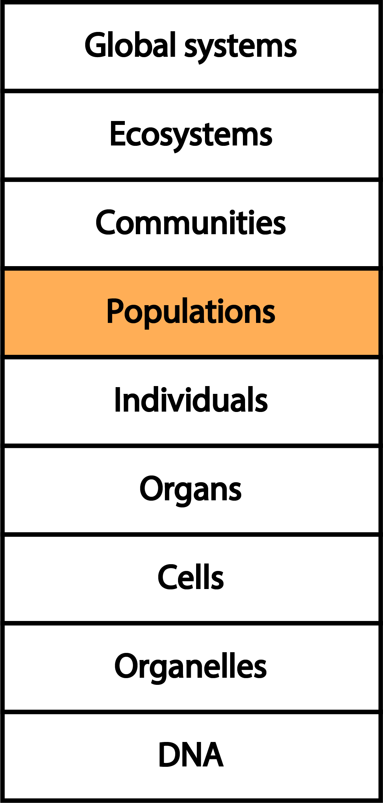

```{r setup, include = FALSE}
options(htmltools.dir.version = FALSE)
knitr::opts_chunk$set(echo = FALSE, fig.align = 'center', warning=FALSE, message=FALSE)
library(WILD3810)
# library(gganimate)
```

## Readings

> Mills 3-12  

> Powell & Gale 6-10  

---
class: inverse, center, middle
# What is population ecology?

---
class: center, middle
Population ecology is the study of the distribution of individuals in a population over time and space

---

```{r out.width=275}


```

---

```{r out.width=275}


```


---

### Population ecology forms the basis for modern natural resource management 

- Conservation

```{r out.width=300}
knitr::include_graphics("https://upload.wikimedia.org/wikipedia/commons/1/17/Gymnogyps_californianus_-Bitter_Creek_National_Wildlife_Refuge%2C_California%2C_USA_-flying-8.jpg")
```

???

Image: Pacific Southwest Region U.S. Fish and Wildlife Service from Sacramento, US [CC BY 2.0 (https://creativecommons.org/licenses/by/2.0) or Public domain], via Wikimedia Commons

---

### Population ecology forms the basis for modern natural resource management

- Conservation
- Management

```{r out.width=400}
knitr::include_graphics("https://upload.wikimedia.org/wikipedia/commons/b/ba/2012-mule-deer-female.jpg")
```


???

Image: Yathin S Krishnappa [CC BY-SA 3.0 (https://creativecommons.org/licenses/by-sa/3.0)], from Wikimedia Commons

---

### Population ecology forms the basis for modern natural resource management 

- Conservation
- Management
- Population control

```{r out.width=400}
knitr::include_graphics("https://upload.wikimedia.org/wikipedia/commons/2/21/Phragmites6170.JPG")
```

???

Image: Le.Loup.Gris [GFDL 1.3 (www.gnu.org/licenses/fdl-1.3.html) or CC BY-SA 3.0 (https://creativecommons.org/licenses/by-sa/3.0)], from Wikimedia Commons

---
class: inverse, center, middle
# Definitions

---
class: inverse
## Population

> A group of organisms of the same species occupying a particular space at a particular time   

---
## Interactions

A common concept in all definitions of a population is some potential for *interactions* among individuals 

--

- interactions can be direct (fighting for territories, reproducing) or indirect (food depletion)

--

- some definitions refer to reproduction - what about non-reproductive periods of the life cycle?  

---
class: inverse

## Abundance (population size)

> the number of individual organisms in a population at a particular time 

---
## Abundance (population size)

> the number of individual organisms in a population at a particular time $^1$


???

Image: [https://wildlife.utah.gov/hunting/biggame/pdf/moose_plan.pdf](https://wildlife.utah.gov/hunting/biggame/pdf/moose_plan.pdf)

$^1$ How is the "population" defined in this example? Does that make sense biologically? From a management perspective?

---
class: inverse

## Density

> the number of individuals relative to a critical resources (i.e., space)

---
## Density

> the number of individuals relative to a critical resources (i.e., space)


---
## Density

> the number of individuals relative to a critical resources (i.e., space) $^2$

```{r out.width=400}
knitr::include_graphics("https://upload.wikimedia.org/wikipedia/commons/4/42/Western_Bluebird_leaving_nest_box.jpg")
```


???

$^2$ Density doesn't always have to be relative to space. It could relative any limiting resource (e.g., nesting sites)

Image: Kevin Cole from Pacific Coast, USA (en:User:Kevinlcole) [CC BY 2.0 (https://creativecommons.org/licenses/by/2.0)], via Wikimedia Commons

---
class: inverse, center, middle

## Why are you interested in population ecology? 

---
## Questions that population ecologists ask:

--
+ *Why is this species found here and not there?*  

--
+ *Are there more of this species than there used to be? Why?*  

--
+ *How many individuals of this species can be harvested each year?*  

--
+ *Will climate change cause this species to increase or decrease?*  
    
---
## Models of populations

Answering these questions **requires** models  
<br/>
<br/>
--
Models link **observations** to **processes**  
<br/>
<br/>

--
Models are tools that allow us to learn about the real world  
<br/>

--
- By necessity, models are simplifications of reality  
     
---
class: inverse, center, middle

## By the end of the course, you will be a modeler!  

---
class: inverse, center, middle
## The modeling process $^3$

???

$^3$ For more information, refer to Powell & Gale pgs 7-9

---
## The modeling process  
1) Define the problem  

--
- How many individuals will be in our population next year?

---
## The modeling process  
1) Define the problem  

2) Identify the important variables  

--
- population size this year $(N_t)^4$  

???

$^4$ $t$ subscript refers to `time` and can be integer values $(1,2,3...)$ that correspond to days, weeks, years, etc.

--
- number of births $(B_t)$

--
- number of deaths $(D_t)$

--
- number of immigrants $(I_t)$

--
- number of emigrants $(E_t)$


---
## The modeling process
1) Define the problem

2) Identify the important variables

3) Create the model
    $$N_{t+1} = N_t + B_t + I_t - D_t - E_t$$

---
## The modeling process
1) Define the problem

2) Identify the important variables

3) Create the model  

4) Solve the model

--
- Count the individuals! 

--
- Estimate birth/death rate

--
- Measure movement
    
---
## The modeling process
1) Define the problem

2) Identify the important variables

3) Create the model  

4) Solve the model

5) Interpret the results

--
- Do the results make sense? $^5$

???

$^5$ Checking whether the results make sense is a complex process that involves not just checking whether the results are consistent with your knowledge of the system but also more formal approaches like goodness-of-fit testing, sensitivity analysis, and model selection. We will discuss these more in lab as we work through some more specific models and questions

---
class: inverse, middle, center

# Abundance

---
## Abundance

Each definition of a population refers to it being a collection of individuals  
<br/>
--
We denote the total number of individuals in a population as $N$  
<br/>
--
$N$ is the **State Variable** of a population

```{r out.width=400}

```

