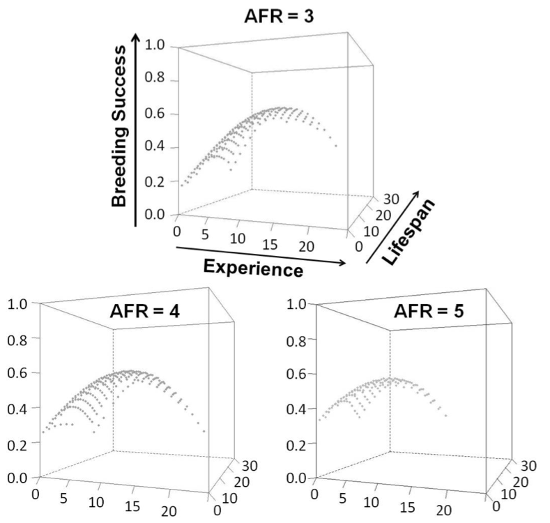
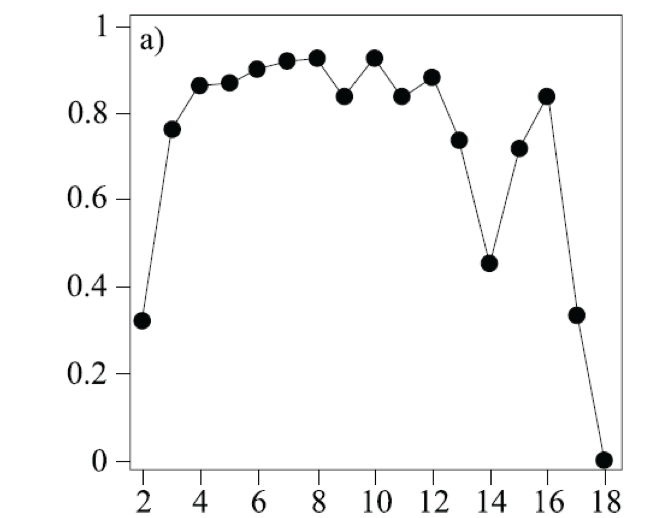
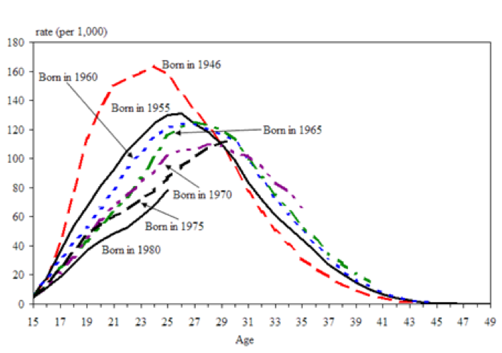

```{r setup, include = FALSE}
options(htmltools.dir.version = FALSE)
knitr::opts_chunk$set(echo = FALSE, fig.align = 'center', warning=FALSE, message=FALSE)
library(WILD3810)
library(gganimate)
```

## Readings

> Mills 70-71, 98-102

---
## Life tables

#### Last week, we learned *why* and *how* to estimate age-specific patterns of survival and mortality  

.left-column[
```{r, out.width="100%"}
knitr::include_graphics("https://upload.wikimedia.org/wikipedia/commons/f/f6/Phlox_drummondii_-_Archer_FL_02.jpg")
```
]

.right-column[
```{r, out.width="80%"}
knitr::include_graphics("figs/phlox_lt.png")
```
]

---
## Life tables

#### Survival is not the only demographic process that varies with age

--
#### Reproductive output also varies with age

```{r, out.width="80%"}
knitr::include_graphics("figs/repro_schedule.png")
```

---
class: inverse, center, middle

# Reproduction

---
## Reproduction

### Terminology

#### Breeding Probability

> chance an adult will breed  


--
#### Natality: 

> average number of offspring born per individual that reproduces  


--
- Clutch Size: birds, monotremes, oviparous herps, fish & insects  

- Litter Size: mammals, viviparous herps & fish  

- Progeny number: all others  

---
## Reproduction

### Terminology

#### Fecundity $\Large (m_x)$  

> average number of offspring born per mature adult of age $x$	

--

- typically measured as the number of *female* offspring produced per adult female (limiting sex)
<br/>


--
$$\LARGE m_x = \frac{Breeding\;\; Probability_x \times Natality_x}{2}$$

---
## Reproduction

#### Estimation

**Breeding Probability estimation**  

- Advanced multi-state CMR methods  

- Hormone analysis (blood, hair/feather, or fecal samples)  

- Flowering rates in mature plants  


--
**Natality estimation**  

- Direct observations in a sample of clutches, litters, or seed sets  

- Number of corpora lutea scars in ovaries of hunted mammals  

- Field ultrasounds on live captured individuals  

---
## Reproduction

#### Estimation using life tables  

- $\Large F_x$: Total offspring produced by each age class

```{r}
library(kableExtra)
lt <- data.frame(x = c(0,7,8,9,10,11,12),
                       Nx = c(996, 159, 154, 147, 105, 22, 0),
                       lx = c(1, 0.160, 0.155, 0.148, 0.105, 0.022, 0),
                       Fx = c("-", 53, 485, 802, 972, 95, "-"),
                       mx = "",
                       lxmx = "")

names(lt) <- c("\\(x\\)", "\\(N_x\\)", "\\(l_x\\)", "\\(F_x\\)", "\\(m_x\\)", "\\(l_xm_x\\)")

lt1 <- lt
names(lt1) <- c("\\(x\\)", "\\(N_x\\)", "\\(l_x\\)", "\\(F_x\\)", "", "")

lt1 %>%
  kable("html", align = 'c', escape = FALSE) %>%
  kable_styling(bootstrap_options = c("striped", "hover", "condensed", "responsive"), full_width = TRUE,font_size = 12) 
```

---
## Reproduction

- $\Large m_x$: Number of offspring produced per original individual (fecundity)

```{r}
lt2 <- lt
names(lt2) <- c("\\(x\\)", "\\(N_x\\)", "\\(l_x\\)", "\\(F_x\\)", "\\(m_x\\)", "")

lt2[,5] <- c("-", 0.33, 3.13, 5.42, 9.26, 4.31, "-")
lt2 %>%
  kable("html", align = 'c', escape = FALSE) %>%
  kable_styling(bootstrap_options = c("striped", "hover", "condensed", "responsive"), full_width = TRUE,font_size = 12) 
```

---
## Reproduction

- $\Large l_xm_x$: Number of offspring produced per **original** individual  

```{r}
lt[,5] <- c("-", 0.33, 3.13, 5.42, 9.26, 4.31, "-")
lt[,6] <- c("-", lt[2:6,3]*as.numeric(lt[2:6,5]), "-")
lt %>%
  kable("html", align = 'c', escape = FALSE) %>%
  kable_styling(bootstrap_options = c("striped", "hover", "condensed", "responsive"), full_width = TRUE, font_size = 12) 
```

--
$\large R_0$: Basic reproductive rate 
$$\large = \sum l_xm_x = \frac{\sum F_x}{N_0} = 2.41$$

---
## Reproduction

#### $\large R_0$: Basic reproductive rate 

- includes the influence of both survival $(\large l_x)$ and reproduction of survivors $(\large m_x)$  

    + 15.5% of individuals survive to age 8
    + those survivors produce, on average, 3.13 offspring
    + the average number of offspring produced by 8yo individuals **per original individual** = 0.48


--
- defines the overall extent to which population changes  

    + $\large R_0 = 1$ means the population exactly replaces itself per *generation*

--
- $\Large r \approx \frac{ln(R_0)}{T}$
    + $\large T$ = **average cohort lifespan** (average time from the birth of an individual to the birth of its offspring)
    + annual species: $T = 1$, $r = ln(R_0)$

---
class: center, middle, inverse
# Fecundity schedules

---
## Fecundity schedules

.left-column[
```{r, out.width="100%"}
knitr::include_graphics("https://upload.wikimedia.org/wikipedia/commons/a/a4/Black-legged_Kittiwake_%2817742276573%29.jpg")
```
]

.right-column[
```{r, out.width="80%"}

```
]

---
## Fecundity schedules

.left-column[
```{r, out.width="100%"}
knitr::include_graphics("https://upload.wikimedia.org/wikipedia/commons/5/50/MK00658_Badlands_Bighorn_Sheep.jpg")
```
]

.right-column[

#### Breeding probability vs. age

```{r, out.width="80%"}

```
]

???

Image courtesy of Martin Kraft, via WikiCommons

---
## Fecundity schedules

#### Change in Canadian fecundity schedules over time 

.left-column[
```{r, out.width="100%"}
knitr::include_graphics("https://upload.wikimedia.org/wikipedia/commons/c/cf/Flag_of_Canada.svg")
```
]

.right-column[

#### Births/1000 women

```{r, out.width="80%"}

```
]
