```{r setup, include = FALSE}
options(htmltools.dir.version = FALSE)
knitr::opts_chunk$set(echo = FALSE, fig.align = 'center', warning=FALSE, message=FALSE, fig.retina = 2)
library(WILD3810)
library(gganimate)
```

## Readings

> Mills 98-103


---
## Assumptions of the B-D models

#### Over the coming weeks, we will learn about why and how to relax assumption 3:  


1) Population closed to immigration and emigration  
<br/>


2) Model pertains to only the limiting sex, usually females  
<br/>


**3) Birth and death rates are independent of an individual’s age or biological stage**  
<br/>


4) Birth and death rates are constant

--
### **How can we model population dynamics of populations with complex age structure?**

---
## Age-structured demography

### Consider the following life table:
<br/>

```{r}
library(kableExtra)
lt <- data.frame(x = c(0,1,2,3),
                       mx = c(0, "\\(m_1\\)", "\\(m_2\\)", "\\(m_3\\)"),
                       px = c("\\(P_0\\)", "\\(P_1\\)", "\\(P_2\\)", 0))

names(lt) <- c("\\(x\\)", "\\(m_x\\)", "\\(P_x\\)")

lt %>%
  kable("html", align = 'c', escape = FALSE) %>%
  kable_styling(bootstrap_options = c("striped", "hover", "condensed", "responsive"), full_width = TRUE, font_size = 22) 
```

???

What do $m_x$ and $P_x$ represent?  

What can you say about the reproductive and survival schedules of this population?

---
## Age-structred demography

#### List population abundance in discrete 1-year age classes $\Large (n_i)$  

- e.g., $\large n_1$, $\large n_2$, $\large n_3$  

- $\large n_i$ is the number of individuals about to experience their $\large i^{th}$ birthday  
<br/>

```{r out.width="70%"}
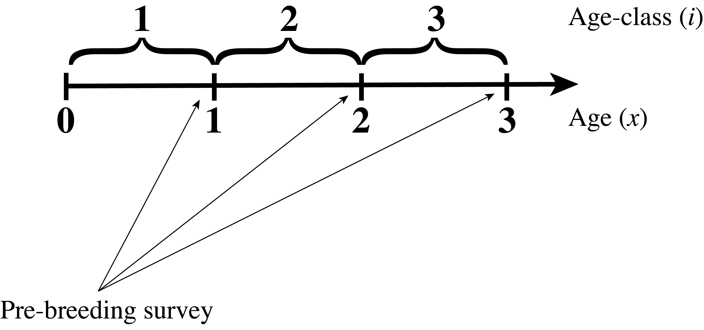
```

---
## Age-structured demography

```{r}
lt %>%
  kable("html", align = 'c', escape = FALSE) %>%
  kable_styling(bootstrap_options = c("striped", "hover", "condensed", "responsive"),  font_size = 16) 
```

<br/>

```{r out.width="70%"}
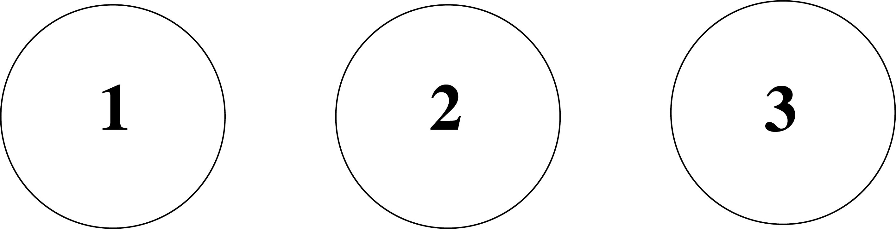
```

---
## Age-structured demography

```{r}
lt <- data.frame(x = c(0,1,2,3),
                       mx = c(0, "\\(m_1\\)", "\\(m_2\\)", "\\(m_3\\)"),
                       px = c("\\(P_0\\)", "\\(P_1\\)", "\\(P_2\\)", 0))

lt2 <- dplyr::mutate(lt, px = cell_spec(lt$px, "html", background = c("transparent", "yellow", "yellow", "transparent")))

names(lt2) <- c("\\(x\\)", "\\(m_x\\)", "\\(P_x\\)")


lt2 %>%
  knitr::kable("html", align = 'c', escape = FALSE) %>%
  kable_styling(bootstrap_options = c("striped", "hover", "condensed", "responsive"),  font_size = 16) 
```

<br/>

```{r out.width="70%"}
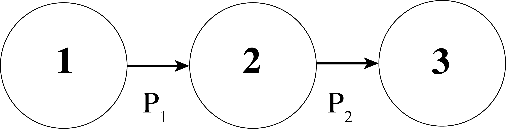
```


---
## Age-structured demography

```{r}
lt <- data.frame(x = c(0,1,2,3),
                       mx = c(0, "\\(m_1\\)", "\\(m_2\\)", "\\(m_3\\)"),
                       px = c("\\(P_0\\)", "\\(P_1\\)", "\\(P_2\\)", 0))

lt3 <- dplyr::mutate(lt, px = cell_spec(lt$px, "html", background = c("yellow", "transparent", "transparent", "transparent")))

lt3 <- dplyr::mutate(lt3, mx = cell_spec(lt$mx, "html", background = c("transparent", "transparent", "yellow", "transparent")))

names(lt3) <- c("\\(x\\)", "\\(m_x\\)", "\\(P_x\\)")


lt3 %>%
  knitr::kable("html", align = 'c', escape = FALSE) %>%
  kable_styling(bootstrap_options = c("striped", "hover", "condensed", "responsive"),  font_size = 16) 
```


```{r out.width="63%"}
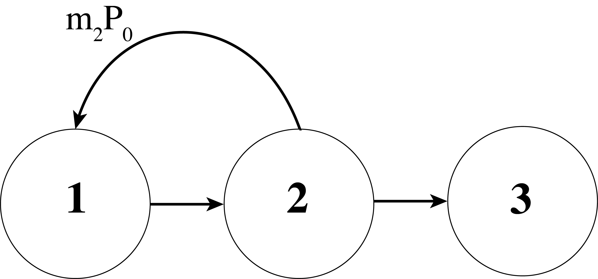
```


---
## Age-structured demography

```{r}
lt <- data.frame(x = c(0,1,2,3),
                       mx = c(0, "\\(m_1\\)", "\\(m_2\\)", "\\(m_3\\)"),
                       px = c("\\(P_0\\)", "\\(P_1\\)", "\\(P_2\\)", 0))

lt4 <- dplyr::mutate(lt, px = cell_spec(lt$px, "html", background = c("yellow", "transparent", "transparent", "transparent")))

lt4 <- dplyr::mutate(lt4, mx = cell_spec(lt$mx, "html", background = c("transparent", "yellow",  "yellow", "yellow")))

names(lt4) <- c("\\(x\\)", "\\(m_x\\)", "\\(P_x\\)")


lt4 %>%
  knitr::kable("html", align = 'c', escape = FALSE) %>%
  kable_styling(bootstrap_options = c("striped", "hover", "condensed", "responsive"),  font_size = 16) 
```


```{r out.width="63%"}
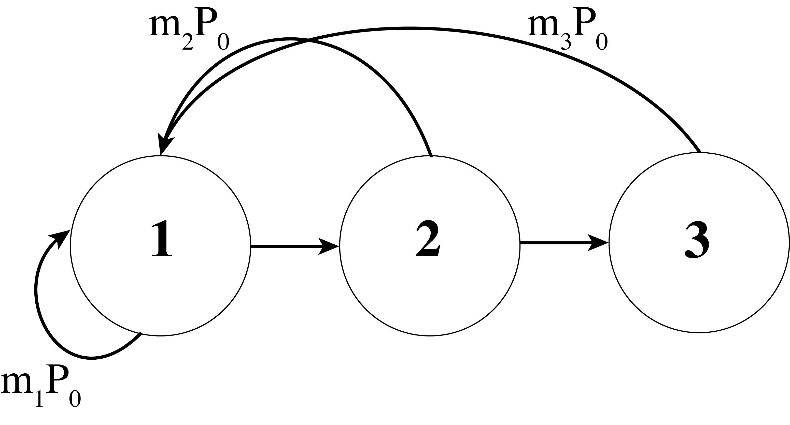
```


---
## Age-structured demography

#### How many individuals will be in the population next year?

--

```{r out.width="63%"}
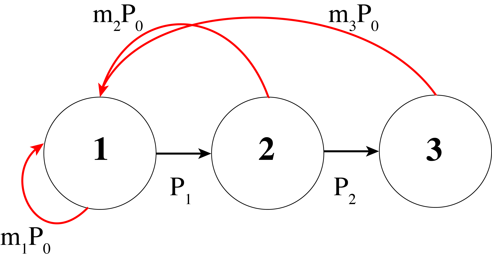
```

$\LARGE n_{1,t+1} = m_1P_0n_{1,t}+m_2P_0n_{2,t} + m_3P_0n_{3,t}$  

---
## Age-structured demography

#### How many individuals will be in the population next year?

```{r out.width="63%"}
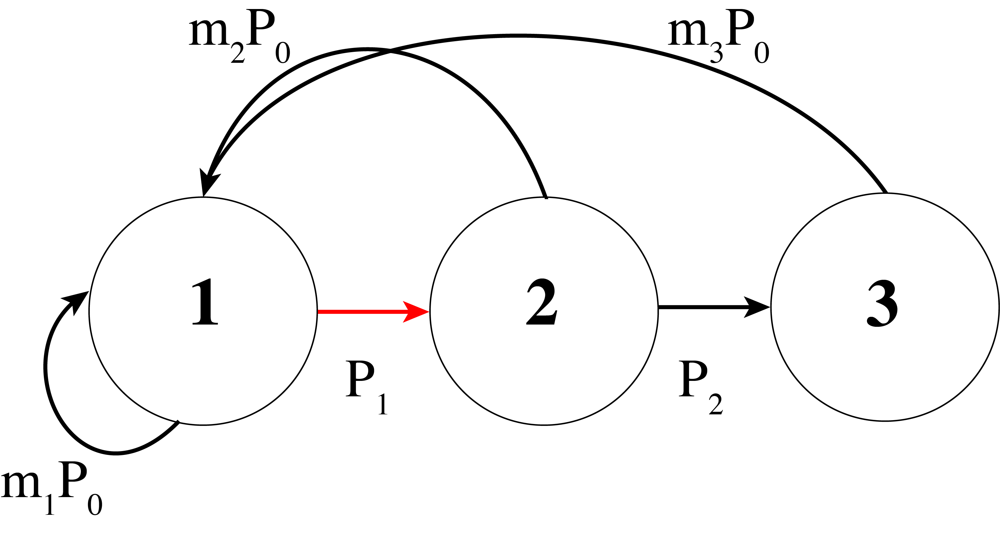
```

$\LARGE n_{1,t+1} = m_1P_0n_{1,t}+m_2P_0n_{2,t} + m_3P_0n_{3,t}$  

$\LARGE n_{2,t+1} =P_1n_{1,t}$  

---
## Age-structured demography

#### How many individuals will be in the population next year?

```{r out.width="63%"}
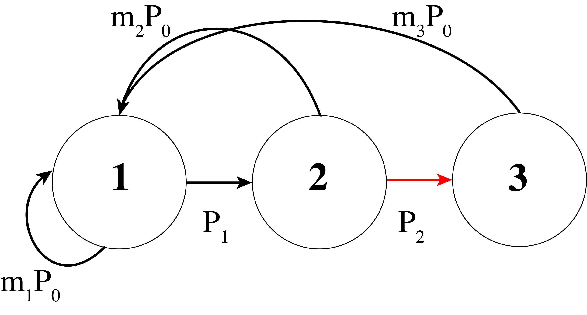
```

$\LARGE n_{1,t+1} = m_1P_0n_{1,t}+m_2P_0n_{2,t} + m_3P_0n_{3,t}$  

$\LARGE n_{2,t+1} =P_1n_{1,t}$  

$\LARGE n_{3,t+1} =P_2n_{2,t}$  


---
## Leslie matrix model

#### Rather than modeling the dynamics using the previous equations, we can use **matrix projection models**  

--
- defined by square matrix that summarizes the demography of age-specific life cycles  

--
- one column for each age class

--
- developed by Sir Patrick H. Leslie for application to population biology  

--
- a matrix with age-specific birth and survival rates is called a **Leslie matrix**  
<br/> 

$$\LARGE \mathbf A = \begin{bmatrix}
    m_1P_0 & m_2P_0 & m_3P_0\\
    P_1 & 0 & 0\\
    0 &P_2 & 0
\end{bmatrix}$$

---
class: inverse, middle, center

# Review of matrix algebra

---
## Review of matrix algebra

#### Matrix addition

- Matrices must be of the same dimension  

- Add corresponding elements of the matrices


$$\LARGE \mathbf A = \begin{bmatrix}
    2 & 0 \\
    4 & 6
\end{bmatrix},\;\;
\mathbf B = \begin{bmatrix}
    1 & 5 \\
    2 & 7
\end{bmatrix}$$
<br/>

--

$$\LARGE \mathbf A + \mathbf B = \begin{bmatrix}
    3 & 5 \\
    6 & 13
\end{bmatrix}$$

---
## Review of matrix algebra

#### Matrix subtraction

- Matrices must be of the same dimension  

- Subtract corresponding elements of the matrices


$$\LARGE \mathbf A = \begin{bmatrix}
    2 & 0 \\
    4 & 6
\end{bmatrix},\;\;
\mathbf B = \begin{bmatrix}
    1 & 5 \\
    2 & 7
\end{bmatrix}$$

--

$$\LARGE \mathbf A - \mathbf B = \begin{bmatrix}
    1 & -5 \\
    2 & -1
\end{bmatrix}$$

---
## Review of matrix algebra

#### Matrix multiplication

- Dimensions are specified as **rows** by **columns**  

- Matrix multiplication does not require matrices to have the same dimensions  

- But they must have the same **inner** dimension

    + for example, a 3x3 matrix can be multiplied by a 3x1 matrix

$$\LARGE \;\;\;\;\;\;\;\;\;\;\;\;\;\;\;\;\;\;\;\;\;\;\;\;\;3\times3\;\;\;\;\;\;\;\;\;\;\;\;\;\;\;\;\;\;\;\;\;\;\;\;\;\;\;\;3\times1$$
$$\LARGE \mathbf A = \begin{bmatrix}
    a & b & c \\
    d & e & f \\
    g & h & i 
\end{bmatrix},\;\;
\mathbf B = \begin{bmatrix}
    x \\
    y \\
    z
\end{bmatrix}$$

---
## Review of matrix algebra

#### Matrix multiplication

- Dimensions are specified as **rows** by **columns**  

- Matrix multiplication does not require matrices to have the same dimensions  

- But they must have the same **inner** dimension

    + but a 3x3 matrix **cannnot** be multiplied by a 1x3 matrix

$$\LARGE \;\;\;\;\;\;\;\;\;\;\;\;3\times3\;\;\;\;\;\;\;\;\;\;\;\;\;\;\;\;\;\;\;\;\;\;\;\;\;\;\;\;1\times3$$
$$\LARGE \mathbf A = \begin{bmatrix}
    a & b & c \\
    d & e & f \\
    g & h & i 
\end{bmatrix},\;\;
\mathbf B = \begin{bmatrix}
    x & y & z\\
\end{bmatrix}$$

---
## Review of matrix algebra

#### How does matrix multiplication work?

$$\LARGE \mathbf A = \begin{bmatrix}
    a & b & c \\
    d & e & f \\
    g & h & i 
\end{bmatrix},\;\;
\mathbf B = \begin{bmatrix}
    x \\
    y \\
    z
\end{bmatrix}$$
<br/>

$$\LARGE \mathbf A = \begin{bmatrix}
    a\times x + b\times y + c\times z\\
    d\times x + e\times y + f\times z\\
    g\times x + h\times y + i\times z
\end{bmatrix}$$

---
## Review of matrix algebra

#### How does matrix multiplication work?

$$\LARGE \mathbf A = \begin{bmatrix}
    1 & 0 & 5 \\
    0 & 4 & 3 \\
    2 & 6 & 0 
\end{bmatrix},\;\;
\mathbf B = \begin{bmatrix}
    3 \\
    2 \\
    1
\end{bmatrix}$$
<br/>
<br/>

$$\LARGE \mathbf A = \begin{bmatrix}
    1\times 3 + 0\times 2 + 5\times 1\\
    0\times 3 + 4\times 2 + 3\times 1\\
    2\times 3 + 6\times 2 + 1\times 1
\end{bmatrix}=\begin{bmatrix}
    8 \\
    11 \\
    18
\end{bmatrix}$$


---
## Review of matrix algebra

#### Transpose of a matrix

$$\LARGE \mathbf B = \begin{bmatrix}
    3 \\
    2 \\
    1
\end{bmatrix},\;\; \mathbf B^T = \begin{bmatrix}
    3 & 2 & 1
\end{bmatrix}$$
<br/>
<br/>

$$\LARGE \mathbf C = \begin{bmatrix}
    3 & 2 & 1
\end{bmatrix},\;\; \mathbf C^T = \begin{bmatrix}
    3\\
    2\\
    1
\end{bmatrix}$$

---
## Review of matrix algebra

#### Transpose of a matrix

- is the following allowed? 
$$\LARGE \mathbf A = \begin{bmatrix}
    1 & 0 & 5 \\
    0 & 4 & 3 \\
    2 & 6 & 0 
\end{bmatrix},\;\;
\mathbf B = \begin{bmatrix}
    3 & 2 & 1
\end{bmatrix}$$
<br/>
<br/>
$$\Huge A \times B$$

---
## Review of matrix algebra

#### Transpose of a matrix

- is the following allowed? 
$$\LARGE \mathbf A = \begin{bmatrix}
    1 & 0 & 5 \\
    0 & 4 & 3 \\
    2 & 6 & 0 
\end{bmatrix},\;\;
\mathbf B = \begin{bmatrix}
    3 & 2 & 1
\end{bmatrix}$$
<br/>
<br/>
$$\Huge A \times B^T$$


---
class: inverse, center, middle

# Age-structured matrix models

---
## Age-structured matrix models


#### How many individuals will be in the population next year?

```{r out.width="63%"}

```

$\LARGE n_{1,t+1} = m_1P_0n_{1,t}+m_2P_0n_{2,t} + m_3P_0n_{3,t}$  

$\LARGE n_{2,t+1} =P_1n_{1,t}$  

$\LARGE n_{3,t+1} =P_2n_{2,t}$  


---
## Age-structured matrix models


#### How many individuals will be in the population next year?

```{r out.width="55%"}

```

```{r out.width="45%"}
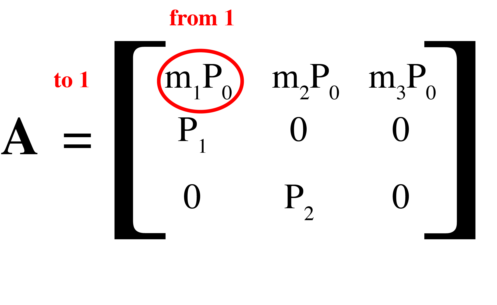
```

---
## Age-structured matrix models


#### How many individuals will be in the population next year?

```{r out.width="55%"}

```

```{r out.width="45%"}
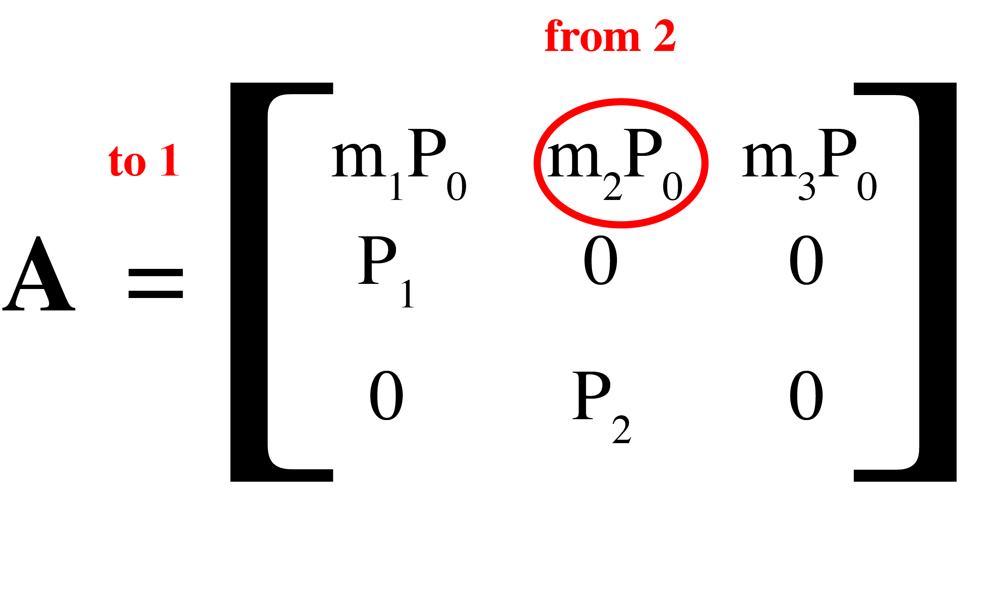
```

---
## Age-structured matrix models


#### How many individuals will be in the population next year?

```{r out.width="55%"}

```

```{r out.width="45%"}
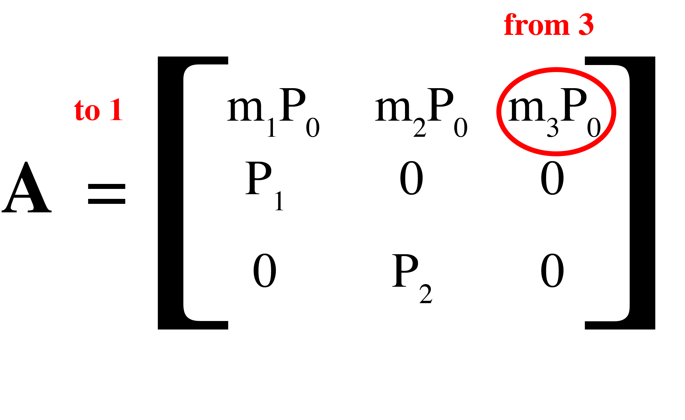
```

---
## Age-structured matrix models


#### How many individuals will be in the population next year?

```{r out.width="55%"}

```

```{r out.width="45%"}
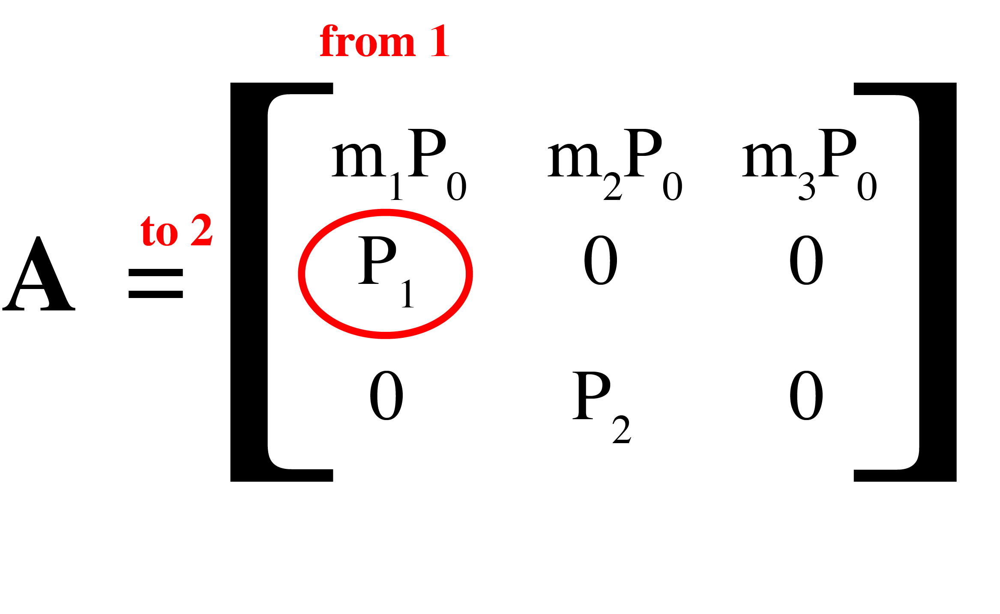
```

---
## Age-structured matrix models


#### How many individuals will be in the population next year?

```{r out.width="55%"}

```

```{r out.width="45%"}
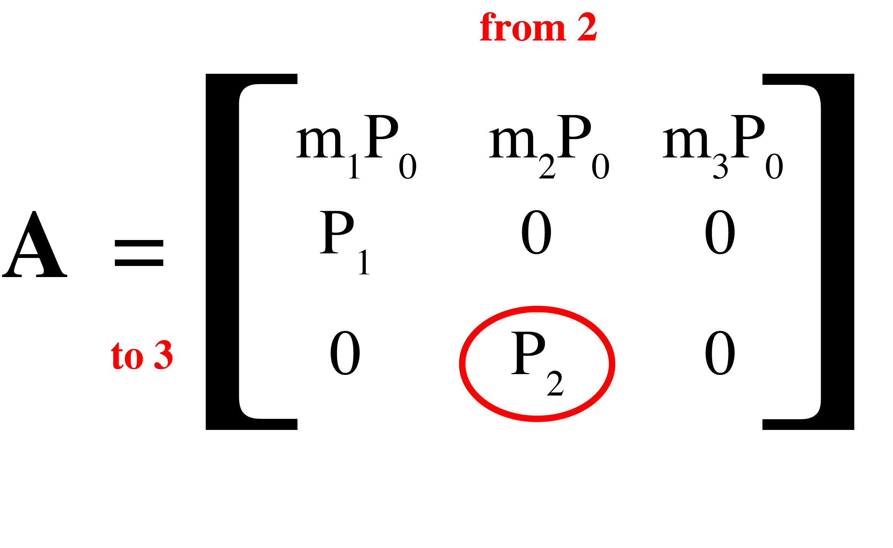
```

---
## Age-structured matrix models

#### Rather than separately modeling fecundity and juvenile survival, Leslie matrices often include **recruitment**

- $\Large F_x$: Recruitment (or sometimes **F**ertility)

- $\Large F_x = m_xP_0$

$$\LARGE \mathbf A = \begin{bmatrix}
    F_1 & F_2 & F_3\\
    P_1 & 0 & 0\\
    0 &P_2 & 0
\end{bmatrix}$$


---
## Age-structured matrix models

####  Recruitment doesn't have to be estimated from the life table

#### Birds:

- Clutch size  

- Nest survival  

- Chick survival  

- Juvenile survival  

$$\LARGE F = cs \times ns \times chs \times js$$

$$\LARGE \mathbf A = \begin{bmatrix}
    F_1 & F_2 & F_3\\
    P_1 & 0 & 0\\
    0 &P_2 & 0
\end{bmatrix}$$

---
## Age-structured matrix models

####  Recruitment doesn't have to be estimated from the life table

#### Plants:

- Seed production  

- Seed survival  

- Germination rate  

- Seedling survival  

$$\LARGE F = sp \times sds \times gr \times sls$$

$$\LARGE \mathbf A = \begin{bmatrix}
    F_1 & F_2 & F_3\\
    P_1 & 0 & 0\\
    0 &P_2 & 0
\end{bmatrix}$$

---
## Projecting abundance

#### The Leslie matrix can be used to project abundance

$$\LARGE \mathbf N_t = \begin{bmatrix}
    n_{1,t}\\
    n_{2,t}\\
    n_{3,t}
\end{bmatrix}$$
<br/>

```{r out.width="70%"}

```

---
## Projecting abundance

#### The Leslie matrix can be used to project abundance  

--
- multiply the Leslie matrix

$$\Large \mathbf A = \begin{bmatrix}
    F_1 & F_2 & F_3\\
    P_1 & 0 & 0\\
    0 &P_2 & 0
\end{bmatrix}$$

--
- by the abundance matrix

$$\Large \mathbf N_t = \begin{bmatrix}
    n_{1,t}\\
    n_{2,t}\\
    n_{3,t}
\end{bmatrix}$$

using the rules of matrix multiplication

---
## Projecting abundance

#### Population abundance is projected through time using matrix multiplication

$$\Large \mathbf N_{t+1} = \mathbf A \times \mathbf N_t$$ 

$$\Large \begin{bmatrix}
    n_{1,t+1}\\
    n_{2,t+1}\\
    n_{3,t+1}
\end{bmatrix}\Large =  \begin{bmatrix}
    F_1 & F_2 & F_3\\
    P_1 & 0 & 0\\
    0 &P_2 & 0
\end{bmatrix} \times \begin{bmatrix}
    n_{1,t}\\
    n_{2,t}\\
    n_{3,t}
\end{bmatrix}$$

<br/>

Notice that the inner dimensions match

---
## Projecting abundance

#### Population abundance is projected through time using matrix multiplication

```{r out.width="80%"}
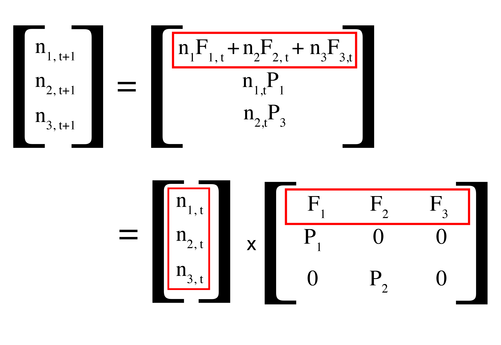
```

---
## Projecting abundance

#### Population abundance is projected through time using matrix multiplication

```{r out.width="80%"}
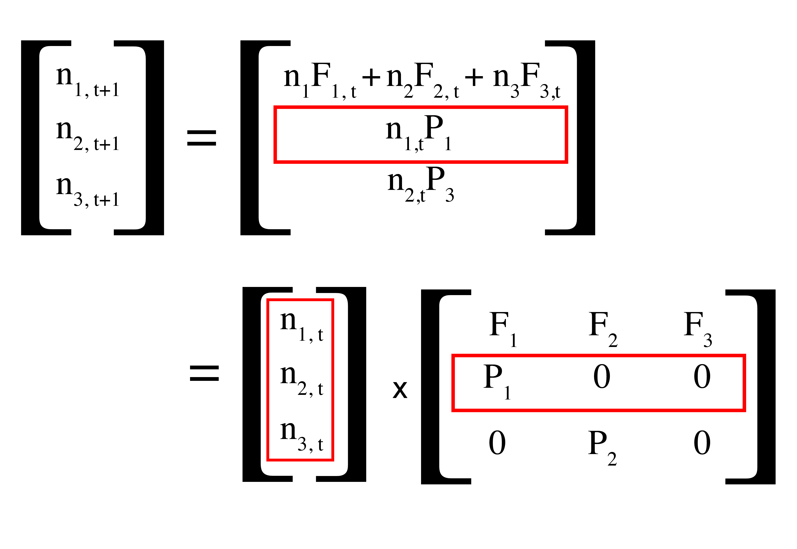
```


---
## Projecting abundance

#### Population abundance is projected through time using matrix multiplication

```{r out.width="80%"}
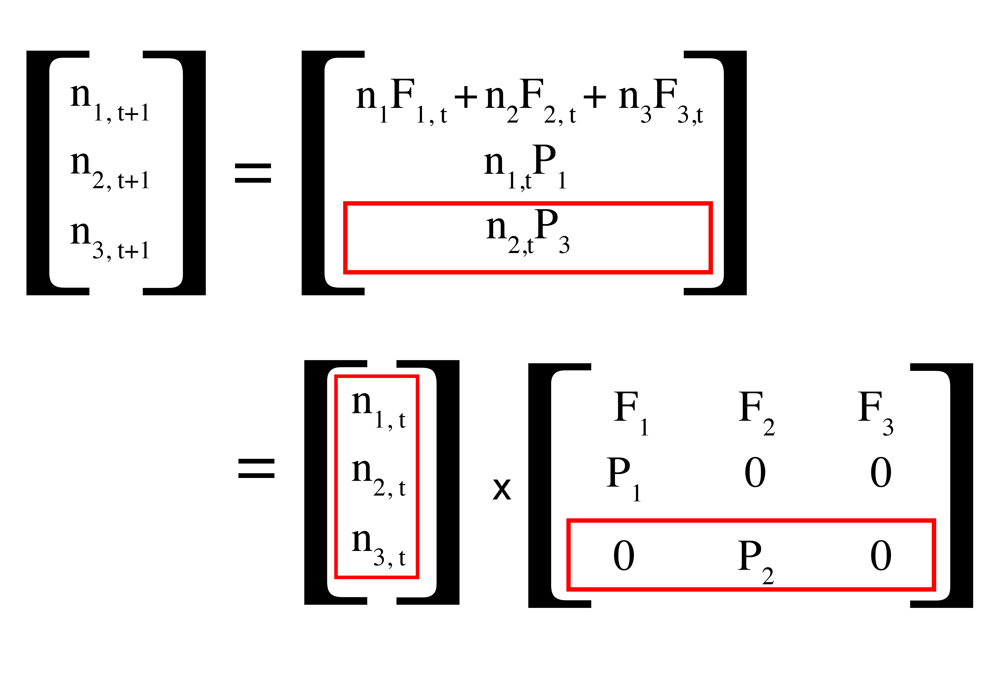
```

