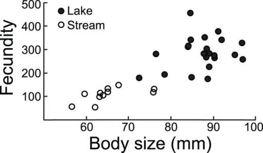

```{r setup, include = FALSE}
options(htmltools.dir.version = FALSE)
knitr::opts_chunk$set(echo = FALSE, fig.align = 'center', warning=FALSE, message=FALSE)
library(WILD3810)
library(gganimate)
```

## Leslie matrix 

#### Leslie matrices are defined as :   

- square matrix that summarizes the demography of **age**-specific life cycles  

- one column for each **age** class

- matrix elements contain **age**-specific birth and survival rates   

- individuals cannot stay in the same **age**-class for more than a single time step $^1$
<br/> 
<br/> 
$$\LARGE \mathbf A = \begin{bmatrix}
    F_1 & F_2 & F_3\\
    P_1 & 0 & 0\\
    0 &P_2 & 0
\end{bmatrix}$$

???

$^1$ In some cases, for example when we define identify individuals juveniles (age 1), pre-adults (age 2), and adults (age 3+), the last element in the Leslie matrix might not be zero. Individuals can remain in the "adult" class for more than 1 year  

---
## Stage-structured populations

#### In some cases, age is not a relevant predictor of survival and birth rates   

--
#### Instead, survival and birth rates vary with **stage**

--
- life cycle stage

.pull-left[
```{r, out.width="75%"}
knitr::include_graphics("figs/lifecycle_diagram.jpg")
```
]

.pull-right[
```{r, out.width="75%"}
knitr::include_graphics("figs/lifecycle.gif")
```
]

---
## Stage-structured populations

#### In some cases, age is not a relevant predictor of survival and birth rates   

#### Instead, survival and birth rates vary with **stage**

- life cycle stage

- size 

.left-column[
```{r, out.width="100%"}
knitr::include_graphics("https://upload.wikimedia.org/wikipedia/commons/a/af/Gasterosteus_aculeatus_t%C3%BCsk%C3%A9s_pik%C3%B3.jpg")
```
]

.right-column[
```{r, out.width="60%"}

```
]

???

Image courtesy of Kókay Szabolcs, via Wikimedia Commons
Figure from Moser et al. (2012)

---
## Stage-structured populations

#### L. Lefkovitch relaxed an assumption of the age-structured matrix model developed by Leslie  

--
#### **Lefkovitch matrices ** allow individuals to remain in life-stages (or size classes) longer than one time step 

--
#### Useful for plants and animals with stage-dependent demography

```{r, out.width="60%"}
knitr::include_graphics("figs/stage_diagram.png")
```

---
## Stage-structured matrix

$$\LARGE \mathbf A = \begin{bmatrix}
    F_1 & F_2 & F_3\\
    P_1 & 0 & 0\\
    0 &P_2 & 0
\end{bmatrix} \rightarrow
\mathbf A = \begin{bmatrix}
    P_1 & F_2 & F_3\\
    G_1 & P_2 & 0\\
    0 & G_2 & P_3
\end{bmatrix}$$
<br/>
- $\large F_x$ is still **recruitment**, the number of offspring recruited into stage class 1 per adult in stage $\large x$  

- $\large P_x$ is the probability of **surviving** from year $\large t$ until year $\large t+1$ and **remaining** in stage $\large x$  

- $\large G_x$ is the probability of **growing and surviving** to stage $\large x + 1$ during $\large t$ to  $\large t+1$ 


---
## Stage-structured matrix model

$$\Large \mathbf N_{t+1} = \mathbf A \times \mathbf N_t$$
$$\LARGE = \begin{bmatrix}
    P_1 & F_2 & F_3\\
    G_1 & P_2 & 0\\
    0 & G_2 & P_3
\end{bmatrix} \times 
\begin{bmatrix} 
    n_{1,t}\\
    n_{2,t}\\
    n_{3,t}
\end{bmatrix}$$

<br/>
#### Matrix multiplication is the  same as in the Leslie matrix model!! 

---
## Common teasel example

.pull-left[
```{r out.width = "80%"}
knitr::include_graphics("https://upload.wikimedia.org/wikipedia/commons/5/56/Dipsacus_fullonum_002.JPG")
```
]

.pull-right[

- *Dypsacus sylvestris*

- native to Europe

- invasive species in United States

- stage-structured dynamics studied intensively by Patricia Werner and Hal Caswell
]


???

Image courtesy of H. Zell, via Wikicommons

---
## Common teasel example

.pull-left[
```{r out.width = "80%"}

```
]

.pull-right[

#### Complex stage structure

1) Dormant 1st year seeds  

2) Dormant 2nd year seeds  

3) Small rosettes $(< 2.5cm)$  

4) Medium rosettes $2.5-18.9cm$  

5) Large rosettes $\geq 19cm$  

6) Flowering plants  
]

---
## Common teasel example

.pull-left[
```{r out.width = "80%"}

```
]

.pull-right[

#### Complex stage structure

1) Dormant 1st year seeds  

2) Dormant 2nd year seeds  

3) Small rosettes $(< 2.5cm)$  

4) Medium rosettes $2.5-18.9cm$  

5) Large rosettes $\geq 19cm$  

6) Flowering plants  
]

---
## Common teasel example

<br/>
 
```{r}
library(kableExtra)
teasel <- data.frame(seed1 = c(0, 0.966, 0.013, 0.007, 0.001, 0),
                 seed2 = c(0, 0, 0.01, 0, 0, 0),
                 sr = c(0, 0, 0.125, 0.125, 0, 0),
                 mr = c(0, 0, 0, 0.238, 0.245, 0.023),
                 lr = c(0, 0, 0, 0, 0.167, 0.75),
                 fl = c(322.28, 0, 3.448, 30.17, 0.862, 0))

teasel1 <- teasel
names(teasel1) <- c("Seed 1", "Seed 2", "Small rosette", "Medium rosette", "Large rosette", "Flowering")

teasel1 %>%
  knitr::kable("html", align = 'c', escape = FALSE) %>%
  kable_styling(bootstrap_options = c("striped", "hover", "condensed", "responsive"),  font_size = 15) 
```

---
## Common teasel example

.pull-left[
```{r}
teasel_seed1 <- dplyr::mutate(teasel, seed1 = cell_spec(teasel$seed1, "html", background = c("transparent", "red", "orange", "yellow", "green", "transparent")))


names(teasel_seed1) <- c("Seed 1", "Seed 2", "Small rosette", "Medium rosette", "Large rosette", "Flowering")


teasel_seed1 %>%
  knitr::kable("html", align = 'c', escape = FALSE) %>%
  kable_styling(bootstrap_options = c("striped", "hover", "condensed", "responsive"),  font_size = 14) 
```
]

.pull-right[
```{r out.width = "75%", fig.align = 'right'}

```
]


---
## Common teasel example

.pull-left[
```{r}
teasel_seed2 <- dplyr::mutate(teasel, seed2 = cell_spec(teasel$seed2, "html", background = c("transparent", "transparent", "red", "transparent", "transparent", "transparent")))


names(teasel_seed2) <- c("Seed 1", "Seed 2", "Small rosette", "Medium rosette", "Large rosette", "Flowering")


teasel_seed2 %>%
  knitr::kable("html", align = 'c', escape = FALSE) %>%
  kable_styling(bootstrap_options = c("striped", "hover", "condensed", "responsive"),  font_size = 14) 
```
]

.pull-right[
```{r out.width = "75%", fig.align = 'right'}

```
]

---
## Common teasel example

.pull-left[
```{r}
teasel_sr <- dplyr::mutate(teasel, sr = cell_spec(teasel$sr, "html", background = c("transparent", "transparent", "red", "orange", "transparent", "transparent")))


names(teasel_sr) <- c("Seed 1", "Seed 2", "Small rosette", "Medium rosette", "Large rosette", "Flowering")


teasel_sr %>%
  knitr::kable("html", align = 'c', escape = FALSE) %>%
  kable_styling(bootstrap_options = c("striped", "hover", "condensed", "responsive"),  font_size = 14) 
```
]

.pull-right[
```{r out.width = "75%", fig.align = 'right'}

```
]

---
## Common teasel example

.pull-left[
```{r}
teasel_mr <- dplyr::mutate(teasel, mr = cell_spec(teasel$mr, "html", background = c("transparent", "transparent", "transparent", "red", "orange", "yellow")))


names(teasel_mr) <- c("Seed 1", "Seed 2", "Small rosette", "Medium rosette", "Large rosette", "Flowering")


teasel_mr %>%
  knitr::kable("html", align = 'c', escape = FALSE) %>%
  kable_styling(bootstrap_options = c("striped", "hover", "condensed", "responsive"),  font_size = 14) 
```
]

.pull-right[
```{r out.width = "75%", fig.align = 'right'}

```
]

---
## Common teasel example

.pull-left[
```{r}
teasel_lr <- dplyr::mutate(teasel, lr = cell_spec(teasel$lr, "html", background = c("transparent", "transparent", "transparent", "transparent", "red", "orange")))


names(teasel_lr) <- c("Seed 1", "Seed 2", "Small rosette", "Medium rosette", "Large rosette", "Flowering")


teasel_lr %>%
  knitr::kable("html", align = 'c', escape = FALSE) %>%
  kable_styling(bootstrap_options = c("striped", "hover", "condensed", "responsive"),  font_size = 14) 
```
]

.pull-right[
```{r out.width = "75%", fig.align = 'right'}

```
]

---
## Common teasel example

.pull-left[
```{r}
teasel_fl <- dplyr::mutate(teasel, fl = cell_spec(teasel$fl, "html", background = c("red", "transparent", "orange", "yellow", "green", "transparent")))


names(teasel_fl) <- c("Seed 1", "Seed 2", "Small rosette", "Medium rosette", "Large rosette", "Flowering")


teasel_fl %>%
  knitr::kable("html", align = 'c', escape = FALSE) %>%
  kable_styling(bootstrap_options = c("striped", "hover", "condensed", "responsive"),  font_size = 14) 
```
]

.pull-right[
```{r out.width = "75%", fig.align = 'right'}

```
]


---
## Common teasel example

#### What happens to a newly established population?

- Assume population starts with 100 1st year seeds

<br/>

--
$$\Large \begin{bmatrix}
    0 & 0 & 0 &0 & 0 & 322.38\\
    0.966 & 0 & 0 & 0 & 0 & 0\\
    0.013 & 0.01 & 0.125 & 0 & 0 & 3.448\\
    0.007 & 0 & 0.125 & 0.238 & 0 & 30.17\\
    0.001 & 0 & 0 & 0.245 & 0.167 & 0.862\\
    0 & 0 & 0 & 0.023 & 0.75 & 0\\
\end{bmatrix} \times \begin{bmatrix}
    100\\
    0\\
    0\\
    0\\
    0\\
    0
\end{bmatrix}$$


---
## Common teasel example

<br/>
```{r}
A <- matrix(c(0, 0, 0,0, 0, 322.38,
    0.966, 0, 0, 0, 0, 0,
    0.013, 0.01, 0.125, 0, 0, 3.448,
    0.007 , 0 , 0.125 , 0.238 , 0 , 30.17,
    0.001 , 0 , 0 , 0.245 , 0.167 , 0.862,
    0 , 0 , 0 , 0.023 , 0.75 , 0), nrow = 6, byrow = TRUE)

N1 <- c(100, 0, 0, 0, 0, 0)
N <- matrix(NA, nrow = 6, ncol = 25)
N[,1] <- N1

for(t in 2:25){
  N[,t] <- A %*% N[,t-1]
}

N.tot <- apply(N, 2, sum)

stage_dist <- apply(N, 1, function(x) x/N.tot)

teasel_df <- data.frame(Year = 1:25,
                        N = c(t(N)),
                        SSD = c(stage_dist),
                        Stage = rep(c("Seed 1", "Seed 2", 
                                      "Small rosette", "Medium rosette", 
                                      "Large rosette", "Flowering"), each = 25))
```

```{r fig.height= 5, fig.width=8}
ggplot(teasel_df, aes(x = Year, y = log(N), color = Stage)) + geom_path(size = 1) +
  scale_color_manual(values = WILD3810_colors$value) +
  scale_y_continuous("log(N)")
```

---
## Common teasel example
<br/>

```{r fig.height= 5, fig.width=8}
ggplot(teasel_df, aes(x = Year, y = log(N), color = Stage)) + 
  geom_rect(aes(xmin = -Inf, xmax = 11, ymin = -Inf, ymax = Inf), fill = "grey70", color = "grey70") + 
  geom_path(size = 1) +
  scale_color_manual(values = WILD3810_colors$value) +
  scale_y_continuous("log(N)") +
  annotate("text", x = 5, y = 18, label = "Transient \ndynamics", color = "grey20", size = 8)
```

---
## Common teasel example

<br/>

```{r fig.height= 5, fig.width=8}
ggplot(teasel_df, aes(x = Year, y = SSD, color = Stage)) + 
  geom_rect(aes(xmin = -Inf, xmax = 11, ymin = -Inf, ymax = Inf), fill = "grey70", color = "grey70") + 
  geom_path(size = 1) +
  scale_color_manual(values = WILD3810_colors$value) +
  scale_y_continuous(expression(paste("Proportion of population (", N[x]/N[total], ")")), 
                     limits = c(0, 1.5)) +
  annotate("text", x = 5, y = 1.25, label = "Transient \ndynamics", color = "grey20", size = 8)
```

--
**Stable stage distribution**


---
# Common teasel example

```{r fig.height= 5, fig.width=8}
lambda <- data.frame(Year = 1:24,
                     lambda = numeric(24))
for(t in 1:24){
  lambda$lambda[t] <- N.tot[t+1]/N.tot[t]
}

ggplot(lambda, aes(x = Year, y = lambda)) + 
  geom_rect(aes(xmin = -Inf, xmax = 11, ymin = -Inf, ymax = Inf), fill = "grey70", color = "grey70") + 
  geom_path(size = 1, color = WILD3810_colors$value[WILD3810_colors$name == "primary"]) +
  scale_y_continuous(expression(lambda)) +
  annotate("text", x = 7, y = 17, label = "Transient \ndynamics", color = "grey20", size = 8) +
  annotate("text", x = 18, y = 5, label = expression(paste("Asymptotic ", lambda, "= 2.20")), size = 8)
```

**Asymptotic growth rate**

---
## Management questions

#### What is the short-term growth of this population given the current age/stage structure?  

--
#### What is the long-term growth of this population given the current vital rates?

--
#### Which age/stage contributes most to future population growth? 

--
#### Which vital rates have the biggest effect on future growth?  

--
#### How would future  population dynamics change if different vital rates were changed?  
>>>>>>> 6a2860326049d9c169963d26b42a83faef7adb1e

