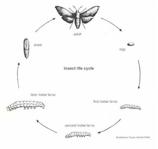
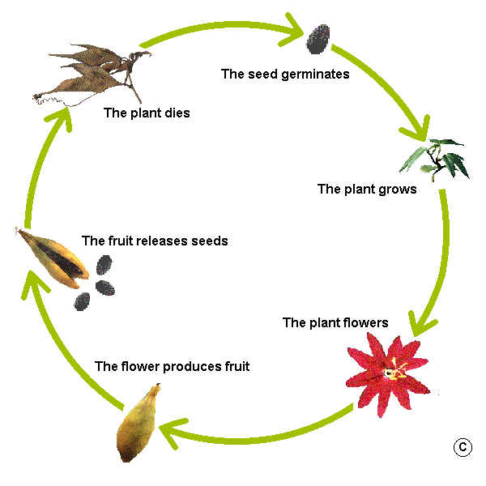
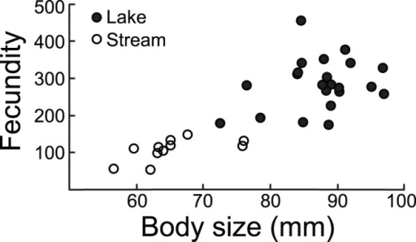
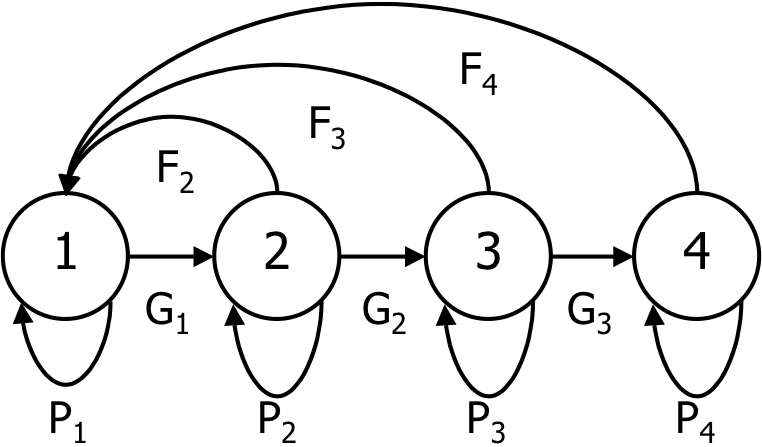

```{r setup, include = FALSE}
options(htmltools.dir.version = FALSE)
knitr::opts_chunk$set(echo = FALSE, fig.align = 'center', warning=FALSE, message=FALSE)
library(WILD3810)
library(gganimate)
```


## Leslie matrix 

#### Leslie matrices are defined as :   

- square matrix that summarizes the demography of **age**-specific life cycles  

- one column for each **age** class

- matrix elements contain **age**-specific birth and survival rates   

- individuals cannot stay in the same **age**-class for more than a single time step $^1$
<br/> 
<br/> 
$$\LARGE \mathbf A = \begin{bmatrix}
    F_1 & F_2 & F_3\\
    P_1 & 0 & 0\\
    0 &P_2 & 0
\end{bmatrix}$$

???

$^1$ In some cases, for example when we define identify individuals juveniles (age 1), pre-adults (age 2), and adults (age 3+), the last element in the Leslie matrix might not be zero. Individuals can remain in the "adult" class for more than 1 year  

---
## Stage-structured populations

#### In some cases, age is not a relevant predictor of survival and birth rates   

--
#### Instead, survival and birth rates vary with **stage**

--
- life cycle stage

.pull-left[
```{r, out.width="75%"}

```
]

.pull-right[
```{r, out.width="75%"}

```
]

---
## Stage-structured populations

#### In some cases, age is not a relevant predictor of survival and birth rates   

#### Instead, survival and birth rates vary with **stage**

- life cycle stage

- size 

.left-column[
```{r, out.width="100%"}
knitr::include_graphics("https://upload.wikimedia.org/wikipedia/commons/a/af/Gasterosteus_aculeatus_t%C3%BCsk%C3%A9s_pik%C3%B3.jpg")
```
]

.right-column[
```{r, out.width="60%"}

```
]

???

Image courtesy of Kókay Szabolcs, via Wikimedia Commons
Figure from Moser et al. (2012)

---
## Stage-structured populations

#### L. Lefkovitch relaxed an assumption of the age-structured matrix model developed by Leslie  

--
#### **Lefkovitch matrices ** allow individuals to remain in life-stages (or size classes) longer than one time step 

--
#### Useful for plants and animals with stage-dependent demography

```{r, out.width="60%"}

```

---
## Stage-structured matrix

$$\LARGE \mathbf A = \begin{bmatrix}
    F_1 & F_2 & F_3\\
    P_1 & 0 & 0\\
    0 &P_2 & 0
\end{bmatrix} \rightarrow
\mathbf A = \begin{bmatrix}
    P_1 & F_2 & F_3\\
    G_1 & P_2 & 0\\
    0 & G_2 & P_3
\end{bmatrix}$$
<br/>
- $\large F_x$ is still **recruitment**, the number of offspring recruited into stage class 1 per adult in stage $\large x$  

- $\large P_x$ is the probability of **surviving** from year $\large t$ until year $\large t+1$ and **remaining** in stage $\large x$  

- $\large G_x$ is the probability of **growing and surviving** to stage $\large x + 1$ during $\large t$ to  $\large t+1$ 


---
## Stage-structured matrix model

$$\Large \mathbf N_{t+1} = \mathbf A \times \mathbf N_t$$
$$\LARGE = \begin{bmatrix}
    P_1 & F_2 & F_3\\
    G_1 & P_2 & 0\\
    0 & G_2 & P_3
\end{bmatrix} \times 
\begin{bmatrix} 
    n_{1,t}\\
    n_{2,t}\\
    n_{3,t}
\end{bmatrix}$$

<br/>
#### Matrix multiplication is the  same as in the Leslie matrix model!! 

---
## Teasel example

$$\LARGE \begin{bmatrix}
    0 & 0 & 0 &0 & 0 & 322.38\\
    0.966 & 0 & 0 & 0 & 0 & 0\\
    0.013 & 0.01 & 0.125 & 0 & 0 & 3.448\\
    0.007 & 0 & 0.125 & 0.238 & 0 & 30.17\\
    0.001 & 0 & 0 & 0.245 & 0.167 & 0.862\\
    0 & 0 & 0 & 0.023 & 0.75 & 0\\
\end{bmatrix}$$

---
## Teasel example

```{r}
library(kableExtra)
teasel <- data.frame(seed1 = c(0, 0.966, 0.013, 0.007, 0.001, 0),
                 seed2 = c(0, 0, 0.01, 0, 0, 0),
                 sr = c(0, 0, 0.125, 0.125, 0, 0),
                 mr = c(0, 0, 0, 0.238, 0.245, 0.023),
                 lr = c(0, 0, 0, 0, 0.167, 0.75),
                 fl = c(322.28, 0, 3.448, 30.17, 0.862, 0))

teasel %>%
  knitr::kable("html", align = 'c', escape = FALSE) %>%
  kable_styling(bootstrap_options = c("striped", "hover", "condensed", "responsive"),  font_size = 15) 
```

---
## Teasel example

```{r}
library(kableExtra)
teasel <- data.frame(seed1 = c(0, 0.966, 0.013, 0.007, 0.001, 0),
                 seed2 = c(0, 0, 0.01, 0, 0, 0),
                 sr = c(0, 0, 0.125, 0.125, 0, 0),
                 mr = c(0, 0, 0, 0.238, 0.245, 0.023),
                 lr = c(0, 0, 0, 0, 0.167, 0.75),
                 fl = c(322.28, 0, 3.448, 30.17, 0.862, 0))

teasel_seed1 <- dplyr::mutate(teasel, seed1 = cell_spec(teasel$seed1, "html", background = c("transparent", "red", "orange", "yellow", "green", "transparent")))


names(teasel_seed1) <- c("Seed 1", "Seed 2", "Small rosette", "Medium rosette", "Large rosette", "Flowering")


teasel_seed1 %>%
  knitr::kable("html", align = 'c', escape = FALSE) %>%
  kable_styling(bootstrap_options = c("striped", "hover", "condensed", "responsive"),  font_size = 15) 
```
