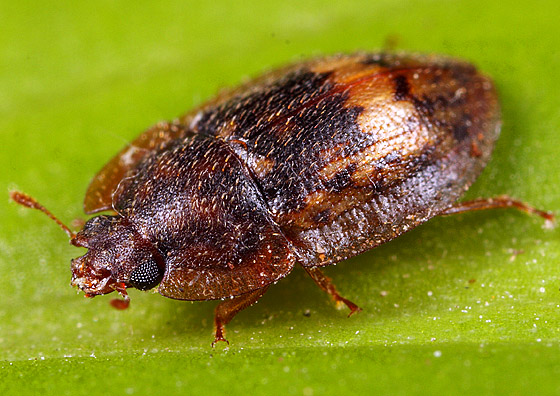
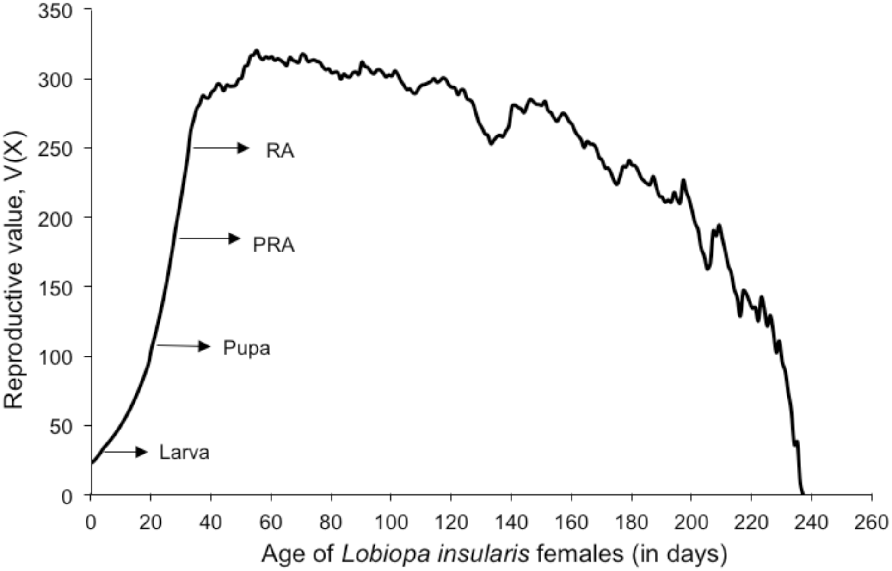
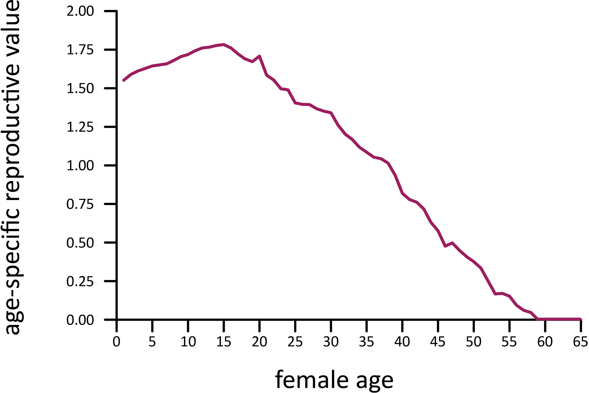

```{r setup, include = FALSE}
options(htmltools.dir.version = FALSE)
knitr::opts_chunk$set(echo = FALSE, fig.align = 'center', warning=FALSE, message=FALSE)
library(WILD3810)
library(gganimate)
```

## Readings

> Mills 103-109


---
## Management questions

#### What is the short-term growth of this population given the current age/stage structure?  

#### What is the long-term growth of this population given the current vital rates?

#### Which age/stage contributes most to future population growth? 

#### Which vital rates have the biggest effect on future growth?  

#### How would future  population dynamics change if different vital rates were changed?  

---
## Common teasel example

<br/>
```{r}
A <- matrix(c(0, 0, 0,0, 0, 322.38,
    0.966, 0, 0, 0, 0, 0,
    0.013, 0.01, 0.125, 0, 0, 3.448,
    0.007 , 0 , 0.125 , 0.238 , 0 , 30.17,
    0.001 , 0 , 0 , 0.245 , 0.167 , 0.862,
    0 , 0 , 0 , 0.023 , 0.75 , 0), nrow = 6, byrow = TRUE)

N1 <- c(100, 0, 0, 0, 0, 0)
N <- matrix(NA, nrow = 6, ncol = 25)
N[,1] <- N1

for(t in 2:25){
  N[,t] <- A %*% N[,t-1]
}

N.tot <- apply(N, 2, sum)

stage_dist <- apply(N, 1, function(x) x/N.tot)

teasel_df <- data.frame(Year = 1:25,
                        N = c(t(N)),
                        SSD = c(stage_dist),
                        Stage = rep(c("Seed 1", "Seed 2", 
                                      "Small rosette", "Medium rosette", 
                                      "Large rosette", "Flowering"), each = 25))
```

```{r fig.height= 5, fig.width=8}
ggplot(teasel_df, aes(x = Year, y = log(N), color = Stage)) + geom_path(size = 1) +
  scale_color_manual(values = WILD3810_colors$value) +
  scale_y_continuous("log(N)")
```

---
## How does initial stage-distribution effect growth?

<br/>
```{r}
A <- matrix(c(0, 0, 0,0, 0, 322.38,
    0.966, 0, 0, 0, 0, 0,
    0.013, 0.01, 0.125, 0, 0, 3.448,
    0.007 , 0 , 0.125 , 0.238 , 0 , 30.17,
    0.001 , 0 , 0 , 0.245 , 0.167 , 0.862,
    0 , 0 , 0 , 0.023 , 0.75 , 0), nrow = 6, byrow = TRUE)

N1.1 <- c(100, 0, 0, 0, 0, 0)
N1.2 <- c(0, 100, 0, 0, 0, 0)
N1.3 <- c(0, 0, 100, 0, 0, 0)
N1.4 <- c(0, 0, 0, 100, 0, 0)
N1.5 <- c(0, 0, 0, 0, 100, 0)
N1.6 <- c(0, 0, 0, 0, 0, 100)

N.mat1 <- N.mat2 <- N.mat3 <- N.mat4 <- N.mat5 <- N.mat6 <- matrix(NA, nrow = 6, ncol = 25)
N.mat1[,1] <- N1.1
N.mat2[,1] <- N1.2
N.mat3[,1] <- N1.3
N.mat4[,1] <- N1.4
N.mat5[,1] <- N1.5
N.mat6[,1] <- N1.6

for(t in 2:25){
  N.mat1[,t] <- A %*% N.mat1[,t-1]
  N.mat2[,t] <- A %*% N.mat2[,t-1]
  N.mat3[,t] <- A %*% N.mat3[,t-1]
  N.mat4[,t] <- A %*% N.mat4[,t-1]
  N.mat5[,t] <- A %*% N.mat5[,t-1]
  N.mat6[,t] <- A %*% N.mat6[,t-1]
}

N.tot1 <- apply(N.mat1, 2, sum)
N.tot2 <- apply(N.mat2, 2, sum)
N.tot3 <- apply(N.mat3, 2, sum)
N.tot4 <- apply(N.mat4, 2, sum)
N.tot5 <- apply(N.mat5, 2, sum)
N.tot6 <- apply(N.mat6, 2, sum)

teasel_df <- data.frame(Year = 1:25,
                        N = c(N.tot1, N.tot2, N.tot3, N.tot4, N.tot5, N.tot6),
                        Initial = rep(c("100 seed 1", "100 seed 2", 
                                      "100 small rosette", "100 medium rosette", 
                                      "100 large rosette", "100 flowering"), each = 25))
```

```{r fig.height= 4, fig.width=6.5}
ggplot(teasel_df, aes(x = Year, y = log(N), color = Initial)) + geom_path(size = 1) +
  scale_color_manual(values = WILD3810_colors$value) +
  scale_y_continuous("log(N)")
```

--
#### All populations reach the same stable stage distribution and have the same $\Large \lambda_{SSD}$

--
- But they do not have the same $\Large N_T$

---
class: center, middle, inverse

# Reproductive value

---
## Reproductive value

> the number of offspring that an individual is expected to contribute to a population over its remaining life span (after adjusting for the growth rate of the population)

--

#### Intuitive, but complex to compute

--
#### Factors that influence reproductive value:

--
- Expected future reproductive output
<br/>

--
- Survival probability
<br/>

--
- Age at maturity
<br/>

--
- Population growth rate

    + if a population is growing, future offspring will be smaller contribution to $N$
    + if a population is shrinking, future offspringwill be larger contribution to $N$

---
## Reproductive value

#### Teasel example

- Dormant seeds, year 1: $\Large 1.00$

- Dormant seeds, year 2: $\Large 0.04$

- Small rosette: $\Large 9.19$

- Medium rosette: $\Large 152.4$

- Large rosette: $\Large 972.1$

- Flowering plant: $\Large 2,633$

---
## Reproductive value

.left-column[
```{r out.width="100%"}

```
]

.right-column[
```{r out.width="100%"}

```
]

???

Image courtesty of Scott Justis

Figure from Greco et al. (2017) *Life history traits and life table analysis of Lobiopa insularis (Coleoptera: Nitidulidae) fed on strawberry* PlosOne

---
## Reproductive value

.left-column[
```{r out.width="100%"}
knitr::include_graphics("https://upload.wikimedia.org/wikipedia/commons/e/ea/Forest_elephant.jpg")
```
]

.right-column[
```{r out.width="100%"}

```
]

???

Image courtesty of dsg-photo.com, via Wikicommons

Figure from Turkalo et al. (2018) *Demography of a forest elephant population* PlosOne
---
class: center, middle, inverse

# Population inertia

```{r}
A <- matrix(c(0, 0.44, 0.62, 0.62, 0.62, 0.62, 0.62, 0.62, 0.22,
    0.69, 0, 0, 0, 0, 0, 0, 0, 0,
    0, 0.77, 0, 0, 0, 0, 0, 0, 0,
    0, 0, 0.77, 0, 0, 0, 0, 0, 0,
    0, 0, 0, 0.77, 0, 0, 0, 0, 0,
    0, 0, 0, 0, 0.77, 0, 0, 0, 0,
    0, 0, 0, 0, 0, 0.77, 0, 0, 0,
    0, 0, 0, 0, 0, 0, 0.77, 0, 0,
    0, 0, 0, 0, 0, 0, 0, 0.55, 0.37), nrow = 9, byrow = TRUE)

N.sad <- popbio::stable.stage(A) * 100

N1.j <- c(rep(0, 8), 100)
N1.a <- c(0, 0, 100, rep(0, 6))

N.mat1 <- N.mat2 <- N.mat3 <- matrix(NA, nrow = 9, ncol = 25)
N.mat1[,1] <- N.sad
N.mat2[,1] <- N1.j
N.mat3[,1] <- N1.a

for(t in 2:25){
  N.mat1[,t] <- A %*% N.mat1[,t-1]
  N.mat2[,t] <- A %*% N.mat2[,t-1]
  N.mat3[,t] <- A %*% N.mat3[,t-1]
}

N.tot1 <- apply(N.mat1, 2, sum)
N.tot2 <- apply(N.mat2, 2, sum)
N.tot3 <- apply(N.mat3, 2, sum)

wolf_sad <- data.frame(Year = 1:25,
                        N = N.tot1)
wolf_df <- data.frame(Year = 1:25,
                        N = c(N.tot2, N.tot3),
                         Initial = rep(c("100 age 9", "100 age 3"), each = 25))
```

---
## Population inertia

> difference between the long-term population size of a population that experiences transient dynamics and the long-term population size of a population that grows at the SSD

```{r fig.height= 5, fig.width=8}
ggplot(wolf_sad, aes(x = Year, y = N)) + 
      geom_path(size = 1.5, color = "grey50") +
  geom_path(data = wolf_df, aes(x = Year, y = N, color = Initial), size = 1.5) +
  scale_y_continuous("N")
```

---
## Population inertia

#### Grey wolf population matrix 

$$\large \mathbf A = \begin{bmatrix}
    0 & 0.44 & 0.62 & 0.62 & 0.62 & 0.62 & 0.62 & 0.62 & 0.22\\
    0.69 & 0 & 0 & 0 & 0 & 0 & 0 & 0 & 0\\
    0 & 0.77 & 0 & 0 & 0 & 0 & 0 & 0 & 0\\
    0 & 0 & 0.77 & 0 & 0 & 0 & 0 & 0 & 0\\
    0 & 0 & 0 & 0.77 & 0 & 0 & 0 & 0 & 0\\
    0 & 0 & 0 & 0 & 0.77 & 0 & 0 & 0 & 0\\
    0 & 0 & 0 & 0 & 0 & 0.77 & 0 & 0 & 0\\
    0 & 0 & 0 & 0 & 0 & 0 & 0.77 & 0 & 0\\
    0 & 0 & 0 & 0 & 0 & 0 & 0 & 0.55 & 0.37
\end{bmatrix}$$

--
$$\LARGE \lambda_{SAD} = 1.097$$

--
#### Reproductive values: 
$$\Large [1.00, 1.59, 1.69, 1.61, 1.49, 1.31, 1.07, 0.72, 0.30]$$

???

Adapted from Carroll et al. (2003) *Cons Biol*

---
## Population inertia

#### What is the projected growth if reintroduced population starts at SAD? 

.left-column[
#### SAD:
$$\large \begin{bmatrix}
    0.33\\
    0.21\\
    0.15\\
    0.10\\
    0.07\\
    0.05\\
    0.04\\
    0.03\\
    0.02
\end{bmatrix}$$
]

.right-column[
<br/>
<br/>
```{r fig.height= 4, fig.width=6.5, fig.align='left'}
ggplot(wolf_sad, aes(x = Year, y = N)) + geom_path(size = 1) +
  scale_color_manual(values = WILD3810_colors$value) +
  scale_y_continuous("N")
```
]


---
## Population inertia

#### What is the projected growth if reintroduced population starts with all 9 year olds?

.left-column[
$$\large \begin{bmatrix}
    0\\
    0\\
    0\\
    0\\
    0\\
    0\\
    0\\
    0\\
    1
\end{bmatrix}$$
]  

.right-column[
<br/>
<br/>
```{r fig.height= 4, fig.width=6.5, fig.align='left'}
ggplot(wolf_sad, aes(x = Year, y = N)) + 
  geom_path(size = 1.5, color = "grey50") +
  geom_path(data = wolf_df[wolf_df$Initial=="100 age 9",], 
            aes(x = Year, y = N), 
            size = 1.5, color = WILD3810_colors$value[WILD3810_colors$name=="primary"]) +
  scale_y_continuous("N")
```
]

---
## Population inertia

#### What is the projected growth if reintroduced population starts with all 3 year olds?

.left-column[
$$\large \begin{bmatrix}
    0\\
    0\\
    1\\
    0\\
    0\\
    0\\
    0\\
    0\\
    0
\end{bmatrix}$$
]  

.right-column[
<br/>
<br/>
```{r fig.height= 4, fig.width=6.5, fig.align='left'}
ggplot(wolf_sad, aes(x = Year, y = N)) + 
  geom_path(size = 1.5, color = "grey50") +
  geom_path(data = wolf_df[wolf_df$Initial=="100 age 9",], 
            aes(x = Year, y = N), 
            size = 1.5, color = WILD3810_colors$value[WILD3810_colors$name=="primary"]) +
    geom_path(data = wolf_df[wolf_df$Initial=="100 age 3",], 
            aes(x = Year, y = N), 
            size = 1.5, color = WILD3810_colors$value[WILD3810_colors$name=="warning"]) +
  scale_y_continuous("N")
```
]

---
## Population intertia and reproductive value in practice

#### What age/stage distribution will lead to largest $\large N$ for introduced population?

#### What age/stage should be the target for reducing invasive species?

#### What age/stage distribution can be harvested to maintain stable population of game species? 

```{r out.width = "50%"}
knitr::include_graphics("https://upload.wikimedia.org/wikipedia/commons/2/21/Mule_Deer_Herd_%2815382464835%29.jpg")
```

???
Image courtesy of USFWS Mountain-Prairie via WikiCommons

---
class: center, middle, inverse

# Sensitivity and elasticity

---
## Sensitivity

#### Remember that $\Large \lambda$ is determined by the birth and death rates of a population

$$\Large \lambda = 1 + b - d$$

--
#### As managers, we might want to increase or decrease $\Large \lambda$ of certain species by manipulating age-specific $\large b$ and $\large d$ rates

#### But $\lambda$ does not respond equally to all vital rates 

- in some cases, a small change in adult survival may result in a large change in $\large \lambda$

- in other cases, a small change in fecundity or juvenile survival may result in a large change in $\large \lambda$

#### Which vital rates should we focus our management efforts on? 

---
## Sensitivity

#### Sensitivity

> the change in $\large \lambda$ caused by a small change in a vital rate

$$\Large s_{i,j} = \frac{\delta \lambda}{\delta a_{i,j}} = \frac{v_iw_j}{\sum_{k=1}v_kw_k}$$

where $v_i$ and $w_j$ are the reproductive value and stable stage distribution of stage $i$

--
- large reproductive values or large stable stable distribution lead to large sensitivity

---
## Sensitivity

.pull-left[

```{r out.width="70%", fig.align='left'}
knitr::include_graphics("https://upload.wikimedia.org/wikipedia/commons/b/be/Grasfrosch-Rana-temporaria-side.jpg")
```

**Common frog (*Rana temporaria*)**

3 stages: 

- pre-juvenile (egg - tadpole)

- juvenile (tadpole - 2 years)

- adult (> 2 years)
]

.pull-right[
<br/>
<br/>
<br/>
$$\Large \mathbf A = \begin{bmatrix}
    0 & 52 & 279.5\\
    0.019 & 0.25 & 0\\
    0 & 0.08 & 0.43\\
\end{bmatrix}$$

<br/>

$$\LARGE \lambda = 1.338$$
]

???

Image courtesy of H. Krisp, via Wikicommons

```{r include=FALSE}
A <- matrix(c(0, 52, 279.5,
              0.019, 0.25, 0,
              0, 0.08, 0.43), nrow = 3, byrow = TRUE)

lambda <- popbio::lambda(A)

Aprime <- matrix(c(0, 52, 279.5,
                   0.029, 0.25, 0,
                   0, 0.08, 0.43), nrow = 3, byrow = TRUE)


popbio::lambda(Aprime)
```


---
## Estimating sensitivity


#### By hand

$$\Large a_{2,1} = 0.019, \lambda = 1.338$$

--
$$\Large a_{2,1}' = 0.029, \lambda = 1.571$$

$$\Large s_{2,1} = \frac{1.571 - 1.338}{0.01} = 23.3$$
--

#### Analytically

`popbio::sensitivity(A)[2,1] = 26.05`


```{r include=FALSE}
A <- matrix(c(0, 52, 279.5,
              0.019, 0.25, 0,
              0, 0.08, 0.43), nrow = 3, byrow = TRUE)

popbio::lambda(A)

Aprime <- matrix(c(0, 52.01, 279.5,
                   0.019, 0.25, 0,
                   0, 0.08, 0.43), nrow = 3, byrow = TRUE)


popbio::lambda(Aprime)
```


---
## Estimating sensitivity


#### By hand

$$\Large a_{1,2} = 52, \lambda = 1.338$$

--
$$\Large a_{1,2}' = 52.01, \lambda = 1.338$$

$$\Large s_{1,2} = \frac{1.338 - 1.338}{0.01} = 0.00$$
--

#### Analytically

`popbio::sensitivity(A)[1,2] = 0.006`


---
## Elasticity

#### Does it make sense to compare a change of 0.01 in a survival value to a change of 0.01 in fecundity?

- 0.01 is about 52% of 0.019

- 0.01 is about 0.02% of 52


--
#### Elasticity

> the change in $\large \lambda$ caused by a small *proportional* change in a vital rate

$$\Large e_{i,j} = s_{i,j} \bigg[\frac{a_{i,j}}{\lambda}\bigg]$$

- Elasticity scales sensitivity to account for the magnitude of the vital rate

---
## Elasticity

#### Common frog example

##### By hand
$$\Large e_{2,1} = 26.05 \bigg[\frac{0.019}{1.338}\bigg] = 0.3699$$

$$\Large e_{2,1} = 0.006 \bigg[\frac{52}{1.338}\bigg] = 0.2332$$

--

##### Analytically 

`popbio::elasticity(A)[2,1] = 0.3699`

`popbio::elasticity(A)[1,2] = 0.251`


---
## Life history variation

#### Organisms have limited resources to investment between growth, reproduction, and survivorship

--

#### Evolution selects for different combinations of *life history traits*

> Demographic traits that influence fitness (i.e., $\lambda$)

- size at birth  
- growth pattern  
- age at maturity  
- fecundity schedule  
- mortality schedule  
- length of life  

--

#### Trade-offs between traits directly related to sensitivity/elasticity

--

#### We'll explore variation in life history traits during the next lecture

