```{r setup, include = FALSE}
options(htmltools.dir.version = FALSE)
knitr::opts_chunk$set(echo = FALSE, fig.align = 'center', warning=FALSE, message=FALSE)
library(WILD3810)
library(gganimate)
```

## Life history variation

#### Organisms have limited resources to investment between growth, reproduction, and survivorship

- **Trade offs**

--

#### Evolution selects for different combinations of *life history traits*

> Demographic traits that influence fitness (i.e., $\lambda$)

- size at birth  
- growth pattern  
- age at maturity  
- fecundity schedule  
- mortality schedule  
- length of life  


--
#### Selection favors life history combinations that maximize the per capita growth rate 

---
## Life history variation


#### Which species has higher fecundity?

#### Which species has a higher age at first reproduction?

#### Which species lives longer?

.pull-left[
```{r out.width="100%"}
knitr::include_graphics("https://upload.wikimedia.org/wikipedia/commons/e/ed/BRACHYLAGUS_IDAHOENSIS.jpg")
```
]


.pull-right[
```{r out.width="100%"}
knitr::include_graphics("https://upload.wikimedia.org/wikipedia/commons/5/5a/Black-bear_with_her_cub.jpg")
```
]

---
## Life history variation


#### Which species has higher fecundity?

#### Which species has a higher age at first reproduction?

#### Which species lives longer?

.pull-left[
```{r out.width="100%"}
knitr::include_graphics("https://upload.wikimedia.org/wikipedia/commons/1/10/Green-winged_teal_FWS_18507.jpg")
```
]


.pull-right[
```{r out.width="100%"}
knitr::include_graphics("https://upload.wikimedia.org/wikipedia/commons/0/0b/Northern_Pintails_%28Male_%26_Female%29_I_IMG_0911.jpg")
```
]

---
## Life history variation


#### Which species has higher fecundity?

#### Which species has a higher age at first reproduction?

#### Which species lives longer?

.pull-left[
```{r out.width="100%"}
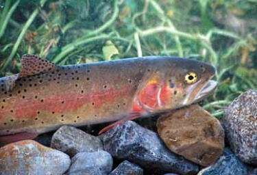
```
]


.pull-right[
```{r out.width="100%"}
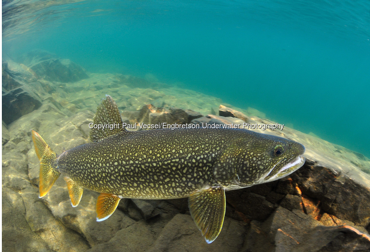
```
]

---
class: inverse, middle, center

# Life history trade offs

---
## Life history trade offs

#### Current reproduction vs. future reproduction

.pull-left[
#### Semelparity
```{r out.width="100%"}
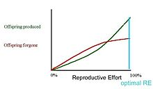
```
]


.pull-right[
#### Iteroparity
```{r out.width="100%", fig.align='left'}
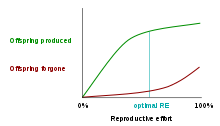
```
]


---
## Life history trade offs

#### Offspring quantity vs. quality (Lack 1954,1968)

.pull-left[
```{r out.width="100%"}
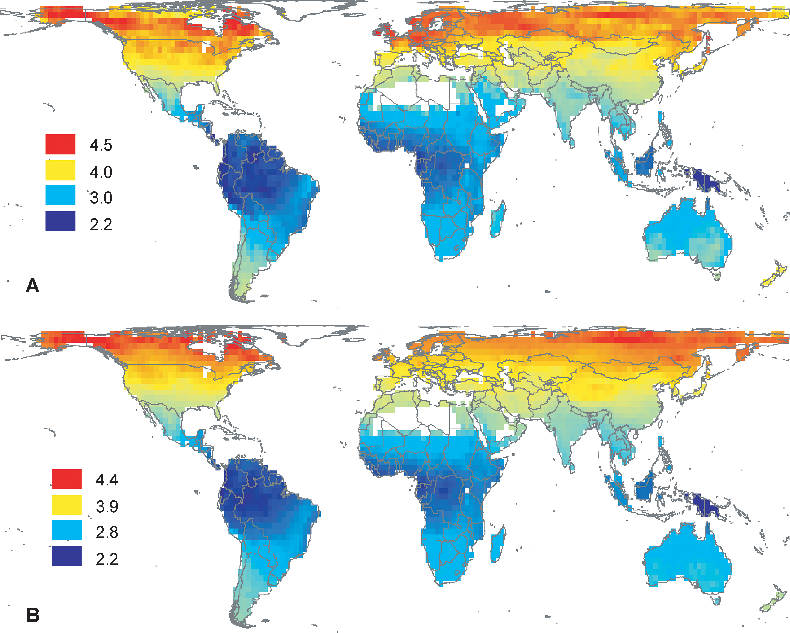
```
]


.pull-right[
```{r out.width="100%"}
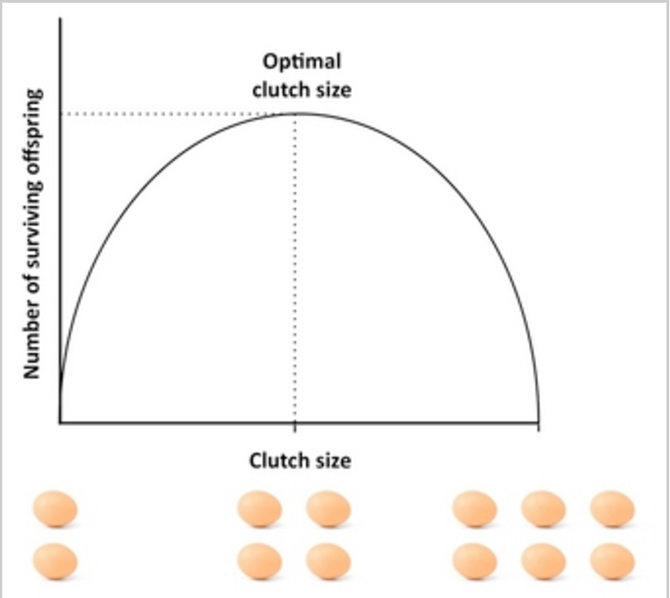
```
]


---
## r-K selection 

#### Arises directly from logistic population growth model (MacArthur & Wilson 1967; Pianka 1970)

- $\large r_0$: density-independent rate of population growth

- $\large K$: carrying capacity


--
#### Evolution of life history strategies leads to:

**r-selected species**  

- selection for ability to colonize and reproduce rapidly  

- good colonizers, poor competitors  


--
**K-selected species**

- selection for ability to contribute to $N$ when the population is near $K$  

- good competitors, poor colonizers  


---
## Life history trade offs

#### Predictions (based on Pianka 1970)

```{r}
library(kableExtra)

rk <- data.frame(x = c("Mortality", "Population size", "Competition", "Selection favors", "Length of life", "Leads to..."),
                 r = c("Variable & unpredictable", "Variable & below K", "Variable & weak", "Rapid development, early reproduction, small body size, semelparity", "Short", "High productivity"),
                 K <- c("Constant & predictable", "Constant & close to K", "Strong", "Slow development, delayed reproduction, large body size, iteroparity", "Long", "High efficiency"))

names(rk) <- c("", "r-selection", "K-selection")

rk%>%
  kable("html", align = 'c', escape = FALSE) %>%
  kable_styling(bootstrap_options = c("striped", "hover", "condensed", "responsive"), full_width = TRUE, font_size = 16) 
  
```


---
## r-K selection


#### The predictions of r-K selection stimulated vast amounts of research on life history evolution

--
#### But...

- Many species don't fall neatly into these categories (combinations of r-selected traits and K-selected traits)

- Predictions are vague enough that many different results are "consistent" with them

- Carrying-capacity is not a demographic parameter so traits that influence resource use do not directly translate to a specific K

---
class: inverse, middle, center

# Fast-slow continuum

---
## Fast-slow continuum

#### More recent studies view life history variation as existing on a continuum:

```{r}
fs <- data.frame(slow = c("Low reproductive effort", "Delayed maturity", "High survival", "Long generation time"),
                 fast = c("High reproduction", "Early maturity", "Low survival", "Short generation time"))

names(fs) <- c("Slow species", "Fast species")

fs %>%
  kable("html", align = 'c', escape = FALSE) %>%
  kable_styling(bootstrap_options = c("striped", "hover", "condensed", "responsive"), full_width = TRUE, font_size = 16) 
  
```

---
## Fast-slow continuum in birds


.pull-left[
```{r out.width="80%"}
knitr::include_graphics("https://upload.wikimedia.org/wikipedia/commons/c/c4/American_Redstart_%2836640045423%29.jpg")
```

```{r out.width="80%"}
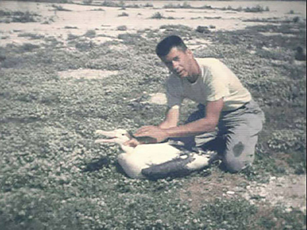
```

]


.pull-right[
```{r out.width="100%"}
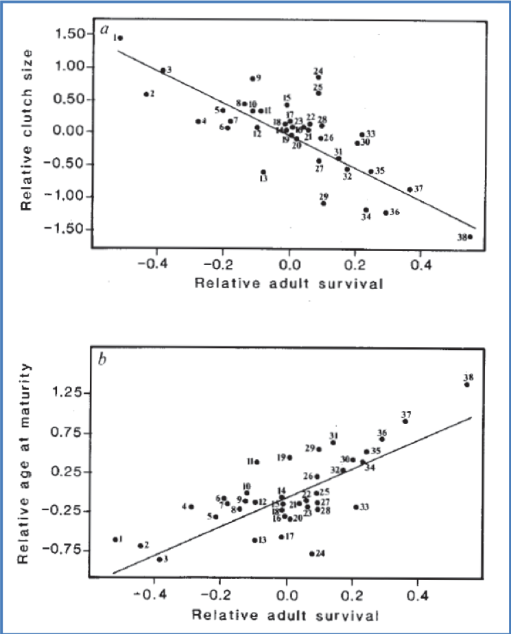
```
]


---
## Fast-slow continuum in mammals


.pull-left[
```{r out.width="80%"}
knitr::include_graphics("https://upload.wikimedia.org/wikipedia/commons/7/76/TiptonKangarooRat.jpg")
```

```{r out.width="80%"}
knitr::include_graphics("https://upload.wikimedia.org/wikipedia/commons/e/ea/Forest_elephant.jpg")
```

]


.pull-right[

##### Age at 1st reproduction vs. adult body mass

```{r out.width="70%"}
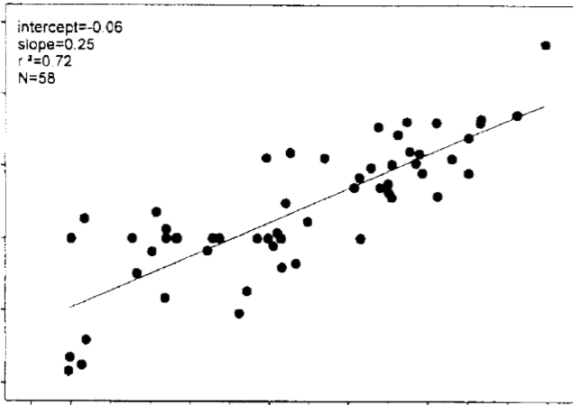
```

##### Adult lifespan vs. adult body mass

```{r out.width="70%"}
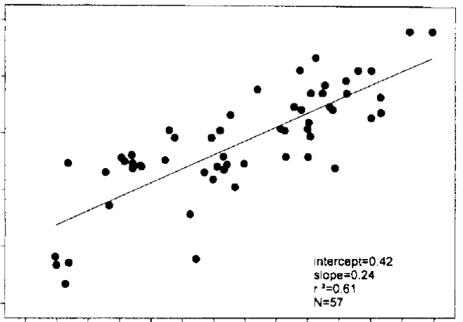
```

]


---
## Fast-slow continuum and elasticities

#### Is the fast-slow continuum related to which vital rates influence $\large \lambda$?

- Explicit connection between evolved pattern of life history vital rates and impact on population dynamics

- Elasticities are useful to guide conservation & management

---
## Fast-slow continuum and elasticities

```{r out.width="70%"}
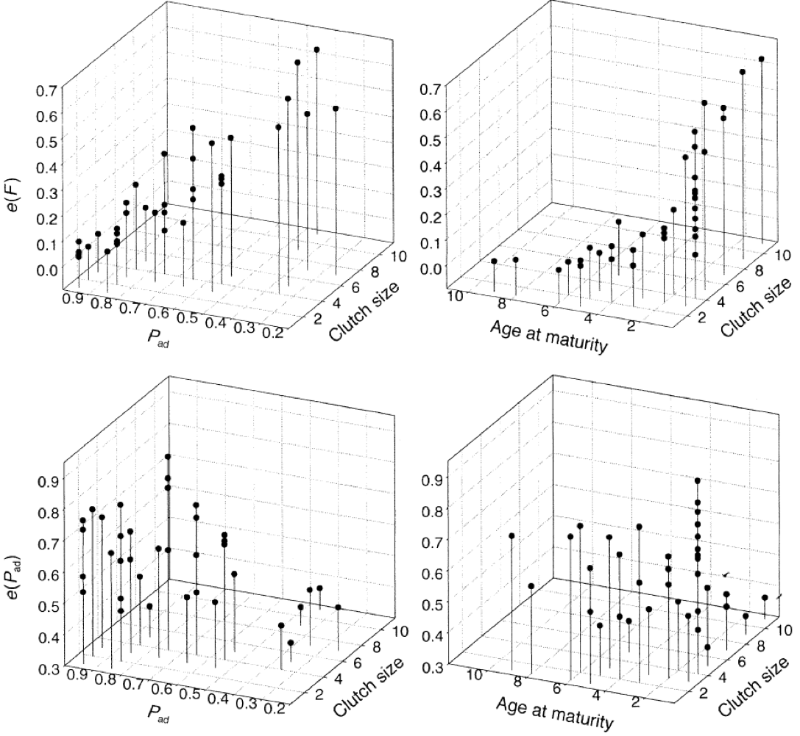
```

---
## Fast-slow continuum and elasticities

```{r out.width="30%"}
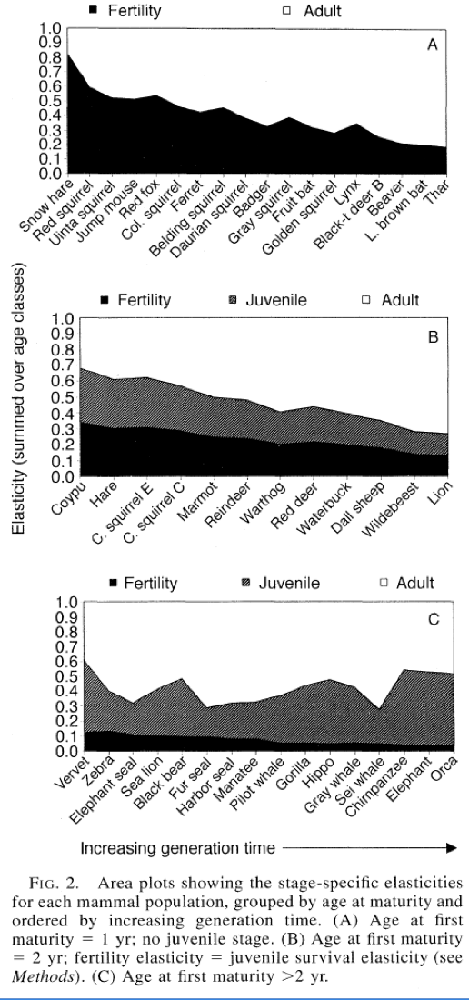
```

---
## Fast-slow continuum and elasticities

```{r out.width="30%"}
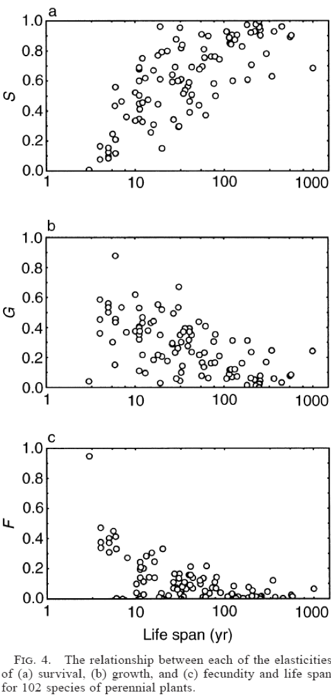
```

---
## Fast-slow continuum and management

#### Distinctive demographic elasticity patterns across bird, mammal, and plant life histories

- Elasticities can be reasonably assessed from limited knowledge of an organisms life history (e.g., clutch size, age at maturity, etc.)

- Managers can assess whether to focus on managing survival (e.g., through harvest or wintering habitat) or reproduction (e.g., spring and summer habitat) 

- Very important for the conservation of rare species

    + Detailed demographic studies not possible
