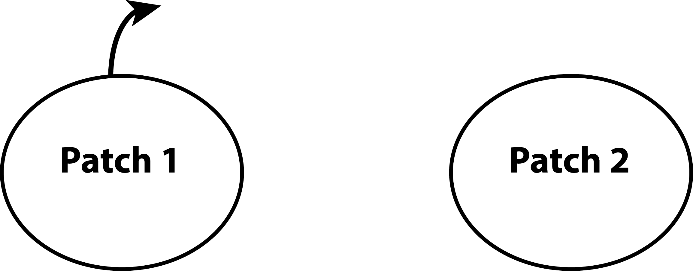
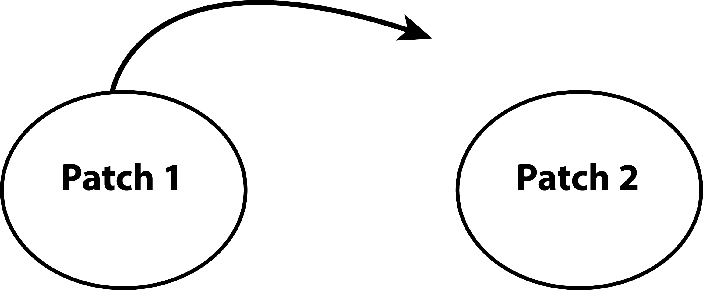
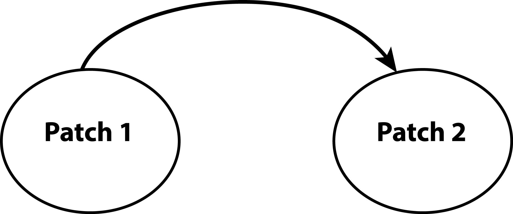
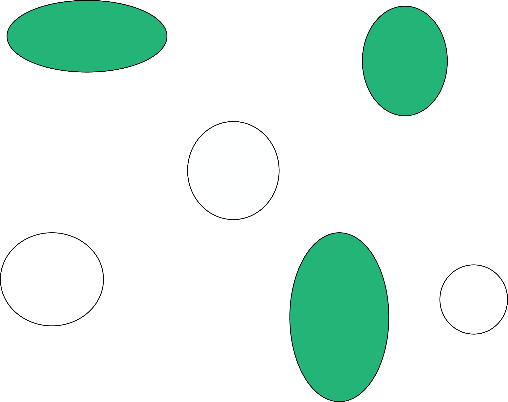
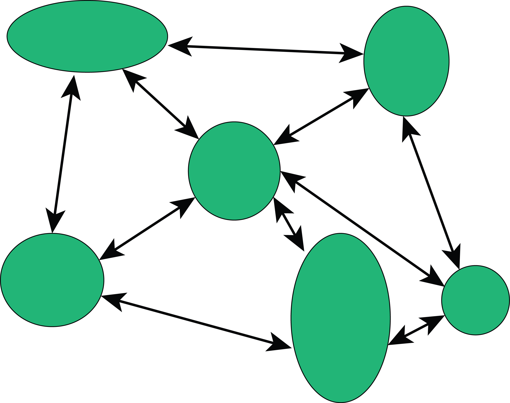
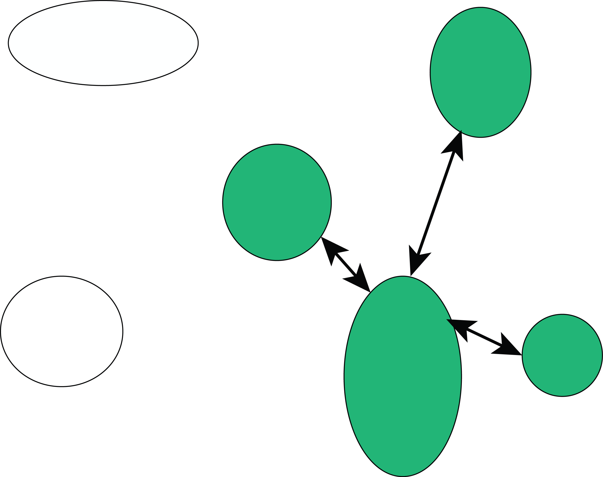
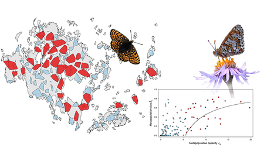

```{r setup, include = FALSE}
options(htmltools.dir.version = FALSE)
knitr::opts_chunk$set(echo = FALSE, fig.align = 'center', warning=FALSE, message=FALSE)
library(WILD3810)
library(gganimate)
```

## Readings

> Mills 175-188


---
class: center, middle

### Population ecology is the study of the distribution of individuals in a population over time and space
<br/>
<br/>

$$\Huge N = B + I + D +E$$


---
## Assumptions of the exponential growth model 

1) Population closed to immigration and emigration  
<br/>

2) Model pertains to only the limiting sex, usually females  
<br/>

3) Birth and death rates are independent of an individual’s age or biological stage  
<br/>

4) Birth and death rates are constant  

---
## Assumptions of the exponential growth model

1) Population closed to immigration and emigration  
<br/>

2) Model pertains to only the limiting sex, usually females  
<br/>

3) Birth and death rates are independent of an individual’s age or biological stage  
<br/>

4) ~~Birth and death rates are constant~~  
- **Stochasticity, density-dependence**

---
## Assumptions of the exponential growth model

1) Population closed to immigration and emigration  
<br/>

2) Model pertains to only the limiting sex, usually females  
<br/>

3) ~~Birth and death rates are independent of an individual’s age or biological stage~~  
- **Stage-structured dynamics** 

4) ~~Birth and death rates are constant~~  
- **Stochasticity, density-dependence**

---
## Assumptions of the exponential growth model

1) **Population closed to immigration and emigration**  
<br/>

2) Model pertains to only the limiting sex, usually females  
<br/>

3) ~~Birth and death rates are independent of an individual’s age or biological stage~~  
- **Stage-structured dynamics** 

4) ~~Birth and death rates are constant~~  
- **Stochasticity, density-dependence**

---
class: center, middle, inverse

# Dispersal

---
## Dispersal

> Movement of an individual from one location to another for the purposes of breeding


- also defined as movements that *can* result in gene flow  


--
#### Types of dispersal

1) Natal dispersal

> Movement of an individual from its birth location to its first breeding location  


--
2) Breeding dispersal

> Movement of an individual between breeding attempts

---
## Dispersal

#### Three stages

1) Emigration

```{r out.width="80%"}

```

---
## Dispersal

#### Three stages

1) Emigration

2) Search

```{r out.width="80%"}

```

---
## Dispersal

#### Three stages

1) Emigration

2) Search

3) Immigration

```{r out.width="80%"}

```

---
## Why disperse?

#### Find mates

<iframe width="560" height="315" src="https://stackoverflow.com/questions/38517236/youtube-video-in-r-markdown" frameborder="0" allowfullscreen></iframe>

---
## Why disperse?

#### Find mates

#### Avoid inbreeding

```{r out.width="60%"}

```


---
## Why disperse?

#### Find mates

#### Avoid inbreeding

#### Avoid kin competition

```{r out.width="60%"}

```

---
## Why not disperse?

#### In some cases, remaining in your current patch (**philopatry**) is beneficial because:

- Search phase can be risky and energetically costly

- "Home field" advantage 

- Loss of kin cooperation

- Competition in new patch


--
Trade-offs between the costs and benefits of dispersal may differ between sexes, populations, and species

- In birds, females often disperse more than males (males benefit from defending territory)

- In mammals, males often disperse more than females (males benefit from defending mates)

---
## How does dispersal influence population dynamics?

#### Movement of individuals can:

- reduce local population size $(E)$

- increase local population size $(I)$

- increase genetic diversity


--
#### Dispersal can link the dynamics of populations that would otherwise be independent

- metapopulation: a population of populations

---
## When are populations a metapopulation?

#### Fragmentation creates patches of suitable habitat surrounded by unsuitable habitat

- if *connectivity* between patches is low, dynamics of local populations will be independent
    + patches that go extinct have little chance of being colonized
    
```{r out.width="30%"}

```


---
## When are populations a metapopulation?

#### Fragmentation creates patches of suitable habitat surrounded by unsuitable habitat

- if connectivity between patches is very high, populations will act as a single, large population
    + very low probability that patches will go extinct
    + "patchy population"
    
```{r out.width="30%"}

```

---
## When are populations a metapopulation?

#### Fragmentation creates patches of suitable habitat surrounded by unsuitable habitat

- if connectivity between patches is moderate, populations can go extinct and be re-colonized
    + at any given time, some sites will be occupied and some will not
    + patches will "blink" on and off
    + metapopulation
    
```{r out.width="30%"}

```

---
## When are populations a metapopulation?

    
```{r out.width="80%"}

```

---
## Levins' metapopulation model

#### Developed originally by Richard Levins

- simple model describing the occupancy of local patches

--
- each patch can be occupied (1) or unoccupied (0)
    + ignores local population dynamics

--
- at each time step, occupied patches go extinct with probability $\Large \epsilon$ 

--
- unoccupied patches can be colonized with probability $\Large \gamma$
<br/>
<br/>

--
- objective is to estimate the fraction of patches occupied, $\Large \psi$

---
## Levins' metapopulation model

#### Spatial configuration of patches is ignored
- all patches have the same probability of being colonized regardless of their location
    
```{r out.width="50%"}
knitr::include_graphics("figs/levins1.png")
```

---
## Levins' metapopulation model

#### At any point in time, what proportion of sites will go extinct?

--
$$\Large E = \psi \epsilon$$

```{r fig.width=7, fig.height=5}
psi <- seq(0, 1, by = 0.1)
eps <- 0.4
gamma <- 0.6

mp <- data.frame(psi = psi,
                 E = psi * eps,
                 I = gamma * psi * (1 - psi))
ggplot(mp, aes(x = psi, y = E)) +
  geom_line(size = 2, color = WILD3810_colors$value[WILD3810_colors$name == "danger"]) +
  scale_x_continuous(expression(psi))
```

---
## Levins' metapopulation model

#### At any point in time, what proportion of sites will be colonized?

$$\Large I = \gamma \psi (1 - \psi)$$

```{r fig.width=7, fig.height=5}
ggplot(mp, aes(x = psi, y = I)) +
  geom_line(size = 2, color = WILD3810_colors$value[WILD3810_colors$name == "primary"]) +
  scale_x_continuous(expression(psi))
```

---
## Levins' metapopulation model

#### At any point in time, what proportion of sites will be occupied?

$$\Large \psi = 1 - \frac{\epsilon}{\gamma}$$

- Although $\large \psi$% of patches are expected to be occupied at any point in time, *which* sites are occupied will change
    + leads to patches "blinking" on and off
    
```{r fig.width=5.5, fig.height=4}
ggplot(mp) +
    geom_segment(aes(y = -Inf, yend = 0.13, x = 0.33, xend = 0.33), 
               color = "grey50", linetype = "longdash") +
  geom_line(aes(x = psi, y = I), size = 2, color = WILD3810_colors$value[WILD3810_colors$name == "primary"]) +
  geom_line(aes(x = psi, y = E), size = 2, color = WILD3810_colors$value[WILD3810_colors$name == "warning"]) +
  scale_x_continuous(expression(psi)) +
    scale_y_continuous("I/E")
```
---
## Metapopulation persistance

#### If $\Large \epsilon$ is the probability that 1 patch goes extinct:

- probability that it doesn't go extinct (persistence) is $\large 1 - \epsilon$


--
#### What is the probability that a metapopulation composed of two patches does **not** go extinct? 

--
$$\LARGE 1 - \epsilon \times \epsilon$$


--
#### What is the probability that a metapopulation composed of $\large n$ patches does not go extinct? 

--
$$\LARGE 1 - \epsilon^n$$

---
## Metapopulation persistance

#### More patches = lower metapopulation extinction risk 
- unoccupied sites are "rescued" by colonization from occupied sites
- critical to maintain patches, even if they are currently unoccupied
- connectivity of patches important for increasing colonization probability

```{r fig.width=6, fig.height=4}
eps <- seq(0, 1, by = 0.01)

ext <- data.frame(eps = eps,
                  Persistance = c(1-eps, 1-eps^4, 1-eps^16),
                  Patches = rep(c("1", "4", "16"), each = length(eps)))

ggplot(ext, aes(x = eps, y = Persistance, color = Patches)) +
  geom_line(size = 2) +
  scale_x_continuous(expression(epsilon)) 
```


---
## Assumptions of the Levins model

- $\large \gamma$ and $\large \epsilon$ are the same for every patch  
<br/>
- $\large \gamma$ and $\large \epsilon$ are constant over time  
<br/>
- $\large \gamma$ and $\large \epsilon$ are independent of patch size  
<br/>
- $\large \gamma$ and $\large \epsilon$ are independent of distance of patch to other patches  
<br/>
- $\large \gamma$ and $\large \epsilon$ are independent of population density  
<br/>
- Local birth-death dynamics are ignored  
