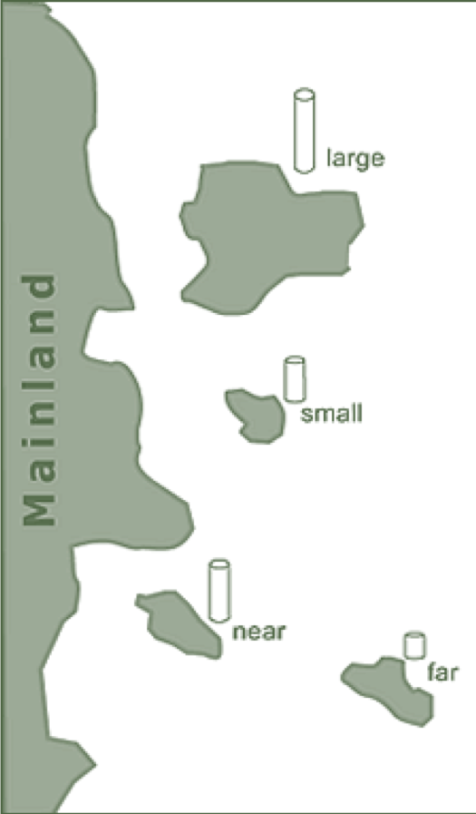
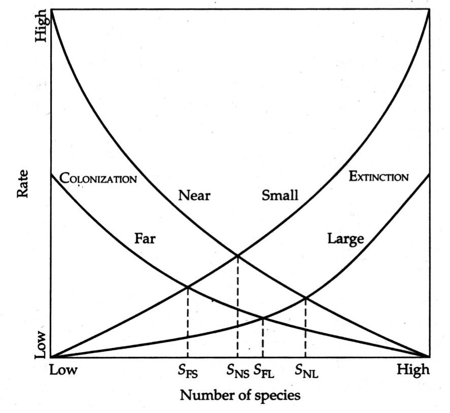
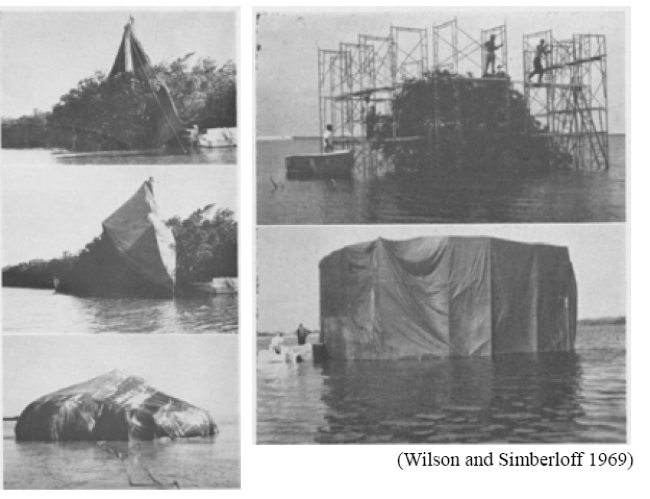
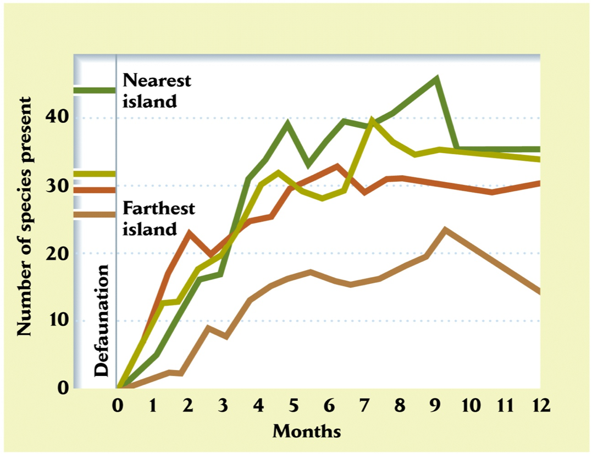
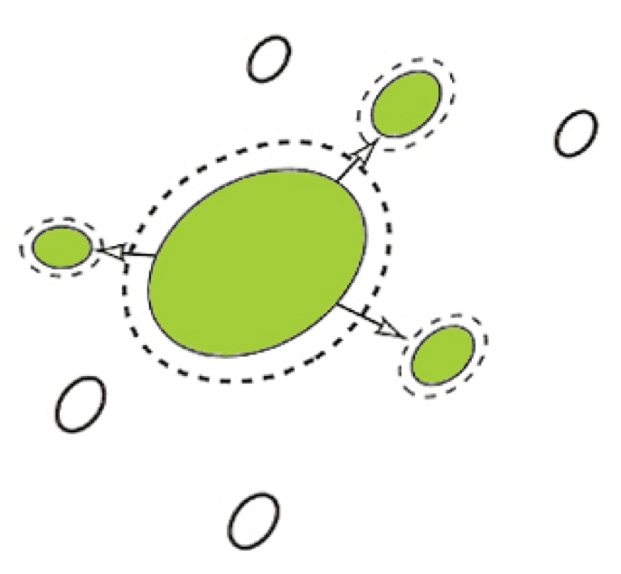

```{r setup, include = FALSE}
options(htmltools.dir.version = FALSE)
knitr::opts_chunk$set(echo = FALSE, fig.align = 'center', warning=FALSE, message=FALSE)
library(WILD3810)
library(gganimate)
```

## Reading

> ### Mills 188-196


---
## Assumptions of the Levins model

- $\large \gamma$ and $\large \epsilon$ are the same for every patch  
<br/>
- $\large \gamma$ and $\large \epsilon$ are constant over time  
<br/>
- $\large \gamma$ and $\large \epsilon$ are independent of patch size  
<br/>
- $\large \gamma$ and $\large \epsilon$ are independent of distance of patch to other patches  
<br/>
- $\large \gamma$ and $\large \epsilon$ are independent of population density  
<br/>
- Local birth-death dynamics are ignored  


---
## Assumptions of the Levins model

- $\large \mathbf \gamma$ **and** $\large \mathbf \epsilon$ **are the same for every patch**  
<br/>
- $\large \gamma$ and $\large \epsilon$ are constant over time  
<br/>
- $\large \mathbf \gamma$ **and** $\large \mathbf \epsilon$ **are independent of patch size**  
<br/>
- $\large \gamma$ **and** $\large \epsilon$ **are independent of distance of patch to other patches**  
<br/>
- $\large \gamma$ and $\large \epsilon$ are independent of population density  
<br/>
- Local birth-death dynamics are ignored  

---
## Island biogeography

#### About the same time Levins was developing the concept of Metapopulation dynamics, Robert MacArthur and E.O. Wilson were developing their theory of Island Biogeography (1963, 1967)


```{r fig.width=8, fig.height=5}
S <- seq(0, 2, by = 0.1)
bio_df <- data.frame(S = S,
                     Rate = c(exp(-S), exp(S)/max(exp(S))),
                     rate = rep(c("Immigration", "Extinction"), each = length(S)),
                     max = apply(cbind(exp(-S), exp(S)/max(exp(S))), 1, max),
                     min = apply(cbind(exp(-S), exp(S)/max(exp(S))), 1, min))

ggplot(bio_df, aes(x = S, y = Rate, color = rate)) +
  geom_line(size = 2) +
  theme(axis.ticks = element_blank(),
        axis.text = element_blank())
```

---
## Island biogeography

```{r fig.width=8, fig.height=5}
ggplot(bio_df, aes(x = S, y = Rate, color = rate)) +
  geom_line(size = 2) +
  theme(axis.ticks = element_blank(),
        axis.text = element_blank())
```

- **Immigration curve**: successful colonization decreases as number of species increases because niches and habitats become filled

- **Extinction curve**: competition increases with increasing number of species, leads to higher extinction rate

---
## Island biogeography

```{r fig.width=8, fig.height=5}
ggplot(bio_df, aes(x = S, y = Rate, color = rate)) +
  geom_line(size = 2) +
  theme(axis.ticks = element_blank(),
        axis.text = element_blank()) +
  geom_ribbon(data=subset(bio_df, S <= 1), 
          aes(ymin=min,ymax=max), fill=WILD3810_colors$value[WILD3810_colors$name=="warning"], color = NA, alpha=0.15) +
    geom_ribbon(data=subset(bio_df, S >= 1), 
          aes(ymin=min,ymax=max), fill=WILD3810_colors$value[WILD3810_colors$name=="primary"], color = NA, alpha=0.15) 
```

$$\LARGE \Delta S = Imm - Ext$$

---
## Island biogeography

```{r fig.width=8, fig.height=5}
ggplot(bio_df, aes(x = S, y = Rate, color = rate)) +
  geom_segment(aes(y = -Inf, yend = 0.375, x = 1, xend = 1)) +
  geom_line(size = 2) +
  theme(axis.ticks = element_blank(),
        axis.text = element_blank()) +
  geom_ribbon(data=subset(bio_df, S <= 1), 
          aes(ymin=min,ymax=max), fill=WILD3810_colors$value[WILD3810_colors$name=="warning"], color = NA, alpha=0.15) +
    geom_ribbon(data=subset(bio_df, S >= 1), 
          aes(ymin=min,ymax=max), fill=WILD3810_colors$value[WILD3810_colors$name=="primary"], color = NA, alpha=0.15) 
```

$$\LARGE \Delta S = Imm - Ext$$

---
## Island biogeography

```{r out.width="35%"}

```

---
## Island biogeography

#### Immigration curves should be lower for **far** islands than for **near** ones:

- distant islands are less likely to be colonized than near ones

```{r fig.width=8, fig.height=5}
S <- seq(0, 2, by = 0.1)
bio_df <- data.frame(S = S,
                     Rate = c(exp(-S), exp(-S)/2, exp(S)/max(exp(S))),
                     rate = rep(c("Immigration", "Immigration", "Emigration"), each = length(S)),
                     distance = rep(c("Near", "Far", "Near"), each = length(S)))

ggplot(bio_df, aes(x = S, y = Rate, color = rate, linetype = distance)) +
  geom_segment(aes(y = -Inf, yend = 0.375, x = 1, xend = 1)) +
  geom_segment(aes(y = -Inf, yend = 0.26, x = 0.65, xend = 0.65)) +
  scale_linetype_manual(values = c("dashed", "solid")) +
  geom_line(size = 2) +
  scale_x_continuous(breaks = c(0.65, 1), labels = c("S[f]", "S[n]")) +
  theme(axis.ticks.y = element_blank(),
        axis.text.y = element_blank())
```


---
## Island biogeography

#### Immigration curves should be lower for **small** islands than **large** ones:

- smaller islands offer a smaller target to find 

```{r fig.width=8, fig.height=5}
S <- seq(0, 2, by = 0.1)
bio_df <- data.frame(S = S,
                     Rate = c(exp(-S), exp(-S)/2, exp(S)/max(exp(S))),
                     rate = rep(c("Immigration", "Immigration", "Emigration"), 
                                each = length(S)),
                     Size = rep(c("Big", "Small", "Big"), each = length(S)))

ggplot(bio_df, aes(x = S, y = Rate, color = rate, linetype = Size)) +
  geom_segment(aes(y = -Inf, yend = 0.375, x = 1, xend = 1)) +
  geom_segment(aes(y = -Inf, yend = 0.26, x = 0.65, xend = 0.65)) +
  scale_linetype_manual(values = c("solid", "dashed")) +
  geom_line(size = 2) +
  scale_x_continuous(breaks = c(0.65, 1), labels = c("S[s]", "S[l]")) +
  theme(axis.ticks.y = element_blank(),
        axis.text.y = element_blank())
```


---
## Island biogeography

#### Extinction curves should be higher for **small** islands than for **large** ones:

- Small islands support smaller population sizes; increased risk of extinction via demographic stochasticity 

```{r fig.width=8, fig.height=5}
S <- seq(0, 2, by = 0.1)
bio_df <- data.frame(S = S,
                     Rate = c(exp(-S), exp(S)/max(exp(S)), exp(S)/max(exp(S))/2),
                     rate = rep(c("Immigration", "Emigration", "Emigration"), 
                                each = length(S)),
                     Size = rep(c("Small", "Small", "Big"), each = length(S)))

ggplot(bio_df, aes(x = S, y = Rate, color = rate, linetype = Size)) +
  geom_segment(aes(y = -Inf, yend = 0.375, x = 1, xend = 1)) +
  geom_segment(aes(y = -Inf, yend = 0.26, x = 1.35, xend = 1.35)) +
  scale_linetype_manual(values = c("dashed", "solid")) +
  geom_line(size = 2) +
  scale_x_continuous(breaks = c(1, 1.35), labels = c("S[s]", "S[l]")) +
  theme(axis.ticks.y = element_blank(),
        axis.text.y = element_blank())
```


---
## Island biogeography

.pull-left[
```{r out.width="100%"}

```
]

.pull-left[
```{r out.width="70%"}

```
]

---
## Island biogeography

#### How can the predictions of island biogeography be tested experimentally?

--
- Wilson andhis grad student Daniel Simberloff de-faunated small clumps of mangroves in Florida bay that differed in their distance from the mainland

.pull-left[
```{r out.width="90%"}

```
]

.pull-left[
```{r out.width="80%"}

```
]

---
## Island biogeography

- **Prediction 1**: insect diversity would attain pre-removal levels

- **Prediction 2**: close islands would be colonized more quickly compared tomore distant islands 

.pull-left[
```{r out.width="90%"}

```
]

.pull-left[
```{r out.width="80%"}

```
]

---
## Island biogeography

```{r out.width="80%"}

```

---
## Island biogeography

#### Island Biogeography led to concept of **Mainland-Island metapopulation structure** 

```{r out.width="50%"}

```

---
## Mainland-island

#### Large, stable Mainland population:

- Provides a constant supply of dispersing individuals


- Colonization does not depend on fraction of islands occupied because colonization largely comes from the mainland

$$\LARGE \hat{\psi} = \frac{\gamma}{\gamma + \epsilon}$$

- Guarantees that at least some islands are occupied because of continual flood of immigration from mainland

---
## Implications of IB and M-I for habitat conservation

#### Preserving single large refuge and tract of habitat
- Supports greater local abundance

- Has low chance of local extinction 

- Supports more species

---
## Implications of IB and M-I for habitat conservation

#### Preserving single large refuge and tract of habitat
- Supports greater local abundance

- Has low chance of local extinction 

- Supports more species

- Vulnerable to isolated catastrophe


--
#### Preserving several small tracts of habitat 

- Higher chance of local extinctions

- More robust to isolated catastrophes

- Connectivity amongst habitat patches is crucial


