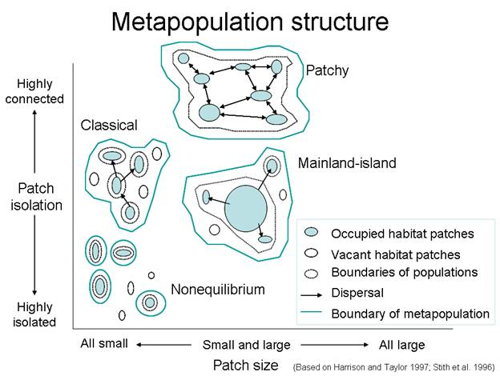

```{r setup, include = FALSE}
options(htmltools.dir.version = FALSE)
knitr::opts_chunk$set(echo = FALSE, fig.align = 'center', warning=FALSE, message=FALSE)
library(WILD3810)
library(gganimate)
```

## Reading

> ### Mills 188-196


---
## Assumptions of the Levins model

- $\large \gamma$ and $\large \epsilon$ are the same for every patch  
<br/>
- $\large \gamma$ and $\large \epsilon$ are constant over time  
<br/>
- $\large \gamma$ and $\large \epsilon$ are independent of patch size  
<br/>
- $\large \gamma$ and $\large \epsilon$ are independent of distance of patch to other patches  
<br/>
- $\large \gamma$ and $\large \epsilon$ are independent of population density  
<br/>
- Local birth-death dynamics are ignored  


---
## Assumptions of the Levins model

- $\large \mathbf \gamma$ **and** $\large \mathbf \epsilon$ **are the same for every patch**  
<br/>
- $\large \gamma$ and $\large \epsilon$ are constant over time  
<br/>
- $\large \mathbf \gamma$ **and** $\large \mathbf \epsilon$ **are independent of patch size**  
<br/>
- $\large \gamma$ and $\large \epsilon$ are independent of distance of patch to other patches  
<br/>
- $\large \gamma$ and $\large \epsilon$ are independent of population density  
<br/>
- Local birth-death dynamics are ignored  

---

```{r out.width="90%"}

```

---
