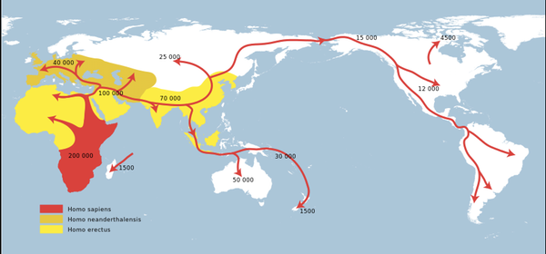
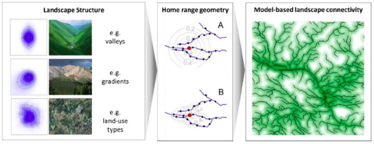
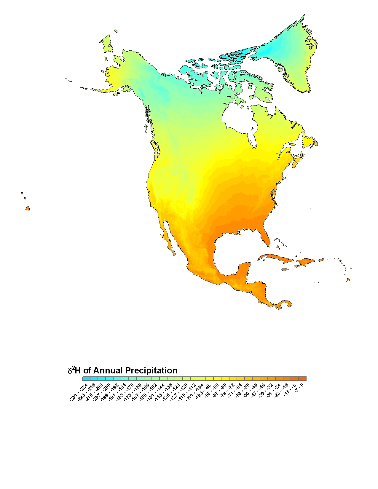
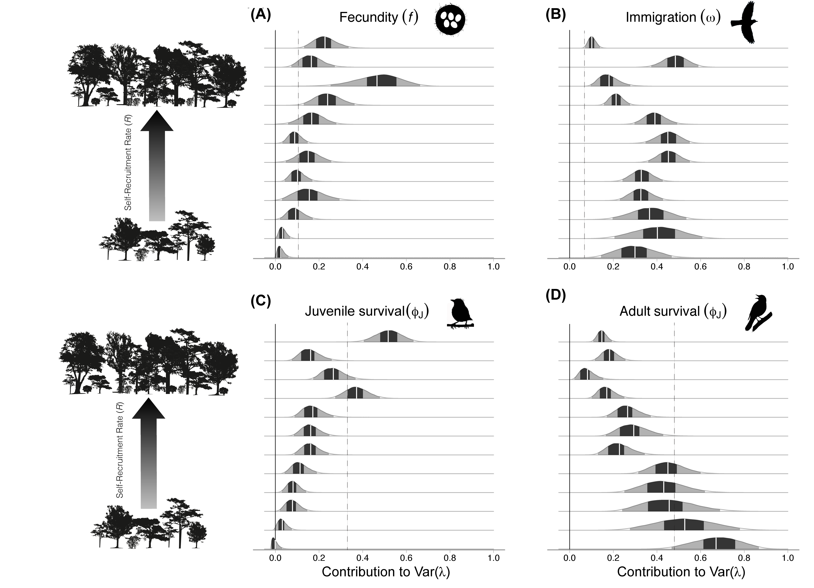
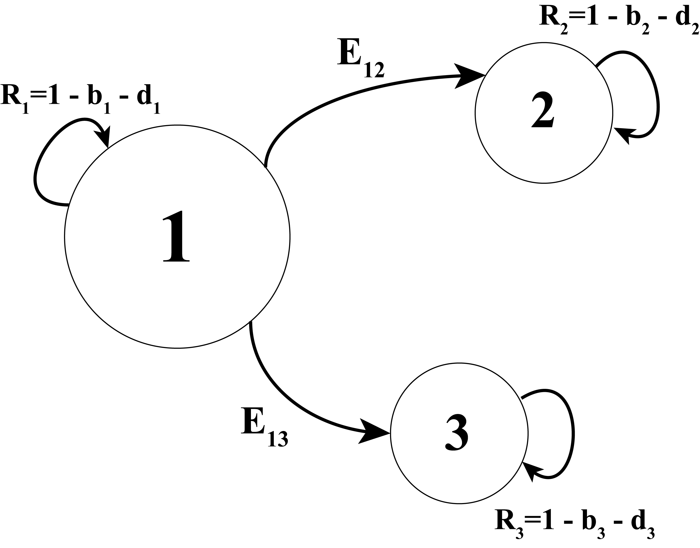

```{r setup, include = FALSE}
options(htmltools.dir.version = FALSE)
knitr::opts_chunk$set(echo = FALSE, fig.align = 'center', warning=FALSE, message=FALSE)
library(WILD3810)
library(gganimate)
```

## Readings

> ### Mills 188-194

---
## Metapopulations

#### Focus of Levins metapopulation models and mainland-island model is on colonization and extinction

- Consider only presence and complete absence


--
#### In reality, $\large \lambda$ within patches is governed by:

- Births

- Immigration

- Deaths

- Emigration


--
#### How does movement interact with local birth/death processes to determine $\large \lambda$?

---
class: inverse, middle, center

# Source-sink dynamics

---
## Source-sink dynamics

#### Variation in habitat quality and biotic interactions (competition, predation, etc.) lead to patch-specific demography

--
#### Source populations:

- $\large b > d$

- produce a net surplus of individuals


--
#### Sink populations

- $\large d > b$

- produce a net deficit of individuals

---
## Source-sink dynamics

#### In high-quality source habitat, dominant individuals prevent young/inferior individuals from settling 
- *despotism*


--
#### Dispersing individuals forced to move from sources to sinks

- dispersal can ‘rescue’ sinks from extinction

- sinks can have $\large \lambda > 1$ but would decline without influx of immigrants


--
#### Sources and sinks **cannot** be identified based on:

- abundance

- $\large \lambda$


---
## Source-sink dynamics

#### "Contribution" metric $(\large C)$

$$\Large C_i = R_i + E_i$$

- $\large R_i$: Self-recruitment rate

- $\large E_i$: Emigration rate

---
## Source-sink dynamics

#### "Contribution" metric $(\large C)$

- Sources: 
    + $\large C_i > 1$
    + contribute more individuals to the metapopulation (births and emigration) than lose to mortality

- Sinks: 
    + $\large C_i < 1$
    + lose more individuals to mortality than contribute to metapopulation
  
    
--
#### How can $\large C_i$ be measured?

---
## Source-sink dynamics

#### Self-recruitment rate $\large R_i$
.pull-left[
- $\large \lambda_i - I_i$

- $\large I_i$ measured via:
    + telemetry
]    

.pull-right[
```{r out.width="100%", fig.align='center'}
knitr::include_graphics("https://upload.wikimedia.org/wikipedia/commons/2/2a/Handheld_telemetry.jpg")
```
]

???
Image courtesy of Red Wolf Recovery Program, via Wikimedia Commons

---
## Source-sink dynamics

#### Self-recruitment rate $\large R_i$
.pull-left[
- $\large \lambda_i - I_i$

- $\large I_i$ measured via:
    + telemetry    
    + genetics
]

.pull-right[
```{r out.width="100%", fig.align='center'}

```
]

???

Image courtesy of [https://theconversation.com/heres-how-genetics-helped-crack-the-history-of-human-migration-52918](https://theconversation.com/heres-how-genetics-helped-crack-the-history-of-human-migration-52918)

---
## Source-sink dynamics

#### Self-recruitment rate $\large R_i$
.pull-left[
- $\large \lambda_i - I_i$

- $\large I_i$ measured via:
    + telemetry    
    + genetics
    + mark-recapture
]

.pull-right[
```{r out.width="120%", fig.align='center'}

```
]

???

Figure from: Royle, J.A., Fuller, A.K. and Sutherland, C., 2018. Unifying population and landscape ecology with spatial capture–recapture. *Ecography*, 41(3), pp.444-456.


---
## Source-sink dynamics

#### Self-recruitment rate $\large R_i$

.pull-left[
- $\large \lambda_i - I_i$

- $\large I_i$ measured via:
    + telemetry    
    + genetics
    + mark-recapture    
    + stable isotopes
]

.pull-right[
```{r out.width="100%", fig.align='center'}

```
]

---
## Source-sink dynamics

#### Emigration rate $\large E_i$

- $\large \epsilon_i \sum_{j \neq i} \phi^{ij}_i$

- $\large \epsilon_i$ (prob. emigration) and $\phi^{ij}_i$ measured via:
    + telemetry
    + mark-recapture

---
## Source-sink dynamics

#### Cougars in Yellowstone National Park (Newby et al. 2012)
.pull-left[
- $\large \lambda = 1.1$

- $\large I = 0.13$

- $\large \epsilon = 0.17$

- $\large \phi = 0.59$
]

.pull-right[
```{r out.width = "100%"}
knitr::include_graphics("https://upload.wikimedia.org/wikipedia/commons/e/e5/Mountain_Lion_in_Grand_Teton_National_Park.jpg")
```
]

<br/>

--
$$\Large C = (1.11 - 0.13) + (0.17 \times 0.59) = 1.08$$

???

Image courtesy of the US National Park Service, via Wikicommons

---
## Source-sink dynamics

#### Wood thrush (*Hylocichla mustelina*)

- In patches with $\large R > 1$, fecundity/juvenile survival drives population dynamics

- In patches with $\large R < 1$, adult survival drives dynamics

- Immigration rate is not related to $\large R$

```{r out.width = "50%"}

```

???
Figure from Rushing et al. (2017)

---
## Source-sink dynamics

#### Modeling source-sink dynamics using matrix models 

```{r out.width="40%"}

```

--
$$\LARGE \mathbf B = \begin{bmatrix}
    R_1 & 0 & 0\\
    E_{12} & R_2 & 0\\
    E_{13} & 0 & R_3
\end{bmatrix}$$

---
## Source-sink dynamics

$$\LARGE \begin{bmatrix}
    n_{1,t+1}\\
    n_{2,t+1}\\
    n_{3,t+1}\end{bmatrix}=
    \begin{bmatrix}
    R_1 & 0 & 0\\
    E_{12} & R_2 & 0\\
    E_{13} & 0 & R_3
\end{bmatrix} \times \begin{bmatrix}
    n_{1,t}\\
    n_{2,t}\\
    n_{3,t} \end{bmatrix}$$


- In this example, what do the vectors of population abundance represent?

---
## Source-sink dynamics

$$\LARGE \begin{bmatrix}
    660\\
    330\\
    110\end{bmatrix}=
    \begin{bmatrix}
    1.1 & 0 & 0\\
    0.1 & 0.9 & 0\\
    0.05 & 0 & 0.8
\end{bmatrix} \times \begin{bmatrix}
    600\\
    300\\
    100 \end{bmatrix}$$


```{r include = FALSE}
B <- matrix(c(1.1, 0, 0, 
              0.1, 0.9, 0,
              0.05, 0, 0.8), nrow = 3, byrow = FALSE)
```

- Metapopulation growth rate: `popbio::lambda(B) = ` `r popbio::lambda(B)` 

- Reproductive value: `popbio::reproductive.value(B) = ` `r round(popbio::reproductive.value(B), 2)`

---
class: center, middle, inverse

# Ecological traps

---
## Ecological traps

#### Animals attracted to a habitat because food resources or nesting cover appear to be high-quality

- Habitat cues that were reliable in the past become unreliable 

- Often, anthropogenic changes to landscape impede successful completion of reproductive cycle

- Over-abundance of cowbirds (nest parasites), meso-predators (e.g., skunks, racoons), anthro-predators (e.g., housecats)

- Traps look like sources to the animal, but demographically they behave like sinks

---
## Ecological traps

#### Polarized light

- For many insects, horizontal polarized light indicates the presence of rivers/steams for mating and egg laying 

- Many windows and even asphalt also produce horizontal light, attracting insects which lay their eggs on artificial surfaces

```{r out.width="60%"}

```

---
## Ecological traps

#### Grassland mowing

- Many grassland birds nest in tall, dense grass

- If these grasses are available early in the season but are then mowed after nesting has commenced, individuals may lose their entire clutch without enough time to renest

```{r out.width="50%"}
knitr::include_graphics("https://upload.wikimedia.org/wikipedia/commons/1/18/Bobolink_%288931393007%29.jpg")
```

???
Image courtesy of CheepShot, via Wikicommons

---
## Source-sink dynamics and management

#### Overall metapopulation dynamics in a source-sink system depend on:

- The net balance of $B$, $D$, $I$, and $E$ amongst all source and sink populations in the region (habitat component)

- Environmental stochasticity (temporal environmental component)

- Demographic stochasticity (bad luck component)

---
## Source-sink dynamics and management

#### Source habitats could mistakenly be ignored if managers preserve habitat with highest abundance abundant (B. van Horne 1983 J. Wildlife Management)

- Sink habitats may have high abundance if individuals forced into them (despotism)

- Ecological traps may result in misleading indicators of habitat quality


--
#### If source habitats are not protected, the whole source-sink metapopulation could become threatened and collapse 


--
#### Must consider where species most productive (i.e., where $\lambda \geq 1$), on average, in a changing environment


