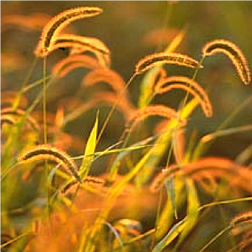

```{r setup, include = FALSE}
options(htmltools.dir.version = FALSE)
knitr::opts_chunk$set(echo = FALSE, fig.align = 'center', warning=FALSE, message=FALSE)
library(WILD3810)
library(gganimate)
```

## Interspecific interactions

#### Thus far, we have focus on the dynamics of populations composed of a single species

--
#### But species exist within a **community**

```{r out.width="50%"}

knitr::include_graphics("https://upload.wikimedia.org/wikipedia/commons/b/b0/Food_Web.svg")
```

---
## Interspecific interactions

#### Interactions among different species can increase or decrease vital rates

- Fecundity

- Growth 

- Survival


--
#### Interactions come in many different forms

---
## Interspecific interactions

#### Interactions come in many different forms
<br/>

```{r}
library(kableExtra)
interactions <- data.frame(A = c("+", "+", "+", "0", "-"),
                           B = c("+", "0", "-", "-", "-"),
                           Type = c("Mutualism", "Commensalism", "Contramensalism", "Amensalism", "Competition"))

names(interactions) <- c("Species A", "Species B", "Interaction type")
kable(interactions, align = 'c', format = 'html') %>%
  kable_styling("striped", full_width = F) 
```

---
## Interspecific interactions

#### Interactions come in many different forms
<br/>

```{r}
library(kableExtra)
interactions <- data.frame(A = c("+", "+", "+", "0", "-"),
                           B = c("+", "0", "-", "-", "-"),
                           Type = c("Mutualism", "Commensalism", "Contramensalism", "Amensalism", "Competition"))

names(interactions) <- c("Species A", "Species B", "Interaction type")
kable(interactions, align = 'c', format = 'html') %>%
  kable_styling("striped", full_width = F) %>%
  row_spec(5, bold = T, color = "white", background = "#446E9B")
```

---
class: middle, center, inverse

# Interspecific competition

---
## Interspecific competition

#### Direct

**Interference competition**

> individuals actively prevent others from attaining a resource in a given area or territory

<iframe width="560" height="315" src="https://www.youtube.com/embed/X4J7DqSkkrU" frameborder="0" allow="accelerometer; autoplay; encrypted-media; gyroscope; picture-in-picture" allowfullscreen></iframe>


---
## Interspecific competition

#### Direct

**Interference competition**

> individuals actively prevent others from attaining a resource in a given area or territory


*Allelopathy*: one plant releases toxic chemicals that poison the soil for others

```{r out.width="55%"}
knitr::include_graphics("figs/manzanita.jpg")
```

---
## Interspecific competition

#### Indirect

**Exploitation competition**: 

> consumption of limited resource by individuals makes it more difficult for others to attain the resource (scramble competition)


**Pre-emptive competition**: 

> competition for space (e.g., nest sites)


---
class: inverse, center, middle

# The niche

---
## The niche

#### What is a niche?

--
- Niche = habitat where a species lives (Grinnell 1917)
    + e.g., the forest canopy 

--
- Niche = trophic position; an organism’s role (Elton 1927)
    + e.g., birds of prey

--
- Niche = “n-dimensional hypervolume” (Hutchinson 1957)
    + the multi-dimensional resources (e.g., temperature, precipitation, light, etc.) required by a species to persist


--
#### Competition arises from niche overlap

---
## The Hutchinsonian niche

#### Niche dimensions are environmental factors (temperature, precipitation, light, etc.)

#### Niche dimensions can be visualized as “resource axes”

```{r out.width="70%"}

```


---
## Competition and the niche 

#### **Fundamental niche**:

> Total range of environmental conditions that allow population persistence


--
#### Strength of competition between co-occurring species is related to the degree of overlap between their fundamental niches

- which set of species compete more strongly?
<br/>
<br/>

```{r out.width="80%"}

```

---
## Competition and the niche 

#### Competition keeps species from occupying all of their fundamental niche

#### **Realized niche**:

> Portion of fundamental niche occupied after interactions w/ other species


```{r out.width="60%"}

```

---
## Competition and the niche 

.pull-left[
#### Classic experiment:

- Joseph Connell (1961)

- Barnacles
    + *Balanus balanoides*
    + *Chthalamus stellatus* 

- Fundamental niches overlap

- Competition w/ *Balanus* restricts *Chthamalus* to upper rocks (realized niche)
]

.pull-right[
```{r out.width="100%"}

```
]

---
## Modeling competition

#### How can interspecific competition be modeled?

--
#### We aleady learned about modeling *intra*specific competition

$$\large \frac{dN}{dt} = r_0N\bigg(1-\frac{N}{K}\bigg)$$

```{r fig.height=3, fig.width=5}
K <- 1000
df1 <- data.frame(N = NA, t = seq(1:100), pop = "1")

df2 <- data.frame(N = NA, t = seq(1:100), pop = "2")

df2$N[1] <- 5

df1$N[1] <- 1500

for(t in 2:nrow(df2)){
  r <- 0.15*(1-df1$N[t-1]/K)
  df1$N[t] <- df1$N[t-1] * exp(r)
  
  r2 <- 0.15*(1-df2$N[t-1]/K)
  df2$N[t] <- df2$N[t-1] * exp(r2)
  
}

df1$dNdt <- df1$N*(1-df1$N/K)
df2$dNdt <- df2$N*(1-df2$N/K)

df <- dplyr::bind_rows(df1, df2)

(m <- ggplot(df, aes(t, N, color = pop)) + 
      geom_hline(yintercept = c(K), linetype = "longdash", color = "grey20") +
      geom_path(size = 2) +
      scale_y_continuous(breaks = c(K), labels = c("K")) +
      scale_x_continuous("Time") +
      theme(axis.text.x = element_blank(), axis.ticks.x = element_blank()) +
  guides(size = FALSE, color = FALSE))
```

--
```{r out.width="80%"}

```

---
## Interspecific competition

#### If competing species are ecologically identical (use the same resources)
- Inter-specific competition is equivalent to intra-specific competition

- Each organism competes with all organisms of both species

- Population growth rate of each species is determined by the sum of numbers of both species combined:

$$\large \frac{dN_1}{dt} = r_1N_1\bigg(1-\frac{N_1 + N_2}{K_1}\bigg)$$

$$\large \frac{dN_2}{dt} = r_2N_2\bigg(1-\frac{N_1 + N_2}{K_2}\bigg)$$
---
## Interspecific competition

#### Isocline of single species logistic model 

```{r out.width="80%"}

```

--
#### Becomes two-dimensional
- on the isocline, $\frac{dN}{dt} = 0$

```{r out.width="45%"}

```

---
## Interspecific competition

#### When species utilize the same niche:

- Species with higher carrying capacity will competitively exclude the other 

- Higher $K$ means that a species can endure more crowding than the other, given the environment (e.g., more effective at getting the resources) 

.pull-left[
```{r out.width="60%"}

```
]

.pull-right[
```{r out.width="100%"}

```
]

---
## Interspecific competition

Competitive Exclusion Principle was first eluded to by Grinnell (1904):

> "Two species of approximately the same food habits are not likely to remain long evenly balanced in numbers in the same region. One will crowd out the other; the one longest exposed to local conditions, and hence best fitted, though ever so slightly, will survive, to the exclusion of any less favored would-be invader"

---
## Interspecific competition

#### What if two competitors do not occupy the same niche? 
- Effect of numbers of another species will not be equivalent to numbers of conspecifics

- The force of interspecific competition will be < intraspecific competition because the other species occupies a (somewhat) different niche whereas conspecifics occupy the same niche

```{r out.width="80%"}

```

---
## Interspecific competition

#### Two individuals independently developed the same model during the 1920s and 1930s to accommodate the realities of competitive species occupying different niches 

- Alfred J. Lotka and Vito Volterra

- Lotka-Volterra competition model


$$\large \frac{dN_1}{dt} = r_1N_1\bigg(\frac{K_1 - [N_1 + \alpha N_2]}{K_1}\bigg)$$

$$\large \frac{dN_2}{dt} = r_2N_2\bigg( \frac{K_2 - [N_2 + \beta N_1]}{K_2}\bigg)$$

- Competition coefficients
    + $\alpha$ is the effect of species 2 on 1
    + $\beta$ is the effect of species 1 on 2

---
## Lotka-Volterra competition model

$$\large \frac{dN_1}{dt} = r_1N_1\bigg(\frac{K_1 - [N_1 + \alpha N_2]}{K_1}\bigg)$$

$$\large \frac{dN_2}{dt} = r_2N_2\bigg( \frac{K_2 - [N_2 + \beta N_1]}{K_2}\bigg)$$

- $\large \alpha < 0$ = Mutualism

- $\large 0 < \alpha < 1$ = interspecific comp < intraspecific comp
 
- $\large \alpha > 1$ = interspecific comp > intraspecific comp (rare) 

- same relationships can be written for $\large \beta$

---
## Lotka-Volterra competition model

#### Can set Lotka-Volterra differential equations to 0 and solve for long-term equilibrium solutions of competition

$$\large 0 = r_1N_1\bigg(\frac{K_1 - [N_1 + \alpha N_2]}{K_1}\bigg)$$

$$\large 0 = r_2N_2\bigg( \frac{K_2 - [N_2 + \beta N_1]}{K_2}\bigg)$$

--
$$\large \hat{N}_1 = K_1 - \alpha N_2$$

$$\large \hat{N}_2 = K_2 - \beta N_1$$

--
- Equilibrium solutions depend on:
    + carrying capacities

    + competition coefficients

    + abundance of other species

---
## Lotka-Volterra competition model

#### Scenario 1: Isoclines do not cross, and that for species 1 is higher than that for 2

.pull-left[
```{r out.width="80%"}

```
]

.pull-right[
```{r out.width="100%"}

```
]

- Species 1 wins and competitively excludes 2 

---
## Lotka-Volterra competition model

#### Scenario 2: Isoclines do not cross, and that for species 2 is higher than that for 1


.pull-left[
```{r out.width="80%"}

```
]

.pull-right[
```{r out.width="100%"}

```
]

- Species 2 wins and competitively excludes 1 


---
## Lotka-Volterra competition model

#### Scenario 3: Isoclines cross, intraspecific comp stronger than interspecific comp


.pull-left[
```{r out.width="80%"}

```
]

.pull-right[
```{r out.width="100%"}

```
]

- Stable equilibrium with coexistence

---
## Coexistence

#### How to avoid competitive exclusion?

--
#### Reduce niche overlap (niche differentiation)
- **Spatially**


.pull-left[
Forage in the open
```{r out.width="80%"}

```
]

.pull-right[
Forage under shrubs
```{r out.width="80%"}
knitr::include_graphics("figs/mouse2.png")
```
]


---
## Coexistence

#### How to avoid competitive exclusion?

#### Reduce niche overlap (niche differentiation)
- **Temporally**


.pull-left[
Forage during the day
```{r out.width="80%"}

```
]

.pull-right[
Forage at night
```{r out.width="80%"}

```
]


---
## Coexistence

#### How to avoid competitive exclusion?

#### Reduce niche overlap (niche differentiation)
- **Temporally**


.pull-left[
Warm season 
```{r out.width="80%"}

```
]

.pull-right[
Cool season
```{r out.width="80%"}

```
]


---
## Coexistence

.pull-left[
#### Many factors can result in niche differentiation

#### Over evolutionary time, species have partitioned the available niches on Earth

#### Species with sufficiently different ‘realized’ niches can coexist
]

.pull-right[
```{r out.width="80%"}

```
]
