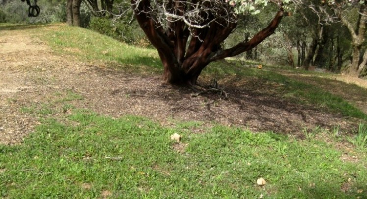

```{r setup, include = FALSE}
options(htmltools.dir.version = FALSE)
knitr::opts_chunk$set(echo = FALSE, fig.align = 'center', warning=FALSE, message=FALSE)
library(WILD3810)
library(gganimate)
```

## Interspecific interactions

#### Thus far, we have focus on the dynamics of populations composed of a single species

--
#### But species exist within a **community**

```{r out.width="50%"}

knitr::include_graphics("https://upload.wikimedia.org/wikipedia/commons/b/b0/Food_Web.svg")
```

---
## Interspecific interactions

#### Interactions among different species can increase or decrease vital rates

- Fecundity

- Growth 

- Survival


--
#### Interactions come in many different forms

---
## Interspecific interactions

#### Interactions come in many different forms
<br/>

```{r}
library(kableExtra)
interactions <- data.frame(A = c("+", "+", "+", "0", "-"),
                           B = c("+", "0", "-", "-", "-"),
                           Type = c("Mutualism", "Commensalism", "Contramensalism", "Amensalism", "Competition"))

names(interactions) <- c("Species A", "Species B", "Interaction type")
kable(interactions, align = 'c') %>%
  kable_styling("striped", full_width = F) 
```

---
## Interspecific interactions

#### Interactions come in many different forms
<br/>

```{r}
library(kableExtra)
interactions <- data.frame(A = c("+", "+", "+", "0", "-"),
                           B = c("+", "0", "-", "-", "-"),
                           Type = c("Mutualism", "Commensalism", "Contramensalism", "Amensalism", "Competition"))

names(interactions) <- c("Species A", "Species B", "Interaction type")
kable(interactions, align = 'c') %>%
  kable_styling("striped", full_width = F) %>%
  row_spec(5, bold = T, color = "white", background = "#446E9B")
```

---
class: middle, center, inverse

# Interspecific competition

---
## Interspecific competition

#### Direct

**Interference competition**

> individuals actively prevent others from attaining a resource in a given area or territory

<iframe width="560" height="315" src="https://www.youtube.com/embed/X4J7DqSkkrU" frameborder="0" allow="accelerometer; autoplay; encrypted-media; gyroscope; picture-in-picture" allowfullscreen></iframe>


---
## Interspecific competition

#### Direct

**Interference competition**

> individuals actively prevent others from attaining a resource in a given area or territory


*Allelopathy*: one plant releases toxic chemicals that poison the soil for others

```{r out.width="55%"}

```

