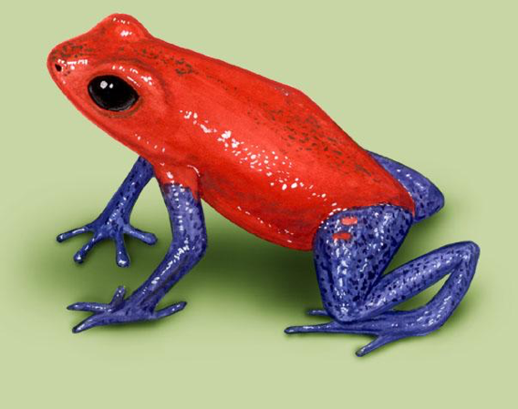
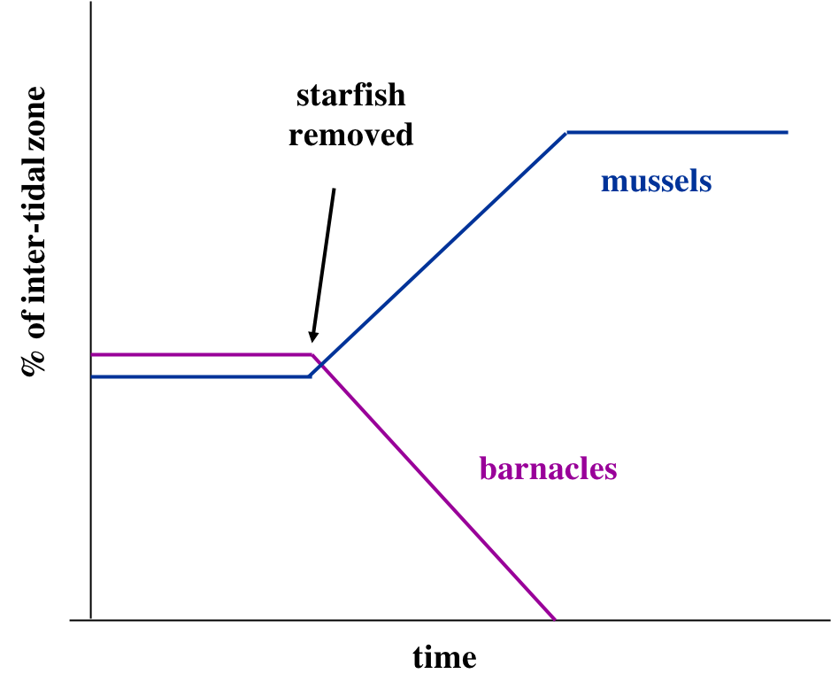
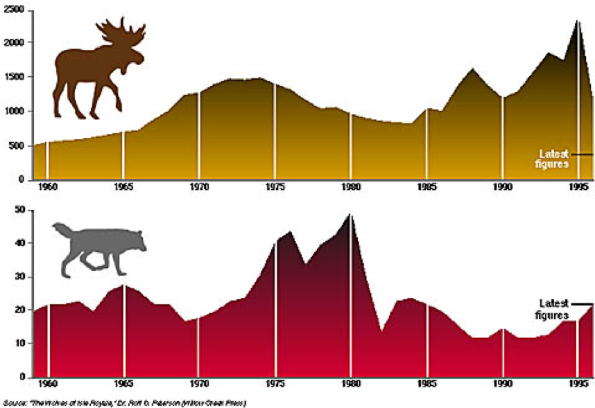

```{r setup, include = FALSE}
options(htmltools.dir.version = FALSE)
knitr::opts_chunk$set(echo = FALSE, fig.align = 'center', warning=FALSE, message=FALSE)
library(WILD3810)
library(gganimate)
```

## Readings

> ### Mills 142-153


---
## Interspecific interactions

#### Interactions come in many different forms
<br/>

```{r}
library(kableExtra)
interactions <- data.frame(A = c("+", "+", "+", "0", "-"),
                           B = c("+", "0", "-", "-", "-"),
                           Type = c("Mutualism", "Commensalism", "Contramensalism", "Amensalism", "Competition"))

names(interactions) <- c("Species A", "Species B", "Interaction type")
kable(interactions, align = 'c', format = 'html') %>%
  kable_styling("striped", full_width = F) 
```

---
## Interspecific interactions

#### Interactions come in many different forms
<br/>

```{r}
library(kableExtra)
interactions <- data.frame(A = c("+", "+", "+", "0", "-"),
                           B = c("+", "0", "-", "-", "-"),
                           Type = c("Mutualism", "Commensalism", "Contramensalism", "Amensalism", "Competition"))

names(interactions) <- c("Species A", "Species B", "Interaction type")
kable(interactions, align = 'c', format = 'html') %>%
  kable_styling("striped", full_width = F) %>%
  row_spec(3, bold = T, color = "white", background = "#446E9B")
```

---
class: middle, center, inverse

# Predation

---
## Predation

<iframe width="560" height="315" align="center" src="https://www.youtube.com/embed/Rv9hn4IGofM" frameborder="0" allow="accelerometer; autoplay; encrypted-media; gyroscope; picture-in-picture" allowfullscreen></iframe>
 

---
## Predation

#### Important, widespread effects on:

- Evolution of behavior, morphology, physiology

.pull-left[
**Semelparity**  

- Synchronous and massive production of offspring

- Predators readily become full (satiated) 

- Most offspring escape and survive
]

.pull-right[
```{r out.width="75%"}
knitr::include_graphics("https://upload.wikimedia.org/wikipedia/commons/3/3b/Agave_July_2011-1.jpg")
```
]

???

Image courtesy of 

---
## Predation

#### Important, widespread effects on:

- Evolution of behavior, morphology, physiology

.pull-left[
**Behavior**  

- Adult birds feign injury to lure predators away from nest 

]

.pull-right[
<iframe width="560" height="315" src="https://www.youtube.com/embed/OUKieDNDWCs" frameborder="0" allow="accelerometer; autoplay; encrypted-media; gyroscope; picture-in-picture" allowfullscreen></iframe>
]

---
## Predation

#### Important, widespread effects on:

- Evolution of behavior, morphology, physiology

.pull-left[
**Behavior**  

- Group hunting

]

.pull-right[
<iframe width="560" height="315" src="https://www.youtube.com/embed/Ai3eVjr0Pzg?start=17" frameborder="0" allow="accelerometer; autoplay; encrypted-media; gyroscope; picture-in-picture" allowfullscreen></iframe>
]


---
## Predation

#### Important, widespread effects on:

- Evolution of behavior, morphology, physiology

.pull-left[
**Physical defense**  

```{r out.width="80%"}
knitr::include_graphics("https://upload.wikimedia.org/wikipedia/commons/7/76/Negev_Tortoise_Luxor.JPG")
```
]

.pull-right[
```{r out.width="80%"}

```
]

---
## Predation

#### Important, widespread effects on:

- Evolution of behavior, morphology, physiology

.pull-left[
**Chemical defense**  

```{r out.width="80%"}

```

]

.pull-right[
<br/>
```{r out.width="80%"}

```
]

---
## Predation

#### Important, widespread effects on:

- Evolution of behavior, morphology, physiology

.pull-left[
**Camouflage**  

```{r out.width="80%"}
knitr::include_graphics("https://upload.wikimedia.org/wikipedia/commons/1/18/Crocodylus_acutus_camouflage.jpg")
```
]

.pull-right[
<iframe width="560" height="315" src="https://www.youtube.com/embed/_gyHNYtLgWo" frameborder="0" allow="accelerometer; autoplay; encrypted-media; gyroscope; picture-in-picture" allowfullscreen></iframe>
]

---
## Predation

#### Important, widespread effects on:

- Evolution of behavior, morphology, physiology

.pull-left[
**Aposematic coloration**  

```{r out.width="80%"}
knitr::include_graphics("https://upload.wikimedia.org/wikipedia/commons/c/cb/Micrurus_tener.jpg")
```
]

.pull-right[
```{r out.width="80%"}
knitr::include_graphics("https://upload.wikimedia.org/wikipedia/commons/4/4a/Xystodesmid_Catoctin_Mountain_Park.jpg")
```
]


---
## Predation

#### Important, widespread effects on:

- Evolution of behavior, morphology, physiology

.pull-left[
**Mimicry**  

- *Batesian* mimicry: harmless species mimic poisonous/unpalatable species
```{r out.width="80%"}
knitr::include_graphics("https://upload.wikimedia.org/wikipedia/commons/c/cb/Micrurus_tener.jpg")
```
]

.pull-right[
<br/>
<br/>
```{r out.width="70%"}
knitr::include_graphics("https://upload.wikimedia.org/wikipedia/commons/a/aa/Red_milk_snake.JPG")
```
]

---
## Predation

#### Important, widespread effects on:

- Evolution of behavior, morphology, physiology

.pull-left[
**Mimicry**  

- *Mullerian* mimicry: convergence of several harmful species on same pattern

]

.pull-right[
```{r out.width="80%"}
knitr::include_graphics("https://upload.wikimedia.org/wikipedia/commons/6/6e/M%C3%BCllerian_mimicry_%2832149192376%29.jpg")
```
]


---
## Predation

#### Important, widespread effects on:

- Evolution of behavior, morphology, physiology

.pull-left[
**Physiology**  

```{r out.width="80%"}
knitr::include_graphics("https://upload.wikimedia.org/wikipedia/commons/9/90/Antilocapra_americana_pair_%28crop%29.jpg")
```

]

.pull-right[
```{r out.width="80%"}
knitr::include_graphics("https://upload.wikimedia.org/wikipedia/commons/6/61/Falco_peregrinus_-Morro_Rock%2C_Morro_Bay%2C_California%2C_USA_-flying-8.jpg")
```
]

---
## Predation

#### Important, widespread effects on:

- Community structure
    + Picky predators can promote coexistence among competing prey species when the dominant competitor is the preferred prey (i.e. ‘competitive exclusion’ is prevented by predator)

--
.pull-left[
**The predator**  

```{r out.width="80%"}
knitr::include_graphics("https://upload.wikimedia.org/wikipedia/commons/a/ad/Orange_Starfish_at_Olympic_National_Park.jpg")
```

]

.pull-right[
**The prey**  

```{r out.width="80%"}
knitr::include_graphics("https://upload.wikimedia.org/wikipedia/commons/2/23/Acorn_Barnacles_%28Balanus_perforatus%29_group%2C_Irvine.jpg")
```
]


---
## Predation

#### Important, widespread effects on:

- Community structure

.pull-left[
- In the presence of starfish, mussels and barnacles coexist

- If starfish are experimentally removed, competitive exclusion of barnacles
    + mussels are the dominant competitor but also the preferred prey

- *competitor-mediated coexistance*
]

.pull-right[

```{r out.width="80%"}

```
]

---
## Predation

#### Important, widespread effects on:

- Regulation of abundance and population dynamics of both predator and prey


--
#### Do predators control the abundance of their prey?

--
##### Yes

- Introduced rats, mongoose, and cats have caused the extinction of at least 43 bird species

```{r out.width="30%"}
knitr::include_graphics("https://upload.wikimedia.org/wikipedia/commons/c/c2/Feral_Cat_%285573630708%29.jpg")
```

---
## Predation

#### Important, widespread effects on:

- Regulation of abundance and population dynamics of both predator and prey


#### Do predators control the abundance of their prey?

##### Yes

- Invasive brown tree snakes caused the extinction of 10 bird species on the island of Guam

```{r out.width="40%"}
knitr::include_graphics("https://upload.wikimedia.org/wikipedia/commons/8/8a/Brown_tree_snake_%28Boiga_irregularis%29_%288387580552%29.jpg")
```

---
## Predation

#### Important, widespread effects on:

- Regulation of abundance and population dynamics of both predator and prey


#### Do predators control the abundance of their prey?

##### Yes

- Mesopredator release

.pull-left[
```{r out.width="75%"}
knitr::include_graphics("https://upload.wikimedia.org/wikipedia/commons/f/f5/Kojote2010.JPG")
```
]

.pull-right[
```{r out.width="75%"}
knitr::include_graphics("https://upload.wikimedia.org/wikipedia/commons/6/69/Raccoons_eat_deer.png")
```
]


---
## Predation

#### Important, widespread effects on:

- Regulation of abundance and population dynamics of both predator and prey


#### Do predators control the abundance of their prey?

#### Maybe?


.pull-left[
```{r out.width="75%"}
knitr::include_graphics("https://upload.wikimedia.org/wikipedia/commons/d/dc/Eurasian_wolf.JPG")
```
]

.pull-right[
```{r out.width="75%"}
knitr::include_graphics("https://upload.wikimedia.org/wikipedia/commons/c/c9/Moose-Gustav.jpg")
```
]

---
## Predation

#### Important, widespread effects on:

- Regulation of abundance and population dynamics of both predator and prey


#### Do predators control the abundance of their prey?

- On Island Royale, wolf/moose populations are linked but also influenced by vegetation and winter severity

```{r out.width="40%"}

```

---
class: inverse, middle, center

# How do predators impact prey population?

---
## How do predators impact prey population?

#### Predation rate $(\large P)$

> Percentage of prey population killed per unit time

$$\large P = \frac{\#\; prey\; killed}{Prey\; abundance} \times 100$$

--
- Number of prey killed = numerical response $\times$ functional response

---
class: inverse, middle, center

# Numerical response

---
## Numerical response

#### Change in number of predators as prey abundance changes

- Number of predators present at a given prey density

--
- Function of how prey influence $B$ $D$ of predator

```{r fig.width=6, fig.height=4}
d <- seq(from = 0, to = 2.5, by = 0.1)
nr1 <- 0.19 * d

nr_df <- data.frame(d = d, 
                    nr = nr1,
                    response = "linear")

ggplot(nr_df, aes(x = d, y = nr, color = response)) +
  geom_line(size = 2) +
  guides(color = FALSE) +
  scale_y_continuous("Numerical response") +
  scale_x_continuous("Prey Density") +
  theme(axis.text.y = element_blank())
```


---
## Numerical response

#### Change in number of predators as prey abundance changes

- Number of predators present at a given prey density

- Function of how prey influence $B$ $D$ of predator

- Predators may also congregate at prey source: *aggregative response*

```{r fig.width=6, fig.height=4}
nr2 <- 1/ (1 + exp(-2 * d)) - 0.5

nr_df2 <- data.frame(d = d, 
                    nr = nr2,
                    response = "move")

nr_df2 <- dplyr::bind_rows(nr_df, nr_df2)
ggplot(nr_df2, aes(x = d, y = nr, color = response)) +
  geom_line(size = 2) +
  guides(color = FALSE) +
  scale_y_continuous("Numerical response") +
  scale_x_continuous("Prey Density") +
  theme(axis.text.y = element_blank())
```

---
## Numerical response

#### When introduced prey lead to large numerical response of predators, native prey can suffer

- high abundance of predators leads to unsustainable predation on native prey

-  **hyperpredation**

.pull-left[
```{r out.width="80%"}
knitr::include_graphics("https://upload.wikimedia.org/wikipedia/commons/9/9b/Wild_hog_%286887959199%29.jpg")
```
]

.pull-left[
```{r out.width="40%"}
knitr::include_graphics("https://upload.wikimedia.org/wikipedia/commons/f/f4/Golden_eagle_at_ACES_%2811809%29.jpg")
```

```{r out.width="40%"}
knitr::include_graphics("https://upload.wikimedia.org/wikipedia/commons/9/97/Urocyon_littoralis_standing.jpg")
```

]

---
class: inverse, middle, center

# Functional response

---
## Functional response

#### Also known as the *kill rate*

> number of prey killed per predator per unit of time

- as number of prey increases, kills rate should change 
    + search time
    + handling time
    + satiation


--
#### Type II

```{r fig.width=5, fig.height=3}
a <- 1.2
fr <- a * d / (1 + a * d)

fr_df <- data.frame(d = d, 
                    fr = fr,
                    response = "Type II")

ggplot(fr_df, aes(x = d, y = fr, color = response)) +
  geom_line(size = 2) +
  guides(color = FALSE) +
  scale_y_continuous("Functional response") +
  scale_x_continuous("Prey Density") +
  theme(axis.text.y = element_blank())
```

---
## Functional response

#### Also known as the *kill rate*

> number of prey killed per predator per unit of time

- as number of prey increases, kills rate should change 
    + search time
    + handling time
    + satiation


#### Type III

```{r fig.width=5, fig.height=3}
a <- 0.4
fr2 <- a * d^2 / (1 + a * d^2)


fr_df2 <- data.frame(d = d, 
                    fr = fr2,
                    response = "Type III")

fr_df3 <- dplyr::bind_rows(fr_df, fr_df2)
ggplot(fr_df3, aes(x = d, y = fr, color = response)) +
  geom_line(size = 2) +
  guides(color = FALSE) +
  scale_y_continuous("Functional response") +
  scale_x_continuous("Prey Density") +
  theme(axis.text.y = element_blank())
```

---
class: inverse, middle, center

# Total predation rate

---
## Total predation rate

$$\large P = \frac{Numerical\;response \times\;functional\;response}{Prey\; abundance} \times 100$$
--
.pull-left[
```{r fig.height=2.5, fig.width=4, fig.align='center'}
nr3 <- 0.45
pr <- (nr3 * fr) / d

pr_df <- data.frame(d = d, 
                    nr = nr3,
                    fr = fr,
                    pr = pr)
ggplot(pr_df, aes(x = d, y = nr)) +
  geom_line(size = 2) +
  scale_y_continuous("Numerical response")+
  scale_x_continuous("")+
  theme(axis.text.y = element_blank(),
        axis.title.y = element_text(size = 16))
```

```{r fig.height=2.5, fig.width=4, fig.align='center'}
ggplot(pr_df, aes(x = d, y = fr)) +
  geom_line(size = 2)+
  scale_y_continuous("Functional response")+
  scale_x_continuous("Prey density") +
  theme(axis.text.y = element_blank(),
        axis.title.y = element_text(size = 16))
```
]

--
.pull-right[
<br/>
<br/>

```{r fig.height=3.5, fig.width=4.5}
ggplot(pr_df, aes(x = d, y = pr)) +
  geom_line(size = 2) +
  scale_y_continuous("Total predation rate") +
  scale_x_continuous("Prey density")+
  theme(axis.text.y = element_blank())
```
]


---
## Total predation rate

$$\large P = \frac{Numerical\;response \times\;functional\;response}{Prey\; abundance} \times 100$$

.pull-left[
As prey numbers increase:
- predation rate goes down

- survival rate increases

- prey population "escapes" regulation by predator


As prey numbers decrease:
- predation rate goes up

- survival rate decreases

- prey population declines (Allee effect)
]

.pull-right[
<br/>
<br/>

```{r fig.height=3.5, fig.width=4.5}
ggplot(pr_df, aes(x = d, y = pr)) +
  geom_line(size = 2) +
  scale_y_continuous("Total predation rate") +
  scale_x_continuous("Prey density")+
  theme(axis.text.y = element_blank())
```
]


---
## Total predation rate

$$\large P = \frac{Numerical\;response \times\;functional\;response}{Prey\; abundance} \times 100$$

.pull-left[
```{r fig.height=2.5, fig.width=4, fig.align='center'}
pr <- (nr2 * fr) / d

pr_df <- data.frame(d = d, 
                    nr = nr2,
                    fr = fr,
                    pr = pr)
ggplot(pr_df, aes(x = d, y = nr)) +
  geom_line(size = 2) +
  scale_y_continuous("Numerical response")+
  scale_x_continuous("")+
  theme(axis.text.y = element_blank(),
        axis.title.y = element_text(size = 16))
```

```{r fig.height=2.5, fig.width=4, fig.align='center'}
ggplot(pr_df, aes(x = d, y = fr)) +
  geom_line(size = 2)+
  scale_y_continuous("Functional response")+
  scale_x_continuous("Prey density") +
  theme(axis.text.y = element_blank(),
        axis.title.y = element_text(size = 16))
```
]

--
.pull-right[
<br/>
<br/>

```{r fig.height=3.5, fig.width=4.5}
ggplot(pr_df, aes(x = d, y = pr)) +
  geom_line(size = 2) +
  scale_y_continuous("Total predation rate") +
  scale_x_continuous("Prey density")+
  theme(axis.text.y = element_blank())
```
]

---
## Predation

#### Other considerations

- Is increased predation compensated by higher fecundity?

- Which individuals are killed?

- Human dimensions

