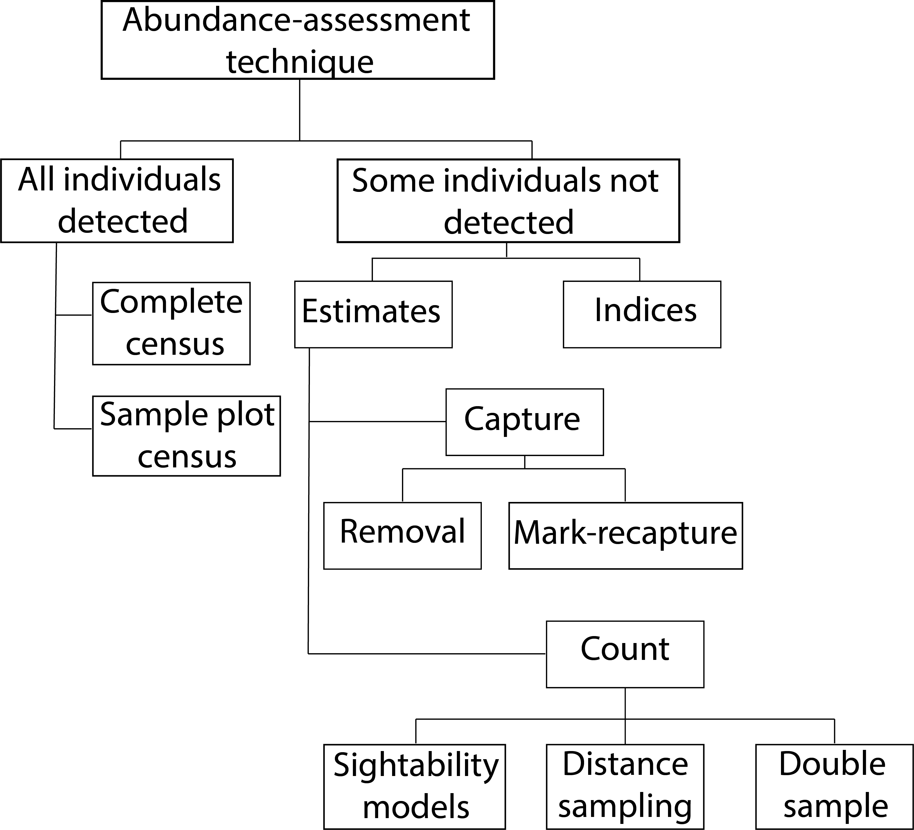

```{r setup, include = FALSE}
options(htmltools.dir.version = FALSE)
knitr::opts_chunk$set(echo = FALSE, fig.align = 'center', warning=FALSE, message=FALSE)
library(WILD3810)
# library(gganimate)
```

## Readings: 

> Mills 54-63  


> Powell & Gale 169-173; 177-180

---
## Abundance

> the number of individual organisms in a population at a particular time  

#### Also referred to as **population size**

---
## Why measure abundance?

### Abundance is the central *state variable* of a population  

#### **How many are there?**

--
- Setting harvest limits  
<br/>

--
- Maintaining viable populations of threatened/endangered species   
<br/>

--
- Monitoring non-native/invasive species   

---
class: inverse, middle, center

# Estimating abundance

---
## Why not just count every individual?

#### Sometimes we can (*census*)  

#### But usually:  
<br/> 

--
1) Not practical  
+ Area too big  


--
2) Not every individual detected  
+ Elusive  

<br/>
--

#### So we have to **estimate** abundance $^{1}$

???

$^1$ In a census, we assume that our counts equal the true population size, the is $C = N$. However, when this assumption is not met, that is $C \neq N$, we have to *estimate* $N$ by accounting for the various reasons that our counts do not equal the true abundance  

---
## Estimation methods

```{r out.width = 550}

```

???

Adapted from Mills pg 55

---
class: inverse, center, middle

# Q1: Abundance or index?

---
## Indices

#### We don't always need to know *exactly* how many individuals there are  
<br/>

#### Sometimes we just want to know the **relative** change in population size over time (or space).
<br/>

--

#### In this case, we can use an **index**  
<br/>

> counts $C$ that are correlated with the actual number of individuals $N$ 

---
## Indices

**Example**  

[Rural Mail Carrier Survey](https://www.audubon.org/news/youve-got-quail-why-thousands-rural-mail-carriers-count-roadside-wildlife-every)

```{r out.width=400}

```

???

Figure from: Powell, L., 2015. Hitler's Effect on Wildlife in Nebraska: World War II and Farmed Landscapes. Great Plains Quarterly, 35(1), pp.1-26.

---
## Indices

#### **Problems**  

--
1) What if the relationship between $N$ and $C$ is not linear? $^2$  
<br/>

```{r out.width=200}

```

???

$^2$ In the middle figure, observers detect a larger percentage of pheasants at low abundance than at high abundance. This could happen if, perhaps, observers become much for vigilant about looking for pheasants when there aren't many around. In this case, true declines in abundance might be *under-estimated*  

In the bottom figure, counts don't increase much at low abundance and then increase rapidly. This could occur if observers don't bother looking when there are few individuals around. In this case, declines in abundance might be *over-estimated*  

Figure from Powell & Gale 2015 "Estimation of Parameters for Animal Populations", pg 171

---
## Indices

#### **Problems**  
 
1) What if the relationship between $N$ and $C$ is not linear?  
<br/>

2) What if the observation process changes? $^3$ 
<br/>

```{r out.width=400}

```


???

$^3$ The number of observers from one rural mail carrier survey has been decreasing over time. Is the decline in the number of bobwhite due to fewer birds or fewer observers?  

Figure from: Robinson Jr, D.A., Jensen, W.E. and Applegate, R.D., 2000. Observer effect on a rural mail carrier survey population index. Wildlife Society Bulletin, pp.330-332.  

---
## Indices

#### **Problems**  

1) What if the relationship between $N$ and $C$ is not linear?  
<br/>


2) What if the observation process changes?  
<br/>

#### Without standardized survey protocols, it is impossible to distinguish between changes in abundance and changes in the observation process

---
class: inverse, center, middle

# Estimates

---
# Estimates

<br/>
#### Estimates attempt to *correct* for sample area and imperfect detection to estimate $N$ from $C$  
<br/>
$$\Large \hat{N} = \frac{C}{P_{area}\hat{P}_d}$$
<br/>

$P_{area}$ is the proportion of the study area sampled by our surveys  

$\hat{P}_d$ is the estimated $^4$ probability that an individual that is present in the population is detected by our surveys

???

$^4$ The hat symbol in $\hat{N}$ and $\hat{P}_d$ is used to distinguish between an *estimated* parameter and the true value of the parameter (e.g., $N$ or $P_d$, which of course we usually can't know)  

Why isn't $P_{area}$ an estimate?  

---
class: inverse, center, middle

# Q2: Is $\Large \hat{P}_d = 1$? 

---
## Census

<br/>
#### If $\Large \hat{P}_d = 1$, we detect every individual in our sampling area   
<br/>
<br/>

#### When counts are equal to the true number of individuals, this is referred to as a **census**

---
## Census

**Excercise**  
<br/>
1) Divide into groups of (about) 3

<br/>
2) Remove all of the beans from the cup and count

<br/>
3) Record how many beans are in the cup $(N)$  
<br/>
4) Return all of the beans to the cup

???

This is a complete census. What are the advantages? Disadvantages?  

Do you think your count is exactly equal to $N$ (i.e., no counting mistakes?)

---
## Complete vs. sample plot census

#### **Complete census**  

> count of every individual in the population (usually not possible)  
C = N  

#### **Sample plot census**  

> count of individuals within sample plot(s)

---
## Sample plot census
<br/>
<br/>
$$\Large \hat{N} = \frac{C}{P_{area}}$$
<br/>
--

#### **Example**  

- $\Large C = 23$  
- $\Large P_{area} = 0.1$  

--
- $\Large \hat{N} = 23/0.1 = 230$  

---
## Sample plot census

####  **Exercise**  
<br/>
1) Divide back into your groups  
<br/>
2) Place your empty cup on the scale and press 'Tare'  
<br/>
3) Remove a portion of the beans from the first cup and place them in the empty cup; record the weight  
<br/>
4) Count and record the number of beans you removed  
<br/>
5) Estimate $\hat{N}$ using: $^1$
$$\hat{N} = \frac{number\; of\; beans\; removed}{weight/100}$$
<br/>
6) Leave the beans in their current cups

???

$^1$ Each cup started with approximately 100g of beans so $weight/100$ is the proportion of the beans you sampled. So the number of beans you removed $=C$ and $weight/100=P_{area}$

How close was your estimate to the true $N$? Why was it not exactly the same?  

---
class: inverse, center, middle

## Imperfect detection

---
## Imperfect detection

#### Usually, $\hat{P}_d < 1$ (even for plants!)  
<br/>
#### Need to estimate $\hat{P}_d$, the probability of detecting an individual that is present in the populations  
<br/>
#### **Many** methods for doing so $^5$

```{r fig.height=3, fig.width=4.5}

p <- seq(0.01, 1, by = 0.01)
Np_df <- data.frame(N = 100/p,
                    p = p)

ggplot(Np_df, aes(p, N)) + 
  geom_point(size = 2, color = WILD3810_colors$value[WILD3810_colors$name=="primary"]) +
  scale_y_continuous(expression(hat(N))) +
  scale_x_continuous(expression(P[d])) +
  labs(subtitle = "C = 100")
```

???

$^5$ We can't cover them all of the methods but will learn about some of the basic ways to estimate detection probability

---
class: inverse, center, middle

# Q3: Capture or count?

---
## Capture or count?

##### The major divide in the methods to estimate $\hat{P}_d$ is whether you are dealing with individually identifiable individuals or not.  

.pull-left[
### Mark-recapture
- Individual ID known (physical or natural marks)
- Harder to collect
- (often) requires physical handling
- More information
]

.pull-right[
### Counts
- Individual ID not known
- Easy to collect
- Minimally invasive
- Less information
]

---
## Capture-mark-recapture (CMR)

#### CMR includes a wide variety of related techniques and models  

#### Traditionally, CMR referred to methods of capturing, marking, and then recapturing individuals at some point in the future  

#### This results in a **capture-history** for each individual $^6$:  

##### Individual 1: $101101$  
##### Individual 2: $011001$  

???

$^6$ Individual 1 was captured on occasions 1, 3, 4, and 6  

Individual 2 was captured on occasions 2,3, and 6. 

---
## Capture-mark-recapture

#### From capture-histories, we can estimate:  

--
- abundance  

--
- detection probability  

--
- survival  

--
- movement  

--
- recruitment  

--
- individual growth  

--
- populations trends   

---
## Capture-mark-recapture


#### CMR methods are not restricted to physical captures and recaptures $^7$

```{r out.width=600}

```

???

$^7$ Capture histories can be created from resighting marks that can be seen from a distance

Photo Credit: Rick Kimble/USFWS

---
## Capture-mark-recapture


#### CMR methods are not restricted to physical captures and recaptures $^8$

```{r out.width=600}
knitr::include_graphics("https://upload.wikimedia.org/wikipedia/commons/2/23/PIT_Tagging_%2810426702854%29.jpg")
```

???

$^8$ Capture histories can be created from automated systems that record ID's, like PIT tags

Image courtesy of: USFWS Mountain-Prairie via Wikimedia Commons

---
## Capture-mark-recapture


#### CMR methods are not restricted to physical captures and recaptures $^9$

```{r out.width=600}
knitr::include_graphics("https://upload.wikimedia.org/wikipedia/commons/3/37/Wild_Sumatran_tiger.jpg")
```

???

$^9$ Capture histories can be created from "natural marks", e.g. camera trapping

Image courtesy of: Arddu, via Wikimedia Commons

---
## Capture-mark-recapture


#### CMR methods are not restricted to physical captures and recaptures $^{10}$

```{r out.width=600}

knitr::include_graphics("https://upload.wikimedia.org/wikipedia/commons/2/2a/Grizzly_hair_snare_%28Northern_Divide_Grizzly_Bear_Project%29_%284428177124%29.jpg")
```

???

$^{10}$ Capture histories can be created from "natural marks", e.g. genetic markers

Image courtesy of: GlacierNPS, via Wikimedia Commons

---
## Capture-mark-recapture


#### CMR methods are not restricted to physical captures and recaptures  

#### *What ties all of these methods together is that we have individual-level capture-histories*  

---
## Capture-mark-recapture

#### **Exercise**  
<br/>
1) Divide into groups your groups  
<br/>
2) Record how many beans you removed in the previoius exercise (call this $n_1$)  
<br/>
3) Count the same number of black-eyed peas and put them back in the original cup (these are your marked individuals)  
<br/>
4) Cover and shake/stir the cup 

---
## Lincoln-Peterson (LP) model

#### LP is one of the first and most basic **closed** CMR models  

#### *Closed* population models:  

> the number of individuals in the population does not change between sampling occasions. No births, no deaths, no movement in or out  


--
#### How can we make this assumption? Usually by conducting sampling within a short $^{11}$ period of time  

--
#### Key questions for determining whether population is closed:

* When are the birth pulses? Do they happen a specific time of year (colonial birds) or continuously (humans)  

--
* How often do individuals die? Rarely (elephants) or commonly (insects)  

--
* How often do individuals move in/out of the population? Territories (breeding birds) vs. roaming (migrating elk)

???

$^{11}$ Short will depend on the study organism - trees vs. insects

---
## Lincoln-Peterson model

#### **Basic logic**  

#### On the first occasion, we capture $n_1$ individuals  

--
#### What proportion of the total number of individuals is $n_1$? 

$$\Large p = \frac{n_1}{N}$$ 

--
#### If we knew $p$, we could estimate $N$ as $\frac{n_1}{p}$


--
**Example**  

If $p$ is $35\%$ and $N=100$, $n_1$ should be approximatley 35 individuals. 

---
## Lincoln-Peterson model

**Basic logic**  

```{r out.width = 200}

```

---
## Lincoln-Peterson model

**Basic logic**  

On the first occasion, we capture $n_1$ individuals  
<br/>

--
On the second occasion, we capture $n_2$ individuals

--
- $m_2$ of those individuals were captured and marked on the first occasion  


---
## Lincoln-Peterson model

**Basic logic**  

```{r out.width = 200}

```

---
## Lincoln-Peterson model

**Basic logic**  

Lincoln & Peterson realized that:  

$$\Large \frac{m_2}{n_2} = \frac{n_1}{N}$$

--
We can rearrange that to solve for $N$:

$$\Large N = \frac{n_1n_2}{m_2}$$

---
## Lincoln-Peterson model

**Basic logic**  

```{r out.width = 400}

```

???

Modified from Powell & Gale pg 93

---
## Lincoln-Peterson model

**Exercise**  

1) Take a second handful of beans from the cup  
<br/>
2) Count and record the total number of beans (this is $n_2$)  
<br/>
3) Count and record the number of black-eyed peas in the sample (this is $m_2$)  
<br/>
4) Estimate $\hat{N}$ using the formula above $^{12}$  

???

$^{12}$ How close was your estimate to the true $N$?

How did the number of beans you removed influence your estimate of $N$

---
class: inverse, middle, center

# Uncertainty

---
## Lincoln-Peterson model

#### It is very unlikely that $\hat{N} = N$  

#### But, with large sample sizes, LP is **unbiased** $^{13}$:

> **on average** $\hat{N}$ will be equal to $N$  

```{r out.width = 200}  
knitr::include_graphics("bias_precision.png")
```

???

$^{13}$ It's important to note that the concept of bias applies to an imagined set of repeated experiments to estimate $N$, not to a single estimate of $N$  

For any single estimate (each group's estimate), $\hat{N}$ may be bigger or smaller than $N$  

But, if we did this experiment many times (all of the estimates from each group), the *average difference* between $\hat{N}$ and $N$ will be 0  

 
---
## Lincoln-Peterson

#### For any given estimate, $\hat{N}$ will not exactly equal $N$  

#### The difference between $N$ and $\hat{N}$ occurs because we have to **sample** the true population

#### In any given sample, we might get a few more marked indviduals than expected, or a few less (flipping a coin)

???

We will explore this more in lab, using computer code to do this experiment many times and varying sample sizes.    

---
## Measuring uncertainty

#### All estimated parameters require information about *how certain* we are in our estimate  

#### We **cannot** make inferences about population parameters without providing information to interpret how confident we are in those estimates!  

#### **Example**  

We do a CMR study of two populations and estimate $\hat{N}_1 = 142$ and $\hat{N}_2 = 160$  

Is $N_1 < N_2$? 

```{r fig.width=4, fig.height=2.5}
df <- data.frame(scenario = factor(rep(c("Point estimate", "High uncertainty", "Low uncertainty"), each = 2), levels = c("Point estimate", "High uncertainty", "Low uncertainty")),
                 x = rep(c("1", "2"), 3),
                 y = rep(c(142, 160), 3),
                 se = rep(c(0, 30, 5), each = 2))

ggplot(df[c(1,2),], aes(x = x, y = y)) + geom_point() + geom_errorbar(aes(x = x, ymin = y - se, ymax = y + se), width = 0) +
  scale_y_continuous("Population size", limits = c(100, 200)) +
  scale_x_discrete("Population") +
  theme(axis.title.y = element_text(size = 17))
```

???

Note that our question is about the true abundances ($N_1$ and $N_2$) **not** our estimates

---
## Measuring uncertainty

Uncertainty measures *on average* how far off our estimate is from the true value  

```{r out.width = 300}  
knitr::include_graphics("bias_precision.png")
```  

---
## Measuring uncertainty

#### Uncertainty measures *on average* how far off our estimate is from the true value  

#### We measure spread as the **variance** of the samples $^{14}$  

#### We don't know the true value but statisticians have developed ways to approximate how far we are from the true value using only our data

???

$^{14}$ High variance means are sample estimates are generally far from the true value, low variance means they are close. **Which do we prefer?**  

---
## Uncertainty of Lincoln-Peterson estimator

#### Variance of the LP estimator can be calculated as:

$$\large var(\hat{N}) = \frac{(n_1 + 1)(n_2+1)(n_1-m_2)(n_2-m_2)}{(m_2+1)^2(m_2+2)}$$

```{r fig.width=5, fig.height=3.5}

ggplot(df, aes(x = x, y = y)) + geom_point() + geom_errorbar(aes(x = x, ymin = y - se, ymax = y + se), width = 0) +
  scale_y_continuous("Population size", limits = c(100, 200)) +
  scale_x_discrete("Population") +
  facet_wrap(~scenario, nrow = 1) +
  theme(strip.text = element_blank())
```

???

In the plots, the lines indicate the range of $N$ values that we think are possible given our estimate $\hat{N}$ and $var(\hat{N})$. In the middle example, how confident are you that $N_1 < N_2$? What about the figure on the right?  

This is why it's so important to report uncertainty along with every parameter estimate. We will discuss these issues more in lab  

---
## Assumptions of Lincoln-Peterson

#### All models have assumptions  

#### Just as it's important to report variance, it's important to know the assumptions of our model and to make those assumptions clear  

#### If we violate the assumptions, we can get the wrong answer!

---
## Assumptions of Lincoln-Peterson

#### The assumptions of LP are:   

--
1) the population is closed between samples  
<br/>

--
2) the marking of an animal does not effect $p$  
<br/>

--
3) marks are not lost between capture occasions  
<br/>

--
4) each sample of the population is a random sample of the population  
<br/>

--
What effects would violating these assumptions have on estimates of $N$?

---
## Assumptions of Lincoln-Peterson

1) The population is closed between samples  
<br/>
- Violation of the assumption means that $N$ either decreases (animals die/leave) or increases (animals are born/enter) between samples  
<br/>
- Can bias $\hat{N}$ high or low  
<br/>
- Address by sampling over a short period

---
## Assumptions of Lincoln-Peterson

2) The marking of an animal does not effect $p$  
<br/>
- What happens if animals that are trapped on occasion one are less likely to be trapped later because they figure out that trapping is unpleasant?  
$$\frac{m_2}{n_2} < \frac{n_1}{N}$$ 

- $\hat{N}$ will be too high  
<br/>
- Addressed by using less invasive trapping methods or through more advanced statistical methods

---
## Assumptions of Lincoln-Peterson

3) Marks are not lost between capture occasions  
<br/>
- If marks are lost, individuals that should be in $m_2$ will be recorded as unmarked  
<br/>

- $m_2$ will be too low and $\hat{N}$ will be too high  
<br/>

- Addressed by double marking or looking for physical evidence of tag loss

---
## Assumptions of Lincoln-Peterson

4) Each sample of the population is a random sample of the population  
<br/>
- What happens if our sampling only detects $\frac{1}{2}$ of the population? What happens if we only sample is really good habitat?   
<br/>

- Addressed by random sampling
