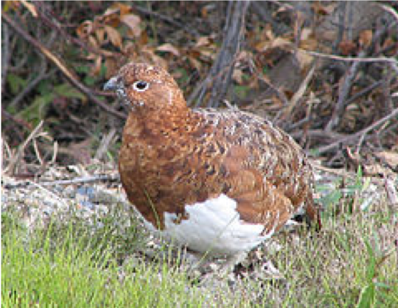
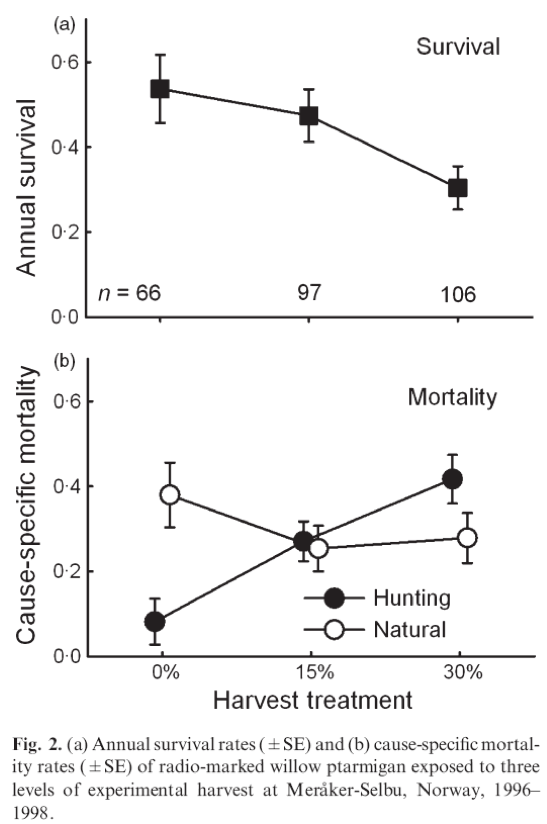
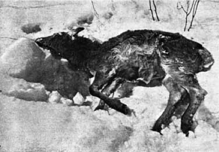
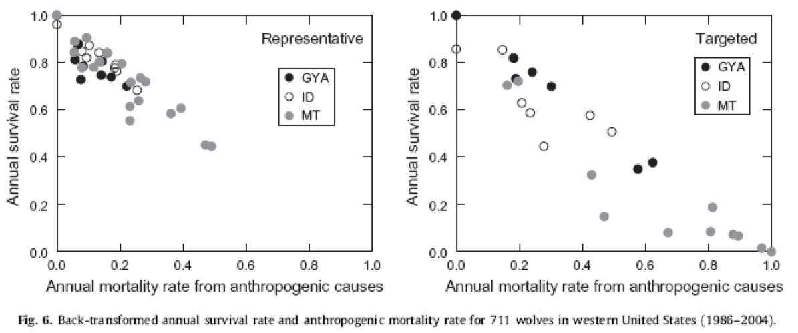
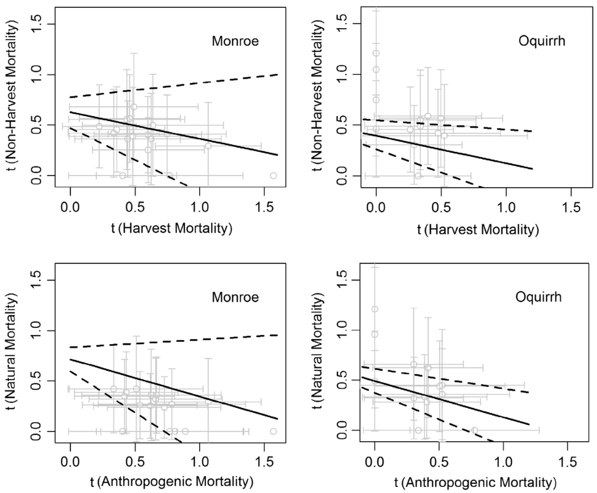
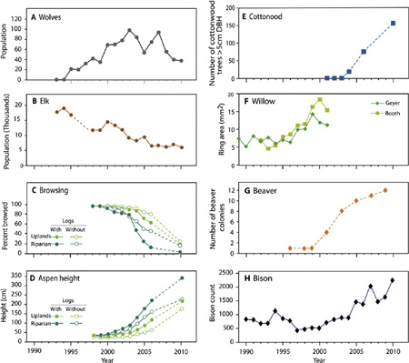
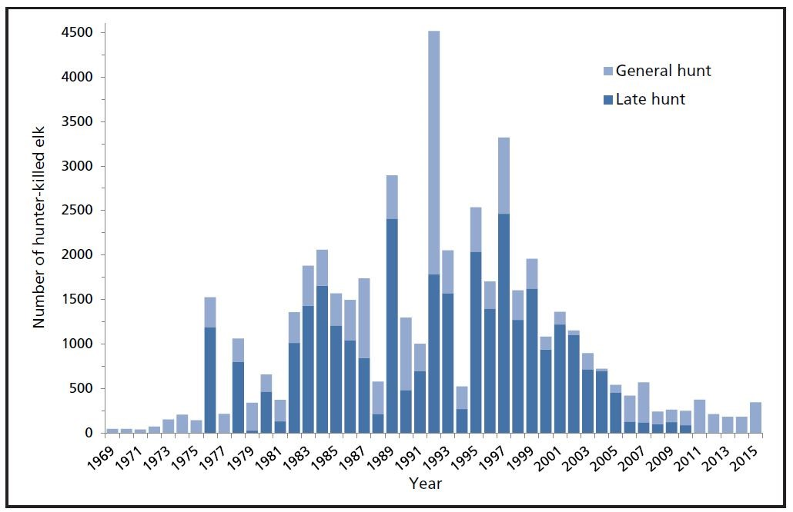
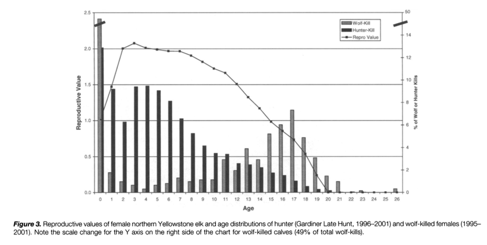

```{r setup, include = FALSE}
options(htmltools.dir.version = FALSE)
knitr::opts_chunk$set(echo = FALSE, fig.align = 'center', warning=FALSE, message=FALSE)
library(WILD3810)
library(gganimate)
```

## Readings

> ### Mills 150-153

---
## Do predators control the abundance of their prey?

#### If predators kill prey:

--
- does predation lower the overall survival probability of prey? 

```{r out.width="30%"}
knitr::include_graphics("https://upload.wikimedia.org/wikipedia/commons/5/5e/Polar_bear_%28Ursus_maritimus%29_with_its_prey.jpg")
```

--
- does harvest lower abundance of prey (note - for humans, top predators might be "prey")?

```{r out.width="30%"}
knitr::include_graphics("https://upload.wikimedia.org/wikipedia/commons/7/77/FMIB_34651_Ducks_Illegally_Netted_in_Lake_Ontario.jpeg")
```

???
Images courtesy of AWeith and University of Washington, via wikicommons

---
## The effect of predation on prey survival

#### Say $S_0$ is the survival probability in the absence of predation/harvest

--
- if the predation rate is $P$, individuals must survive other sources of mortality *and* not be predated 

$$\large S_A = S_0(1 - P)$$

```{r fig.height=4, fig.width=6}
S0 <- 0.8
P <- seq(0, 1, by = 0.05)
df <- data.frame(P = P,
                 Sa = S0 * (1 - P))

ggplot(df, aes(x = P, y = Sa)) + 
  geom_line(size = 2, color = WILD3810_colors$value[WILD3810_colors$name=="primary"]) +
  scale_y_continuous(expression(S[A]), breaks = S0, labels = expression(S[0])) +
  theme(axis.text.x = element_blank(), axis.ticks.x = element_blank())
```

---
## The effect of predation on prey survival

#### **Additive** mortality

> Predation/harvest occurs independently of other sources of mortality 

$$\large S_A = S_0(1 - P)$$

```{r fig.height=4, fig.width=6}
S0 <- 0.8
P <- seq(0, 1, by = 0.05)
df <- data.frame(P = P,
                 Sa = S0 * (1 - P))

ggplot(df, aes(x = P, y = Sa)) + 
  geom_line(size = 2, color = WILD3810_colors$value[WILD3810_colors$name=="primary"]) +
  scale_y_continuous(expression(S[A]), breaks = S0, labels = expression(S[0])) +
  theme(axis.text.x = element_blank(), axis.ticks.x = element_blank())
```


---
## The effect of predation on prey survival

#### If predation/harvest is additive:

- removing predators should increase prey abundance

```{r out.width="30%"}
knitr::include_graphics("https://upload.wikimedia.org/wikipedia/commons/e/eb/Last_wolf_in_Central_Finland.jpg")
```

--
- harvest of game species should reduce their abundance

---
## The effect of predation on prey survival

#### In many populations, some individuals have very low survival:

- floaters

- old individuals

- sick individual

--
- the "doomed surplus" (Errington 1956)


--
#### If predators/harvest take individuals that would have died from other causes, overall survival rate may be uneffected by $\large P$

---
## The effect of predation on prey survival

#### **Compensatory** mortality

> mortality due to predation/harvest is offset by lower mortality from other sources

```{r fig.height=4, fig.width=8}
S0 <- 0.35
P <- seq(0, 1, by = 0.05)

Sa <- S0 * (1 - P)
Sc <- c(rep(S0, 13), S0 - S0/P[8] * P[1:8])

df <- data.frame(P = P,
                 S = c(Sa, Sc),
                 Type = rep(c("Additive", "Compensatory"), each = length(P)))

ggplot(df, aes(x = P, y = S, color = Type))  +
  geom_vline(xintercept = (1-S0), linetype = "longdash") + 
  geom_line(size = 2) +
  scale_y_continuous(expression(S[A]), breaks = S0, labels = expression(S[0])) +
  scale_x_continuous(breaks = (1 - S0), labels = expression(1 - S[0]))
```

---
## The effect of predation on prey survival

#### **Partial compensatory** mortality

```{r fig.height=4, fig.width=8}
S0 <- 0.35
P <- seq(0, 1, by = 0.05)

Sa <- S0 * (1 - P)
Sc <- c(rep(S0, 13), S0 - S0/P[8] * P[1:8])
Sp <- c(S0 - 0.1 * P[1:13], (S0 - 0.1 * P[14]) - (S0 - 0.1 * P[14])/P[8] * P[1:8])
df <- data.frame(P = P,
                 S = c(Sa, Sc, Sp),
                 Type = rep(c("Additive", "Compensatory", "Partial compensation"), each = length(P)))

ggplot(df, aes(x = P, y = S, color = Type))  +
  geom_vline(xintercept = (1-S0), linetype = "longdash") + 
  geom_line(size = 2) +
  scale_y_continuous(expression(S[A]), breaks = S0, labels = expression(S[0])) +
  scale_x_continuous(breaks = (1 - S0), labels = expression(1 - S[0]))
```

---
## The effect of predation on prey survival

#### Partial compensatory mortality

- Partial compensation in hunting of willow ptarmigan (Sandercock et al. 2010)
    + Typical of short-lived gamebirds

.pull-left[
```{r}

```
]

.pull-right[
```{r out.width="50%"}

```
]


---
## The effect of predation on prey survival

#### Partial compensatory mortality

- Partial compensation of predator mortality in elk calves
    + predation offset by winter severity and density-dependent malnutrition (Singer et al. 1997)

```{r out.width="50%"}

```

---
## The effect of predation on prey survival

#### Population dynamics can be compensated by Density-Dependent changes in other vital rates

- Immigration: mortality of territorial animals can open up space for ‘floaters’ and give them a chance to reproduce and gain fitness. 

- Fertility: Reduced density through mortality can free up resources for survivors and enhance their reproductive output and success. 

---
## The effect of harvest on predator abundance

#### Anthropogenic mortality is largely additive in lower-48 wolves (Murray et al. 2010)
- In absence of human pressure, mortality is fairly low, opportunity for compensation is low

```{r out.width="70%"}

```

---
## The effect of harvest on predator abundance

#### Cougars in Utah (Wolfe et al. 2015)
- In absence of human pressure, mortality is fairly low, opportunity for compensation is low

```{r out.width="50%"}

```

---
## Do predators control the abundance of their prey?

#### Did reintroduction of wolves to Yellowstone NP reduce elk populations? 

.pull-left[
```{r out.width="75%"}
knitr::include_graphics("https://upload.wikimedia.org/wikipedia/commons/c/cb/Wolves_and_elk.jpg")
```
]

.pull-right[
```{r}

```
]


---
## Do predators control the abundance of their prey?

#### Did reintroduction of wolves to Yellowstone NP reduce elk populations? 

- During the time that elk populations started to decline, general and late season anterless elk hunts were at historically high levels

```{r out.width="65%"}

```

---
## Do predators control the abundance of their prey?

#### Did reintroduction of wolves to Yellowstone NP reduce elk populations? 

- Age distribution differs between wolf kills and hunter kills
    + Wolves mainly take fawns and older elk
    + Hunters take females at the height of their reproductive value
    
```{r out.width="65%"}

```

---
## Do predators control the abundance of their prey?

#### Who gets killed?

- Young and old may be more vulnerable
    + loss of young may be compensated for by additional reproductive effort
    + old may have low reproducive value

--
- Effects on population growth depend on elasticities
    + loss of young may have big impact in species with high elasticity of fecundity/recruitment
    + loss of adults may have big impact in species with high elasticity of adult survival
    
---
## Do predators control the abundance of their prey?

#### It's complicated; need to know:

- Predation rate
    + Numerical response
    + Functional reponse

- Additive vs. compensatory


--
#### Central questions to many modern issues in natural resource management
  - Predator control
  - Hunting regulations
  - Commercial harvest limits
