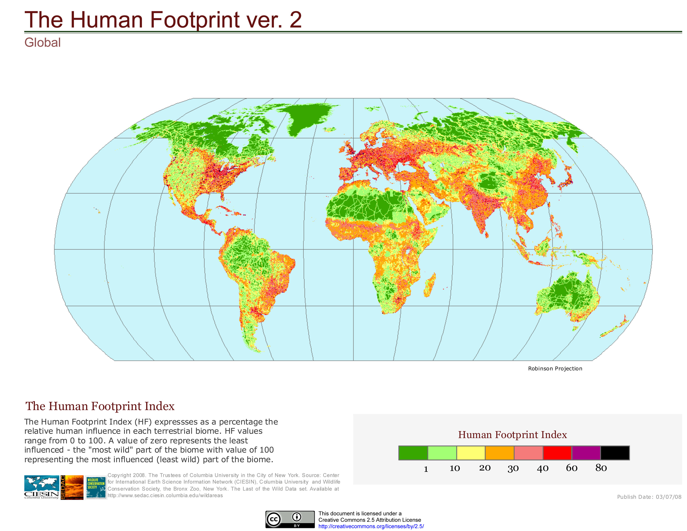
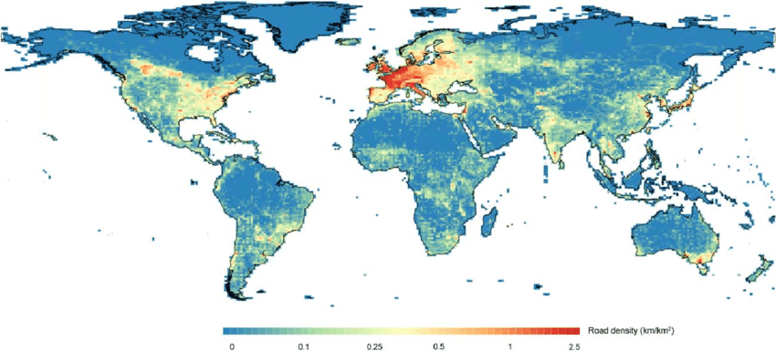
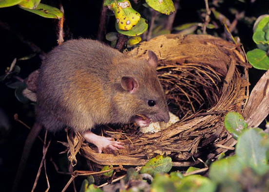
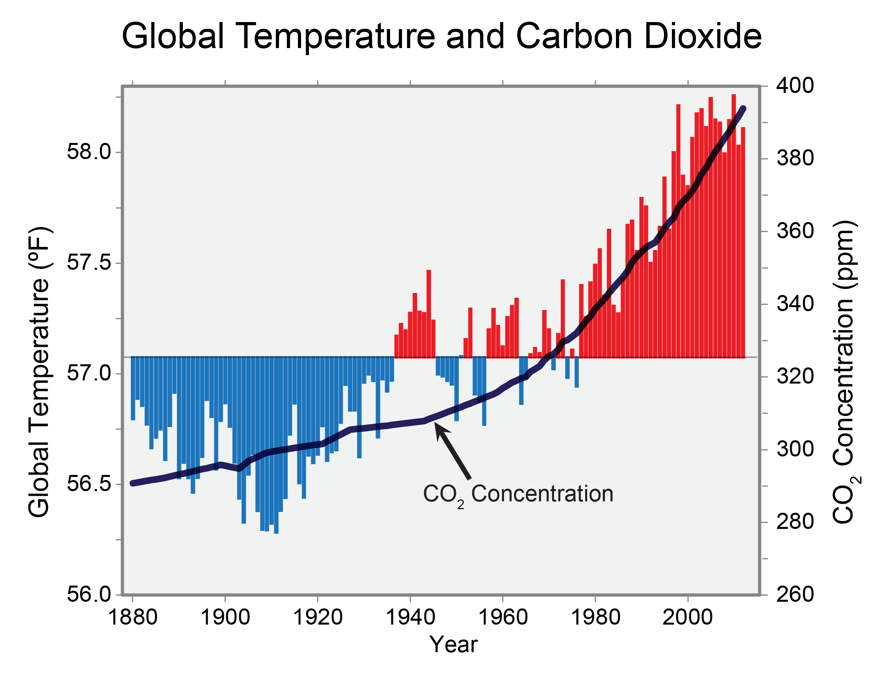
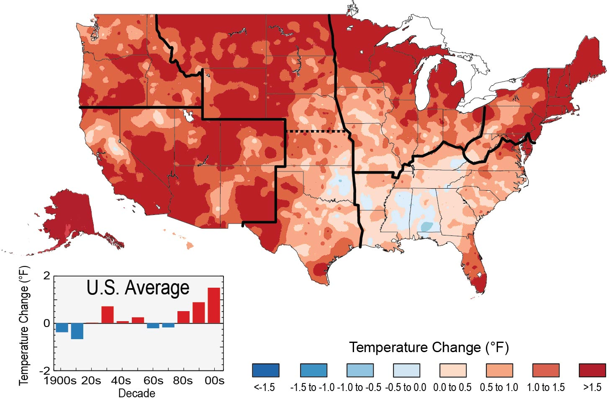
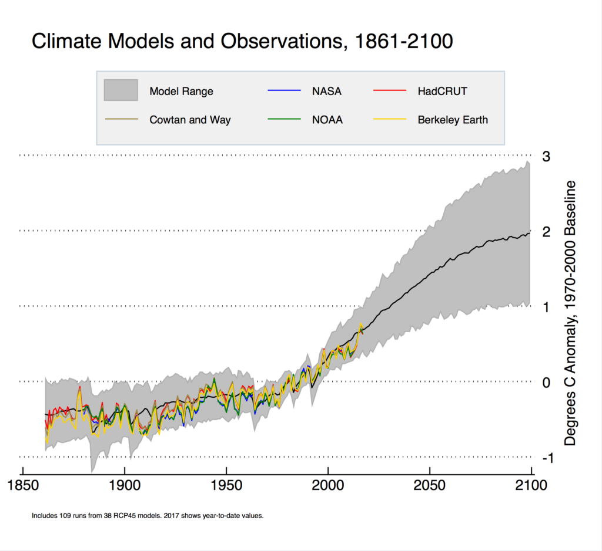
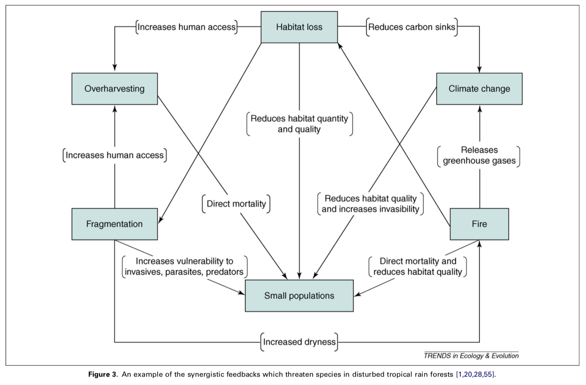

```{r setup, include = FALSE}
options(htmltools.dir.version = FALSE)
knitr::opts_chunk$set(echo = FALSE, fig.align = 'center', warning=FALSE, message=FALSE)
library(WILD3810)
library(gganimate)
```

## Readings

> Mills 201-223

---
## Population regulation vs limitation

In lecture 3, we learned that all species have the *potential* for exponential population growth  

--
- $r > 0$  


--
In lecture 5, we learned that regulating factors keep populations from going too far above or below $K$ 

--

```{r out.height=200}
knitr::include_graphics("https://upload.wikimedia.org/wikipedia/commons/4/49/OfficeThermostat.jpg")
```


--
## But...

---
## Population declines are widespread

```{r out.height=400}
knitr::include_graphics("https://upload.wikimedia.org/wikipedia/commons/c/ca/White-tailed_prairie_dog_2.jpg")
```

???

White-tailed prairie dog  

Image courtesy of John J. Mosesso, via Wikimedia Commons

---
## Population declines are widespread

```{r out.height=400}
knitr::include_graphics("https://upload.wikimedia.org/wikipedia/commons/3/36/Yellowstone_Cutthroat_Trout.jpg")
```

???

Yellowstone cutthroat trout 

Image courtesy of US Forest Service, via Wikimedia Commons


---
## Population declines are widespread

```{r out.height=400}
knitr::include_graphics("https://upload.wikimedia.org/wikipedia/commons/0/04/Greater_sage-grouse_%28Centrocercus_urophasianus%29.jpg")
```

???

Greater sage grouse  

Image courtesy of Bureau  of Land Management, via Wikimedia Commons

---
## Population declines are widespread

```{r out.height=400}
knitr::include_graphics("https://upload.wikimedia.org/wikipedia/commons/2/24/Larimer_County%2C_CO_%286938158012%29.png")
```

???
Boreal toad

Image courtesy of USFWS Mountain-Prairie, via Wikimedia Commons

---
## Population declines are widespread

```{r out.height=400}
knitr::include_graphics("https://upload.wikimedia.org/wikipedia/commons/8/89/Deseret_milkvetch_%28Astragalus_desereticus%29_%2844458352965%29.jpg")
```

???
Deseret milkvetch

Image courtesy of USFWS Mountain-Prairie, via Wikimedia Commons

---
class: inverse, middle, center

### If all populations have potential to increase and (in theory) are regulated, why are so many declining? 

---
## Population declines

Most population declines are driven by *deterministic* $^1$ changes to their environment that reduces $K$  

--
- Habitat loss  

--
- Invasive species  

--
- Pollution  

--
- Over-exploitation  

--
- Climate change  

???
$^1$ *deterministic* refers to the processes that have predictable effects on population dynamics. The opposite of deterministic is *stochastic*, which refers to changes that occur seemingly at random and are therefore difficult predict. Stochastic processes will the the topic of the next lecture

---
class: inverse, middle, center

# Habitat loss

---
## Habitat loss

```{r out.height=400}

```

---
## Habitat loss

Habitat loss has a number of negative effects on populations:  

--
1) Reduce $K$  

--
- Less area/fewer resources

--
- Effects may not be immediately apparent due to (temporary) crowding

---
## Habitat loss

Habitat loss has a number of negative effects on populations:  

1) Reduce $K$  

--
2) Altered connectivity $^2$

```{r out.height=300}
knitr::include_graphics("https://upload.wikimedia.org/wikipedia/commons/6/66/Wildlife_overpass_in_Singapore.jpeg")
```

???

$^2$ By increasing the distance between patches and potentially created uninhabitable matrix between patches, isolated populations may have reduced immigration and gene flow, with negative consequences of population growth and adaptation

---
## Habitat loss

Habitat loss has a number of negative effects on populations:  

1) Reduce $K$  

2) Altered connectivity  

```{r out.height=300}

```


???

Figure from: Ceia‐Hasse, A., Borda‐de‐Água, L., Grilo, C. and Pereira, H.M., 2017. Global exposure of carnivores to roads. Global Ecology and Biogeography, 26(5), pp.592-600.

Wildlife corridor in Singapore

Image courtesy of Benjamin P. Y-H. Lee (University of Kent),  via Wikimedia Commons

---
## Habitat loss

Habitat loss has a number of negative effects on populations:  

1) Reduce $K$  

2) Altered connectivity  

--
3) Edge effects $^4$

```{r out.height=250,  out.width = 300}

```

???

$^4$ As habitats become fragmented, the proportion of interior to edge increases (in the figure, you can see that not only is there less of the interior blue habitat in the bottom rectangle but also proportionally more orange edge habitat). "Edge" is defined as the transition from habitat (e.g., forest) to matrix. Edges are ecologically distinct due to differences in humidity, light, and temperature, which can alter plant and animal composition. Species that require intact, interior habitat are often negatively impact by "edge effects", due to changes in the physical environment as well as increases in predators


---
## Habitat loss

Habitat loss has a number of negative effects on populations:  

1) Reduce $K$  

2) Altered connectivity  

3) Edge effects 

```{r out.height=250}
knitr::include_graphics("https://upload.wikimedia.org/wikipedia/commons/9/9f/Brown-Headed_Cowbird.jpg")
```

???

Many bird species that nest in mature forested habitats have worse nest success in edge habitats due to the increased presence of nest predators (squirrels, chipmunks, snakes, etc.) as well as increased nest parasitism by brown-headed cowbirds 

Brown-headed cowbird image courtesy of http://www.naturespicsonline.com/, via Wikimedia Commons

---
class: inverse, middle, center

# Invasive species

---
## Invasive species

```{r out.width = 500}

```

???

Although species have moved or been transported around the world throughout history, the rate and magnitude of species introductions have increased dramatically due to the scale global transportation  

Invasive species can impact native species through predation, competition, disease spread, and hybridization

Image by Jack Jeffery

---
## Invasive species

```{r out.width = 500}
knitr::include_graphics("https://upload.wikimedia.org/wikipedia/commons/f/ff/Domestic_cat_eating_bird_on_lawn-8.jpg")
```

???

Domestic cats alone kill an estimated 1.3–4 **billion** birds and 6–22 **billion** mammals each year (Loss et al. 2013)

Image courtesy of dr_relling, via Wikimedia Commons

---
## Invasive species

```{r out.width = 400}
knitr::include_graphics("https://upload.wikimedia.org/wikipedia/commons/f/ff/Brown_tree_snake_%28Boiga_irregularis%29_%288387575202%29.jpg")
```


???

Invasive species can be particularly problematic on islands where native species have not evolved along with predators. On Guam, brown tree snakes were responsible for the loss of 10 out of 12 native bird species (https://www.bbc.com/news/science-environment-17992053). On many remote oceanic island, rats and birds have decimated ground-nesting seabirds (https://www.nature.org/en-us/about-us/where-we-work/united-states/alaska/stories-in-alaska/removing-rats-to-restore-seabirds-in-the-aleutian-islands/)

Image courtesy of Pavel Kirillov, via Wikimedia Commons

---
## Invasive species

```{r out.width = 300}
knitr::include_graphics("https://upload.wikimedia.org/wikipedia/commons/0/0b/Zebra_mussel_GLERL_3.jpg")
```

???

Damages and loss due to invasive species, such as the zebra mussel, also cost the US $120 **billion** per year 


---
class: inverse, middle, center

# Pollution

---
## Pollution

1) Pesticides

```{r out.width=400}
knitr::include_graphics("https://upload.wikimedia.org/wikipedia/commons/3/38/Osprey_on_Seedskadee_National_Wildlife_Refuge_%2815073279413%29.jpg")
```

???

Widespread use of DDT nearly led the extinction of many bird species in North America, including osprey, bald eagles, and brown pelicans, due to its effects on eggshell thickness

---
## Pollution

1) Pesticides

```{r out.width=400}
knitr::include_graphics("https://upload.wikimedia.org/wikipedia/commons/a/a6/Bee_%28233542965%29.jpeg")
```

???

Pesticide use is thought to be a major cause of *colony collapse disorder* in honey bees (http://sfyl.ifas.ufl.edu/agriculture/colony-collapse-disorder/)


---
## Pollution

1) Pesticides

2) Pharmaceuticals

```{r out.width=400}
knitr::include_graphics("https://upload.wikimedia.org/wikipedia/commons/6/6a/Indian_Vulture_at_Madhav_National_Park%2C_Shivpuri%2C_M.P.jpg")
```

???

In India, use of the antibiotic *diclofenac* in cattle has resulted in a 95% decline in the abundance of three vulture species (Asian white-backed vultures *Gyps bengalensis*, Indian vultures *Gyps indicus*, and slender-billed vultures *Gyps tenuirostris*) in less than a decade. When vultures feed on dead cattle, they ingest diclofenac, which causes acute kidney failure and death within days. Vultures perform a critical ecosystem service, scavenging dead carcasses, and without the vultures, rates of pathogen spread have increases as has the number of feral dogs (https://www.nytimes.com/2004/01/29/world/a-drug-used-for-cattle-is-said-to-be-killing-vultures.html)

---
## Pollution

1) Pesticides

2) Pharmaceuticals

3) Heavy metals

```{r out.width=200}
knitr::include_graphics("https://upload.wikimedia.org/wikipedia/commons/d/de/Lead_poisoned_eagle_under_care_at_Cobequid_Wildlife_Rehabilitation_Centre_.jpg")
```

???

Lead is commonly used in ammunition and fishing tackle. Lead shot used in ammunition is often ingested by birds of prey who scavenge on carcasses left by hunters. Picivourous birds like loons can ingest lead that is left in waterways or ingested by fish. As for humans, lead is toxic to birds, often lethally (https://bioone.org/journals/The-Condor/volume-116/issue-3/CONDOR-14-36.1/The-persistent-problem-of-lead-poisoning-in-birds-from-ammunition/10.1650/CONDOR-14-36.1.full)  

---
class: inverse, middle, center

# Over-exploitation

---
## Over-exploitation

```{r out.width=400}
knitr::include_graphics("https://upload.wikimedia.org/wikipedia/commons/9/99/Coming_aboard%2C_cod_being_removed_from_the_trap_into_the_Island_Star._%285645779248%29.jpg")
```


???

Poorly or unregulated fisheries and hunting have causes the collapse of plant and animal populations throughout human history. The Atlantic cod fishery was once one of the most productive in the world but by the 1970's had almost totally collapsed (https://en.wikipedia.org/wiki/Collapse_of_the_Atlantic_northwest_cod_fishery)

---
## Over-exploitation

```{r out.width=400}
knitr::include_graphics("https://upload.wikimedia.org/wikipedia/commons/c/c7/The_American_Museum_journal_%28c1900-%281918%29%29_%2817972927068%29.jpg")
```


???

At the turn of the 20th century, many of North America's wading birds (egrets and herons) and ducks were on the verge of extinction due to unregulated hunting for meat and fashion

---
## Over-exploitation

```{r out.width=400}
knitr::include_graphics("https://upload.wikimedia.org/wikipedia/commons/e/e4/Bushmeat_-_Buschfleisch_Ghana.JPG")
```

???

In many parts of the world, bush meat harvest is a major cause of decline for local wildlife. An estimated 579 million animals are consumed per year in the Congo Basin and 19 million in the Amazon (Fa & Peres 2001)

---
## Over-exploitation

```{r out.width=400}
knitr::include_graphics("https://upload.wikimedia.org/wikipedia/commons/4/43/Caged_birds_in_Pasty_Market.jpg")
```

???

Poaching and illegal trapping of animals for the pet trade is also a major threat to many species. For example, illegal trapping is responsible for the decline of many parrot species (https://www.nationalgeographic.com/magazine/2018/06/photo-ark-parrots/) and species like tigers, rhinos, and elephants could go extinct in our lifetime due to illegal poaching (https://www.fws.gov/international/wildlife-trafficking/) 

---
## Over-exploitation

```{r out.width=400}
knitr::include_graphics("https://upload.wikimedia.org/wikipedia/commons/1/17/Wild_ginseng.jpg")
```

???

Even plants are vulnerable to over exploitation. Wild American ginseng is collected throughout Appalachia for export to China, where it is used for medicinal purposes. Although ginseng harvest has strong economic and cultural importance to many communities, it has led to the near collapse of this native species (https://www.fws.gov/international/plants/american-ginseng.html)

---
class: inverse, center, middle

# Climate change

---
## Climate change


```{r out.width=600}

```

???

Image from: https://nca2014.globalchange.gov/highlights/report-findings/our-changing-climate

---
## Climate change


```{r out.width=600}

```

???

Image from: https://nca2014.globalchange.gov/highlights/report-findings/our-changing-climate

---
## Climate change


```{r out.width=600}

```

???

Image from: https://www.carbonbrief.org/factcheck-climate-models-have-not-exaggerated-global-warming

---
## Climate change

```{r out.width=600}
knitr::include_graphics("https://media.springernature.com/original/springer-static/image/art%3A10.1007%2Fs13157-016-0852-6/MediaObjects/13157_2016_852_Fig2_HTML.gif")
```

???

The Prairie Pothole region of North America is called the duck factory because it produces the vast majority of the continents ducks and because breeding productivity here determining 90% of the variation in population growth for mid-continent mallard populations. This region is expected to experience significant shifts in both temperature and precipitation over the coming decades, with potentially huge consequences for duck populations


---
## Climate change

```{r out.width=600}
knitr::include_graphics("https://upload.wikimedia.org/wikipedia/commons/9/98/Post_Forest_Fire.jpg")
```

???

Changes in temperature and rainfall are causing more frequent and more severe forest fires (https://www.scientificamerican.com/article/heres-what-we-know-about-wildfires-and-climate-change/)

---
## Climate change

```{r out.width=600}
knitr::include_graphics("https://upload.wikimedia.org/wikipedia/commons/e/ef/Blackwater_National_Wildlife_Refuge_%288895072196%29.jpg")
```

???

Sea level rise is rapidly changing coastal ecosystems as salt water encroaches further inland

---
class: inverse, middle, center

# Multiple threats

---
## Synergies among threats

```{r out.width=600}

```

???

Often, there is not a single threat. Instead, multiple threats are operating simultaneously, making management significantly harder.  

Figure from: Brook, B.W., Sodhi, N.S. and Bradshaw, C.J., 2008. Synergies among extinction drivers under global change. Trends in ecology & evolution, 23(8), pp.453-460.


