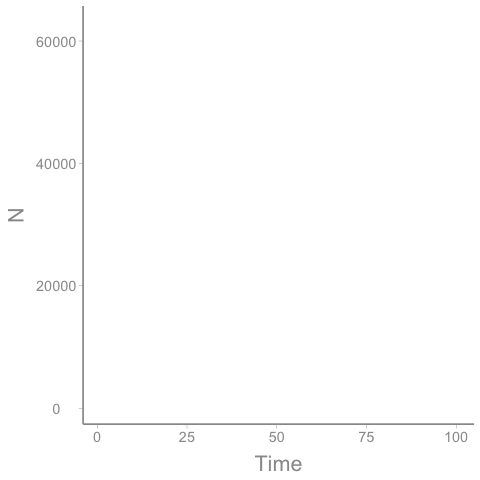
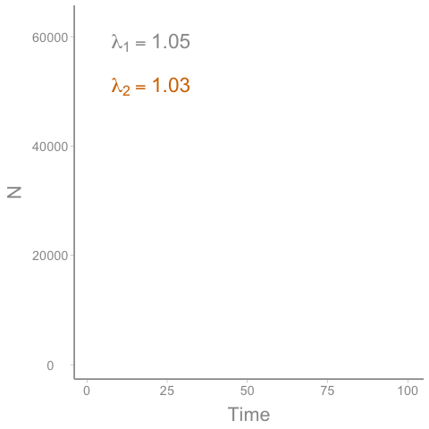
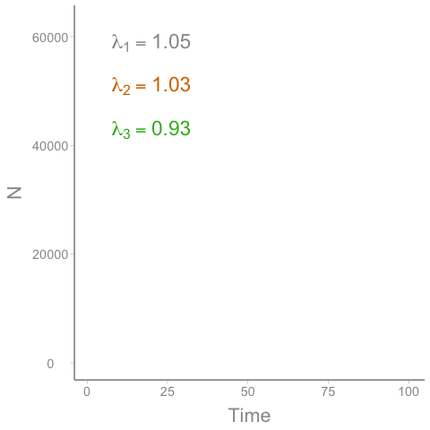
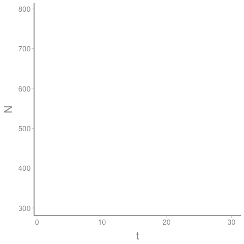
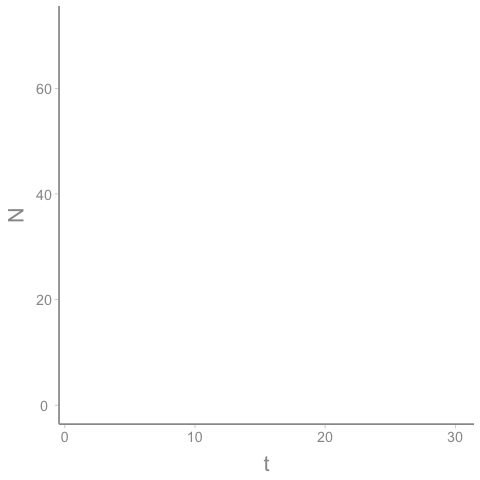
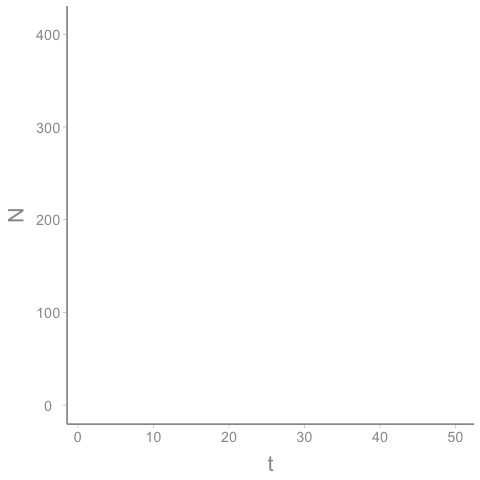
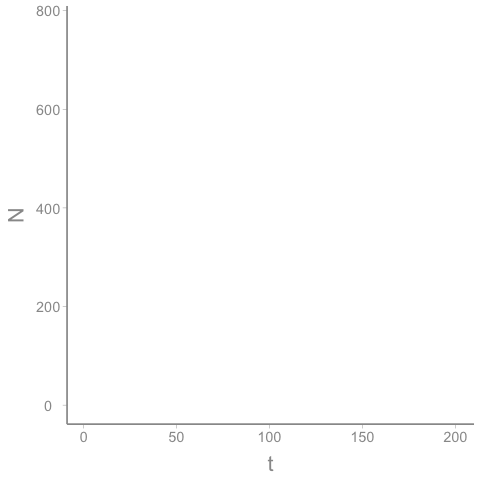
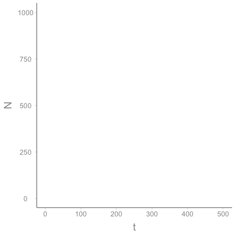
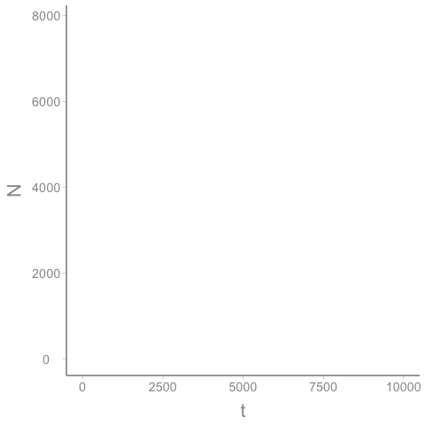

```{r setup, echo=FALSE}
options(htmltools.dir.version = FALSE)
knitr::opts_chunk$set(echo = FALSE, fig.align = 'center', warning=FALSE, message = FALSE)
library(WILD3810)
library(gganimate)
```

## Readings

> Mills 84-92  

---
## Assumptions of the B-D models

#### Remember from the lecture 3 that our simple models of population growth were based on the following assumptions:  

--
1) Population closed to immigration and emigration  
<br/>

--
2) Model pertains to only the limiting sex, usually females  
<br/>

--
3) Birth and death rates are independent of an individual’s age or biological stage  
<br/>

--
**4) Birth and death rates are constant** $^1$
<br/>

???

$^1$ Do not vary over time or space, across individuals

---
## Assumptions of the B-D models

#### In reality, we know that assumption 4 is almost never true  

--
#### Birth and death rates are determined by many external forces  

--
#### These forces often vary across space, time, and individuals:

- body condition  

- temperature  

- drought  

- fire  


--
#### The B-D population model ignored all of these sources of variation $^2$

???

$^2$ As we'll see, this is not only unrealistic, ignoring variation can change our conclusions about population growth. 

---
class: inverse, center, middle

# Stochasticity

---
## Stochasticity

#### In many cases, we do not know exactly why populations go up or down from year-to-year  

--
#### Often don't know what these causes are so from our perspective, the variation appears to be **random**  

--
#### Processes that are governed by some element of chance (randomness) are referred to as **stochastic** processes  

--
#### Just because something is stochastic doesn't mean it's completely unpredictable $^3$  

```{r, fig.width=4, fig.height=2.5}
set.seed(1234578)
n.year <- 30
n.pop <- 100

N <- matrix(NA, nrow = n.pop, ncol = n.year)
N[,1] <- 500

b <- 0.5
d <- 0.5
for(i in 1:n.pop){
  for(t in 2:n.year){
    N[i, t] <- rbinom(1, size = N[i, t-1], prob = d) + rpois(1, N[i, t-1] * b)
  }
}

Nd <- data.frame(Year = seq(1:n.year),
                 N = c(t(N)),
                 Population = as.character(rep(1:n.pop, each = n.year)))


(dem_plot <- ggplot(Nd, aes(x = Year, y = N, group = Population)) + geom_path(color = WILD3810_colors$value[WILD3810_colors$name == "warning"], alpha = 0.5, size = 1)) 
```

???

$^3$ For example, we can't predict with 100% certainty whether a coin flip will be heads or tails or what side a 6-sided dice will land on (there is some stochasticity in these processes) but that doesn't mean we have no idea what the outcomes will be  


---
## Stochasticity

#### We can predict how often we expect different random outcomes using *probability*  

--
#### Probability distributions characterize the frequency of different outcomes $^4$  

```{r fig.width=5, fig.height=3.5}
norm_df <- data.frame(x = seq(from = -10, to = 10, by = 0.1),
                       pr_z = dnorm(x = seq(from = -10, to = 10, by = 0.1), 0, 3))

ggplot(norm_df, aes(x = x, y = pr_z)) + geom_path(color = "grey50") +
  scale_y_continuous("Density")
```

--
#### In population models, we can use probability to characterize and account for stochastic processes that effect population growth  

???

$^4$ For example, many of you are probably familiar with the normal (or bell-shaped) distribution. This is a probability distribution with a single "most probable" outcome and decreasing probability of more "extreme" values.

---
## Two types of stochastic processes

#### With regards to population models, we generally distinguish between two types of stochasticity:  

--
1) **Environmental stochasticity**  

> variation in the *mean* demographic parameters and population growth that occurs due to random changes in environmental conditions  


--
2) **Demographic  stochasticity**  

> variability in demographic parameters and population growth that arises from random outcomes among *individual* survival and reproductive fates due to random chance alone

---
class: inverse, center, middle

# Environmental stochasticity

---
## Environmental stochasticity

#### The expected value of demographic parameters can fluctuate over time in response to:

.pull-left[
+ rainfall  

+ temperature  

+ fires and disturbance  

+ competitors  

+ predators  

+ pathogens  
]

.pull-right[
```{r fig.align = 'left', fig.width=6, fig.height=5}
r0 <- 0.18
K <- 500

Nl <- data.frame(Time = 0:60, 
                 N = numeric(length = 61))

Nl$N[1] <- 10

for(t in 2:61){
  Nl$N[t] <- Nl$N[t-1] * exp(r0 * (1 - (Nl$N[t-1]/K)))
}

(r <- ggplot(Nl, aes(x = Time, y = N)) + geom_line(color = WILD3810_colors$value[WILD3810_colors$name=="secondary"]) + scale_x_continuous("Rainfall") + 
  scale_y_continuous("Survival probability", breaks = c(0, 500), labels = c(0, 1))) #+ transition_time(Time))
```
]

---
## Environmental stochasticity

#### If environmental attributes change stochastically over time, so will demographic vital rates and population growth rate

```{r  fig.height=5, fig.width=8}
years <- sample(seq(1:length(Nl$N)), size = 20, replace = FALSE)

years_df <- data.frame(Time = years,
                       N = Nl$N[years])

r + geom_rug(data = years_df, sides = "b", color = WILD3810_colors$value[WILD3810_colors$name == "primary"], size = 1.5) +
  geom_rug(data = years_df, sides = "l", color = WILD3810_colors$value[WILD3810_colors$name == "danger"])
```

---
## Modeling environmental stochasticity

##### If we want to take into account changes in demographic parameters as environmental conditions change, we need time-specific demographic parameters: 

$$\huge N_{t+1} = N_t \times (1 + b_t - d_t)$$

--
$$\huge N_{t+1} = N_t \times \lambda_t$$

--
##### Over $T$ years, abundance will be:

$$\huge N_{T} = N_0 \times \big(\lambda_0 \times \lambda_1 \times \lambda_2 \times...\lambda_{T-1}\big)$$

---
## Modeling environmental stochasticity

#### For example, if $N_0 = 50$ and:

$$\large \lambda_0 = 1.1$$

$$\large \lambda_1 = 0.9$$

$$\large \lambda_2 = 0.7$$

$$\large \lambda_3 = 1.2$$

$$\large \lambda_4 = 1.1$$

then:

--

$$\large N_{5} = 50 \times 1.1 \times 0.9 \times 0.7 \times 1.2 \times 1.1 = 46$$  

```{r fig.height=2.5, fig.width=4}

lambda <- prod(c(1.1,0.9,0.7,1.2,1.1))^(1/5)

Ns <- data.frame(Time = 0:5,
                 N.pred = 50,
                 N = c(50, 55, 49.5, 34.65, 41.48, 46))

for(t in 2:6){
  Ns$N.pred[t] <- Ns$N.pred[t-1]*lambda
}

(r <- ggplot() + geom_point(data = Ns, aes(x = Time, y = N), color = WILD3810_colors$value[WILD3810_colors$name=="warning"]) +
    geom_line(data = Ns, aes(x = Time, y = N.pred), color = WILD3810_colors$value[WILD3810_colors$name=="secondary"]))

```

---
## Modeling environmental stochasticity

#### It's clear that this population is declining  

+ the *average* value of $\lambda$ must be $<1$  


--
#### What *is* the average $\large \lambda$ (which we'll call $\large \bar{\lambda}$)?  

---
## Modeling environmental stochasticity

#### An obvious way to calculate $\large \bar{\lambda}$ is the *arithmetic mean* of the annual $\lambda \lambda$'s:

$$\Large \bar{\lambda} = \frac{\lambda_0+ \lambda_1 + \lambda_2 +...\lambda_{T-1}}{T}$$

--
#### In our example, this equals:

$$\Large \bar{\lambda} = \frac{1.1 + 0.9 + 0.7 + 1.2 + 1.1}{5} = \frac{5}{5} = 1$$
---
## Modeling environmental stochasticity

#### But that can't be right!  

#### $\large \bar{\lambda} = 1$ means the population should have, on average, remained at 50 individuals 
<br/>

--
#### The issue that the population growth is a multiplicative process  

#### This means that shrinking by 30% $(\large \lambda = 0.7)$ and then growing by 30% $(\large \lambda = 1.3)$ does not get you back to where you started  

+ For example, $100 \times 0.7 = 70$ but $70 \times 1.3 = 91$. 

---
## Modeling environmental stochasticity

To estimate the average of a multiplicative process, we need to take the *geometric* mean rather than the arithmetic mean:  

$$\Large \bar{\lambda} = \big(\lambda_0 \times \lambda_1 \times \lambda_2 \times...\lambda_{T-1}\big)^\frac{1}{T}$$  


--
For our population, that means: 

$$\Large \bar{\lambda} = \big(1.1 \times 0.9 \times 0.7 \times 1.2 \times 1.1\big)^\frac{1}{5} = 0.98$$

---
## Modeling environmental stochasticity

#### As you can see, the geometric mean < arithmetic mean  

--
#### This is a *critical point* about environmental stochasticity  

--
> Populations with variable growth rates will tend to grow more slowly (or decrease faster) than populations in constant environments even if their mean vital rates are the same.

---
## Modeling environmental stochasticity

#### Let's see what that looks like:  

--
#### Initially, assume a large population $\large (N_0 = 500)$ with:

+ $\bar{b_t} = 0.55$  

+ $\bar{d_t} = 0.50$  

+ and **neither parameter varies over time**  

Thus:

$$\Large \bar{\lambda} = (1 + \bar{b_t} - \bar{d_t}) = (1 + 0.55 - 0.5) = 1.05$$

---
## Modeling environmental stochasticity

#### Over 100 years, the population growth will be:

```{r out.height=400}

```


---
## Modeling environmental stochasticity

Now let's look at the dynamics of a second population with the same starting population size, the same mean demographic rates but with annual variation of 20%   

--
Notice that the mean rates are the same so intuitively,  

$$\Large \bar{\lambda} = (1 + \bar{b_t} - \bar{d_t}) = (1 + 0.55 - 0.5) = 1.05$$


--
but:  

```{r out.height=300}

```

---
## Modeling environmental stochasticity

Finally, let's add a third population with the same starting population size, the same mean demographic rates but now with annual variation of 40%. 

```{r out.height=400}

```

---
## Modeling environmental stochasticity

#### Because environmental stochasticity tends to reduce $\large \bar{\lambda}$ regardless of population size, it has important consequences for the extinction risk of **both small and large populations**  

#### We'll explore this idea more in lab  

---
class: inverse, center, middle

# Demographic stochasticity

---
## Demographic  stochasticity

#### In the preceeding examples, we treated the demographic outomes (individual survival and reproductive success) at each time step as non-random variables  

--
+ If the mean survival probability in a given year is 80%, then exactly 80% of the population survived and 20% died  


--
#### This is not a realistic assumption  

#### Imagine flipping a coin 10 times:  

--
+ we know that the probability of getting a heads is 50% 

--
+ but we would not be suprised to get 4 heads. Or 7  

--
+ we wouldn't even be that surprised to get 2 or 9  


--
#### This is because the outcome of the coin flip is a *random variable* - the outcome is governed by chance  

---
## Demographic  stochasticity

#### The same is true to demographic outcomes  

--

#### Even if the *expected* survival rate is 80%, the *realized* survival rate could be higher or lower  

#### Likewise, we might expect individuals to produce 3 offspring on average, but some individuals will have more and some fewer based on chance $^5$  

--

#### Demographic stochasticity is essentially the difference between the **expected** survival/reproductive rate and the **realized** rates in our population.

???
$^5$ or at least what appears to use to be chance  

---
## Demographic  stochasticity

#### Demographic  stochasticity occurs because our population is a *finite sample*  

--

#### Going back to the coin flip, if we flip the coin 1000 times, we would expect to get pretty close to 50% heads  

#### But as the number of flips gets smaller, the realized success rate could differ more from the expected value  

---
exclude: true

## Demographic  stochasticity

### Coin flipping exercise

1) Form groups of 2-3 (a coin flipper and a recorder), and within your group, flip a coin a total of 10 times

2) What fraction of flips resulted in heads?

3) Now flip coins a total of 50 times in your group

4) What fraction of flips resulted in heads?

---
## Effects of demographic stochasticity

#### Demographic stochasticity is mainly an issue at **small population sizes** because each individual is a larger proportion of the total sample size  

--

#### To see this in action, we can use `R` to simulate the abundance of populations that experience demographic stochasticity  
<br/>

---
## Effects of demographic stochasticity

#### Start with 100 populations with a relatively large population size $(N = 500)$ $^6$  

- Further assume that the mean survival and reproductive rates remain constant so all stochastisticity is demographic  

--
```{r out.height=300}

```

--

#### With $\large N_0=500$ no populations went extinct

???

$^6$ Since each population starts with the same initial populaiton size, any differences at the end of the simulation are due to stochasticity  

---
## Effects of demographic stochasticity

#### What happens if we start with 10 individuals instead?


```{r out.height=400}
n.year <- 30
n.pop <- 100

N <- matrix(NA, nrow = n.pop, ncol = n.year)
N[,1] <- 10

b <- 0.5
d <- 0.5
for(i in 1:n.pop){
  for(t in 2:n.year){
    N[i, t] <- rbinom(1, size = N[i, t-1], prob = d) + rpois(1, N[i, t-1] * b)
  }
}


```

--
#### Now `r mean(apply(N, 1, min)==0)*100`% went extinct $^7$ 

???

$^7$ Remember that if at any point during the timeseries $N=0$, the population is extinct. Because our model assumes no movement, a population that goes extinct stays extinct

---
## Effects of demographic stochasticity

Demographic stochasticity increase extinction risk of small populations because there's an increased chance that, purely due to randomness, more individuals die than are born  

At large abundances, this is much less likely  

---
### Stochasticity and extinction risk over time

Another important consequences of stochasticity is that, over long-enough time periods, populations that exeperience stochasticity (both demographic and environmental) will eventually go extinct  
<br/> 


--
Given long enough, each population will eventually experience a string of years with high mortality and low reproductive success  
<br/>

--
The time it takes for this to occur will be longer for large populations but even still, it will eventually happen  


---
### Stochasticity and extinction risk over time

```{r}

set.seed(12345)
n.year <- 10000
n.pop <- 100

N <- matrix(NA, nrow = n.pop, ncol = n.year)
N[,1] <- 100

b <- 0.5
d <- 0.5
for(i in 1:n.pop){
  for(t in 2:n.year){
    N[i, t] <- rbinom(1, size = N[i, t-1], prob = d) + rpois(1, N[i, t-1] * b)
  }
}

```
Again, we can use data simulations to show this:

--
If we start with populations of 100 individuals and simulate 50 years of population change, `r mean(apply(N[,1:50], 1, min)==0)*100`% of populations go extinct  

```{r  out.height=400}

```

---
### Stochasticity and extinction risk over time

If we extend our simulation out to 200 years, `r mean(apply(N[,1:200], 1, min)==0)*100`% of populations go extinct  

```{r out.height=400}

```

---
### Stochasticity and extinction risk over time

500 years? `r mean(apply(N[,1:500], 1, min)==0)*100`% of populations go extinct  

```{r out.height=400}

```

---
### Stochasticity and extinction risk over time

10,000 years? `r mean(apply(N, 1, min)==0)*100`% of populations go extinct $^8$ 

```{r out.height=400}

```

???

$^8$ We could go further if we wanted and that last population would eventually go extinct as well  

So why isn't extinction more common in nature? 
