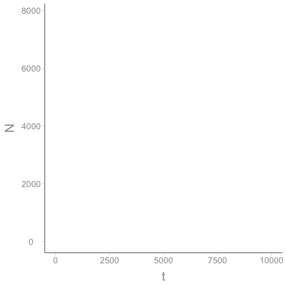
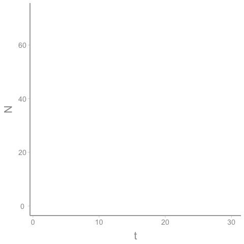
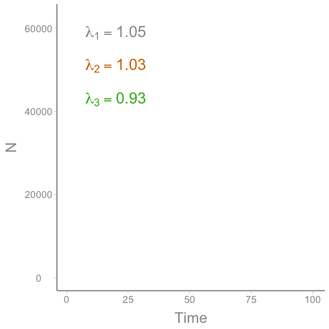

```{r setup, include = FALSE}
options(htmltools.dir.version = FALSE)
knitr::opts_chunk$set(echo = FALSE, fig.align = 'center', warning=FALSE, message=FALSE)
library(WILD3810)
library(gganimate)
```
<style type="text/css">
.remark-slide-content {
    font-size: 25px;
}
</style>

## Readings

> Mills 224-243

---
# Stochasticity and extinction risk

Over a long enough time scales, the fate of any population that is subject to stochasticity is *extinction*  

```{r out.height=300}


```


---
# Stochasticity and extinction risk

Stochasticity, particularly demographic stochasticity, is most consequential at small population sizes  

```{r out.height=300}


```
---
## Genetic stochasticity 

In addition to demographic and environmental stochasticity, **genetic stochasticity** also increases extinction risk for small populations  
<br/>  

--
Genetic drift leads to random accumulation and expression of harmful alleles, which can reduce demographic rates $^1$  
<br/>

--
Inbreeding depression can also lead to expression of harmful alleles

???
$^1$ This is very similar to demographic stochasticity - just by chance, it is possible to get a string of bad luck, in this case expression of alleles that are harmful  

Like demographic stochasticity, drift is more likely to be consequential at small population sizes  

---
class: inverse, middle, center
# Extinction vortex


---
## Extinction vortex

As populations decrease in size, they reach a point where **environmental stochasticity**, **demographic stochasticity**, and **genetic stochasticity** interact to drive populations towards extinction
  

```{r out.width=500, out.height=300}

```

---
## Extinction vortex

The danger with the extinction vortex is that focusing on a single factor (e.g., deterministic cause of decline) is not enough   
<br/>

--
Once a population is small, removing the cause of decline will not remove the stochastic threats  
<br/>

--
All threats have to be managed and considered together 

---
## What is a "small" population?

#### Detecting when species have entered the extinction vortex is difficult  

--
#### But risk of exinction is related to population size  

+ small populations are at higher risk than large ones   
<br/>


--
#### What defines a "small" population? 

---
## What is a "small" population?

#### This is a difficult question because "small" is a relative term  

--
#### "Small" compared to what? 

--
+ Historical population size?  

```{r fig.height=4, fig.width=6}
set.seed(12345)
N <- matrix(NA, nrow = 60, ncol = 2)
N[1,] <- c(5000, 50)

for(i in 2:60){
  N[i, 1] <- rnorm(1, N[i-1, 1]*0.98, 50)
  N[i, 2] <- rnorm(1, N[i-1,2], 4)
}

df <- data.frame(Year = rep(1:60, 2),
                 N = c(N),
                 Species = rep(c("1", "2"), each = 60))

ggplot(df[df$Species == "1",], aes(x = Year, y = N, color = Species)) + geom_path(size = 2) +
  guides(color = "none") +
  scale_y_continuous(limits = c(0, max(df$N)*1.1))
```

---
## What is a "small" population?

#### This is a difficult question because "small" is a relative term  

#### "Small" compared to what? 

+ Historical population size?

+ Other species?  

```{r fig.height=4, fig.width=6}
ggplot(df, aes(x = Year, y = N, color = Species)) + geom_path(size = 2) +
  guides(color = "none")
```

???

Species 1 is declining but is still more common than species 2, which has been stable for 60 years despite being rare. Which species would we consider more at risk of extinction? 

---
## What is a "small" population?

#### This is a difficult question because "small" is a relative term  

#### "Small" compared to what? 

+ Historical population size?

+ Other species?

+ Management standards? 

```{r fig.height=3, fig.width=5}
ggplot(df, aes(x = Year, y = N, color = Species)) + geom_path(size = 2) +
  guides(color = "none")
```

???

If species 1 is mallards, we might consider this a very small population size relative to management objectives. If species 2 is cougar, we might consider this to be a relatively large population relative to management objectives. 

---
## What is a "small" population?

There is a long history of trying to define the minimum abundance that avoids extinction (*minimum viable population*):

1) 50-500 rules (Soule 1980; Frankel & Soule 1981):  

> Effective population size $(N_e)$ of 50 needed to avoid negative consequences of inbreeding depression; $N_e=500$ needed for maintenence of genetic diversity to allow adapation $^1$ 


--
Focused on captive breeding not wild populations  
<br/>

--
$N_e=500$ probably too small for wild populations subject to stochasticity

???

$^1$ Effective population size is a concept from population genetics that refers to the size of an idealized population (i.e., one that meets all the Hardy-Weinberg assumptions) that would genetic drift at a rate equal to that of the observed population

$N_e=50$ translates to about 200-250 individuals

---
## What is a "small" population?

There is a long history of trying to define the minimum abundance that avoids extinction (*minimum viable population*):

1) 50-500 rules (Soule 1980; Frankel & Soule 1981)

2) 1400-4000 (Brook et al. 2006; Traill et al. 2007): 

> 1400-4000 individuals found to promote low risk of extinction over moderate timescales (20-100 years)


--
Improvement over 50-500 rule because focuses is on "risk of extinction" rather than on abundance itself  

Good rule-of-thumb but not a magic number  

---
## Problems with MVP approach

--
1) We probably don't want to aim for the *minimum* population size  
<br/>

--
2) There is not really a single minimum number of individuals (uncertainty!)  
<br/>

--
3) Populations provide ecological functions that may not be met at low population sizes  
<br/>


--
Many factors influence risk of extinction so maintenance of a population should consider multiple risk factors

---
class: inverse, center, middle

# Predictors of exinction risk

---
## Predictors of exinction risk

1)  Abundance  

* smaller populations are at higher risk of extinction than larger ones

```{r out.height=300}

```

---
## Predictors of exinction risk

1)  Abundance  

2)  Range size  

* Species restricted to small area/highly specialized are often at a higher risk of extinction than widespread species  

.pull-left[
```{r out.width="80%"}
knitr::include_graphics("https://upload.wikimedia.org/wikipedia/commons/f/f7/Kirtland%27s_warbler.jpg")
```
]

.pull-right[
```{r out.width="60%"}
knitr::include_graphics("https://upload.wikimedia.org/wikipedia/commons/0/06/Dendroica_kirtlandii_map.svg")
```
]
???
Image courtesy of USFWS via Wikicommons


---
## Predictors of exinction risk

1)  Abundance  

2)  Range size  

* Species restricted to small area/highly specialized are often at a higher risk of extinction than widespread species  

    a) small range and specialization are generally correlated with population size  
--
    b) the restricted habitats used by these species are at higher risk of catastrophic loss  

---
## Predictors of exinction risk

1)  Abundance  

2)  Range size  

```{r out.width="80%"}
knitr::include_graphics("https://upload.wikimedia.org/wikipedia/commons/d/d3/Attwater%27s_Prairie_Chicken.jpg")
```

???

[Attwater's prairie chicken](https://en.wikipedia.org/wiki/Attwater%27s_prairie_chicken) (*Tympanuchus cupido attwateri*) is an endangered subspecies of the greater prairie chicken. Historically, the subspecies was found along the Gulf coast from Louisiana to Mexico (6 million acres). Today, it is restricted to a small wildlife refuge near Eagle Lake, Texas and a few small areas of private lands. Around 1900, there were an estimated 1,000,000 Attwater's prairie chickens, a number that declines to 8,700 by 1937 due to habitat loss and invasive species. By 1967, there were only 1,070 birds and by 2003 there were fewer than 50. In 2016, flooding destroyed all nests and in 2017 Hurricane Harey killed at least 32 birds, leaving only 5-12 chickens in the wild. 

Image courtesy of Lavendowski, George (USFWS), via Wikimedia Commons


---
## Predictors of exinction risk

1)  Abundance  

2)  Range size  

3) Population growth rate  

* Species with low and/or highly variable growth rates are at higher risk of extinction than species with stable and/or high growth rates  

```{r out.width="25%"}

```

---
## Predictors of exinction risk

1)  Abundance  

2)  Range size  

3) Population growth rate  

4) Body size  

* Population growth rate and abundance tend to decrease with increasing body size so large-bodied species are generally at higher risk than small bodied species

---
## Predictors of exinction risk

1)  Abundance  

2)  Range size  

3) Population growth rate  

4) Body size  

5) Movement  

* Species that are able to colonize new habitats are generally at lower risk of extinction because:

    a) Better able to colonize suitable habitat; and  
    b) Increased gene flow limits drift/inbreeding depression  

---
class: inverse, center, middle

# Population viability analysis

---
## Population viability analysis

The above criteria have proven useful for predicting which species are vulnerable to extinction  
<br/>

--
Due to the complex and interacting factors that determine extinction risk, these criteria are often too simple to accurately assess true risk of extinction   
<br/>

--
When data are available, a more useful tool for predicting extinction risk is *population viability analysis* (PVA)  
<br/>

---
## Population viability analysis

PVA is a tool (or more accurately a set of methods) that:  

> use data and models to estimate the likelihoods of a population crossing thresholds of viability within various time spans, and to give insights into factors that constitute the biggest threats $^1$  

```{r out.width="45%"}
knitr::include_graphics("https://upload.wikimedia.org/wikipedia/commons/c/ce/Furbish_lousewort_%2837055906572%29.jpg")
```

???

Furbish lousewort (*Pedicularis furbishiae*) is a perennial plant endemic to Maine that was the subject of an early use of PVA  

Image courtesy of USFWS NE Region, via wikicommons

---
## Population viability analysis

PVA is a tool (or more accurately a set of methods) that:  

> use data and models to estimate the likelihoods of a population crossing thresholds of viability within various time spans, and to give insights into factors that constitute the biggest threats $^1$  


<br/>

Unlike minimum viable populations, PVA provides a means of determining "population viability" without the need to set a threshold abundance

???

$^1$ quoted from Mills pg 227  

In lab, we will practice implementing a PVA using R. For now, we will discuss the different parts of the definition, different types of PVA, and how PVA is used to inform management decisions.

---
class: inverse, middle, center
# Components of a PVA

---
## Components of a PVA

--
1) Viability  

- The first step of a PVA is defining what we mean by viable  

--
- This is an abundance level that we want to maintain our population at or above  

--
- In the most simple case, a viable means not extinct $(N > 0)$   


--
Rather than $(N > 0)$ we may also want keep abundance above some level where, e.g.

--
- Allee effects might kick in  

--
- ecological functions are detrimented  

--
- monitoring becomes unreliable  

---
## Components of a PVA

1) Viability  

Thus, PVA is usually based on *quasi-extinction* thresholds that are $> 0$  

Below these thresholds, some management action $^1$ might be triggered to prevent absolute extinction  

???

$^1$ captive breeding or special management actions

---
## Components of a PVA

1) Viability  
<br/>

2) Time frame  

- As we learned earlier, over long enough time periods, every population will go extinct  

--
- Critical to determine the specific time frame *relevant to our management objectives*  


---
## Components of a PVA

1) Viability  

2) Time frame  


One of the central issues with any type of prediction is that predictions are less certain the farther in the future we try to predict  

- The longer the time frame, the more ways there are for stochastic sources of variation to accumulate  

```{r fig.height = 2.5, fig.width=4}
N <- exp(1.6 + 0.025 * seq(1:50))
se <- exp(0.001 + 0.05 * seq(1:50))
df <- data.frame(x = seq(1:50), 
                 N = N, se = se)

ggplot(df, aes(x = x, y = N)) + geom_ribbon(aes(ymin = N - se, ymax = N + se), alpha = 0.5) + geom_path(color = WILD3810_colors$value[WILD3810_colors$name == "warning"])
```

---
## Components of a PVA

1) Viability  
<br/>

2) Time frame  

Most PVAs incorporate both short-term and long-term objectives  

--
- Long-term objectives are generally based solely on biology - maintaining populations above the quasi-extinction threshold for several decades  

--
- Short-term goals are more focused on political, legal, and social realities - what *can* we do now to maintain or increase population viability?  


---
## Components of a PVA

1) Viability  
<br/>

2) Time frame  

By monitoring the population and re-running the PVA with new data, managers can assess whether short-term actions are helping (or hurting) meet long-term objectives.

---
## Components of a PVA

1) Viability  
<br/>

2) Time frame  
<br/>

3) Likelihood of risk  

- The reason we need PVA is that we cannot say with certainty what will happen in the future due to stochasticity $^1$  

--
- PVAs are based on estimating probabilities of meeting viability objectives over our defined time frames  
- These probabilities capture the inherent *uncertainty* in our predictions  

???

$^1$ as well as deterministic processes that may occur in the future


---
## Components of a PVA

1) Viability  
<br/>

2) Time frame  
<br/>

3) Likelihood of risk  

- The likelihood of risk can be expressed in different ways  

---
## Components of a PVA

1) Viability  
<br/>

2) Time frame  
<br/>

3) Likelihood of risk  

- Overall quasi-extinction probability   

```{r out.height=150}


```
---
## Components of a PVA

1) Viability  
<br/>

2) Time frame  
<br/>

3) Likelihood of risk  

- Cumulative probability of declining below the quasi-extinction threshold   

```{r fig.width=3.5, fig.height=2.5}
cum_extinct <- data.frame(qe = dnorm(x = seq(1:60), 0, 20))

ggplot(cum_extinct, aes(x = qe)) + stat_ecdf(geom = "step") +
  scale_y_continuous("Cummulative \nextict. prob.") +
  scale_x_continuous("Time", labels = c(0, 5, 10, 15, 20))
```


---
## Components of a PVA

1) Viability  
<br/>

2) Time frame  
<br/>

3) Likelihood of risk  

In all cases, it's important to remember that these are *probabililities* - we don't know exactly how things will turn out  
<br/>

--
PVA can be used to estimate these probabilities but they cannot be used to tell us what level of risk we are willing to accept. That is a value judgement. 

---
class: inverse, center, middle

# Types of PVA

---
## Types of PVA 

Once we have established our quasi-extinction thresholds, time frames, and likelihoods of risk, we can build the PVA  
<br/>

--
As mentioned above, PVA actually refers to a variety of modeling techniques  
<br/>

--
The type of PVA we choose usually depends on the available data  

---
## Types of PVA

### Time-series

The most straightforward type of PVA is based on a time series of abundance data  

- use data to estimate $r$ and $\sigma^2$

```{r fig.height=4, fig.width=8}
set.seed(23456)
N1 <- numeric(length = 50)
N1[1] <- 65
for(i in 2:50){
  N1[i] <- rnorm(1, N1[i-1]*0.985, 5)
}
df <- data.frame(Year = seq(1:50),
                 N = N1)

(p <- ggplot(df, aes(x = Year, y = N)) + geom_path(size = 2) +
  scale_y_continuous(limits = c(0, 100)))
```

---
## Types of PVA

### Time-series

Use $r$ and $\sigma^2$ to **simulate** future dynamics

```{r fig.width=8, fig.height=5}
N <- matrix(NA, nrow = 50, ncol = 100)
N[1,] <- df$N[df$Year==50]

for(i in 1:100){
  for(j in 2:50){
    if(N[j-1,i] < 0){
      N[j,i] <- 0
    }else{
      N[j,i] <- max(0, rnorm(1, N[j-1,i]*0.985, 5))
    }
  }
}

df2 <- data.frame(Year = rep(seq(from = 50, to = 99), 100),
                  N = c(N),
                  pva = rep(as.factor(seq(1:100)), each = 50))

p + geom_path(data = df2, aes(x = Year, y = N, group = pva), alpha = 0.2, size = 0.75)
```

---
## Types of PVA

### Time-series

Summarize simulated populations to predict future dynamics:  

- `r mean(apply(N, 2, min)==0)*100`% probability of extinction  

- `r mean(apply(N, 2, min)<10)*100`% probability of $N<10$  

- `r mean(apply(N, 2, min)<20)*100`% probability of $N<20$  

---
## Types of PVA  

### Time-series  

More complex time-series PVAs can account for:  

- Density-dependence  

- Changes in $r$ over time  

- Effects of management actions  

---
## Types of PVA

### Demographically-explicit 

Rather than model $r$, model $b$ and $d$ directly  

--
- Incorporate variance, density-dependence, and covariation in vital rates  

--
- Mechanistic management predictions  

--
- Possible to include effects of genetic processes (e.g., inbreeding depression) on vital rates  

---
## Types of PVA

### Demographically-explicit 

Rather than model $r$, model $b$ and $d$ directly  

### But

- require lots of data  

- challenging to construct  

---
## Types of PVA

### Spatial 

In addition to $b$ and $d$, viability influenced by movement:  

- immigration and emigration  


--
Spatially-explicit PVAs model *how many* individuals and *where* they are  

- allow locally-extinct patches to become re-colonized  

- allow gene flow to add genetic variation  

---
## Considerations for using PVA

1) Data quality  

--
- Time frame  

--
- Sampling error  

---
## Considerations for using PVA

1) Data quality

2) Uncertainty

--
- Do we need accurate predictions of extinction risk? Or is relative risk be enough? 

--
- Account for uncertainty using simulations

---
## Considerations for using PVA

1) Data quality

2) Uncertainty

3) Other sources of information

--
- Expert opinion

--
- Rules-of-thumb
