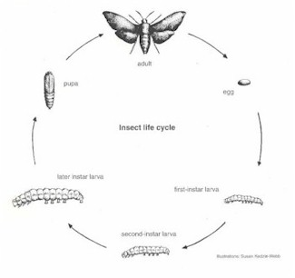
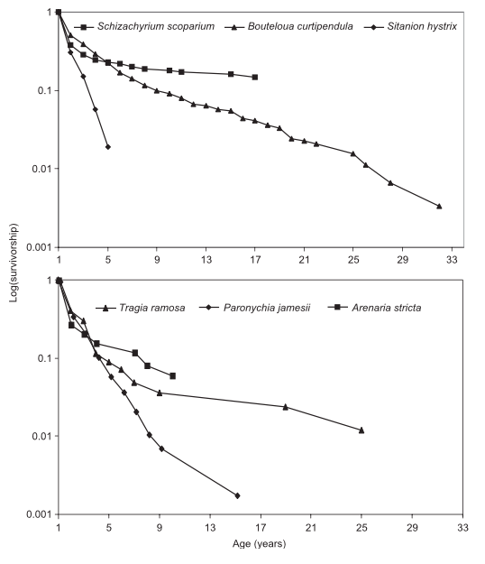

```{r setup, include = FALSE}
options(htmltools.dir.version = FALSE)
knitr::opts_chunk$set(echo = FALSE, fig.align = 'center', warning=FALSE, message=FALSE, fig.retina = 2)
library(WILD3810)
library(gganimate)
```


## Assumptions of the density-independent models

#### Remember from the lecture 3 that our simple models of population growth were based on the following assumptions:  

--
1) Population closed to immigration and emigration  
<br/>

--
2) Model pertains to only the limiting sex, usually females  
<br/>

--
3) Birth and death rates are independent of an individual’s age or biological stage  
<br/>

--
4) Birth and death rates are constant


---
## Assumptions of the density-independent models

#### In lectures 4 and 5, we learned about ways to model dynamics that do not meet assumption 4:  


1) Population closed to immigration and emigration  
<br/>


2) Model pertains to only the limiting sex, usually females  
<br/>


3) Birth and death rates are independent of an individual’s age or biological stage  
<br/>


**4) Birth and death rates are constant**

???

In lecture 4, we learned about why birth and death rates might change as a function of abundance  

In lecture 5, we learned about ways that birth and death rates might vary stochastically  


---
## Assumptions of the density-independent models

#### Over the coming weeks, we will learn about why and how to relax assumption 3:  


1) Population closed to immigration and emigration  
<br/>


2) Model pertains to only the limiting sex, usually females  
<br/>


**3) Birth and death rates are independent of an individual’s age or biological stage**  
<br/>


4) Birth and death rates are constant


---
class: inverse, center, middle

# Structured populations

---
## Age-structured populations

#### Survival and birth rates often vary with age

.left-column[
```{r, out.width="100%"}
knitr::include_graphics("https://upload.wikimedia.org/wikipedia/commons/d/d2/Anser_caerulescens_CT4.jpg")
```
]

.right-column[
```{r, out.width="80%"}

```
]

???

Image courtesy of Cephas, from Wikimedia Commons  

Figure from Rockwell et al. (1985) *Evolution*

---
## Stage-structured populations

#### In some cases, age is not a relevant predictor of survival and birth rates   

--
#### Instead, survival and birth rates vary with **stage**

--
- life cycle stage

.pull-left[
```{r, out.width="75%"}

```
]

.pull-right[
```{r, out.width="75%"}
knitr::include_graphics("figs/lifecycle.gif")
```
]

---
## Stage-structured populations

#### In some cases, age is not a relevant predictor of survival and birth rates   

#### Instead, survival and birth rates vary with **stage**

- life cycle stage

- size 

.left-column[
```{r, out.width="100%"}
knitr::include_graphics("https://upload.wikimedia.org/wikipedia/commons/a/af/Gasterosteus_aculeatus_t%C3%BCsk%C3%A9s_pik%C3%B3.jpg")
```
]

.right-column[
```{r, out.width="60%"}
knitr::include_graphics("figs/stickleback_fecundity.png")
```
]

???

Image courtesy of Kókay Szabolcs, via Wikimedia Commons
Figure from Moser et al. (2012)

---
class: inverse, center, middle

# Age-structured populations

---
## Age-structured populations

#### **Life tables**  

- earliest accounting tool for calculating age-specific survival and mortality  


--
#### Applications to:  

-  Human demography  

- Insurance industry (actuarial sciences)  

- Health professions  


--
[Pearl and Parker (1921)](https://www.journals.uchicago.edu/doi/pdfplus/10.1086/279836) were the first to calculate a non-human life table  
- *Drosophila melanogaster* (a fruit fly)  

- Since used in ecology, evolution, and natural resource management  

---
## Life tables

#### Cohort life table

- follow group of individuals born within short period (a **cohort**) until each individual's death  

--
- develop life table for groups of individuals with similar traits (e.g., one for males, one for females)  

--
- **longitudinal** study design  

```{r long_cohort, fig.width=6, fig.height=4}
long <- data.frame(Time = seq(0, 100),
                   Age = seq(0, 100))

poly <- data.frame(x = c(0, 20, 100, 100),
                   y = c(-Inf, -Inf, 75, 95))
p <- ggplot(long, aes(x = Time, y = Age)) +
  scale_x_continuous(limits = c(0, 100)) +
  scale_y_continuous(limits = c(0, 100)) +
  geom_polygon(data = poly, aes(x = x, y = y), fill = "white", color = "black") +
  geom_segment(aes(x = -Inf, xend = 15, y = 5, yend = 25), size = 2,
               color = WILD3810_colors$value[WILD3810_colors$name == "primary"]) +
  geom_segment(aes(x = -Inf, xend = 35, y = 15, yend = 55), size = 2,
               color = WILD3810_colors$value[WILD3810_colors$name == "primary"]) +
        geom_segment(aes(x = -Inf, xend = 53, y = -Inf, yend = 58), size = 2,
               color = WILD3810_colors$value[WILD3810_colors$name == "primary"]) +
    geom_segment(aes(x = 5, xend = 95, y = -Inf, yend = 85), size = 2, 
               color = WILD3810_colors$value[WILD3810_colors$name == "primary"]) +
  geom_segment(aes(x = 10, xend = 45, y = -Inf, yend = 30), size = 2, 
               color = WILD3810_colors$value[WILD3810_colors$name == "primary"]) +
  geom_segment(aes(x = 16, xend = 31, y = -Inf, yend = 10), size = 2, 
               color = WILD3810_colors$value[WILD3810_colors$name == "primary"]) +
  geom_segment(aes(x = 30, xend = 50, y = -Inf, yend = 15), size = 2, 
               color = WILD3810_colors$value[WILD3810_colors$name == "primary"]) +
  geom_segment(aes(x = 40, xend = 90, y =-Inf, yend = 45), size = 2, 
               color = WILD3810_colors$value[WILD3810_colors$name == "primary"]) +
  theme(axis.text = element_blank(), axis.ticks = element_blank(),
        panel.background = element_rect(fill = "grey85"))
p
```

---
## Life tables

- $\Large x$: age of individuals

- $\Large N_x$: number of individuals observed alive at age $\Large x$ (sometimes called $\Large S_x$)
<br/>

```{r}

library(kableExtra)
lt <- data.frame(x = seq(from = 0, to  = 4),
                       Nx = c(100, 75, 50, 40, 0),
                       lx = "",
                       Lx = "",
                       Tx = "",
                       ex = "")

names(lt) <- c("\\(x\\)", "\\(N_x\\)", "\\(l_x\\)", "\\(L_x\\)", "\\(T_x\\)", "\\(e_x\\)")
```

```{r}
lt2 <- lt
names(lt2) <- c("\\(x\\)", "\\(N_x\\)", "", "", "", "")
lt2 %>%
  kable("html", align = 'c', escape = FALSE) %>%
  kable_styling(bootstrap_options = c("striped", "hover", "condensed", "responsive"), full_width = TRUE) 
```


???

$S_x$ stands for number of *survivors* at age $x$

---
## Life tables

- $\Large l_x$: Probability of surviving to age $\Large x$

    + Can also be interpreted as the proportion of individuals still alive at age $x$

- $\Large l_x = N_x/N_0$
<br/>

```{r}
lt3 <- lt

names(lt3) <- c("\\(x\\)", "\\(N_x\\)", "\\(l_x\\)", "", "", "")
lt3 %>%
  kable("html", align = 'c', escape = FALSE) %>%
  kable_styling(bootstrap_options = c("striped", "hover", "condensed", "responsive"), full_width = TRUE) 
```

---
## Life tables

- $\Large l_x$: Probability of surviving to age $\Large x$

- $\Large l_x = N_x/N_0$
<br/>

```{r}
lt3[,3] <- c("1.00", "", "", "", "")
lt3 %>%
  kable("html", align = 'c', escape = FALSE) %>%
  kable_styling(bootstrap_options = c("striped", "hover", "condensed", "responsive"), full_width = TRUE) 
```

---
## Life tables

- $\Large l_x$: Probability of surviving to age $\Large x$

- $\Large l_x = N_x/N_0$
<br/>

```{r}
lt3[,3] <- c("1.00", "0.75", "", "", "")
lt3 %>%
  kable("html", align = 'c', escape = FALSE) %>%
  kable_styling(bootstrap_options = c("striped", "hover", "condensed", "responsive"), full_width = TRUE) 
```

---
## Life tables

- $\Large l_x$: Probability of surviving to age $\Large x$

- $\Large l_x = N_x/N_0$
<br/>

```{r}
lt3[,3] <- c("1.00", "0.75", "0.50", "", "")
lt3 %>%
  kable("html", align = 'c', escape = FALSE) %>%
  kable_styling(bootstrap_options = c("striped", "hover", "condensed", "responsive"), full_width = TRUE) 
```

---
## Life tables

- $\Large l_x$: Probability of surviving to age $\Large x$

- $\Large l_x = N_x/N_0$
<br/>

```{r}
lt3[,3] <- c("1.00", "0.75", "0.50", "0.40", "")
lt3 %>%
  kable("html", align = 'c', escape = FALSE) %>%
  kable_styling(bootstrap_options = c("striped", "hover", "condensed", "responsive"), full_width = TRUE) 
```

---
## Life tables

- $\Large l_x$: Probability of surviving to age $\Large x$

- $\Large l_x = N_x/N_0$
<br/>

```{r}
lt3[,3] <- c(1.0, 0.75, 0.5, 0.4, 0)
lt3 %>%
  kable("html", align = 'c', escape = FALSE) %>%
  kable_styling(bootstrap_options = c("striped", "hover", "condensed", "responsive"), full_width = TRUE) 
```

---
exclude: true

## Life tables


.left-column[
```{r, out.width="100%"}
knitr::include_graphics("https://upload.wikimedia.org/wikipedia/commons/f/f6/Phlox_drummondii_-_Archer_FL_02.jpg")
```
]

.right-column[
```{r, out.width="80%"}
knitr::include_graphics("figs/phlox_lt.png")
```
]


???

Image courtesy of Ebyabe, from Wikimedia Commons

from Leverich & Leven (1979) *American Naturalist*

---
## Life tables

.left-column[
```{r, out.width="100%"}
knitr::include_graphics("https://upload.wikimedia.org/wikipedia/commons/f/f6/Phlox_drummondii_-_Archer_FL_02.jpg")
```
]

.right-column[
```{r, out.width="60%"}

```
]


???

Image courtesy of Ebyabe, from Wikimedia Commons

from Leverich & Leven (1979) *American Naturalist*

---
## Life tables

- $\Large P_x$: Probability of surviving **from** age $x$ **to** the next age (of those alive at age $x$)


- $\Large P_x = l_{x+1}/l_x$
<br/>

```{r}
lt4 <- lt3

names(lt4) <- c("\\(x\\)", "\\(N_x\\)", "\\(l_x\\)", "\\(P_x\\)", "", "")

lt4[,4] <- c(0.75, "", "", "", "")
lt4 %>%
  kable("html", align = 'c', escape = FALSE) %>%
  kable_styling(bootstrap_options = c("striped", "hover", "condensed", "responsive"), full_width = TRUE) 
```


---
## Life tables

- $\Large P_x$: Probability of surviving **from** age $x$ **to** the next age (of those alive at age $x$)


- $\Large P_x = l_{x+1}/l_x$
<br/>

```{r}
lt4[,4] <- c(0.75, 0.667, "", "", "")
lt4 %>%
  kable("html", align = 'c', escape = FALSE) %>%
  kable_styling(bootstrap_options = c("striped", "hover", "condensed", "responsive"), full_width = TRUE) 
```

---
## Life tables

- $\Large P_x$: Probability of surviving **from** age $x$ **to** the next age (of those alive at age $x$)


- $\Large P_x = l_{x+1}/l_x$
<br/>

```{r}

lt4[,4] <- c(0.75, 0.667, 0.8, "", "")
lt4 %>%
  kable("html", align = 'c', escape = FALSE) %>%
  kable_styling(bootstrap_options = c("striped", "hover", "condensed", "responsive"), full_width = TRUE) 
```

---
## Life tables

- $\Large P_x$: Probability of surviving **from** age $x$ **to** the next age (of those alive at age $x$)


- $\Large P_x = l_{x+1}/l_x$
<br/>

```{r}

lt4[,4] <- c(0.75, 0.667, 0.8, 0, "-")
lt4 %>%
  kable("html", align = 'c', escape = FALSE) %>%
  kable_styling(bootstrap_options = c("striped", "hover", "condensed", "responsive"), full_width = TRUE) 
```

---
## Life tables

### Age-specific survival of fallow deer (*Dama dama*)

.left-column[
```{r, out.width="100%"}
knitr::include_graphics("https://upload.wikimedia.org/wikipedia/commons/f/f3/Fallow_deer_in_field.jpg")
```
]

.right-column[
```{r, out.width="70%"}

```
]

???

Image courtesy of Johann-Nikolaus Andreae, via Wikimedia Commons
Figure from McElligott et al. (2002) *Proc Royal Society B*

---
## Life tables

- $\Large q_x$: Probability of dying **between** age $x$ the next age (of those alive at age $x$)


- $\Large q_x = 1 - P_x$
<br/>

```{r}
lt5 <- lt4

names(lt5) <- c("\\(x\\)", "\\(N_x\\)", "\\(l_x\\)", "\\(P_x\\)", "\\(q_x\\)", "")

lt5[,5] <- c(0.25, "", "", "", "")
lt5 %>%
  kable("html", align = 'c', escape = FALSE) %>%
  kable_styling(bootstrap_options = c("striped", "hover", "condensed", "responsive"), full_width = TRUE) 
```

---
## Life tables

- $\Large q_x$: Probability of dying **between** age $x$ the next age (of those alive at age $x$)


- $\Large q_x = 1 - P_x$
<br/>

```{r}
lt5[,5] <- c(0.25, 0.333, "", "", "")
lt5 %>%
  kable("html", align = 'c', escape = FALSE) %>%
  kable_styling(bootstrap_options = c("striped", "hover", "condensed", "responsive"), full_width = TRUE) 
```

---
## Life tables

- $\Large q_x$: Probability of dying **between** age $x$ the next age (of those alive at age $x$)


- $\Large q_x = 1 - P_x$
<br/>

```{r}

lt5[,5] <- c(0.25, 0.333, 0.2, "", "")
lt5 %>%
  kable("html", align = 'c', escape = FALSE) %>%
  kable_styling(bootstrap_options = c("striped", "hover", "condensed", "responsive"), full_width = TRUE) 
```

---
## Life tables

- $\Large q_x$: Probability of dying **between** age $x$ the next age (of those alive at age $x$)


- $\Large q_x = 1 - P_x$
<br/>

```{r}

lt5[,5] <- c(0.25, 0.333, 0.2, 1, "-")
lt5 %>%
  kable("html", align = 'c', escape = FALSE) %>%
  kable_styling(bootstrap_options = c("striped", "hover", "condensed", "responsive"), full_width = TRUE) 
```


---
exclude: true

## Life tables

- $\Large H_x$: Hazard (i.e., risk)  of dying **between** age $x$ the next age (of those alive at age $x$)


- $\Large H_x = -log(P_x)$
<br/>

```{r}
lt6 <- lt5

names(lt6) <- c("\\(x\\)", "\\(N_x\\)", "\\(l_x\\)", "\\(P_x\\)", "\\(q_x\\)", "\\(H_x\\)")

lt6[,6] <- c(0.29, 0.4, 0.22, "Inf", "-")
lt6 %>%
  kable("html", align = 'c', escape = FALSE) %>%
  kable_styling(bootstrap_options = c("striped", "hover", "condensed", "responsive"), full_width = TRUE) 
```

---
## Life tables

#### Cohort tables

- Assume that all live individuals are available for observation at every age until death  


- Most readily applied to:  

    + Human populations (e.g., CDC NCHS)  
    + Plants  
    + Sessile animals  
    + Mobile animals on small islands with high observer detection  
    + Animals in captivity (zoos)  

---
## Life tables

#### Static tables

- assess number of individuals of known age at one point in time or the age of individuals dying at any point in time

```{r stat_cohort, fig.width=7, fig.height=5}
long <- data.frame(Time = seq(0, 100),
                   Age = seq(0, 100))

start <- data.frame(Time = c(0, 10, 20, 30, 40), 
                    Age = 0, 
                    Cohort = c("1", "2", "3", "4", "5"))


ggplot(long, aes(x = Time, y = Age)) +
  scale_x_continuous(limits = c(0, 100)) +
  scale_y_continuous(limits = c(0, 100)) +
    geom_polygon(data = poly, aes(x = x, y = y), fill = "grey95", color = "grey79") +
    geom_rect(aes(xmin = 40, xmax = 55, ymin = -Inf, ymax = Inf), fill = "white", color = "black") +
  geom_segment(aes(x = -Inf, xend = 15, y = 5, yend = 25), size = 2,
               color = WILD3810_colors$value[WILD3810_colors$name == "primary"]) +
  geom_segment(aes(x = -Inf, xend = 35, y = 15, yend = 55), size = 2,
               color = WILD3810_colors$value[WILD3810_colors$name == "primary"]) +
    geom_segment(aes(x = -Inf, xend = 53, y = -Inf, yend = 58), size = 2,
               color = WILD3810_colors$value[WILD3810_colors$name == "primary"]) +
    geom_segment(aes(x = 5, xend = 95, y = -Inf, yend = 85), size = 2, 
               color = WILD3810_colors$value[WILD3810_colors$name == "primary"]) +
  geom_segment(aes(x = 10, xend = 45, y = -Inf, yend = 30), size = 2, 
               color = WILD3810_colors$value[WILD3810_colors$name == "primary"]) +
  geom_segment(aes(x = 16, xend = 31, y = -Inf, yend = 10), size = 2, 
               color = WILD3810_colors$value[WILD3810_colors$name == "primary"]) +
  geom_segment(aes(x = 30, xend = 50, y = -Inf, yend = 15), size = 2, 
               color = WILD3810_colors$value[WILD3810_colors$name == "primary"]) +
  geom_segment(aes(x = 40, xend = 90, y =-Inf, yend = 45), size = 2, 
               color = WILD3810_colors$value[WILD3810_colors$name == "primary"]) +
  theme(axis.text = element_blank(), axis.ticks = element_blank(),
        panel.background = element_rect(fill = "grey85"))

```

---
## Static life tables

- $\Large a_x$: Deaths between age $\large x-1$ and age $\Large x$
<br/>

```{r}
lt3 <- lt

names(lt3) <- c("\\(x\\)", "\\(a_x\\)", "", "", "", "")
lt3[,2] <- c("", 25, 15, 10, 7)

lt3 %>%
  kable("html", align = 'c', escape = FALSE) %>%
  kable_styling(bootstrap_options = c("striped", "hover", "condensed", "responsive"), full_width = TRUE) 
```

--

$\large \sum_{x=0}^{max(x)} a_x = 57$

---
## Static life tables

- $\Large a_x$: Deaths between age $\large x-1$ and age $\Large x$
<br/>

```{r}
names(lt3) <- c("\\(x\\)", "\\(a_x\\)", "\\(N_x\\)", "", "", "")
lt3[,3] <- c(57, "57-25=32", "32-15=17", "17-10=7", "7-7=0")

lt3 %>%
  kable("html", align = 'c', escape = FALSE) %>%
  kable_styling(bootstrap_options = c("striped", "hover", "condensed", "responsive"), full_width = TRUE) 
```

$\large \sum_{x=0}^{max(x)} a_x = 57$

---
## Static life tables

- $\Large a_x$: Deaths between age $\large x-1$ and age $\Large x$
<br/>

```{r}
lt4 <- lt3

names(lt4) <- c("\\(x\\)", "\\(a_x\\)", "\\(N_x\\)", "\\(l_x\\)", "\\(P_x\\)", "etc.")
lt4[,4] <- c(1, 0.56, 0.30, 0.12, 0)
lt4[,5] <- c(0.56, 0.54, 0.4, 0, "-")
lt4 %>%
  kable("html", align = 'c', escape = FALSE) %>%
  kable_styling(bootstrap_options = c("striped", "hover", "condensed", "responsive"), full_width = TRUE) 
```


---
## Static life tables

#### Static life tables most readily applied to:

- Plants and animals where age can be accurately determined for all individuals at a given moment in time  

- e.g., using the rings/layering in trees, teeth, otoliths, horns, and maybe even telomere length on genes


---
## Static life tables

#### Static life table assumptions:

- All individuals have equivalent availability for observation, regardless of age  

- Stable age distribution  

- Age-specific survival $\Large (P_x)$ does not change over time  

    + If it does, time effects may appear as ‘age effects’ and lead to biased results

---
class: inverse, middle, center

# Survivorship curves

---
## Survivorship curves

```{r surv_curv1, fig.height=5 ,fig.width=9}
age <- seq(from = 0, to = 10, length.out = 100)
surv <- -1.2*age
lx <- exp(surv)

survII <- data.frame(Age = age, lx = lx, surv = surv)

p1 <- ggplot(survII, aes(Age, lx)) + geom_line() +
  scale_y_continuous(expression(l[x]))
p2 <- ggplot(survII, aes(Age, surv)) + geom_line() +
  scale_y_continuous(expression(paste("log(", l[x], ") 'Survivorship'")))

cowplot::plot_grid(p1, p2)

```

--
#### **Type II Survivorship curve** (Pearl 1928)


---
## Survivorship curves

```{r surv_curve2, fig.height=5 ,fig.width=7}
age <- seq(from = 0, to = 1, length.out = 100)
survI <- -0.1 * age ^ 7
survII <- -0.1*age
survIII <- -0.1*age^0.1

surv_df <- data.frame(Age = age, surv = c(survI, survII, survIII),
                     Type = rep(c("I", "II", "III"), each = length(age)))

ggplot(surv_df, aes(Age, surv, color = Type, label = Type)) + geom_line(size = 1.6) +
  scale_y_continuous(expression(paste("log(", l[x], ") 'Survivorship'"))) 
```

---
## Survivorship curves

### What types of species do you expect have type 1 survivorship curves?

--
```{r out.width = "50%"}

```

---
## Survivorship curves

### What types of species do you expect have type 2 survivorship curves?

--
.left-column[
```{r, out.width="100%"}
knitr::include_graphics("https://upload.wikimedia.org/wikipedia/commons/7/7c/Eastern_Grey_Squirrel_in_St_James%27s_Park%2C_London_-_Nov_2006_edit.jpg")
```
]

.right-column[
```{r, out.width="50%"}

```
]

???

Image courtesy of Diliff, from Wikimedia Commons  

Figure from Barkalow et al. (1970)

---
## Survivorship curves

### What types of species do you expect have type 3 survivorship curves?

--
.left-column[
```{r, out.width="100%"}
knitr::include_graphics("https://upload.wikimedia.org/wikipedia/commons/8/89/Little_Bluestem_P7280448.JPG")
```
]

.right-column[
```{r, out.width="50%"}

```
]

???

Image courtesy of Chris Light, from Wikimedia Commons  

Figure from Lauenroth & Adler (2008)

---
class: middle, center, inverse

# Life expectancy

---
## Life expectancy

#### Life Expectancy  

> The average length of time an individual is expected to live, given they are currently $x$ years old  


- Directly related to the probability of surviving to a given age  


--
#### Utah has the lowest per capita crude death rate in the U.S. (averaged across all ages)  

--
### Can Utahns expect to live longer than in all other states? 

???

crude death rate means the average death rate across all individuals in the population, regardless of age  

---
## Life expectancy

#### To estimate life expectancy, start with $\Large l_x$

- $\Large l_x$ = Proportion of individuals still alive at age $\Large x$

```{r}
lt3 <- lt
lt3[,3] <- c(1.0, 0.75, 0.5, 0.4, 0)

names(lt3) <- c("\\(x\\)", "\\(N_x\\)", "\\(l_x\\)", "", "", "")
lt3 %>%
  kable("html", align = 'c', escape = FALSE) %>%
  kable_styling(bootstrap_options = c("striped", "hover", "condensed", "responsive"), full_width = TRUE) 
```

---
## Life expectancy

- $\Large L_x$: Average proportion of living individuals across successive age classes  

- $\Large L_x = \frac{l_x+l_{x+1}}{2}$

```{r}
lt4 <- lt3
lt4[,4] <- c(0.875, 0.625, 0.45, 0.2, "-")

names(lt4) <- c("\\(x\\)", "\\(N_x\\)", "\\(l_x\\)", "\\(L_x\\)", "", "")
lt4 %>%
  kable("html", align = 'c', escape = FALSE) %>%
  kable_styling(bootstrap_options = c("striped", "hover", "condensed", "responsive"), full_width = TRUE) 
```

---
## Life expectancy

- $\Large T_x$: total proportion of living individuals from age $x$ to $max(x)$


```{r Tx, fig.height=6, fig.width=8}
ggplot(data.frame(x = c(0, 5)), aes(x)) +
  stat_function(fun = dnorm) + 
  stat_function(fun = dnorm, 
                xlim = c(0, 5),
                geom = "area",
                fill = WILD3810_colors$value[WILD3810_colors$name=="primary"]) +
  scale_x_continuous("Age", breaks = 0) +
  scale_y_continuous(expression(paste("Average proportion alive (", L[x], ")"))) +
  theme(axis.text.y = element_blank(), axis.ticks.y = element_blank())

```

---
## Life expectancy

- $\Large T_x$: total proportion of living individuals from age $x$ to $max(x)$


```{r Tx2, fig.height=6, fig.width=8}
ggplot(data.frame(x = c(0, 5)), aes(x)) +
  stat_function(fun = dnorm) + 
  stat_function(fun = dnorm, 
                xlim = c(2, 5),
                geom = "area",
                fill = WILD3810_colors$value[WILD3810_colors$name=="primary"]) +
  scale_x_continuous("Age", breaks = 2) +
  scale_y_continuous(expression(paste("Average proportion alive (", L[x], ")"))) +
  theme(axis.text.y = element_blank(), axis.ticks.y = element_blank())

```


---
## Life expectancy

- $\Large T_x$: total proportion of living individuals from age $x$ to $max(x)$

- $\Large T_x = \sum_x^{max(x)}L_x$

```{r}
lt5 <- lt4
lt5[,5] <- c(2.15, 1.275, 0.65, 0.2, "-")

names(lt5) <- c("\\(x\\)", "\\(N_x\\)", "\\(l_x\\)", "\\(L_x\\)", "\\(T_x\\)", "")
lt5 %>%
  kable("html", align = 'c', escape = FALSE) %>%
  kable_styling(bootstrap_options = c("striped", "hover", "condensed", "responsive"), full_width = TRUE) 
```


---
## Life expectancy

- $\Large E_x$: Number of additional years an individual of age $x$ is expected to survive

- $\Large E_x = T_x/l_x$


```{r}
lt6 <- lt5
lt6[,6] <- c(2.15, 1.7, 1.3, 0.5, "-")

names(lt6) <- c("\\(x\\)", "\\(N_x\\)", "\\(l_x\\)", "\\(L_x\\)", "\\(T_x\\)", "\\(E_x\\)")
lt6 %>%
  kable("html", align = 'c', escape = FALSE) %>%
  kable_styling(bootstrap_options = c("striped", "hover", "condensed", "responsive"), full_width = TRUE) 
```

---
## Utah life expectancy

#### Utah has the lowest per capita crude death rate d in the U.S  

### Can Utahns expect to live longer than all other states?

--
### Not exactly

- Life expectancy of a newborn Utahn is 80.2  
<br/>

--
- Ranked 14th in the U.S., not first  

---
## Utah life expectancy

#### Why is Utah’s crude per capita death rate $\Large d$ so low?  

--
#### Because Utah has the highest birth rate and consequently the youngest age structure

- % of Utahns < 18 yrs old is 32%  

- % of U.S. < 18 yrs old is 25%  

--
- % of Utahns ≥ 65 is 11%  

- % of U.S. ≥ 65 = 15%  


--
#### Young individuals have highest chances of survival 

#### Having many young individuals in a population will skew the crude average $\Large d$

