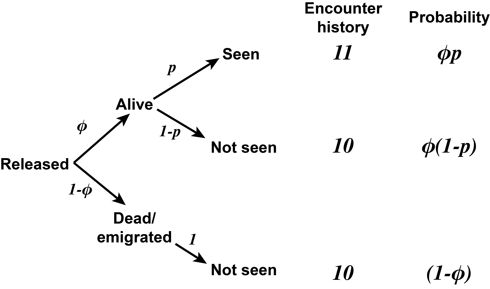
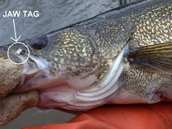
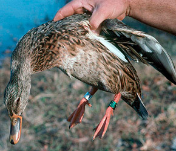
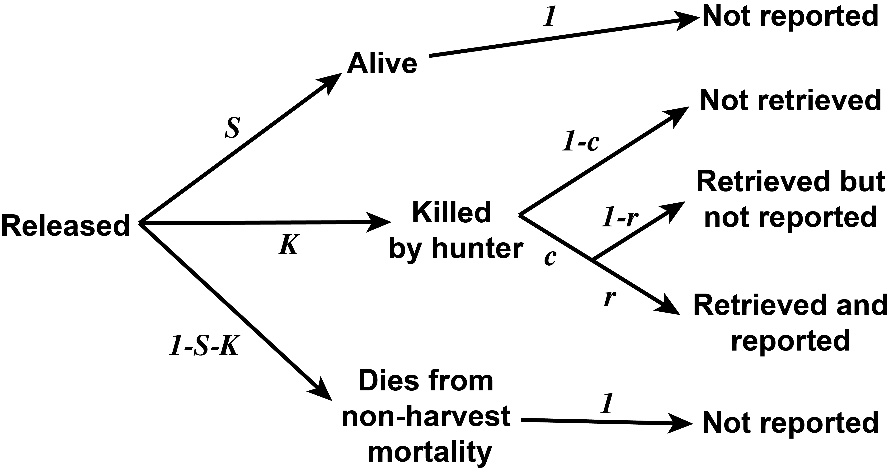

```{r setup, include = FALSE}
options(htmltools.dir.version = FALSE)
knitr::opts_chunk$set(echo = FALSE, fig.align = 'center', warning=FALSE, message=FALSE)
library(WILD3810)
library(gganimate)
```

## Readings

> Powell & Gale 103-122; 123-138  


---
## Life tables

#### If detection probability is $<1$  

- $N_x$ will be biased low  

- All other life table statistics will be biased as well

    + Survival biased low, mortality biased high

.left-column[
```{r, out.width="100%"}
knitr::include_graphics("https://upload.wikimedia.org/wikipedia/commons/f/f6/Phlox_drummondii_-_Archer_FL_02.jpg")
```
]

.right-column[
```{r, out.width="60%"}
knitr::include_graphics("figs/phlox_lt.png")
```
]


---
class: inverse, middle, center

# Survival estimation

---
## Survival estimation

#### Methods used to estimate plant and animal survival generally fall into three categories:  

1) Known fate  

2) Capture-mark-recapture  

3) Recovery models  


---
class: inverse, middle, center

# Known fate

---
## Known fate

#### Location and fate (alive or dead) of every marked individual is known at each sampling occasion

- $\LARGE P_{det} = 1$


--
#### What types of data can be used for known fate analyses?

--
```{r out.width="50%"}
knitr::include_graphics("https://upload.wikimedia.org/wikipedia/commons/2/2a/Handheld_telemetry.jpg")
```


???
Image courtesy of Red Wolf Recovery Program, via Wikimedia Commons


---
## Known fate

#### Location and fate (alive or dead) of every marked individual is known at each sampling occasion

- $\LARGE P_{det} = 1$

#### What types of data can be used for known fate analyses?


```{r out.width="50%"}
knitr::include_graphics("https://upload.wikimedia.org/wikipedia/commons/2/28/Tigress_with_radio_collar.JPG")
```


???
Image courtesy of PR Ganapathy, from Wikimedia Commons

---
## Known fate

#### Location and fate (alive or dead) of every marked individual is known at each sampling occasion

- $\LARGE P_{det} = 1$

#### What types of data can be used for known fate analyses?


```{r, out.width="50%"}
knitr::include_graphics("https://upload.wikimedia.org/wikipedia/commons/f/f6/Phlox_drummondii_-_Archer_FL_02.jpg")
```


???
Image courtesy of Ebyabe, from Wikimedia Commons


---
## Known fate

#### Location and fate (alive or dead) of every marked individual is known at each sampling occasion

- $\LARGE P_{det} = 1$

#### What types of data can be used for known fate analyses?


```{r, out.width="50%"}
knitr::include_graphics("https://upload.wikimedia.org/wikipedia/commons/e/e8/%3F%3F_Vireo_nest_Huachuca_Canyon_Sierra_Vista_AZ_%2835488233510%29.jpg")
```


???
Image courtesy of Bettina Arrigoni, via Wikimedia Commons

---
## Known fate

#### Data

```{r}
library(kableExtra)
df <- data.frame(animal = c("Indv 1", "Indv 2", "Indv 3"),
                 ch = c("111", "110", "100"),
                 prb = c("\\(s_1 \\times s_2\\)", "\\(s_1 \\times (1-s_2)\\)", "\\(1-s_1\\)"))

names(df) <- c("Individual", "Capture history", "Probability")
df2 <- df
df2[,3] <- ""
df2 %>%
  kable("html", align = 'c', escape = FALSE) %>%
  kable_styling(bootstrap_options = c("striped", "hover", "condensed", "responsive"), full_width = TRUE) 
```

--

#### Individual 1

- Captured on occasion 1  

- Resighted alive on occasion 2  

- Resighted alive on occasion 3  

---
## Known fate

#### Data

```{r}
df3 <- df
df3[,3] <- c(as.character(df[1,3]), "", "")
df3 %>%
  kable("html", align = 'c', escape = FALSE) %>%
  kable_styling(bootstrap_options = c("striped", "hover", "condensed", "responsive"), full_width = TRUE) 
```


#### Individual 1

- Captured on occasion 1  

- Resighted **alive** on occasion 2  

- Resighted **alive** on occasion 3  

---
## Known fate

#### Data

```{r}
df3 %>%
  kable("html", align = 'c', escape = FALSE) %>%
  kable_styling(bootstrap_options = c("striped", "hover", "condensed", "responsive"), full_width = TRUE) 
```


#### Individual 2

- Captured on occasion 1  

- Resighted **alive** on occasion 2  

- Resighted **dead** on occasion 3  

---
## Known fate

#### Data

```{r}
df4 <- df
df4[,3] <- c(as.character(df[1,3]), as.character(df[2,3]), "")
df4 %>%
  kable("html", align = 'c', escape = FALSE) %>%
  kable_styling(bootstrap_options = c("striped", "hover", "condensed", "responsive"), full_width = TRUE) 
```

#### Individual 2

- Captured on occasion 1  

- Resighted **alive** on occasion 2  

- Resighted **dead** on occasion 3  

---
## Known fate

#### Data

```{r}
df %>%
  kable("html", align = 'c', escape = FALSE) %>%
  kable_styling(bootstrap_options = c("striped", "hover", "condensed", "responsive"), full_width = TRUE) 
```

#### Individual 3

- Captured on occasion 1  

- Resighted **dead** on occasion 2  

- Known **dead** on occasion 3  

---
## Known fate

#### Kaplan-Meier model

$$\LARGE s_t = \frac{n_t - d_t}{n_t}$$

$$\LARGE var(s_t) = \frac{s_t^2\big(1-s_t\big)}{n_t}$$


- $\Large n_t$: Number of individuals at risk of dying during interval $\Large t$

- $\Large d_t$: Number of individuals that died during interval $\Large t$


--

$$\LARGE S_T = \prod_{t=1}^Ts_t$$

--
### Who is at risk of dying? 

---
## Known fate

#### Who is at risk of dying?  

--
- Individuals who are **known** alive at the beginning of the interval  

--
    + Does not include individuals not yet marked (*staggered entry*)  

--
    + Does not include individuals who's fates are unknown (*censoring*)

```{r fig.width=8, fig.height=4}
df <- data.frame(start = rep(0, 18),
                 indv = sample(1:18, size = 18),
                 end = c(3,3, 6,8,8,9,9,9,10,10,12, rep(Inf, 7)),
                 fate = c("Dead", "Dead", "Dead", "Dead", "Censored", "Dead", "Censored", "Censored", "Dead", "Censored", "Censored", rep("Alive", 7)))
df$start[c(3,8,13, 16)] <- c(2,1,4,2)
ggplot(df, aes(x = end-0.1, y = indv)) +
  geom_segment(aes(x = start, xend = end-0.2, y = indv, yend = indv)) +
  geom_point(aes(shape = fate)) +
  scale_shape_manual(values = c(45, 63, 21)) +
  scale_x_continuous("Week", limits = c(0, 13)) +
  scale_y_continuous("Individual") +
  theme(axis.text.y = element_blank(), axis.ticks.y = element_blank())
```

---
## Known fate

#### Estimating survival

#### Who is at risk of dying?

```{r fig.width=8, fig.height=4}
ggplot(df, aes(x = end-0.1, y = indv)) +
  geom_rect(aes(xmin = 0, xmax = 1, ymin = -Inf, ymax = Inf), fill = WILD3810_colors$value[WILD3810_colors$name=="primary"], alpha = 0.1) +
  geom_segment(aes(x = start, xend = end-0.2, y = indv, yend = indv)) +
  geom_point(aes(shape = fate)) +
  scale_shape_manual(values = c(45, 63, 21)) +
  scale_x_continuous("Week", limits = c(0, 13)) +
  scale_y_continuous("Individual") +
  theme(axis.text.y = element_blank(), axis.ticks.y = element_blank())
```

--
- $\Large n_1 = 14$, $\Large d_1 = 0$  

- $\Large s_1 = 1.00$

---
## Known fate

#### Estimating survival

#### Who is at risk of dying?

```{r fig.width=8, fig.height=4}
ggplot(df, aes(x = end-0.1, y = indv)) +
  geom_rect(aes(xmin = 0, xmax = 1, ymin = -Inf, ymax = Inf), fill = WILD3810_colors$value[WILD3810_colors$name=="primary"], alpha = 0.1) +
  geom_rect(aes(xmin = 1, xmax = 2, ymin = -Inf, ymax = Inf), fill = WILD3810_colors$value[WILD3810_colors$name=="light"], alpha = 0.1) +
  geom_rect(aes(xmin = 2, xmax = 3, ymin = -Inf, ymax = Inf), fill = WILD3810_colors$value[WILD3810_colors$name=="primary"], alpha = 0.1) +
  geom_rect(aes(xmin = 3, xmax = 4, ymin = -Inf, ymax = Inf), fill = WILD3810_colors$value[WILD3810_colors$name=="light"], alpha = 0.1) +
  geom_rect(aes(xmin = 4, xmax = 5, ymin = -Inf, ymax = Inf), fill = WILD3810_colors$value[WILD3810_colors$name=="primary"], alpha = 0.1) +
  geom_rect(aes(xmin = 5, xmax = 6, ymin = -Inf, ymax = Inf), fill = WILD3810_colors$value[WILD3810_colors$name=="light"], alpha = 0.1) +
  geom_rect(aes(xmin = 6, xmax = 7, ymin = -Inf, ymax = Inf), fill = WILD3810_colors$value[WILD3810_colors$name=="primary"], alpha = 0.1) +
  geom_rect(aes(xmin = 7, xmax = 8, ymin = -Inf, ymax = Inf), fill = WILD3810_colors$value[WILD3810_colors$name=="light"], alpha = 0.1) +
  geom_rect(aes(xmin = 8, xmax = 9, ymin = -Inf, ymax = Inf), fill = WILD3810_colors$value[WILD3810_colors$name=="primary"], alpha = 0.1) +
  geom_rect(aes(xmin = 9, xmax = 10, ymin = -Inf, ymax = Inf), fill = WILD3810_colors$value[WILD3810_colors$name=="light"], alpha = 0.1) +
  geom_rect(aes(xmin = 10, xmax = 11, ymin = -Inf, ymax = Inf), fill = WILD3810_colors$value[WILD3810_colors$name=="primary"], alpha = 0.1) +
  geom_rect(aes(xmin = 11, xmax = 12, ymin = -Inf, ymax = Inf), fill = WILD3810_colors$value[WILD3810_colors$name=="light"], alpha = 0.1) +
  geom_rect(aes(xmin = 12, xmax = 13, ymin = -Inf, ymax = Inf), fill = WILD3810_colors$value[WILD3810_colors$name=="primary"], alpha = 0.1) +
  geom_segment(aes(x = start, xend = end-0.2, y = indv, yend = indv)) +
  geom_point(aes(shape = fate)) +
  scale_shape_manual(values = c(45, 63, 21)) +
  scale_x_continuous("Week", limits = c(0, 13)) +
  scale_y_continuous("Individual") +
  theme(axis.text.y = element_blank(), axis.ticks.y = element_blank())
```


--
- $\Large n_3 = 17$, $\Large d_3 = 2$  

- $\Large s_3 = 0.88$

---
## Known fate

#### Estimating survival

#### Who is at risk of dying?

```{r fig.width=8, fig.height=4}
ggplot(df, aes(x = end-0.1, y = indv)) +
  geom_rect(aes(xmin = 0, xmax = 1, ymin = -Inf, ymax = Inf), fill = WILD3810_colors$value[WILD3810_colors$name=="primary"], alpha = 0.1) +
  geom_rect(aes(xmin = 1, xmax = 2, ymin = -Inf, ymax = Inf), fill = WILD3810_colors$value[WILD3810_colors$name=="light"], alpha = 0.1) +
  geom_rect(aes(xmin = 2, xmax = 3, ymin = -Inf, ymax = Inf), fill = WILD3810_colors$value[WILD3810_colors$name=="primary"], alpha = 0.1) +
  geom_rect(aes(xmin = 3, xmax = 4, ymin = -Inf, ymax = Inf), fill = WILD3810_colors$value[WILD3810_colors$name=="light"], alpha = 0.1) +
  geom_rect(aes(xmin = 4, xmax = 5, ymin = -Inf, ymax = Inf), fill = WILD3810_colors$value[WILD3810_colors$name=="primary"], alpha = 0.1) +
  geom_rect(aes(xmin = 5, xmax = 6, ymin = -Inf, ymax = Inf), fill = WILD3810_colors$value[WILD3810_colors$name=="light"], alpha = 0.1) +
  geom_rect(aes(xmin = 6, xmax = 7, ymin = -Inf, ymax = Inf), fill = WILD3810_colors$value[WILD3810_colors$name=="primary"], alpha = 0.1) +
  geom_rect(aes(xmin = 7, xmax = 8, ymin = -Inf, ymax = Inf), fill = WILD3810_colors$value[WILD3810_colors$name=="light"], alpha = 0.1) +
  geom_rect(aes(xmin = 8, xmax = 9, ymin = -Inf, ymax = Inf), fill = WILD3810_colors$value[WILD3810_colors$name=="primary"], alpha = 0.1) +
  geom_rect(aes(xmin = 9, xmax = 10, ymin = -Inf, ymax = Inf), fill = WILD3810_colors$value[WILD3810_colors$name=="light"], alpha = 0.1) +
  geom_rect(aes(xmin = 10, xmax = 11, ymin = -Inf, ymax = Inf), fill = WILD3810_colors$value[WILD3810_colors$name=="primary"], alpha = 0.1) +
  geom_rect(aes(xmin = 11, xmax = 12, ymin = -Inf, ymax = Inf), fill = WILD3810_colors$value[WILD3810_colors$name=="light"], alpha = 0.1) +
  geom_rect(aes(xmin = 12, xmax = 13, ymin = -Inf, ymax = Inf), fill = WILD3810_colors$value[WILD3810_colors$name=="primary"], alpha = 0.1) +
  geom_segment(aes(x = start, xend = end-0.2, y = indv, yend = indv)) +
  geom_point(aes(shape = fate)) +
  scale_shape_manual(values = c(45, 63, 21)) +
  scale_x_continuous("Week", limits = c(0, 13)) +
  scale_y_continuous("Individual") +
  theme(axis.text.y = element_blank(), axis.ticks.y = element_blank())
```


--
- $\Large n_9 = 13-2= 11$, $\Large d_9 = 1$  

- $\Large s_9 = 0.91$


---
## Known fate

```{r}
kf_df <- data.frame(Week = seq(1,13),
                    risk = c(14,15,17,15,16,16,15,15,13,10,8,8,7),
                    deaths = c(0,0,2,0,0,1,0,1,1,1,0,0,0),
                    censored = c(0,0,0,0,0,0,0,1,2,1,0,1,0),
                    added = c(1,2,0,1,0,0,0,0,0,0,0,0,0))

kf_df <- dplyr::mutate(kf_df, s = (risk-censored-deaths)/(risk-censored))

kf_df$S <- cumprod(kf_df$s)

names(kf_df) <- c("Week (t)", "# at risk", "# deaths", "# censored", "# added", "s(t)", "S(t)")

kf_df %>%
  kable("html", align = 'c', escape = FALSE) %>%
  kable_styling(bootstrap_options = c("striped", "hover", "condensed", "responsive"), full_width = TRUE,font_size = 8) 
```

---
## Assumptions of Kaplan-Meier

1) Animal at risk if **known** alive at the start of the interval  
<br/>

--
2) Survival is constant within each interval  
<br/>

--
3) Newly tagged individuals have the same survival probability as previously tagged individuals  
<br/>

--
4) Tagged animals are a random sample of the population  
<br/>

--
5) Animals are independent  
<br/>

--
6) Working tags are always located  
<br/>

--
7) Censoring is a random event/independent of mortality  
<br/>

--
8) Tagging method does not impact survival  


---
class: inverse, middle, center

# Capture-recapture

---
## Capture-recapture

#### When using known-fate methods, $\Large P_{det} = 1$  

--
#### When using mark-recapture, $\Large P_{det} < 1$  

- if an individual is not detected, it's fate (alive or dead) cannot be known with certainty

- in closed population models (Lincoln-Peterson), we assumed no deaths occurred between sampling occasions 


--
#### **Open population** models relax this assumption

--
.pull-left[
During each sampling occasion

- individuals are captured  

- marked or identified  

- released alive  
]

.pull-right[
```{r out.width="50%"}
knitr::include_graphics("https://upload.wikimedia.org/wikipedia/commons/6/6f/Band_on_pelican_leg_%285282438747%29.jpg")
```
]

???
Image courtesy of USFWS Mountain-Prairie, via Wikimedia Commons


---
## Capture-recapture

#### On the occasion after release, 4 possible scenarios:

- 1) Individual survives and is re-captured (capture history = `11`)  


- 2) Individual survives but is not recaptured (capture history = `10`)  


- 3) Individual dies and is **not available** for recapture (capture history = `10`)  


- 4) Individual survives but leaves the study area and is **not available** for recapture (capture history = `10`)  


--
#### Not possible to distinguish between scenarios 3 & 4 without additional data

- $\LARGE \phi_t = s_t \times (1 - \epsilon_t)$ 

- $\LARGE \phi_t$: **Apparent survival** (prob. individual survives *and* remains within study area)  

???

$\LARGE \epsilon_t$: probability an individual leaves the study area

---
## Capture-recapture

#### How do we distinguish between scenarios 2 & 3/4?  

--
### **Cormack-Jolly-Seber model**

#### Parameters

- $\LARGE \phi$: Apparent survival probability

- $\Large p$: Recapture probability

???

Note that for simplicity, we have removed the $t$ subscript. This implies that apparent survival probability and recapture probability are constant across all occasions.   

However, the CJS model can estimate different apparent survival and recapture probabilities for each occasion, that is $\phi_t$ and $p_t$

---
## Capture-recapture

#### How do we distinguish between scenarios 2 & 3/4?  

### Cormack-Jolly-Seber model

```{r out.width="75%"}

```


---
## Capture-recapture

### Cormack-Jolly-Seber model

```{r}
cjs_df <- data.frame(animal = c("Indv 1", "Indv 2", "Indv 3", "Indv 4"),
                 ch = c("111", "101", "110", "100"),
                 prb = c("\\(\\phi_1 p_2 \\phi_2 p_3\\)", 
                         "\\(\\phi_1 (1-p_2) \\phi_2 p_3\\)", 
                         "\\(\\phi_1 p_2 \\phi_2 (1-p_3)+(1-\\phi_2)\\)",
                         "\\((1-\\phi_1) + \\phi_1 (1-p_2) (1-\\phi_2 p_3)\\)"))

names(cjs_df) <- c("Individual", "Capture history", "Probability")
cjs_df2 <- cjs_df
cjs_df2[,3] <- c("\\(\\phi_1 p_2 \\phi_2 p_3\\)", "", "", "")
cjs_df2 %>%
  kable("html", align = 'c', escape = FALSE) %>%
  kable_styling(bootstrap_options = c("striped", "hover", "condensed", "responsive"), full_width = TRUE, font_size = 10) 
```

#### Individual 1

- survived interval 1 $\large (\phi_1)$, recaptured on occasion 2 $\large (p_2)$, survived occasion 2 $\large (\phi_2)$, recapture on occasion 3 $\large (p_3)$


---
## Capture-recapture

### Cormack-Jolly-Seber model

```{r}
cjs_df3 <- cjs_df
cjs_df3[,3] <- c("\\(\\phi_1 p_2 \\phi_2 p_3\\)", 
                         "\\(\\phi_1 (1-p_2) \\phi_2 p_3\\)", 
                         "",
                         "")
cjs_df3 %>%
  kable("html", align = 'c', escape = FALSE) %>%
  kable_styling(bootstrap_options = c("striped", "hover", "condensed", "responsive"), full_width = TRUE, font_size = 10) 
```

#### Individual 2

- survived interval 1 $\large (\phi_1)$, not recaptured on occasion 2 $\large (1-p_2)$, survived occasion 2 $\large (\phi_2)$, recapture on occasion 3 $\large (p_3)$

---
## Capture-recapture


### Cormack-Jolly-Seber model

```{r}
cjs_df4 <- cjs_df
cjs_df4[,3] <- c("\\(\\phi_1 p_2 \\phi_2 p_3\\)", 
                         "\\(\\phi_1 (1-p_2) \\phi_2 p_3\\)", 
                         "\\(\\phi_1 p_2 \\phi_2 (1-p_3)+(1-\\phi_2)\\)",
                         "")
cjs_df4 %>%
  kable("html", align = 'c', escape = FALSE) %>%
  kable_styling(bootstrap_options = c("striped", "hover", "condensed", "responsive"), full_width = TRUE, font_size = 10) 
```

#### Individual 3

- survived interval 1 $\large (\phi_1)$, recaptured on occasion 2 $\large (p_2)$

--
    + survived occasion 2 $\large (\phi_2)$, not recaptured on occasion 3 $\large (1 - p_3)$; **or**  

--
    + died during occasion 2 $\large (1-\phi_2)$


---
## Capture-recapture


### Cormack-Jolly-Seber model

```{r}
cjs_df %>%
  kable("html", align = 'c', escape = FALSE) %>%
  kable_styling(bootstrap_options = c("striped", "hover", "condensed", "responsive"), full_width = TRUE, font_size = 10) 
```

#### Individual 4

- died during interval 1 $\large (1-\phi_1)$; **or**  

--
- survived occasion 1 $\large (\phi_1)$, not recaptured on occasion 2 $\large (1 - p_2)$, died during occasion 2 $(1-\phi_2)$; **or**  

--
- survived occasion 1 $\large (\phi_1)$, not recaptured on occasion 2 $\large (1 - p_2)$, survived occasion 2 $\large (\phi_2)$, not recaptured on occasion 3 $\large (1 - p_3)$  


---
## Capture-recapture

#### Advantages

- inexpensive (relative to telemetry)

--
- possible to mark many individuals

    + often more precise than known-fate  

--
- can use natural marks

--
- possible to measure effects of age, stage, environment, habitat, management actions, etc.


--
#### Assumptions  

- every individual has the same recapture probability $p$ $^*$

--
- every individual has the same apparent survival probability $\large \phi$ $^*$  

--
- tags are not lost  

--
- all emigration is permanent  

--
- fates of individuals are independent

???

$^*$ assumptions 1 or 2 can be relaxed by estimating parameters for different groups of individuals (males and females) or estimating parameters as a function of some factor that might influence survival/detection (e.g., size, age)


---
class: inverse, center, middle

# Recovery models

---
## Recovery models

#### In some cases, marked individuals may be recovered dead 

.pull-left[
```{r out.height="80%"}

```
]

.pull-right[

```{r out.height="80%"}

```
]

---
## Recovery models

```{r out.widght="75%"}

```

???

Adapted from Powell & Gale 2015

---
class: inverse, middle, center

# Life tables

---
## Life tables

- Ages-specific estimates of $\Large S$ or $\Large \phi$ are equivalent to $\Large  P_x$

<br/>

```{r}
lt <- data.frame(x = seq(from = 0, to  = 4),
                       Nx = "",
                       lx = "",
                       Px = c(0.70, 0.86, 0.67, 0.00, ""),
                       Tx = "",
                       ex = "")

names(lt) <- c("\\(x\\)", "", "", "\\(P_x\\)", "", "")

lt%>%
  kable("html", align = 'c', escape = FALSE) %>%
  kable_styling(bootstrap_options = c("striped", "hover", "condensed", "responsive"), full_width = TRUE) 
```


---
## Life tables

- With unbiased estimates of $\Large P_x$, can obtain unbiased estimates of $\Large l_x$ and $\Large q_x$

- $\Large l_0 = 1$, $\Large l_{x+1} = 1_xP_x$

- $\Large q_{x} = 1- P_x$
<br/>

```{r}

names(lt) <- c("\\(x\\)", "", "\\(l_x\\)", "\\(P_x\\)", "\\(q_x\\)", "")

lt[,3] <- c(1, 0.7, 0.6, 0.4, 0)
lt[,5] <- c(0.30, 0.14, 0.33, 1.00, "")
lt%>%
  kable("html", align = 'c', escape = FALSE) %>%
  kable_styling(bootstrap_options = c("striped", "hover", "condensed", "responsive"), full_width = TRUE) 
```
