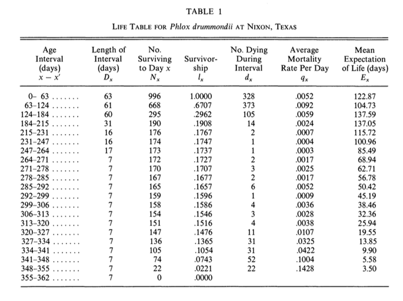

```{r setup, include = FALSE}
options(htmltools.dir.version = FALSE)
knitr::opts_chunk$set(echo = FALSE, fig.align = 'center', warning=FALSE, message=FALSE)
library(WILD3810)
library(gganimate)
```

## Readings

> Powell & Gale 103-122; 123-138  


---
## Life tables

#### If detection probability is $<1$  

- $N_x$ will be biased low  

- All other life table statistics will be biased as well

    + Survival biased low, mortality biased high

.left-column[
```{r, out.width="100%"}
knitr::include_graphics("https://upload.wikimedia.org/wikipedia/commons/f/f6/Phlox_drummondii_-_Archer_FL_02.jpg")
```
]

.right-column[
```{r, out.width="60%"}

```
]


---
class: inverse, middle, center

# Survival estimation

---
## Survival estimation

#### Methods used to estimate plant and animal survival generally fall into three categories:  

1) Known fate  

2) Capture-mark-recapture  

3) Recovery models  


---
class: inverse, middle, center

# Known fate

---
## Known fate

#### Location and fate (alive or dead) of every marked individual is known at each sampling occasion

- $\LARGE P_{det} = 1$


--
#### What types of data can be used for known fate analyses?

--
```{r out.width="50%"}
knitr::include_graphics("https://upload.wikimedia.org/wikipedia/commons/2/2a/Handheld_telemetry.jpg")
```


???
Image courtesy of Red Wolf Recovery Program, via Wikimedia Commons


---
## Known fate

#### Location and fate (alive or dead) of every marked individual is known at each sampling occasion

- $\LARGE P_{det} = 1$

#### What types of data can be used for known fate analyses?


```{r out.width="50%"}
knitr::include_graphics("https://upload.wikimedia.org/wikipedia/commons/2/2a/Handheld_telemetry.jpg")
```


???
Image courtesy of Red Wolf Recovery Program, via Wikimedia Commons

---
## Known fate

#### Location and fate (alive or dead) of every marked individual is known at each sampling occasion

- $\LARGE P_{det} = 1$

#### What types of data can be used for known fate analyses?


```{r, out.width="50%"}
knitr::include_graphics("https://upload.wikimedia.org/wikipedia/commons/f/f6/Phlox_drummondii_-_Archer_FL_02.jpg")
```


???
Image courtesy of Ebyabe, from Wikimedia Commons


---
## Known fate

#### Location and fate (alive or dead) of every marked individual is known at each sampling occasion

- $\LARGE P_{det} = 1$

#### What types of data can be used for known fate analyses?


```{r, out.width="50%"}
knitr::include_graphics("https://upload.wikimedia.org/wikipedia/commons/e/e8/%3F%3F_Vireo_nest_Huachuca_Canyon_Sierra_Vista_AZ_%2835488233510%29.jpg")
```


???
Image courtesy of Bettina Arrigoni, via Wikimedia Commons

---
## Known fate

#### Data

```{r}
library(kableExtra)
df <- data.frame(animal = c("Indv 1", "Indv 2", "Indv 3"),
                 ch = c("111", "110", "100"),
                 prb = c("\\(S_1 \\times S_2\\)", "\\(S_1 \\times (1-S_2)\\)", "\\(1-S_1\\)"))

names(df) <- c("Individual", "Capture history", "Probability")
df2 <- df
df2[,3] <- ""
df2 %>%
  kable("html", align = 'c', escape = FALSE) %>%
  kable_styling(bootstrap_options = c("striped", "hover", "condensed", "responsive"), full_width = TRUE) 
```

--

#### Individual 1

- Captured on occasion 1  

- Resighted alive on occasion 2  

- Resighted alive on occasion 3  

---
## Known fate

#### Data

```{r}
df3 <- df
df3[,3] <- c(as.character(df[1,3]), "", "")
df3 %>%
  kable("html", align = 'c', escape = FALSE) %>%
  kable_styling(bootstrap_options = c("striped", "hover", "condensed", "responsive"), full_width = TRUE) 
```


#### Individual 1

- Captured on occasion 1  

- Resighted **alive** on occasion 2  

- Resighted **alive** on occasion 3  

---
## Known fate

#### Data

```{r}
df3 %>%
  kable("html", align = 'c', escape = FALSE) %>%
  kable_styling(bootstrap_options = c("striped", "hover", "condensed", "responsive"), full_width = TRUE) 
```


#### Individual 2

- Captured on occasion 1  

- Resighted **alive** on occasion 2  

- Resighted **dead** on occasion 3  

---
## Known fate

#### Data

```{r}
df4 <- df
df4[,3] <- c(as.character(df[1,3]), as.character(df[2,3]), "")
df4 %>%
  kable("html", align = 'c', escape = FALSE) %>%
  kable_styling(bootstrap_options = c("striped", "hover", "condensed", "responsive"), full_width = TRUE) 
```

#### Individual 2

- Captured on occasion 1  

- Resighted **alive** on occasion 2  

- Resighted **dead** on occasion 3  

---
## Known fate

#### Data

```{r}
df %>%
  kable("html", align = 'c', escape = FALSE) %>%
  kable_styling(bootstrap_options = c("striped", "hover", "condensed", "responsive"), full_width = TRUE) 
```

#### Individual 3

- Captured on occasion 1  

- Resighted **dead** on occasion 2  

- Known **dead** on occasion 3  

---
## Known fate

#### Intuitively, 

$$\LARGE S_t = \frac{y_t}{n_t}$$

- $\Large y_t$: Number of individuals alive at the end of interval $\Large t$

- $\Large n_t$: Number of individuals at risk of dying during interval $\Large t$


--
### Who is at risk of dying? 

---
## Known fate

#### Who is at risk of dying?  

--
- Individuals who are **known** alive at the beginning of the interval  

--
    + Does not include individuals not yet marked (*staggered entry*)  

--
    + Does not include indivdiuals who's fates are unknown (*censoring*)

```{r fig.width=6, fig.height=4}
df <- data.frame(start = rep(0, 18),
                 indv = sample(1:18, size = 18),
                 end = c(3,3, 6,8,8,9,9,9,10,10,12, rep(Inf, 7)),
                 fate = c("Dead", "Dead", "Dead", "Dead", "Censored", "Dead", "Censored", "Censored", "Dead", "Censored", "Censored", rep("Alive", 7)))
df$start[c(3,8,13, 16)] <- c(2,1,4,2)
ggplot(df, aes(x = end + 0.15, y = indv)) +
  geom_segment(aes(x = start, xend = end, y = indv, yend = indv)) +
  geom_point(aes(shape = fate)) +
  scale_shape_manual(values = c(45, 63, 21)) +
  scale_x_continuous("Week", limits = c(0, 13)) +
  scale_y_continuous("Individual") +
  theme(axis.text.y = element_blank(), axis.ticks.y = element_blank())
```
---
## Known fate

#### Estimating survival

