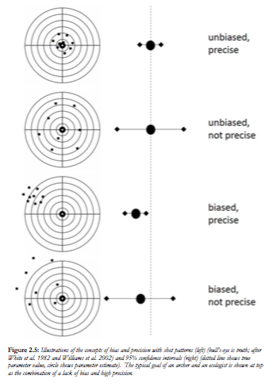

```{r setup, include = FALSE}
options(htmltools.dir.version = FALSE)
knitr::opts_chunk$set(echo = TRUE, fig.align = 'center', warning = FALSE, message = FALSE)
library(WILD3810)
```


In this homework assignment, you will become more familiar with using `R` and R Markdown to analyze and visualize data and report your results. To accomplish these goals, we will continue our discussion of estimating abundance using mark-recapture data.  

First, make sure you have:

> 1a) Changed the `author` field in the YAML header to your name;

> 1b) Changed the font size to 12 by adding `fontsize: 12pt` to the YAML header

> 1c) Clicked `Knit` to check that you can create a html document from the .Rmd file;

> 1d) Saved the .Rmd file as `LastnameFirstname-homework1.Rmd` in a directory named `LastNameFirstName-Homework1`

If you have any problems with these steps, be sure to get help from either the instructor or the TA

# Lincoln-Peterson is unbiased when sample sizes are large

When the number of individuals in the capture-recapture samples is large, the Lincoln-Peterson estimator returns an *unbiased* estimated of $N$. By unbiased, we mean that the Lincoln-Peterson estimator will *on average* match the true abundance of the population. It is important to note that bias applies to the average estimate - for any given sample, our estimate of $\hat{N}$ may be a little bigger or a little smaller than $N$. But if we took a large number of samples, we would get about the same number of low estimates as we get high estimates, so the average of all the samples would be $N$. 

```{r out.width="4in", echo=FALSE}

```

In most real-life scenarios, we only get to take a single sample of the target population so we never know if our estimate is a little bigger than $N$ or a little smaller than $N$ (that is why we estimate uncertainty - so we at least know the range of plausible values of $N$ given our data). However, we can use `R` to prove that the L-P estimator is unbiased by *simulating* a large number of samples from an imaginary population. 

## Simulating mark-recapture samples in `R`

To start, we will add a code chunk to set up the code for our simulation (since this is the first assignment, the chunk has already been added below. In the future, you will be asked to add the chunk yourself so now is a good time to remember how to do that)  

The key to using simulations is that we **know** the true values of all of the parameters in our model. In this case, the parameters are: $N$ (the true population size) and $p$ (the probability of capturing an individual in the population). In the code chunk below (named `Np` because it is the chunk we will use to set the values of $N$ and $p$; if you are reading this as the rendered HTML document, be sure to go back to the raw R Markdown file to complete the questions):

> 2a) Create an object called `N`, give it a value of 10000, and add a comment (using `#`) stating what the object represents

> 2b) Create an object called `p`, give it a value of 0.4, and add a comment (using `#`) stating what the object represents

```{r Np}

```

Now we need to tell `R` how many simulated samples we want to take. In the chunk below:

> 3) Create an object called `nSims`, give it a value of 1000, and add a comment (using `#`) stating what the object represents

```{r nSims}

```

The next step is a little more advanced. We need to simulate *random* samples of the population to generate values of $n1$, $n2$ and $m2$. To clarify what this means, imagine we wanted to simulate the number of heads we would get if we flipped a coin 10 times. We know the probability of getting a heads is $0.5$ but the actual number of heads might be any value between 0 and 10. In this case, the number of heads follows a *binomial* probability distribution. The binomial distribution requires two parameters, the number of "trials" (the number of coin flips or, in our case $N$) and the probability of "success" (heads or in our case capture). 

```{r echo = FALSE}

binom_df <- data.frame(x = seq(0, 20, 1),
                       y = dbinom(seq(0, 20, 1), 20, 0.5))

ggplot(binom_df, aes(x, y)) + 
  geom_path(color = WILD3810_colors$value[WILD3810_colors$name=="primary"], size = 1) +
  scale_x_continuous("Number of heads out of 20 coin flips") +
  scale_y_continuous("Probability")
```

In `R`, we can simulate random values from a binomial distribution using the `rbinom()` function. This function requires 3 arguments: `n` - the number of simulated values (in this case, `nSims`), `size` - the number of trials, and `p` - the probability of success. For example, to generate values of `n1` we use the following code: 

```{r n1}
n1 <- rbinom(n = nSims, size = N, prob = p)
```

Notice that in this case, we are sampling from the total population so `size = N`. When you run this line, you will get `r nSims` random values of `n1`. 

> 4a) How many individuals do you expect to capture in $n1$? Type your answer below in bold (hint: use double asterisks before and after text to make it **bold**)

> 4b) In the chunk below, use the `mean()` function to see if the average of the randomly generated values is close to the expected value (If you need help with this function, use `?mean()` to see the help documentation) 

```{r mean_n1}

```

Simulating $n2$ is a little harder because, in theory, we need to know which of the $n2$ individuals was marked in our previous sample. Since we are not keeping track of individuals, we'll generate $n2$ in a slightly round about way. First, we'll simulate $m2$, that is, the number of marked individuals that we recapture on the second occasion. 

> 5) In the chunk below, remove the comment symbol and then fill in the correct size needed to generate the values of $m2$ (hint: we are not sampling $m2$ from the total population but from the marked population) then run the code 

```{r m2}
# m2 <- rbinom(n = nSims, size = , prob = p)
```

On the second occasion, we also capture some unmarked individuals so we need to simulate those values as well (we'll call that sample `nm2` for "not marked")

> 6) In the chunk below, remove the comment symbol and then fill in the correct size needed to generate the values of $nm2$ (hint: we are not sampling $nm2$ from the total population but from the *unmarked* population) then run the code 

```{r nm2}
# nm2 <- rbinom(n = nSims, size = , prob = p)
```

Now we can get $n2$ by adding `m2` and `nm2` (remember how adding vectors works in `R`!)

> 7) Create a new object called `n2` that is the sum of `m2` and `nm2`

```{r n2}

```

Finally, we have everything we need to estimate $\hat{N}$. 

```{r Nhat}
# Nhat <- (n1 * n2) / m2
```

Because $N$ is very big (`r N`), our `Nhat` estimates should *on average* be unbiased. We can test this by taking the mean of all `r nSims` estimates (which should be very close to $N$) and by taking the ratio of this mean to the true value (which should be 1 if the estimator is unbiased):

```{r mean_Nhat}
# mean(Nhat)
# mean(Nhat)/N
```

We can also visualize this by plotting a histogram showing all of our `Nhat` estimates along with the mean and true value. A quick way to do this in `R` is using the `hist()` and `abline()` functions (we'll learn more advanced ways to plot data in the next lab):

```{r Nhat_hist}
# hist(x = Nhat, breaks = 100)
# abline(v = N, col = "blue")
# abline(v = mean(Nhat), col = "red")
```
As expected, our estimates appear to be unbiased (though note how much variation there is around the true value of $N$! Even when all of the assumptions of L-P are met, we would still over- or under-estimate $N$ by 4-5%!)


# Lincoln-Peterson is biased when sample sizes are small

Now that we have the code needed to simulate data to analyze with the L-P estimator, it's easy to explore the well-known bias in the model when sample sizes are small. By biased, we mean that an estimator will systematically *overestimate* or *underestimate* the true value. We'll explore bias in the L-P estimator by continuing the simulation exercise:

> 8a) Take the code you used above and copy it into a single code chunk below

> 8b) Now change $N$ to 50 and run the code

```{r LP2}


```

> 8c) Based on the metrics and visualizations created by this code, do you think L-P overestimates or underestimates abundance as sample size gets smaller and smaller? Type your answer below in bold

The reason for bias in L-P can more easily be understood through a simple example (borrow from Powell 2015 pg 95). Imagine you have 10 white balls in a hat ($N=10$) and draw 4 randomly ($p = 0.4$). You mark these 4 and return them to the bag. If you draw 4 new balls, you *expect* to get $0.4 \times 4 = 1.6$ marked balls. But that's impossible! Because the sample size is so small, $m2/n2$ can only be 0%, 25%, 50%, 75%, or 100%. So if $m2 = 2$, $\hat{N} = \frac{4 \times 4}{2} = 8$. If $m1 = 1$, then $\hat{N} = \frac{4 \times 4}{2} = 16$. If $m2 = 0$, we can't even estimate $N$! 

# The Chapman modification

Chapman (1951) proposed a modified version of the L-P estimator that is unbiased even when sample sizes are small:

$$\hat{N} = \frac{(n_1+1) \times (n_2+1)}{m_2 + 1} - 1$$

Let's see if it works. The below code should use your previously created `n1`, `n2`, and `m2` samples  to calculate new estimate of $\hat{N}$ using the Chapman modification:

```{r chapman}
# Nhat <- (n1 + 1) * (n2 + 1) / (m2 + 1) - 1
```

> 9) In the chunk below, estimate the new mean of the $\hat{N}$ estimates and the ratio of this new mean ot the true $N$. Also create a new histogram showing the $\hat{N}$ estimates based on the Chapman modification along with the true value and mean of the estimates. According to these metrics, did bias get larger or smaller using the Chapman modifcation? Type your answer in bold below the chunk.

```{r mean_chapman}
```

Now let's make the population size really small. In the chunk below, copy the code needed to simulate the L-P data but this time set `N <- 10` and use the Chapman modification to estimate the $\hat{N}$s. 

```{r chapman2}

```

> 10) If this was a real study, would you trust these estimates of $N$? Why or why not? For a population this small, what alternative methods might you use to estimate population size? Write your answers below in bold. 
