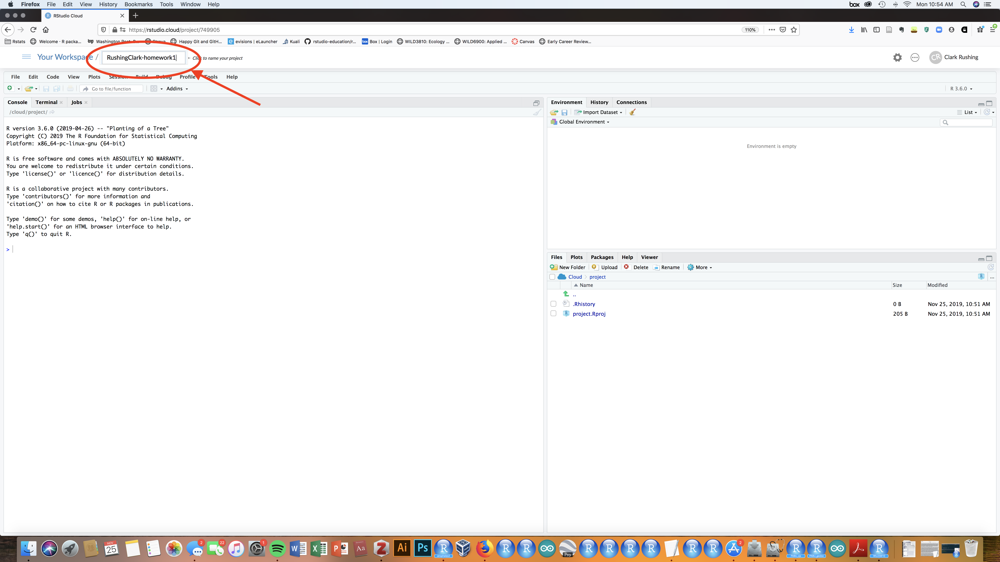
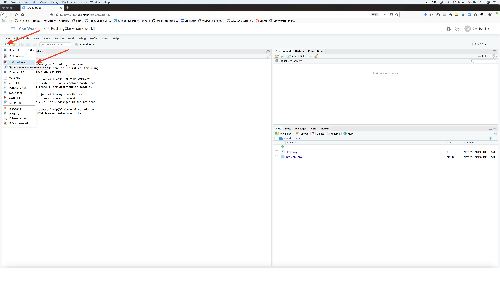
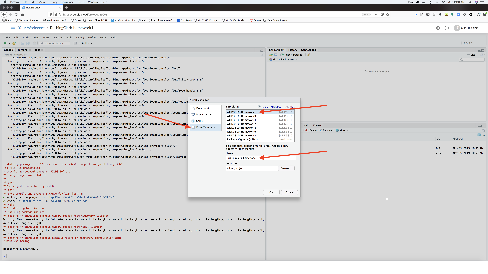
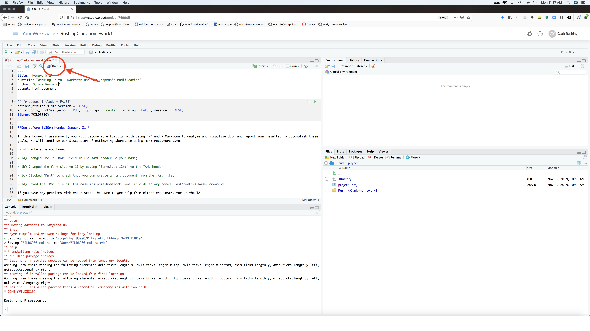
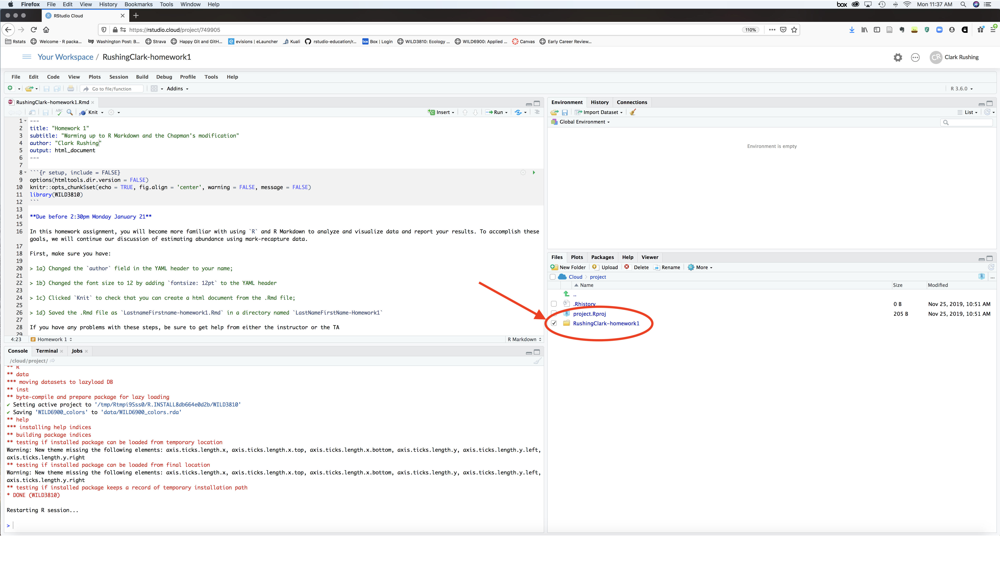
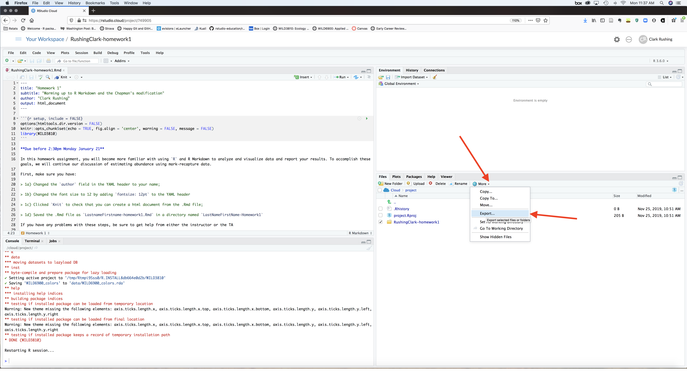
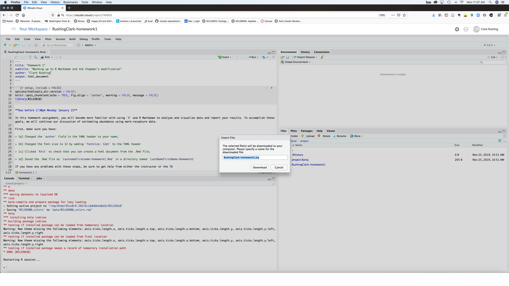
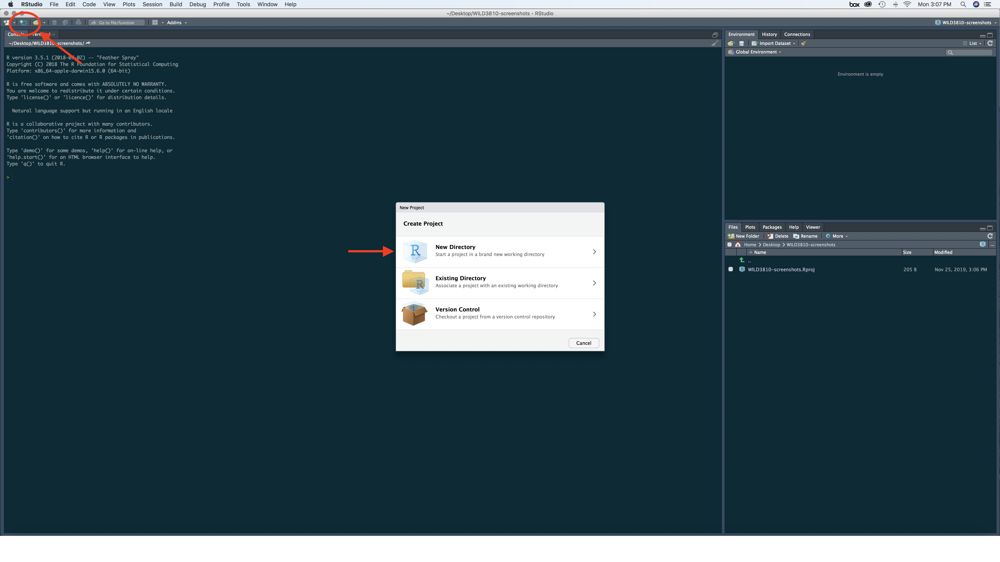
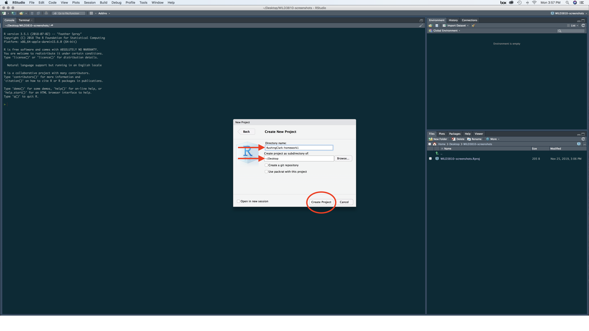

```{r setup, include = FALSE}
knitr::opts_chunk$set(
  collapse = TRUE,echo = FALSE, out.width = "600px",
  comment = "#>"
)
```

All homework assignments for this course will be completed R Markdown files. To make the distribution, completion, and grading easier, each homework will follow the same workflow. Detailed instructions for creating and submitting homeworks assignments depend on whether you are using RStudio Cloud or a local installation of RStudio. **Assignments that fail to follow this instructions will not be graded**

# Homework steps for RStudio Cloud

### Step 1: Create a new project to complete the homework assignment

1a) Create a new project 

```{r }
knitr::include_graphics("figs/New_project.png")
```

1b) Name the new project `LastNameFirstName-Homework#`, replacing `LastNameFirstName` with your last and first names and `#` with the appropriate homework number

```{r}

```

### Step 2: Create a new R Markdown file using the homework template

2a) Click on `File -> New File -> R Markdown...`

```{r}

```

2b) In the window on the left, select `From Template`. Scroll down through the options until you see `WILD3810-Homework#` (where `#` will be the appropriate homework number). Select that template. In the `Name:` window type `LastnameFirstname-homework#`, substituting your last and first names and the correct homework number. In the `Location` window, navigate to your newly create `LastNameFirstName-Homework#` directory

```{r}

```

2e) Click `Ok`

### Step 3: Complete the assignment

3a) Change the `author: YOUR NAME HERE` field in the header to your name. 

3b) Work your way through the entire document, following the instructions as you go

### Step 4: Submit your assignment

4a) Before submitting your assignment, always click the "Knit" button to be sure your .Rmd file can be rendered as a html file. **If you have any problems rendering the file, please contact me or the TA prior to the submission deadline.**

```{r}

```

4b) Once you know your file can be rendered, check the box next to the `LastnameFirstname-homework#` folder in the `Files` window

```{r}

```

4c) On the toolbar at the top of the `Files` window, select `More -> Export`

```{r}

```

4d) Click `Download` and then select a location to save the files

```{r}

```

4e) Unzip the downloaded file

- **Windows**: press and hold (or right-click) the `LastnameFirstname-homework#.zip` folder, select Extract All, follow the instructions

- **Mac**: double click the `LastnameFirstname-homework#.zip` file)

4f) Upload **both** the `LastnameFirstname-homework#.Rmd` *and* the `LastnameFirstname-homework#.html` files to Canvas under the correct assignment folder


# Homework steps for local installation of RStudio

### Step 1: Create a new project to complete and store your homework files

1a) Open RStudio

1b) Create a new RStudio project by clicking on the icon at the top left of the RStudio toolbar. Select `New Directory`

```{r out.width="600px"}

```

1c) On the next dialog box, select `New Project`

```{r out.width="600px"}
knitr::include_graphics("figs/new_project-local2.png")
```

1d) Name the project `LastNameFirstName-Homework#`, replacing `LastNameFirstName` with your last and first names and `#` with the appropriate homework number and select a location for the project to be saved. Click `Create Project`


```{r out.width="600px"}

```

### Step 2: Create a new R Markdown file using the homework template

2a) Click on `File -> New File -> R Markdown...`

```{r}

```

2b) In the window on the left, select `From Template`. Scroll down through the options until you see `WILD3810-Homework#` (where `#` will be the appropriate homework number). Select that template. In the `Name:` window type `LastnameFirstname-homework#`, substituting your last and first names and the correct homework number. In the `Location` window, navigate to your newly create `LastNameFirstName-Homework#` directory

```{r}

```

2e) Click `Ok`

### Step 3: Complete the assignment

3a) Change the `author: YOUR NAME HERE` field in the header to your name. 

3b) Work your way through the entire document, following the instructions as you go

### Step 4: Submit your assignment

4a) Before submitting your assignment, always click the "Knit" button to be sure your .Rmd file can be rendered as a html file. **If you have any problems rendering the file, please contact me or the TA prior to the submission deadline.**

```{r}

```

4b) Once you know your file can be rendered, upload **both** the `LastnameFirstname-homework#.Rmd` *and* the `LastnameFirstname-homework#.html` files to Canvas under the correct assignment folder
