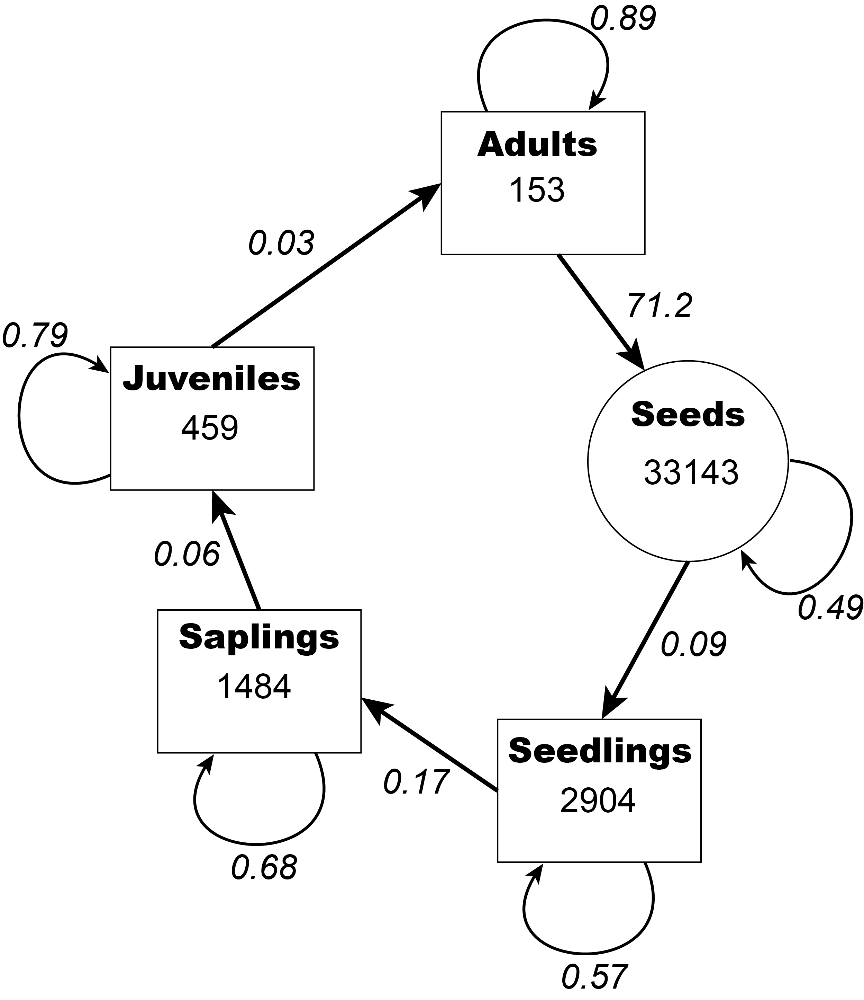

```{r setup, include = FALSE}
knitr::opts_chunk$set(
  collapse = TRUE,
  comment = "#>", 
  warning = FALSE, 
  message = FALSE,
  fig.align = 'center'
)
library(WILD3810)
```

In this lab, you will continue to learn about the application of matrix population models to natural resource management. You will use demographic rate estimates to build a matrix model and to explore how harvest of seeds and adult influences the population dynamics of a long-lived tree. Your goal will be to set harvest limits that allow for sustainable use of the trees by multiple users.

***
**Objectives**

* Use functions from the `popbio` package to learn about the ecology of a commercially important tree species

* Conduct a sensitivity analysis and simulations to make management recommendations to allow sustainable harvest of seeds and adults

* Practice visualizing data using `ggplot2`

* `R` functions used in this exercise:  
    + `popbio::lambda()`
    + `popbio::elasticity()`
    + `popbio::reproductive.value()`
    + `popbio::stable.stage()`
    + `popbio::generation.time()`

***

# Set up

1) Log in to R Studio Cloud

2) Create a new project called `LastnameFirstname-Lab7`

3) Create a new R Markdown file from the Homework-7 template:

    3a) Click `File -> New File -> R Markdown`  
    
    3b) Click `From Template` and scroll down to `WILD3810-Homework7`  
    
    3c) In the `Name` box, type `LastnameFirstname-Homework7`  
    
    3d) Click `Ok`

4) Ensure that you can `Knit` the file

    4a) Change "YOUR NAME HERE" in the header section to your name  
    
    4b) Click `Knit` to make sure you can knit the .Rmd file  
    
5) Complete the assignment as directed in the .Rmd file

6) Follow the [instructions for submission](https://rushinglab.github.io/WILD3810/articles/homework.html) to upload your completed assignment to Canvas
    
***

**Note**: This homework assignment is another written assignment. As for the first writing assignment, you can receive 4 bonus points by incorporating feedback from the science writing center into your final version

***

In this lab, we'll examine the dynamics of a commercially-important but imaginary species of palm tree, *Thrinax imaginarium*. *T. imaginarium* is a tropical palm found throughout Central America and parts of the Caribbean. The large, edible seeds are an important source of food for many local communities throughout its range and are collected for both consumption and sale. Over-harvest of seeds in some areas has led to concern about the sustainability of this practice and some local governments are now considering limits on the number of seeds that can be collected each year. 

Adult trees were also an important source of wood for building homes and as fuel for cooking fires, though in recent years demand for wood has grown as construction of large buildings and resorts has increased. Increased harvest of adult trees has added to concerns about population viability and has led to calls for limits on the number of adult trees that can be cut. Of course, competition between timber operations and seed collectors has led to conflict, with both groups blaming the recent declines in *T. imaginarium* abundance on the other.

```{r echo = FALSE, out.width="75%", fig.cap="*Thrinax radiata*, a real palm that is closely related to the made up species *Thrinax imaginarium*. Photo courtesy of Drew Avery via Wikicommons"}
knitr::include_graphics("https://upload.wikimedia.org/wikipedia/commons/c/cc/Thrinax_radiata_1.jpg")
```

As a leading expert on tree demography and silviculture, you have been asked by a government agency to come up with sustainable harvest limits for both seeds and adult trees of *T. imaginarium*. You will use available demographic data to build a matrix model for *T. imaginarium*, explore the effects of different harvest regimes, and write a report with recommendations that allow both local communities and timber operations to sustainably benefit from this resource.

## Demography of *Thrinax imaginarium*

To write your report, you will rely mainly on published estimates of *T. imaginarium* demography. Several studies have published demographic rates for the species and at least one study reported the age distribution of a single *T. imaginarium* population. This information is summarized in the figure below. 

```{r echo = FALSE, out.width="75%", fig.cap="Demography of *Thrinax imaginarium* life stages. Values inside the circle/squares are the observed number of individuals in each stage class from a single demographic study of the species. Values next to the arrows are the estimated transition probabilities for each stage"}

```

In the chunk named `demography` in the homework template, translate these demographic rates into a matrix object. Call that object `A`. 

## Ecology of *Thrinax imaginarium*

During the last lab, we calculated several properties of a demographic matrix by hand, including the asymptotic growth rate and stable stage distribution. Fortunately, there is an `R` package called `popbio` that will do these calculations (and many more) for us. For example, you can calculate $\lambda$ and the stable stage distribution of the matrix you just created using: 

```{r eval = FALSE}
library(popbio)
lambda <- lambda(A)
ssd <- stable.stage(A)
```


The `popbio` package has a number of other useful functions, for example estimating the reproductive value of each stage and the generation time of a population:

```{r eval = FALSE}
rv <- reproductive.value(A)
gt <- generation.time(A)
```

***
**Look at the output from the functions above. What can you say about the ecology and life history of this species from this information?**  

***

## Sensitivity and elasticity 

In lecture, we learned about the concepts of *sensitivity* and *elasticity*. Remember that sensitivity is the change in $\lambda$ caused by a small change in a vital rate and can be estimated analytically using:

$$\Large s_{i,j} = \frac{\delta \lambda}{\delta a_{i,j}} = \frac{v_iw_j}{\sum_{k=1}v_kw_k}$$

We also learned how to do this by hand but luckily that's not necessary. We can instead use:

```{r eval = FALSE}
sens <- popbio::sensitivity(A)
```

As we saw in lecture, sensitivity is not always the most useful metric for understanding which vital rates are most important for influencing $\lambda$. Instead, most natural resource management studies focus on elasticity, which is the change in $\lambda$ caused by a small *proportional* change in a vital rate. As you probably guessed, `popbio` also does this calculation:

```{r eval = FALSE}
elas <- popbio::elasticity(A)
```

***
**Based on the estimated elasticities, which vital rates do you expect to have the biggest influence on population growth of *T. imaginarium*?**  

***

### Simulating the effects of harvest

To examine the effects of seed and adult harvest, you will simulate 50 years of population dynamics of a *T. imaginarium* population with different levels of seed collection and adult tree harvest. In the homework template, there is a chunk named `sim_params` where you can adjust three parameters: the number of seeds collected each year (`s`), the number of adult trees harvested each intervals (`h`), and the length of the adult harvest interval (`harvest.interval`; 1 = annual harvest, 2 = every other year, 3 = every third each, etc.). **Initial values for each parameter are provided but you will need to change these by trial and error to find a combination that achieves the state management objectives**

Next, you will need to complete the code in the chunk named `simulation`. The first few lines are completed for you, these set the number of years in the simulation, create matrices to store the annual abundances and harvest, and a data frame to keep track of how many seeds/adults are harvested in each year. You will need to do the following before running the code:

1) Create a vector object called `n0` that contains the initial abundance for each stage

2) Assign the first column of the `N` matrix to be the `n0` vector

3) In side the `for` loop, fill in the code necessary to project abundance each year. To incorporate harvest, note that:
  
  $$\large N_{t} = A \times N_{t-1} - H_{t-1}$$

4) Change `eval = FALSE` to `eval = TRUE` in the chunk options

5) Fill the `ggplot2` code in the `adult.fig` and `seed.fig` chunks to visualize the number of adult trees and seeds in each year

6) Change  `eval = FALSE` to `eval = TRUE` in the `adult.fig` and `seed.fig` chunk options

***
**Based on your understanding of matrix algebra, think about what's happening in the equation above. What type of object is H? What are its dimensions? What are its values?**

**Based on the equation, are individuals harvested before or after reproduction?**

***

Notice that after running the simulation there are several lines of code that calculate the average annual growth rate of the population for the final 6 years of the simulation (to avoid any transient dynamics early in the simulation) and the total profit made through each harvest. The timber operation nets \$10 per tree while seeds net \$0.05 per seed. Once you have completed all of the above steps, you should be able to knit the document. When you do so, you should see the figure with the number of adult trees and seeds in each year. The title of each plot also provides information on the total revenue of each harvest. 

## Decision context

For this assignment, you will need to choose the harvest limit (`h`), harvest interval (`harvest.interval`), and seed collection limit (`s`) to accomplish three competing goals: 

1) ensure long-term persistence of the *T. imaginarium* population;

2) maximize profit from the timber harvest (but not at the expense of goals 1 & 3)

3) maximize profit from the seed collection (but not at the expense of goals 1 & 2)

To make this recommendation, you can change `h`, `harvest.interval`, and `s` by trial and error until you find levels that in your judgement meet the stated goals. Use these results to provide a recommendation for which management actions should be taken. Note that there is no specific mandate for relative profits from adult harvest vs. seed collection so you will need to decide what a fair balance looks like. This decision needs to be stated explicitly, though as long as you provide a reasonable rationale there is no wrong answer. 

Use the code chunks in the homework 7 template to complete all code necessary to make your recommendation. Use the same outline that you used for homework 4 to structure your recommendation. In particular, be sure your recommendation includes:

- a description of the management challenge

- the specific objectives you are addressing

- a brief description of the ecology of *T. imaginarium* based on your analysis of the matrix model  

- a **specific** management recommendation, including a rationale for the relative profits from seed vs. adult harvest

- an interpretation of how the ecological properties of the  *T. imaginarium* population (e.g., generation time, elasticities, reproductive values) relate to the ability to sustainably harvest adults and seeds

- figures visualizing the predicted trajectories for adults and seeds under the recommended harvest limits

- potential limitations and/or risks of your recommendation (including reasons it might not work as predicted)

As you put together your report, here are a few tips:

- each time you change `h`, `harvest.interval`, or `s` note the values of each parameter and the resulting $\lambda$ and profits. Keeping notes of each change will help you figure out which combination leads to the best outcomes

- The code automatically creates a number of objects that store information useful for the report (including `lambda`, `elas`, `gt`, `timber.profit`, `timber.profit`, `h`, `harvest.interval`, and `s`). Remember that you can insert these objects into the text of your report using, for example, `` `r "\u0060r timber.profit\u0060"` ``. When you knit the document, that code will display the value of `timber.profit`, saving you a lot of typing. Even better, if you change the values of  `h`, `harvest.interval`, or `s`, the report will reflect those change when you knit so you don't have to retype those values. 


