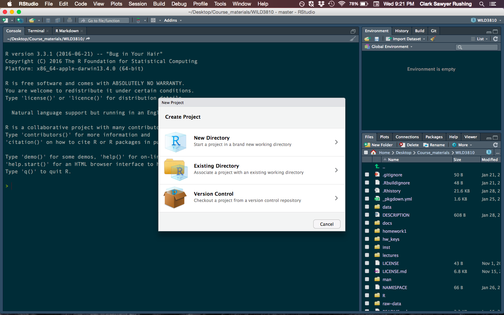
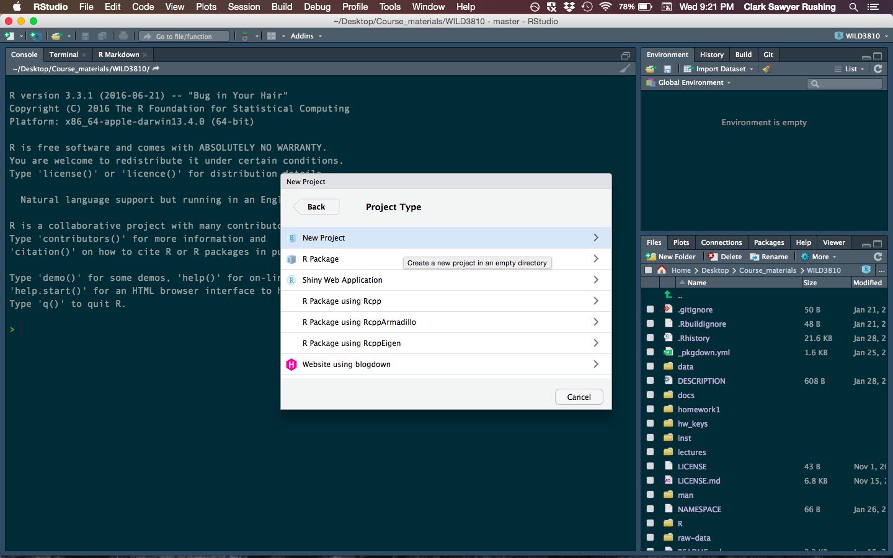
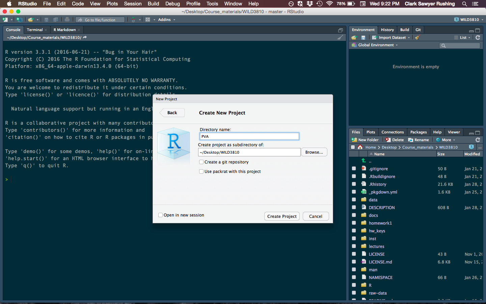
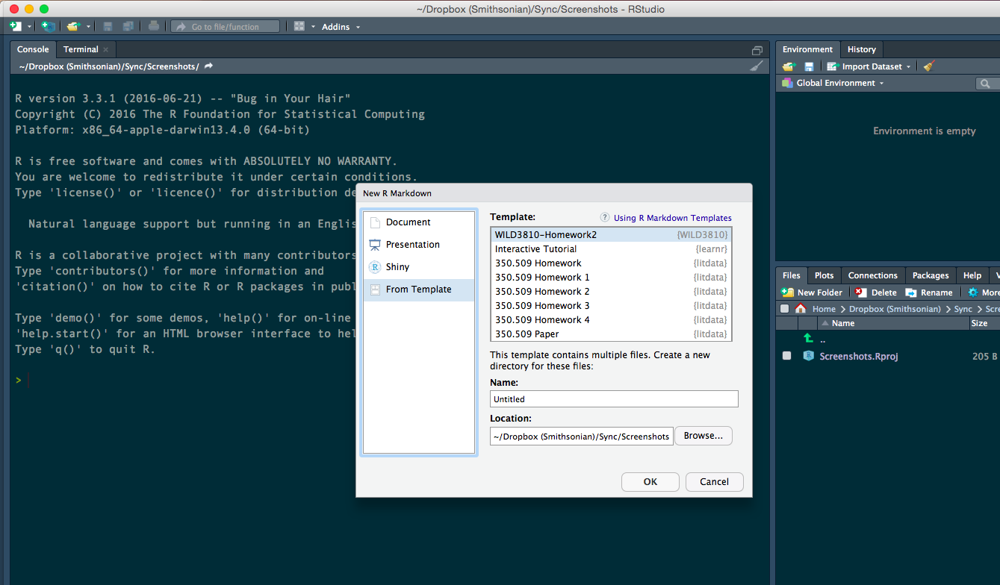
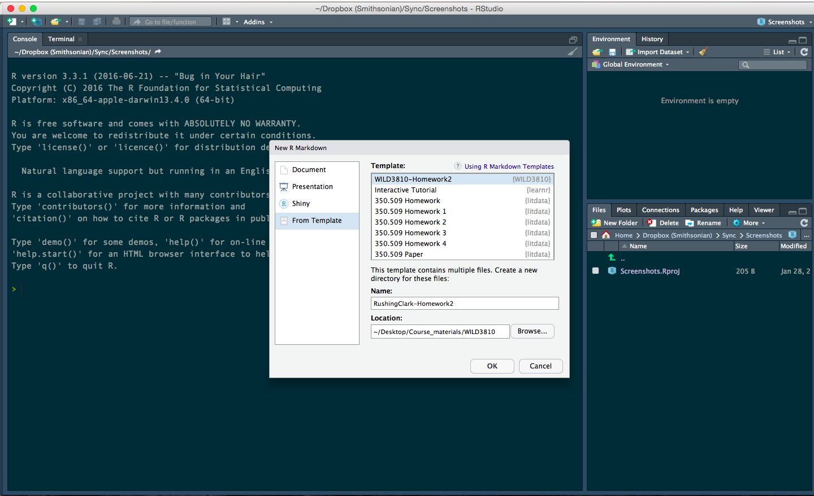

```{r setup, include = FALSE}
knitr::opts_chunk$set(
  collapse = TRUE,
  comment = "#>", 
  warning = FALSE, 
  message = FALSE
)
library(WILD3810)
```

In this lab, you will build a matrix population model from published demographic data. This lab will help get you started on how to build the matrix and explore its properties. You will then complete the exercise as part of this week's homework assignment. If you complete the entire assignment during lab, that is fine. Otherwise, you will need to complete the assignment on your own. 

***
**Objectives**

* Build a matrix population model using published demographic data

* Practice adding data to a matrix using `for` loops

* Practice visualizing data using `ggplot2`

* `R` functions used in this exercise:  
    + `matrix()`
    + `rowSums()`
    
***

## Setting up the lab

In order to organize your code and files for this homework assignment, start by creating a new project:

1) Open `RStudio`

2) Click `File -> New Project`

```{r out.width="100%", echo=FALSE}
knitr::include_graphics("figs/new_file.png")
```

3) Click `New Directory`

```{r out.width="100%", echo=FALSE}

```

4) Click `New Project`

```{r out.width="100%", echo=FALSE}

```

5) Name the project `matrix_model` and create it within your `WILD3810` folder (click `Browse` and navigate to this folder if necessary)

```{r out.width="100%", echo=FALSE}

```

6) Click `Create project`

7) Click `File -> New File -> R Markdown`

```{r out.width="100%", echo=FALSE}
knitr::include_graphics("figs/new_file.png")
```

8) Select `From Template`; scroll down and select `WILD3810-Homework5`

```{r out.width="100%", echo=FALSE}

```

9) In the `Name` box, type `LastnameFirstName-Homework5`

```{r out.width="100%", echo=FALSE}

```

10) Click `Ok`

11) Make sure you have the most update-to-date version of `WILD3810` by running:

```{r eval = FALSE}
install.packages("devtools", dependencies = TRUE)
devtools::install_github("RushingLab/WILD3810")
```

***

**Note**: You will use the homework 5 template to complete the rest of this lab activity. You can copy the code below to your assignment template to start the assignment. However, you **do not** need to copy code the prints objects, only the code the creates or manipulates the objects.

***

## Modeling the dynamics of Brown-headed cowbirds

The Brown-headed cowbird (*Molothrus ater*) is a songbird native to the short-grass prairies of North America. Although historically restricted to small patches of suitable prairie, expansion of agriculture and conversion of forested habitats into fragmented, open landscapes allowed cowbird populations to expand and increase dramatically over the past two centuries. 

```{r echo = FALSE, out.width="75%", fig.align='center', fig.cap="Male Brown-headed cowbird. Photo courtesy of http://www.naturespicsonline.com/  via Wikicommons"}
knitr::include_graphics("https://upload.wikimedia.org/wikipedia/commons/9/9f/Brown-Headed_Cowbird.jpg")
```

Growth and expansion of cowbird populations has been detrimental many other native songbirds because cowbirds are nest parasites. Female cowbirds lay their eggs in the nest of at least 220 other species, letting the host parents incubate the eggs and raise the offspring. Without the need to build a nest or tend to their young, this strategy allows cowbirds to lay up to 40 eggs in a single season. Additionally, cowbird eggs often have a shorter incubation period than most of their hosts, allowing the newly hatched cowbirds to out compete the host offspring (newly hatched cowbirds can even push the unhatched host eggs out of the nest!). Although species that evolved alongside cowbirds often have defenses to protect their nest and eggs against cowbird parasitism, species that have encountered cowbirds only after their expansion often suffer near total reproductive failure. In fact, parasitism by cowbirds has been one of the primary threats to several endangered species, including Kirtland's warblers (*Setophaga kirtlandii*), Golden-cheeked warblers (*Setophaga chrysoparia*), and Black-capped vireos (*Vireo atricapilla*). As a result, cowbirds have been the target of intense management efforts to reduce their populations since at least the 1970's.  

```{r echo = FALSE, out.width="45%", fig.align='center', fig.cap="Brown-headed cowbird egg in the nest of an Eastern Phoebe. Photo courtesy of Frankie Rose  via Wikicommons"}
knitr::include_graphics("https://upload.wikimedia.org/wikipedia/commons/2/29/Cowbird_egg.JPG")
```

### Brown-headed cowbird vital rates

Due to the management focus that cowbirds have received over the past several decades, a number of studies have measured their survival and fecundity. Luckily for us, these data were compiled by several researchers that were interested in creating a matrix population model for the species[^1]. The table below contains the average, high, and low estimates from published studies of relevant cowbird vital rates:

[^1]: Data used in this project are from Citta, J. J., & Scott Mills, L. (1997). What do demographic sensitivity analyses tell us about controlling brown-headed cowbirds?. *Studies in Avian Biology*, 18, 121-134.

```{r echo = FALSE}
library(kableExtra)

bhco_vr <- data.frame(vr = c("Adult Fecundity", "Yearling Fecundity", "Egg survival", "Nestling survival", "Yearling survival", "Adult survival"),
                      Average = c(13.8, 11.2, 0.38, 0.64, 0.24, 0.47),
                      High = c(0.8, NA, 0.68, 0.76, 0.32, 0.63),
                      Low = c(0.51, NA, 0.08, 0.46, 0.15, 0.31))

names(bhco_vr)[1] <- "Vital rate"
kable(bhco_vr, align = "c", format = 'html') %>%
  kable_styling(full_width = F) %>%
  footnote(number = c("Fecundity is the number of female eggs laid each year, assuming 50:50 sex ratio ", 
                      "Egg survival is the probability that eggs survive from laying to hatching",
                      "Nestling survival is the probability that nestlings survive from hatching to fledging",
                      "Yearling survival is the probability that juveniles survive from fledging to the following breeding season")
           )
```

You will use these estimates to build a matrix population model for cowbirds. 

### Estimating relevant vital rates 

Your goal is to convert the values in the above table into the relevant entries of a matrix that describes age-specific cowbird demographic rates. 

Before you can do that, you need to determine what age/stage classes are relevant to the matrix and which vital rates you will need to estimate to fill in the matrix elements. The data we are using assume that the population is monitored annually during the breeding season and therefore we obtain counts of eggs and adults. This means that we need to model the population using **annual rates**. However, the first year of life includes three stages: egg, nestling, and yearling (this is why the table above includes vital rates for each of those three stages). 

***

**Before moving on, answer questions 1a & 1b on the homework file**

***

To create the matrix, you will need to take the vital rates in the table above (for now, just use the average rates) and combine them to create the relevant matrix elements. In the chunk called `bhco_mat`, write the necessary code to create the matrix values based on your answers to 1a and 1b.

### Creating matrices in `R`

Next, you will need to create the matrix. So far in this class, we have learned to create vector objects and data frames. For this lab, we will need to create a different type of object - matrices. Creating a matrix can be done using the `matrix()` function. This function takes a vector that includes all of the values that make up the matrix (remember - to create a vector, use the `c()` function) as well as the number of rows and columns that define the matrix. For example:

```{r echo = TRUE}
(A <- matrix(c(0, 2, 4,
              0.25, 0, 0,
              0, 0.5, 0), nrow = 3, ncol = 3, byrow = TRUE))
```

Notice that the values within the `c()` function form a single vector even though I entered the values on three lines. Putting them on different lines is not necessary but does make it easier to keep track of how the final matrix is organized (in this case, a $3x3$ matrix with values `0, 2, 4` on the first row, `0.25, 0, 0` on the second row, and `0, 0.5, 0` on the third row). One important behavior of this function is that by default, `matrix()` will create the matrix *by column*. We entered our data as rows so we need to specify `byrow = TRUE`. If we did not use this option, we would get:

```{r echo = TRUE}
(A <- matrix(c(0, 2, 4,
              0.25, 0, 0,
              0, 0.5, 0), nrow = 3, ncol = 3))
```

Not the matrix we wanted! Be very careful about this option when you are creating matrices of your own. 

In your homework template, enter the code necessary to create a matrix describing the demographic rates of Brown-headed cowbirds and answer question 2. **Note that your code should not be placed inside of parentheses like the code above. This is done so that the resulting matrix was printed to the console when created. You do not need to print the matrix in the homework template**

## Projecting the matrix

With the matrix now created, you can predict the future dynamics of the hypothetical cowbird population. To start, let's assume that in the first year there are 5000 individuals. Within those 5000 individuals, we will randomly generate initial sizes within each stage. To do that, we'll first determine the number of eggs:

```{r eval = FALSE}
N1 <- ?
eggs1 <- round(runif(n = 1, min = ?, max = ?), digits = ?)
```

Copy the above code into the chunk called `init_N` and replace the question marks with the correct values. Next, calculate the number of adults (replacing the question mark with the correct values):

```{r eval = FALSE}
adults1 <- ?
```

To make our projection easier to keep track of, we'll store the annual stage-specific abundances in another matrix. You will need to determine the number of years for your simulation and then create an empty matrix to store the abundances:

```{r eval = FALSE}
nYears <- ?
  
N <- matrix(NA, nrow = ?, ncol = 2)
```

Now assign the first column the initial abundances you created above:

```{r eval = FALSE}
N[1, 1] <- eggs1
N[1, 2] <- adults1
```

Now you are ready to simulate future population sizes. You will need to do this using a `for` loop. Remember that:

$$\large \mathbf N_{t + 1} = \mathbf A \times \mathbf N_t$$

where $\mathbf N_{t}$ is the matrix containing the current stage-specific abundance and $\mathbf A$ is the population matrix. 

***

**Matrix multiplication in `R`**: To do matrix multiplication in `R`, you will need a special function: `%*%`. Remember to put your matrices in the correct order! ($\mathbf A \times \mathbf N$ is **not** the same as $\mathbf N \times \mathbf A$) 

***

Complete the code below to run your loop:

```{r eval = FALSE}
for(t in ?:?){
  N[,t] <- ?
}
```

## Examining the growth of brown-headed cowbirds

Now that you have projected population size, you can examine the dynamics of this population. 

### Transient dynamics

Because we started the population at a random stage distribution, your population likely underwent some period of transient dynamics. To examine how long these dynamics lasted, you first need to create a data frame with the stage-specific abundances:

```{r eval = FALSE}
N_df <- data.frame(Year = 1:nYears,
                   N = c(N),
                   Stage = rep(c("Eggs", "Adults"), each = nYears))
```

Now complete the following code to plot the **log of N** for each stage:

```{r eval = FALSE}
ggplot(?, aes(x = ?, y = ?, color = ?)) + geom_?()
```

After you have made the plot, answer question 3 in the homework.

### Stable stage distribution

Using either the `N` matrix you can also estimate the stable stage distribution. One way to estimate the stage distribution in each year is to divide the `N` matrix by the total annual population sizes. To do this, first create the total population size in each year:

```{r eval = FALSE}
N_tot <- rowSums(N)
```

At this point in the semester, you should be able to do the rest without any starter code. In your homework template, create the code necessary to estimate the stage distribution in each year and answer questions 4a & 4b.

### Asymptotic $\large \lambda$

Next, estimate the asymptotic growth rate. To do this, you will need to create an empty vector to store the annual $\lambda$ value for each year and then fill in the values using a `for` loop. In the homework template, complete the following code:

```{r eval = FALSE}

lambda_df <- data.frame(Year = 1:?,
                        lambda = numeric(length = ?))

for(t in ?:?){
  ?
}
```

Next, use `ggplot2` to create a line graph showing how the annual $\lambda$ values changed across time. Again, at this stage you should be able to do that without starter code. 

### Population inertia

Now that you know the SSD for this population, simulate the dynamics of a second population that also starts with 5000 individuals but at the SSD. Copy the necessary code from above but change the initial values to match the SSD you estimated above (also change the names of the objects you create!). Then complete the code below to visualize the resulting population growth:

```{r eval = FALSE}
N_ssd_df <- data.frame(Year = 1:nYears,
                       N = c(N_tot, N_tot_ssd),
                       Initial = rep(c("Random", "SSD"), each = nYears))
```

Finally, use `ggplot2` to plot the log population size across years for each simulated population. Make sure the color of each line corresponds to the initial conditions and then answer questions 6a-6c. 

