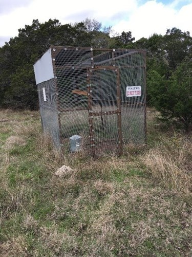
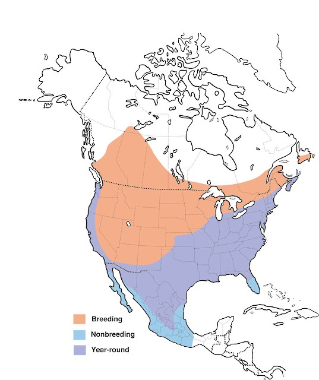

```{r setup, include = FALSE}
knitr::opts_chunk$set(
  collapse = TRUE,
  comment = "#>", 
  warning = FALSE, 
  message = FALSE,
  fig.align = 'center'
)
library(WILD3810)
```

In this lab, you will continue to learn about the application of matrix population models to wildlife management. You will build on your work from last week to explore how management of Brown-headed cowbird populations might influence population dynamics. 

***
**Objectives**

* Conduct a sensitivity analysis of the Brown-headed cowbird matrix you built last week

* Use results from the sensitivity analysis to make management recommendations to reduce cowbird populations

* Practice visualizing data using `ggplot2`

* `R` functions used in this exercise:  
    + `popbio::lambda()`
    + `popbio::sensitivity()`
    + `popbio::elasticity()`
    + `popbio::reproductive.value()`
    + `popbio::stable.stage()`

***

***

**Note**: The work you do in lab will help you complete the next homework assignment, which you can access by creating a new .Rmd file based on the homework 6 template. This homework assignment is another written assignment. As for the first writing assignment, you can receive 4 bonus points by incorporating feedback from the science writing center into your final version

***

```{r include = FALSE}
AF <- 13.8

YF <- 11.2

ES <- 0.38

NS <- 0.64

YS <- 0.24

AS <- 0.47

### Matrix elements
F_11 <- ES*NS*YS*YF
F_21 <- AS*AF
P_12 <- ES*NS*YS
P_22 <- AS

### Matrix
A <- matrix(c(F_11, F_21,
              P_12, P_22), nrow = 2, byrow = TRUE)
```

During the last lab, you built a population matrix for Brown-headed cowbirds and explored the long-term growth rate and stable stage distribution of this matrix. Today, you will explore how changes to vital rates influence the dynamics of cowbird populations. This is important information because knowing which vital rates have the largest influence on dynamics can provide critical insights into which management actions are likely to reduce cowbird populations and (hopefully) increase populations of vulnerable host species. 

Although you were able to estimate the properties of the cowbird matrix by simulating dynamics through time and then manually calculating $\lambda$ and the stable stage distribution, there is a `R` package called `popbio` that can estimate these values (and many more) without having to calculate them by hand. 

Open a new `R` script and copy the code needed to create the population matrix `A` that you built last week. Once this matrix is created, use the following lines of code to estimate $\lambda$ and the stable stage distribution:

```{r}
(lambda <- popbio::lambda(A))
(ssd <- popbio::stable.stage(A))
```

***
**How close are these analytical estimates to the estimates you calcuated by simulating future growth?**  

***

The `popbio` package has a number of other useful functions, for example estimating the reproductive value of each stage:

```{r}
(rv <- popbio::reproductive.value(A))
```

***
**In the previous homework, was your intuition about reproductive value correct?**  

***

## Sensitivity and elasticity 

In lecture, we learned about the concepts of *sensivity* and *elasticity*. Remember that sensitivity is the change in $\lambda$ caused by a small change in a vital rate and can be estimated analytically using:

$$\Large s_{i,j} = \frac{\delta \lambda}{\delta a_{i,j}} = \frac{v_iw_j}{\sum_{k=1}v_kw_k}$$

We also learned how to do this by hand but luckily that's not necessary. We can instead use:

```{r}
(sens <- popbio::sensitivity(A))
```

***
**Which combination of vital rates has the highest sensitivity?**  

***

As we saw in lecture, sensitivity is not always the most useful metric for understanding which vital rates are most important for influencing $\lambda$. Instead, most natural resource management studies focus on elasticity, which is the change in $\lambda$ caused by a small *proportional* change in a vital rate. As you probably guessed, `popbio` also does this calculation:

```{r}
(elas <- popbio::elasticity(A))
```

***
**Based on the estimated elasticities, which vital rates do you expect to have the biggest influence on population growth?**  

***

### Simulated sensitivity analysis

One of the challenges of answering the last question is that the estimated elasticities apply to each element of the matrix. Because each element is a combination of different vital rates, we still don't know which of these rates will have the largest impact of $\lambda$. Although there are ways to estimate elasticities of the underlying rates, it's not super easy. 

An alternative to analytically estimating the elasticities of the vital rates is to simulate a bunch of matrices that contain random but realistic values that each vital rate could possibly take. The growth rate of each matrix can then be estimated analytically and the correlation between the vital rates and $\lambda$ tells you how much variation in each rate contributes to variation in population growth. If this is a bit confusing, walking through an example with the cowbirds will hopefully make it clear. 

The first step to this approach is to generated a large number (e.g., 1000) random values of each vital rate. We want to keep these values within the range of plausible values that each rate could take. In the cowbird table from last week, the `Low` and `High` columns provide the range of values that have been reported for each vital rate in published studies:

```{r echo = FALSE}
library(kableExtra)

bhco_vr <- data.frame(vr = c("Adult Fecundity", "Yearling Fecundity", "Egg survival", "Nestling survival", "Yearling survival", "Adult survival"),
                      Average = c(13.8, 11.2, 0.38, 0.64, 0.24, 0.47),
                      Low = c(10.2, NA, 0.08, 0.46, 0.15, 0.31),
                      High = c(16, NA, 0.68, 0.76, 0.32, 0.63))

names(bhco_vr)[1] <- "Vital rate"
kable(bhco_vr, align = "c", format = 'html') %>%
  kable_styling(full_width = F) %>%
  footnote(number = c("Fecundity is the number of female eggs laid each year, assuming 50:50 sex ratio ", 
                      "Egg survival is the probability that eggs survive from laying to hatching",
                      "Nestling survival is the probability that nestlings survive from hatching to fledging",
                      "Yearling survival is the probability that juveniles survive from fledging to the following breeding season")
           )
```

For now, we will assume that yearling fecundity has the same *possible* range as adult survival even if the mean is lower. We can use these ranges to randomly generate values for each rate. To do this, we will also assume that within the ranges provided in the table, all values of each rate are equally likely. 

This assumption allows us to generate random values from a *uniform* probability distribution using the `runif()` function (note that if you are like me, you will read this as *run if* but technically it is *r unif*. *r* for random and *unif* for uniform distribution). `runif()` requires 3 arguments: 

- `n`: The number of random values to generate

- `min`: The minimum value the numbers can take

- `max`: The maximum value the numbers can take

Using the table above, fill in the code below to generate the values for each rate:

```{r eval = FALSE}
## Number of random values to generate
nSim <- 1000

## Adult fecundity
af <- runif(n = nSim, min = ?, max = ?)

## Yearling fecundity
yf <- runif(n = nSim, min = ?, max = ?)

## Egg survival
es <- runif(n = nSim, min = ?, max = ?)

## Nest survival
ns <- runif(n = nSim, min = ?, max = ?)

## Yearling survival
ys <- runif(n = nSim, min = ?, max = ?)

## Adult survival
as <- runif(n = nSim, min = ?, max = ?)

## Create matrix elements from vital rates
F_11 <- es*ns*ys*yf
F_21 <- as*af
P_12 <- es*ns*ys
P_22 <- as
```

***
**The last four lines of code multiple the vital rates to create the elements of the matrix. In this case, we are mulitplying vectors of length `nSim`. What type of elements are we creating in these lines of code?**  

***

Next we will estimate $\lambda$ for each of the 1000 matrices. To do this, create an empty vector to store the 1000 values of $\lambda$ and then use a loop that creates each matrix and estimates $\lambda$. Fill in the code below to create a matrix `A` during each loop (refer to your code from last week as a starting point, remembering that in this case you will need to index each matrix element created above):

```{r eval = FALSE}
lambda <- numeric(length = nSim)

for(i in 1:?){
  A <- ?
  lambda[i] <- popbio::lambda(A)
}
```

Using this simulation based approach, we expect that the vital rates with the highest elasticities will be the most strongly correlated with $\lambda$. The code below will store the vital rates and $\lambda$s as a data frame and plot the data[^1]:

```{r include = FALSE}
nSim <- 1000

AF <- runif(nSim, 10.2, 16)

YF <- runif(nSim, 10.2, AF)

ES <- runif(nSim, 0.08, 0.68)

NS <- runif(nSim, 0.46, 0.76)

YS <- runif(nSim, 0.15, 0.32)

AS <- runif(nSim, 0.31, 0.63)

F_11 <- ES*NS*YS*YF
F_21 <- AS*AF
P_12 <- ES*NS*YS
P_22 <- AS

lambda <- numeric(length = nSim)

for(i in 1:nSim){
  A <- matrix(c(F_11[i], F_21[i],
                P_12[i], P_22[i]), nrow = 2, byrow = TRUE)
  lambda[i] <- popbio::lambda(A)
}

```

```{r fig.width=6, fig.height=6}
## Store results as data frame
rates <- c("Adult Fecundity", "Yearling Fecundity", "Egg survival", "Nestling survival", "Yearling survival", "Adult survival")

lambda_df <- data.frame(lambda = lambda,
                        value = c(AF, YF, ES, NS, YS, AS),
                        Rate = rep(rates, each = nSim))

## Plot correlations
ggplot(lambda_df, aes(x = value, y = lambda)) + 
  geom_point(alpha = 0.25) +
  stat_smooth(method = "lm", color = "red") +
  facet_wrap(~Rate, scales = "free_x") +
  scale_y_continuous(expression(lambda)) +
  theme(strip.text.x = element_text(size = 10))
```

[^1]: The `ggplot2` code used here is a bit more advanced that what we've done so far this semester. Note that we create a different plot for each vital rate (`facet_wrap()`), plot a line through the data points (`stat_smooth(method = 'lm')`), add a Greek letter to the axis label (`scale_y_continuous(expression(lambda))`), make the points slightly transparent (`alpha=0.25`), and modify the appearance of the facet labels (`theme(strip.text.x)`). These changes were possible using just a few lines of code, demonstrating the power of `ggplot2` to create customized graphics. If you want to learn more about how these options work, play with the code above and use `?function` command to learn more about each function  


Based on these plots, which vital rate(s) do you expect have the largest effect on $\lambda$? Based on just this information, what do you predict would be the two or three most important vital rates to target using management actions? 

# Putting sensitivity analyses into action

Reducing cowbird populations is a central management objective for the recovery of several threatened or endangered songbird species, including including Kirtland's warblers (*Setophaga kirtlandii*), Golden-cheeked warblers (*Setophaga chrysoparia*), and Black-capped vireos (*Vireo atricapilla*). But how should managers go about reducing populations? 

```{r out.width="80%", fig.cap = "Male Kirtlands Warbler, a species that was listed as an endangered species in part due to parasitism by cowbirds", echo = FALSE}
knitr::include_graphics("https://upload.wikimedia.org/wikipedia/commons/f/f7/Kirtland%27s_warbler.jpg")
```

```{r out.width="80%", fig.cap = "Male Golden-cheeked Warbler, a species that is currently listed as an endangered species in part due to parasitism by cowbirds", echo = FALSE}
knitr::include_graphics("https://upload.wikimedia.org/wikipedia/commons/b/b7/Dendroica_chrysoparia1.jpg")
```

```{r out.width="80%", fig.cap = "Male Black-capped Vireo, yet another species that was listed as an endangered species in part due to parasitism by cowbirds", echo = FALSE}
knitr::include_graphics("https://upload.wikimedia.org/wikipedia/commons/8/80/Black-capped_Vireo_-_Texas_-_Usa_H8O1970_%2822978591836%29.jpg")
```

In general, there are three primary actions that can be used to reduce cowbird abundance:

1) **Egg removal**: Egg removal can be done by locating the nests of host species and physically removing any cowbird eggs in the nest. The action reduces cowbird egg survival but is labor intensive (finding nests is hard!) and may carry risks for the host nest.


```{r out.width="50%", fig.cap = "Eastern phoebe nest with a single cowbird egg", echo = FALSE}
knitr::include_graphics("https://upload.wikimedia.org/wikipedia/commons/2/29/Cowbird_egg.JPG")
```


2) **Breeding-season trapping**: Breeding-season trapping can be done by placing large baited traps in suitable breeding habitat and then removing any captured individuals from the population. This action primarily reduces adult survival because this is the age-class that is generally at risk of being trapped during the breeding season. Trapping is generally more cost-effective than egg removal because it does not require intensive nest searching.

```{r out.width="50%", fig.cap = "Cowbird trap. Photo by Stephanie Martinez", echo = FALSE}

```


3) **Winter trapping**: Winter trapping can be done by placing large baited traps in suitable winter habitat and then removing any captured individuals from the population. This action reduces both yearling and adult survival because both age-classes are at risk of being trapped during the winter. Winter trapping is generally more effective than breeding-season trapping because cowbirds, along with other blackbird species (some of which may be species of conservation concern rather than pests), congregate in large flocks during this time of year. However, because winter populations may spread out over very large areas when they migrate back to the breeding ground, this action is not as targeted as breeding-season trapping. 

```{r out.width="70%", fig.cap = "Cowbird range map", echo = FALSE}

```

## Decision context

For this assignment, you will be a state wildlife biologist who has been tasked with recommending which of the three possible actions should be used to reduce breeding cowbird populations that are a threat to another species that is of high conservation concern. To make this recommendation, you must use the information about elasticities that you learned above, along with the following information:

- the average vital rates in the above table adequately describe the dynamics of the local cowbird population

- in the first year of management, the population is at the stable stage distribution

- you have a budget of $100,000/year to spend on **one** of the above strategies

- for each $1000 that you spend on egg removal, you can reduce egg survival by 0.05%

- for each $1000 that you spend on breeding-season trapping, you can reduce adult survival by 0.075%

- for each $1000 that you spend on winter trapping, you can reduce both adult and juvenile survival by 0.1% each

Using this information, you should create a new population matrix for each of the three management scenarios, project population growth 25 years into the future, and estimate the long-term population growth rate for each scenario. Use these results to provide a recommendation for which management action should be taken.

Use the code chunk in the homework 6 template to complete all code necessary to make your recommendation (you should be able to project population size and estimate the long-term population growth rate using the code from last week's lab and the code found above). Use the same outline that you used for homework 3 to structure your recommendation. In particular, be sure your recommendation includes:

- a description of the management challenge

- the specific objectives you are addressing

- a brief justification and description of the methods you used to answer the question 

- a comparison of the predicted outcomes under each scenario, including specific references to the relevant ecological metrics

- a interpretation of how the ecological properties of the cowbird population (e.g., stable stage distribution, elasticities, reproductive values) relate to the effectiveness of the alternative management actions

- a figure showing the predicted trajectories for the cowbird population under each scenario (including the baseline "no action" scenario)

- a **specific** management recommendation 

- potential limitations and/or risks of your recommendation (including reasons it might not work as predicted or negative side effects that your recommended action might have on non-target species)

This assignment will be due on **Wednesday, April 3rd** to give you enough time to work with the science writing center to receive and incorporate feedback on the assignment. **PLEASE forward me the email you recieve confirming you attended the writing center tutoring session**. Once completed, upload the .Rmd and .html files for your assignment to Canvas.

***
**Hints:**

- You can estimate long-term population growth either from the simulated abundances or from the matrices themselves (both approaches should give approximately the same answer). For the first approach, remember that:

$$\lambda = \bigg[\frac{N_T}{N_0}\bigg]^{1/T}$$

- Although you only need to use one approach to estimating $\lambda$, using both approaches is a good way to make sure your code did what you think it did (if the estimates are not about the same, you may have done something wrong)

- You will need to make a figure showing the predicted future abundance under each scenario. This means you will first need a data frame that includes columns `Year`, `N`, and `Action` (you can name them something else if you'd like) and contains the simulated abundances for all four scenarios. Go back to the `ggplot2` examples we have used in previous labs to help create a line graph with different color lines for each management action (e.g., `color = Action`). This code should go in the second chunk so that the figure is displayed along with your written recommendation

***


