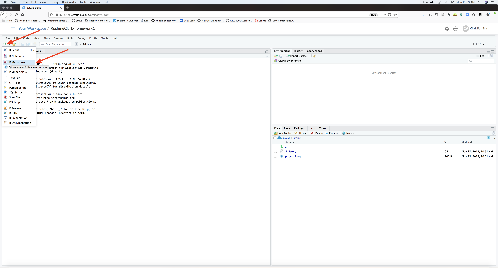
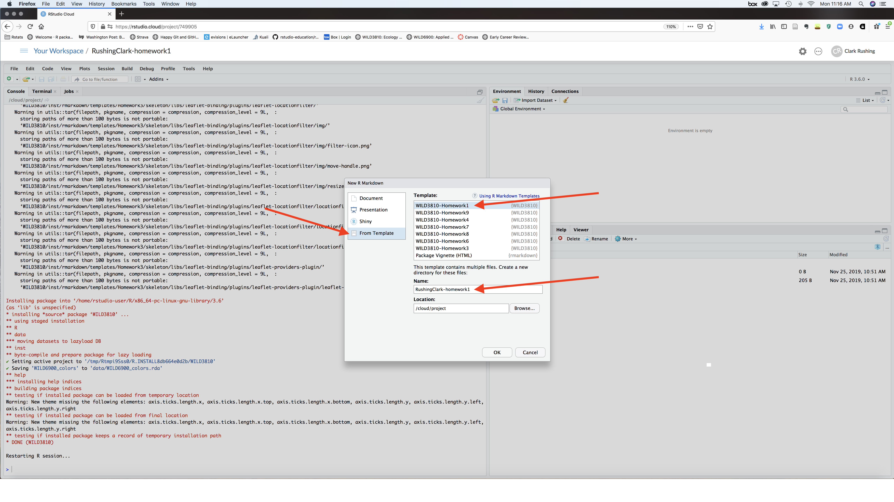

```{r setup, include = FALSE}
knitr::opts_chunk$set(
  collapse = TRUE,echo = FALSE, out.width = "600px",
  comment = "#>"
)
```

# What is Markdown?

Before we discuss what R Markdown is, we need to discuss what Markdown is. What is Markdown? Let's start with what it's not.  

Many of you have probably created a report or a paper using a word processor like Microsoft Word or Google Docs. Word processors are referred to as "what you see is what you get" (*wysiwyg*) text editors. This means that when you hightlight text and click the `boldface` icon in Word, the text appears bold on your screen. All sorts of other formatting options, incluing making headers, inserting figures, adding page numbers, etc., are possible by clicking on buttons. There is code behind the scenes that creates these changes but users don't see the code, only the formatting output. This makes *wysiwyg* editors relatively easy to use for beginners. But for more advanced users, it can actually be problematic. Have you ever had Word act in ways that you don't fully understand? Of course! We all have. Have you ever tried opening a `.docx` file using an older version of Word, only to find that it doesn't look the way thought it would? Have you ever inserted a figure only to have it jump to another page or get 'anchored' to the bottom of a page? These are just a few of the problems that occur when your document has a bunch of hidden formatting code that you cannot see or understand.  

Markdown is different. Markdown files are plain text files, meaning that they be created and edited using text editors (like NotePad on Windows or TextEdit on Mac). The biggest difference between Markdown files and Word documents is that formatting Markdown documents occurs in the document itself rather than behind the scenes. So to make something **boldface** you have to tell Markdown to do that by putting two `**asterisks**` on either side of the word or phrase. *Italics* is done by putting one `*asterisk*` around the text. [Hyperlinks](https://en.wikipedia.org/wiki/Markdown) are written like this: `[Hyperlinks](https://en.wikipedia.org/wiki/Markdown)`. These are just a few of the many formatting options you can include in a Markdown document. We'll learn about options like headers, lists, mathematical symbols and equations, and figures later in this tutorial and throughout the semester.

As you're writing, the text won't look bold or italic or whatever (this is not 'what you see is what you get', it's 'what you see is what you type'). The formatting only shows up when you render the Markdown file to create another type of document (pdf, html, even Word). The nice thing about Markdown is that because it uses standard ways to express specific formatting options, you can convert your documents into different output formats very easily. 

# What is R Markdown?

In this course, we will use a specific 'flavor' of Markdown called 'R Markdown'. R Markdown gives us all of the formatting options available for Markdown *plus* the ability to embed, display, and run R code in our documents. By mixing R code with plain text, we can create dynamic reports that replicate the analytical processes, show the code underlying these processes, create the output from our analysis (figures, summary statistics, etc.), and provide all of the necessary text explanations to go along with the code and output. As Tom Edwards puts it, R Markdown documents "can be, for all intent and purpose, your research metadata."

# Why use R Markdown

R Markdown has many advantages compared to creating reports in Word or GoogleDocs. These advantages include:

1) **Versatility**- Want to convert a Word document into pdf? That's not too hard. But pdf to Word? That's a pain. PDF to HTML? Maybe you know how to do that but I don't. With R Markdown, we can change between these formats with a single click (or a single line of code). You can even convert them into pretty nice slideshows.  

2) **Embed code in text** - After running an analysis, how do you get your results into Word? Type them by hand? Copy-and-paste? Both are a pain and error prone. Rerun your analysis using new data? Oops, now you have to copy and paste those new results and figures. With R Markdown, we embed code directly into the text so results and figures get added to our reports automatically. That means no copying and pasting and updating reports as new results come in is pain free.  

3) **Annotate your code** - Using the `#` is great for adding small annotations to your R scripts and you should defitinely get in the habitat of doing that. But sometimes you need to add a lot of details to help other users (or your future self) make sense of complex code. R Markdown allows you to create documents with as much text and formatting as you need, along with the code.  

4) **Version control** - Tired of saving `manuscript_v1.doc`, `manuscript_v2.doc`, `manuscript_final.doc`, `manuscript_final_v2.doc`? Then version control is for you. We won't go into the specfics here but R Markdown allows you to seamlessly use version control systems like git and Github to document changes to your reports.  

5) **Edit as text files** - R Markdown files are most easily created and editted within RStudio but you don't have to do it that way. They can be opened and edited in base R and even using text editors. This means you can create and edit them on any platform (Windows, Mac, Linux) using free software that is already installed on the computer

6) **Stability** - How many of us have had Word crash while we're working on a paper? Did you save as you were working? Hope so. Because R Markdown files are smaller and more lightweight, they tend not to cause your computer to crash as you're working on them. 

7) **Focus on text, not formatting** - Do you spend a lot of time tweaking the formatting of your Word document rather than writing? R Markdown allows you to separate the writing process from the formatting process, which allows you to focus on the former without worrying about that later (in theory at least). Plus there are lots of templates you can use to ensure that the formatting is taken care without you having to do anything special! 

# Why not use R Markdown?

There are a few disadvantages to R Markdown.

1) **Your advisor doesn't use it** - Try sending a `.Rmd` file to your advisor to get feedback. I'll wait... Like it or not, most folks still use word processors, so if you adopt R Markdown you will still have to create and edit Word documents for some collaborators who are stuck in their ways

2) **No track changes** - Even if you're lucky to have an advisor who will review a `.Rmd` file, you won't get nice track changes like in Word. There are alternative to this (version control helps) but not are quite as easy as track changes. 

3) **Fewer formatting options** - For better or worse, you have a more limited set of formatting options with R Markdown. That can be constraining (but often it's actually freeing!)

4) **There's a learning curve** - You already know how to use Word. R Markdown is new. How do you make something bold? How do you insert equations? How do you get figures to go at the end of your document? At first, you will almost certaintly have to google almost every thing you need to do in R Markdown (this is why number 1 is a problem). Most of it is pretty simple but it still means the going can be slow at first. 

# Authoring R Markdown files

Understanding what R Markdown files are and why they are so useful will become more clear as you learn to create and edit these documents. So without futher ado, let's create an new R Markdown file and do some basic editing. 

## Step 1: Create a new R Markdown file using the homework template

1a) Click on `File -> New File -> R Markdown...`

```{r}

```

1b) In the window on the left, select `From Template`. Scroll down through the options until you see `WILD3810-Homework0`. Select that template. In the `Name:` window type `LastnameFirstname-homework0`. In the `Location` window, navigate to your newly create `LastNameFirstName-Lab0` directory

```{r}

```

1c) Click `Ok`

## Step 2: Fill in your information and render the document

2a) Change the `author: YOUR NAME HERE` field in the header to your name. 

2b) You should see a small box above the `Source` window (the RStudio window where your document just appeared) that says `Knit` with a small ball of yarn icon. When you click that button (not yet!), two things will happen:

* The .Rmd file will be rendered as a HTML document, which will pop up on your screen

* RStudio will create a new file called `LastnameFirstname-homework0.html` - you should see that file in the `Files` window in the bottom right of your screen

2c) Click the `knit` button

```{r}
knitr::include_graphics("figs/Knit_homework.png")
```

Congratulations, you just created your first R Markdown file!

## Completing the homework

Assuming that you were to knit the `LastnameFirstname-homework0.html` document, you can keep the knitted version open while you work through the assignment. Follow the instructions on the html page and complete the assignment within the .Rmd file.
