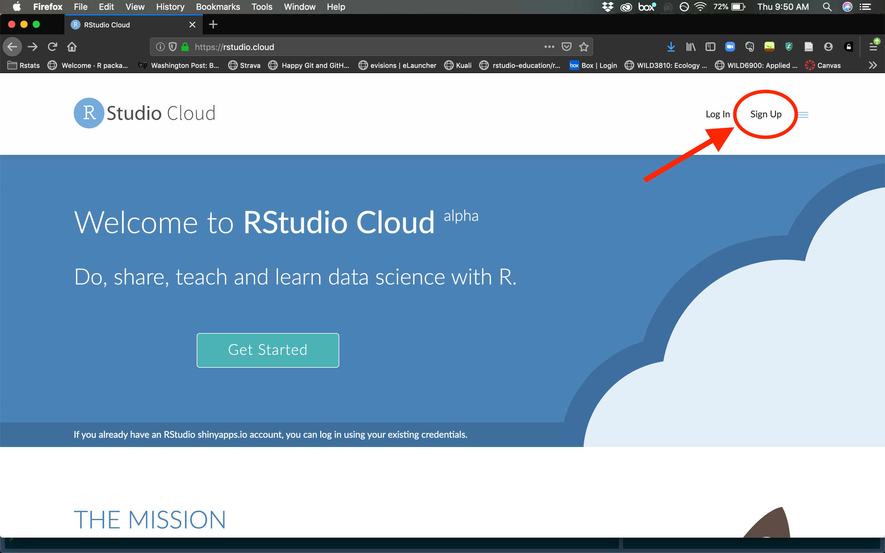

```{r setup, include = FALSE}
knitr::opts_chunk$set(
  collapse = TRUE,
  comment = "#>"
)
```

> The COVID-19 pandemic has forced many changes to our lives, including to the ways we teach and learn. I have attempted to make changes to the format and materials for this course to make online learning more effective and inclusive. However, I have no doubt that unforeseen issues will arise throughout the semester. For this reason, the materials and policies outlined in the syllabus are subject to change at the discretion of the instructor. Feedback about what is working and what is not working is encouraged to assist with making necessary changes. Bottom line - we're all in this together, each doing their best. My goal is to help you learn and to that end, I promise to flexible with accommodating unique circumstances caused by the pandemic. In return, I ask the same of you. 

# LOGISTICS

Due to the COVID-19 pandemic, this course will be taught online for the spring 2021 semester. Zoom links for lectures and labs can be found on the course Canvas page. Live (i.e., synchronous) lectures and labs will be broadcast based on the following schedule:

**Lecture**: Monday and Wednesday 10:30-11:20   
**Lab**: Monday 2:30-4:20  

I will also record each lecture and lab and post the video on Canvas for anyone who cannot attend in person.

# INSTRUCTOR
Dr. Clark Rushing  
[clark.rushing@usu.edu](clark.rushing@usu.edu)  
**Office hours**: Wednesday 1:00-2:30 or by appointment

# TEACHING ASSISTANT
Kim Savides  
[kim.savides@gmail.com](kim.savides@gmail.com)   
**Office hours**: Tuesday 10-12 or by appointment

# PREREQUISITES
WATS 2220 or BIOL 2220; MATH 110 or higher (C- grade or better); STAT 2000 or STAT 3000 (C- grade or better)


# COURSE DESCRIPTION

This course is designed to introduce and review the factors that regulate and cause change in plant and animal populations. The relevance of population dynamics to conservation, management, ecology, and evolution will be covered. We will examine single-species, multi-species, age-structured, size-structured, and spatial models of population dynamics, as well as life history strategies.  In addition to ecological concepts, students will be introduced to mathematical techniques and computer software that will allow them to examine population dynamics on their own as they embark on their careers.  

# COURSE OBJECTIVES

Overall, my main objectives are for you to: 

1)	Understand general concepts of plant & animal population dynamics  
2)	Gain experience using mathematics and computer software to examine dynamics of plant and animal populations  
3)	Apply the following skills learned to other classes:  
a.	Data entry  
b.	Application of basic statistical tests  
c.	Graphical presentation of data and statistical results  
4)	Analyze data and use models to project future plant & animal population conditions resulting from management or anthropogenic disturbances  
5)	Further refine quantitative and critical thinking skills  

# COURSE ACTIVITIES

## Lectures

Lectures will cover basic concepts regarding the dynamics of plant and animal populations. Mastering these topics is critical to doing well in the course and live lectures will include interactive activities to help students master the material. For these reasons, lecture attendance is highly encouraged. 

For the most part, lectures will be taught synchronously to give students the opportunity to actively engage with the instructor and ask questions during lecture. However, I will also record the in-class lectures and post them to Canvas for students who would like to re-watch any of the topics. Throughout semester, I will also try to post a series of pre-recorded "mini lectures" to provide additional details and context for challenging topics.

## Labs

Labs will consist primarily of computer-oriented sessions designed to help solidify the topics presented in lecture. All computer-based lab activities will use the free programming language [R](https://cran.r-project.org/). In addition, we will run R using [RStudio](https://www.rstudio.com/), a powerful *integrated development environment* (IDE) for R. See below for details about accessing and using RStudio.

No previous experience with R is expected for this course. Lab activities, particularly those early in the semester, will be specifically designed to reinforce lecture topics as well as to introduce students to manipulating, analyzing, and visualizing data using R. 

During lab, students will work through pre-written code with the help of instructors. These activities will involve analyzing and visualizing data to deepen understanding of concepts presented in lecture. As for lectures, labs will mostly be taught sychronously, giving students the ability to directly engage with the instructors and each other. Live labs may also be supplemented by pre-recorded videos to provide extra explanations and context for certain topics. 

### Homework assignments

Graded lab assignments will involve a combination of: 

* Short-answer questions based on the results of lab activities;
* Changing/writing code to answer new questions not addressed in lab activities; and,
* Short essays that link lab results to applied management/conservation issues

Each assignment will consist of a [R Markdown template](https://rushinglab.github.io/WILD3810/articles/homework.html) with questions and code. Portions of each assignment can be completed during lab. The remainder of the assignment will require students to take the results from their lab activities and complete assignments outside of class. Out-of-class work can either be completed on your own computer or by using the [computer lab facilities](http://qcnr.usu.edu/quinney/computerlab_hours) in the Quinney Library. 

All lab assignments must be turned in by the beginning of lab the following week.  

## Quizzes

Each week, students will be given a 10-question electronic quiz consisting of multiple choice, fill-in-the-blank, matching, or TRUE/FALSE questions. These quizzes are meant primarily to reinforce lecture materials and to give students an idea of what to expect exam questions to look like. Quizzes will be posted to Canvas and must be completed within one week of posting. Students may use lecture notes, textbooks, or the internet to answer questions but you must take the quiz yourself. **Students may not work together on quizzes.**

**Quizzes that are not completed within one week will receive a grade of 0**

## Exams

This course will have two mid-term exams (worth 12.5% of your grade each) and one final exam (worth 12.5% of your grade). All exams will be cumulative to some extent because the major topics in the course build off of each other so understanding the topics covered later in the semester requires understanding the topics covered earlier in the semester. Exams 2 & 3, however, will mostly focus on material covered since the preceeding exam.

# COURSE RESOURCES

## Lecture and lab materials

PDF copies of each lecture will be posted on Canvas prior to class. Please note, however, that lecture slides will not contain all of the details that will be discussed during lecture. Therefore, reviewing the slides is *not* a substitute for attending class or watching the recorded lectures. 

Lab materials will also be distributed through Canvas prior to each lab. These materials will consist of files containing data and code. These materials can be downloaded prior to or at the beginning of lab. 

## Textbooks

Although no textbooks are required for this course, the material will closely follow: 

> Mills, L.S. 2012. *Conservation of Wildlife Populations: Demography, Genetics, and Management.*
Blackwell Publishing, Malden, MA

so a copy of this book may be useful. New and used copies can be bought or rented from [Amazon](https://www.amazon.com/Conservation-Wildlife-Populations-Demography-Management/dp/0470671491/ref=sr_1_5?ie=UTF8&qid=1541177542&sr=8-5&keywords=mills+conservation). If you find a cheap copy of the first edition, that is fine. 

Occasionally, readings will be assigned from:

> Powell, L.A. and Gale, G.A. 2015. *Estimation of Parameters for Animal Populations: A Primer for the Rest of Us.* Caught Napping Publications. Lincoln, NE

PDF versions of all chapters are available for free [here](http://larkinpowell.wixsite.com/larkinpowell/estimation-of-parameters-for-animal-pop). Links to purchase hard copies ($17.50) can be found by clicking on the previous link. 

## Software

All computer-based lab activities will use the free programming language [R](https://cran.r-project.org/). In addition, we will run R using [RStudio](https://www.rstudio.com/), a powerful *integrated development environment* (IDE) for R. Students have 3 options for accessing R and RStudio:

### Option 1: RStudio Cloud (recommended)

The easiest way to access R, RStudio, and all of the lab materials for WILD3810 is to use [RStudio Cloud](https://rstudio.cloud/). RStudio Cloud provides a fully operational instance of RStudio that can be accessed from any computer with an internet connection. Once logged in, you will have access to the WILD3810 workspace, which will have all necessary packages and materials pre-installed. You can start your homework assignments on one computer, save your work, and pick up right where you left off from another computer. No need to install anything, no configuration issues, no problems. If you wish to use RStudio Cloud, follow these steps:

1) Create an RStudio Cloud account. Go to the [RStudio Cloud](https://rstudio.cloud/) website. At the top right, click `Sign up` and follow the instructions to create an account

```{r echo = FALSE, out.width="600px"}

```

2) Send me your username

3) I will send you an invitation to join the course workspace

That's it. We'll go over how to set up projects on the cloud during the first lab. See the following link for [instructions on turning in assignments that are completed on the cloud](https://rushinglab.github.io/WILD3810/articles/homework.html).

### Option 2: Install R and RStudio on your personal computer

RStudio Cloud is without a doubt the most frictionless way for students to complete lab activities. However, students are free to use their own laptops, which may come in handy if you plan to use R after the course is over. Any students wishing to use their own computers **should have both R and RStudio installed and running prior to the first lab**. Detailed instructions for installing both programs can be found [here](http://stat545.com/block000_r-rstudio-install.html). If you plan to use your own computer, be sure to test that you have everything installed correctly by doing the following: 

1) Launch RStudio

2) Put the cursor in the window labelled `Console`. Type the following code and then press `enter` or `return`: `x <- 2 * 4`. Next type `x` and press `enter` or `return`. You should see the value `8` print to screen. If yes, you’ve succeeded in installing R and RStudio.

If you encounter any problems with the previous steps, please contact me prior to the first lab. 

### Option 3: Use the lab computers (not recommended)

Students are not required to install software on their own computers or use RStudio Cloud. All lab computers in LSB and the Quinney Library have R and RStudio installed on them and students can use these computers to complete all lab activities. Be warned, however, that **there is no guarantee that lab computers have updated software or packages** which can cause problems accessing course material. For this reason, option 3 is not recommended. 

# HONORS STUDENTS

This class is offered as an Honors Class on a contract basis. Those students wishing to take this class for Honors should contact the instructor during the FIRST week of class.


# ATTENDANCE 

If you have an anticipated absence, please notify me at least 1 day prior to the absence. It is your responsibility to make up for the materials missed in the event of a lecture or lab absence. Exams will be announced at least 1 week prior to the exam date in class. Excuses for absence due to illness, death in the family, or other unanticipated events will be handled on a case-by-case basis.    

# GRADING

Your course grade will be based on the following:  

* Lab assignments (10 total, 20 points each) - 200 points (50%)
* Quizzes (10 total, 5 points each) - 50 points (12.5%)
* Midterm exams (2 total, 50 points each) - 100 points (25%)
* Final exam - 50 points (12.5%)
  

# GRADING SCALE

```{r grading, echo=FALSE, warning=FALSE, message=FALSE}
library(kableExtra)
grades <- data.frame(Grade = c("A", "A-", "B+", "B", "B-", "C+", "C", "C-", "D+", "D", "F"),
                       Percent = c("93-100%", "90-92.9%", 
                                   "87-89.9%", "83-86.9%", "80-82.9%", 
                                   "77-79.9%", "73-76.9%", "70-72.9%",
                                   "67-69.9%", "60-66.9%", "59.9% and below"),
                       Points = c("372-400", "360-371", 
                                  "348-359", "332-347", "320-331", 
                                  "308-319", "292-307", "280-291",
                                  "268-279", "240-267", "0-239"))

grades %>%
  kable("html", col.names = c("GRADE", "% RANGE", "POINT RANGE"), align = 'c') %>%
  kable_styling(bootstrap_options = c("striped", "hover", "condensed", "responsive"), full_width = TRUE)

```

# LIBRARY SERVICES

All USU students attending classes in Logan, at our Regional Campuses, or online can access all databases, e-journals, and e-books regardless of location. Additionally, the library will mail printed books to students, at no charge to them. Students can also borrow books from any Utah academic library. Take advantage of all library services and learn more at [libguides.usu.edu/rc](libguides.usu.edu/rc).


# CLASSROOM CIVILILY

Utah State University supports the principle of freedom of expression for both faculty and students. The University respects the rights of faculty to teach and students to learn. Maintenance of these rights requires classroom conditions that do not impede the learning process. Disruptive classroom behavior will not be tolerated. An individual engaging in such behavior may be subject to disciplinary action. Read [Student Code Article V Section V-3](https://studentconduct.usu.edu/studentcode/article5) for more information.

# UNIVERSITY POLICIES & PROCEDURES

## Academic Freedom and Professional Responsibilities

Academic freedom is the right to teach, study, discuss, investigate, discover, create, and publish freely. Academic freedom protects the rights of faculty members in teaching and of students in learning. Freedom in research is fundamental to the advancement of truth. Faculty members are entitled to full freedom in teaching, research, and creative activities, subject to the limitations imposed by professional responsibility. Faculty Code Policy #403 further defines academic freedom and professional responsibilities.

## Academic Integrity – "The Honor System"

Each student has the right and duty to pursue his or her academic experience free of dishonesty. To enhance the learning environment at Utah State University and to develop student academic integrity, each student agrees to the following Honor Pledge:

> "*I pledge, on my honor, to conduct myself with the foremost level of academic integrity*."

A student who lives by the Honor Pledge is a student who does more than not cheat, falsify, or plagiarize. A student who lives by the Honor Pledge:

* Espouses academic integrity as an underlying and essential principle of the Utah State University community;
* Understands that each act of academic dishonesty devalues every degree that is awarded by this institution; and
* Is a welcomed and valued member of Utah State University.

## Academic dishonesty

The instructor of this course will take appropriate actions in response to Academic Dishonesty, as defined the University’s Student Code.  Acts of academic dishonesty include but are not limited to:

* **Cheating**: using, attempting to use, or providing others with any unauthorized assistance in taking quizzes, tests, examinations, or in any other academic exercise or activity.  Unauthorized assistance includes:
  +   Working in a group when the instructor has designated that the quiz, test, examination, or any other academic exercise or activity be done “individually;”
  +   Depending on the aid of sources beyond those authorized by the instructor in writing papers, preparing reports, solving problems, or carrying out other assignments;
  +   Substituting for another student, or permitting another student to substitute for oneself, in taking an examination or preparing academic work;
  +   Acquiring tests or other academic material belonging to a faculty member, staff member, or another student without express permission;
  +   Continuing to write after time has been called on a quiz, test, examination, or any other academic exercise or activity;
  +   Submitting substantially the same work for credit in more than one class, except with prior approval of the instructor; or engaging in any form of research fraud.
*  **Falsification**: altering or fabricating any information or citation in an academic exercise or activity.
*  **Plagiarism**: representing, by paraphrase or direct quotation, the published or unpublished work of another person as one‘s own in any academic exercise or activity without full and clear acknowledgment. It also includes using materials prepared by another person or by an agency engaged in the sale of term papers or other academic materials.

For additional information go to: [ARTICLE VI. University Regulations Regarding Academic Integrity](https://studentconduct.usu.edu/studentcode/article6)

## Sexual Harassment/Title IX

Utah State University is committed to creating and maintaining an environment free from acts of sexual misconduct and discrimination and to fostering respect and dignity for all members of the USU community. Title IX and USU Policy 339 address sexual harassment in the workplace and academic setting.

The university responds promptly upon learning of any form of possible discrimination or sexual misconduct.  Any individual may contact USU’s [Affirmative Action/Equal Opportunity (AA/EO) Office](http://aaeo.usu.edu/) for available options and resources or clarification.  The university has established a complaint procedure to handle all types of discrimination complaints, including sexual harassment ([USU Policy 305](http://www.usu.edu/policies/305/)), and has designated the AA/EO Director/Title IX Coordinator as the official responsible for receiving and investigating complaints of sexual harassment. 

## Assumption of Risk

All classes, programs, and extracurricular activities within the University involve some risk, and certain ones involve travel. The University provides opportunities to participate in these programs on a voluntary basis. Therefore, students should not participate in them if they do not care to assume the risks. Students can ask the respective program leaders/sponsors about the possible risks a program may generate, and if students are not willing to assume the risks, they should not select that program. By voluntarily participating in classes, programs, and extracurricular activities, a student does so at his or her own risk. General information about University Risk Management policies, insurance coverage, vehicle use policies, and risk management forms can be found at: [http://www.usu.edu/riskmgt/](http://www.usu.edu/riskmgt/)

## Withdrawal Policy and "I" Grade Policy

Students are required to complete all courses for which they are registered by the end of the semester. In some cases, a student may be unable to complete all of the coursework because of extenuating circumstances, but not due to poor performance or to retain financial aid. The term ‘extenuating’ circumstances includes: (1) incapacitating illness which prevents a student from attending classes for a minimum period of two weeks, (2) a death in the immediate family, (3) financial responsibilities requiring a student to alter a work schedule to secure employment, (4) change in work schedule as required by an employer, or (5) other emergencies deemed appropriate by the instructor.

## Students with Disabilities

USU welcomes students with disabilities. If you have, or suspect you may have, a physical, mental health, or learning disability that may require accommodations in this course, please contact the [Disability Resource Center (DRC)](http://www.usu.edu/drc/) as early in the semester as possible (University Inn # 101, (435) 797‐2444, drc@usu.edu). All disability related accommodations must be approved by the DRC.  Once approved, the DRC will coordinate with faculty to provide accommodations.

## Diversity Statement

Regardless of intent, careless or ill-informed remarks can be offensive and hurtful to others and detract from the learning climate. If you feel uncomfortable in a classroom due to offensive language or actions by an instructor or student(s) regarding ethnicity, gender, or sexual orientation, contact:

* [Division of Student Affairs](https://studentaffairs.usu.edu): (435) 797-1712, studentservices@usu.edu, TSC 220
* [Student Legal Services](https://ususa.usu.edu/student-association/student-advocacy/legal-services): (435) 797-2912, TSC 326,
* [Access and Diversity](http://accesscenter.usu.edu): (435) 797-1728, access@usu.edu; TSC 315
* [Multicultural Programs](http://accesscenter.usu.edu/multiculture): (435) 797-1728, TSC 315
* [LGBTQA Programs](http://accesscenter.usu.edu/lgbtqa): (435) 797-1728, TSC 3145
* [Provost‘s Office Diversity Resources](https://www.usu.edu/provost/diversity): (435) 797-8176

You can learn about your student rights by visiting [The Code of Policies and Procedures for Students at Utah State University](https://studentconduct.usu.edu/studentcode)

## Grievance Process

Students who feel they have been unfairly treated may file a grievance through the channels and procedures described in the Student Code: [Article VII](https://studentconduct.usu.edu/studentcode/article7).

## Full details for USU Academic Policies and Procedures can be found at:

* [Student Conduct](https://studentconduct.usu.edu/)
* [Student Code](https://studentconduct.usu.edu/studentcode/)
* [Academic Integrity](https://studentconduct.usu.edu/studentcode/article6)
* [USU Selected Academic Policies and Procedures](http://www.usu.edu/provost/faculty-life/syllabus.cfm)
* [USU Academic Policies and Procedures](http://catalog.usu.edu/content.php?catoid=4&navoid=546)
* [Academic Freedom and Professional Responsibility Policy](https://www.usu.edu/policies/403/)

## Emergency Procedures

In the case of a drill or real emergency, classes will be notified to evacuate the building by the sound of the fire/emergency alarm system or by a building representative. In the event of a disaster that may interfere with either notification, evacuate as the situation dictates (i.e., in an earthquake when shaking ceases or immediately when a fire is discovered). Turn off computers and take any personal items with you. Elevators should not be used; instead, use the closest stairs.
